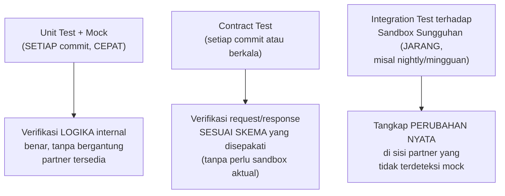

## TL;DR

Menguji kode yang dimiliki sepenuhnya oleh tim sendiri relatif jelas — kamu bisa menjalankan test terhadap database sungguhan, mock apa pun sesuai kebutuhan, dan sepenuhnya mengontrol seluruh lingkungan pengujian (lihat [[../20 Go Language/Mocking Through Interfaces|Mocking Through Interfaces]]). Menguji integrasi yang melintasi batas organisasi berbeda secara fundamental: separuh sistem yang diuji **bukan milikmu**, tidak sepenuhnya bisa kamu kontrol, dan kadang tidak bisa diakses kapan pun kamu mau (sandbox partner yang punya jam operasional terbatas, atau rate limit ketat untuk pengujian). Strategi pengujian yang efektif untuk kasus ini butuh **lapisan berbeda** — unit test dengan mock (cepat, tidak bergantung ketersediaan partner), contract test (memverifikasi kepatuhan terhadap skema yang disepakati), dan integration test terbatas terhadap sandbox sungguhan (lambat dan jarang dijalankan, tapi menangkap masalah yang tidak terlihat mock).

## The Problem

Sebuah tim hanya mengandalkan mock buatan sendiri untuk seluruh pengujian integrasi partner, tanpa pernah menjalankan test terhadap sandbox sungguhan — mock itu dibuat berdasarkan asumsi format response partner yang ternyata **sudah berubah** (partner memperbarui API mereka tanpa memberi tahu secara memadai) tanpa disadari tim, karena tidak ada test yang benar-benar menyentuh sandbox sungguhan yang bisa menangkap perubahan itu. Bug ini baru ditemukan setelah deploy ke production, jauh lebih mahal diperbaiki dibanding kalau tertangkap lebih awal lewat integration test yang benar-benar menyentuh sandbox.

Masalah kedua yang sebaliknya: sebuah tim menjalankan **seluruh** test suite (termasuk semua test integrasi) terhadap sandbox partner sungguhan setiap kali CI berjalan (setiap commit) — sandbox partner yang punya rate limit ketat mulai menolak request karena volume test yang terlalu tinggi, dan CI menjadi lambat serta tidak dapat diandalkan (kadang gagal bukan karena bug kode, tapi karena sandbox partner sedang sibuk atau down sesaat) — masalah yang seharusnya dihindari dengan strategi pengujian berlapis yang tidak membebankan seluruh verifikasi ke sandbox sungguhan.

## Intuition

Bayangkan strategi pengujian berlapis untuk integrasi lintas organisasi seperti **latihan tim sepak bola sebelum pertandingan sungguhan**. Latihan internal (unit test dengan mock) dilakukan setiap hari, cepat dan terkendali penuh — berlatih formasi dan strategi tanpa perlu lawan sungguhan hadir. Uji tanding (contract test, integration test terhadap sandbox) dilakukan lebih jarang, melibatkan pihak eksternal (tim lawan/sandbox partner) untuk memverifikasi strategi itu benar-benar bekerja melawan sesuatu yang nyata, bukan hanya asumsi internal. Pertandingan resmi (production) adalah ujian sesungguhnya yang seharusnya sudah dipersiapkan matang lewat kedua tahap sebelumnya, bukan pertama kalinya strategi itu benar-benar diuji.

Analogi ini bocor pada satu hal: latihan internal tim sepak bola tidak pernah "menjadi usang" karena lawan sungguhan berubah taktik tanpa pemberitahuan. Mock untuk integrasi eksternal **bisa** menjadi usang diam-diam begitu partner mengubah API mereka — inilah kenapa integration test terhadap sandbox sungguhan (meski jarang dijalankan) tetap krusial sebagai jaring pengaman menangkap perubahan itu, sesuatu yang tidak dijawab hanya dengan latihan internal semata.

## How It Works



**Tiga lapisan yang saling melengkapi**:
1. **Unit test dengan mock** — dijalankan setiap commit, memverifikasi logika bisnis sendiri bekerja benar terhadap berbagai skenario respons (sukses, error, data tidak lengkap) tanpa bergantung ketersediaan partner sama sekali.
2. **Contract test** — memverifikasi bahwa request yang dikirim dan response yang diharapkan benar-benar sesuai skema yang disepakati (lihat [[Contract Negotiation and Versioning]]), bisa dijalankan tanpa sandbox sungguhan kalau skema sudah terdokumentasi formal (OpenAPI/Protobuf), atau dengan sandbox tapi fokus sempit hanya memverifikasi struktur, bukan seluruh alur bisnis.
3. **Integration test terhadap sandbox sungguhan** — dijalankan lebih jarang (nightly, atau sebelum rilis besar) karena lebih lambat dan bergantung ketersediaan/rate limit sandbox, tapi menangkap perubahan nyata di sisi partner yang tidak mungkin terdeteksi mock atau contract test murni.

## Under The Hood

**Contract test berbasis consumer-driven contract** (pola yang dipopulerkan tool seperti Pact) membalik arah verifikasi biasa — alih-alih hanya memverifikasi bahwa kodemu mengirim request yang benar, consumer (timmu) mendefinisikan **ekspektasi** terhadap response partner secara eksplisit, dan (idealnya) partner juga menjalankan verifikasi terhadap ekspektasi itu di sisi mereka — memberi sinyal dini kalau partner berencana mengubah API dengan cara yang akan mematahkan ekspektasimu, sebelum perubahan itu benar-benar di-deploy ke production mereka. Pola ini butuh kerja sama dari partner (tidak semua partner, terutama instansi pemerintah dengan proses lambat, bersedia/mampu berpartisipasi), tapi memberi jaring pengaman paling kuat kalau memungkinkan.

**Menjalankan integration test terhadap sandbox secara terjadwal** (bukan setiap commit) menyeimbangkan kebutuhan menangkap perubahan nyata dengan keterbatasan sandbox (rate limit, ketersediaan) — kegagalan pada test terjadwal ini butuh investigasi manual untuk membedakan "kode kita yang salah" dari "sandbox partner sedang bermasalah sesaat", perbedaan yang tidak selalu mudah dipastikan otomatis.

## In Go

```go
package integrasi_test

import (
	"context"
	"os"
	"testing"
)

// TestUnit_LogikaVerifikasi menggunakan MOCK — dijalankan SETIAP
// commit, cepat, tidak bergantung ketersediaan sandbox partner.
func TestUnit_LogikaVerifikasi(t *testing.T) {
	mockClient := &klienPartnerPalsu{responsSimulasi: "sukses"}
	hasil, err := ProsesVerifikasi(context.Background(), mockClient)
	if err != nil {
		t.Fatalf("tidak diharapkan error: %v", err)
	}
	if hasil != "terverifikasi" {
		t.Errorf("hasil = %q, ingin %q", hasil, "terverifikasi")
	}
}

// TestIntegrasi_SandboxSungguhan HANYA dijalankan kalau environment
// variable eksplisit diset (misal RUN_INTEGRATION_TESTS=1) — mencegah
// test ini berjalan di SETIAP commit CI biasa, hanya di pipeline
// terjadwal terpisah (nightly) yang sengaja mengaktifkannya.
func TestIntegrasi_SandboxSungguhan(t *testing.T) {
	if os.Getenv("RUN_INTEGRATION_TESTS") != "1" {
		t.Skip("lewati integration test — set RUN_INTEGRATION_TESTS=1 untuk menjalankan")
	}

	klienSungguhan := klienPartnerSandbox{baseURL: "https://sandbox.partner.example.gov.id"}
	hasil, err := ProsesVerifikasi(context.Background(), klienSungguhan)
	if err != nil {
		t.Fatalf("integration test gagal terhadap sandbox sungguhan: %v", err)
	}
	_ = hasil
}

type klienPartnerPalsu struct{ responsSimulasi string }
type klienPartnerSandbox struct{ baseURL string }

func ProsesVerifikasi(ctx context.Context, klien interface{}) (string, error) { return "terverifikasi", nil }
```

## In His Stack

Untuk integrasi dengan banyak instansi pemerintah berbeda, strategi pengujian berlapis ini penting justru karena beberapa sandbox partner punya jam operasional terbatas atau rate limit ketat (tidak dirancang untuk diakses ratusan kali per hari oleh CI) — menjalankan seluruh test suite terhadap sandbox setiap commit bisa dengan cepat kehabisan kuota atau dianggap penyalahgunaan oleh partner. Pipeline CI yang membedakan unit test (setiap commit) dari integration test terjadwal (nightly, dengan kuota yang jelas disepakati dengan partner kalau perlu) adalah pendekatan yang lebih berkelanjutan untuk hubungan integrasi jangka panjang.

## Trade-offs and When Not To Use It

Membangun strategi pengujian tiga lapis penuh (unit, contract, integration terjadwal) menambah kompleksitas infrastruktur CI/CD yang harus dipelihara — untuk integrasi yang sangat sederhana dan jarang berubah (partner dengan API yang sudah stabil bertahun-tahun tanpa perubahan), investasi penuh mungkin berlebihan, dan unit test dengan mock plus sesekali verifikasi manual mungkin sudah cukup. Consumer-driven contract testing butuh kerja sama aktif dari partner yang tidak semua bersedia atau mampu memberikannya — untuk partner yang tidak bisa diajak berpartisipasi dalam proses ini, integration test terjadwal terhadap sandbox (meski lebih manual dan kurang otomatis) tetap menjadi jaring pengaman yang realistis.

## Common Mistakes

> [!warning] Jebakan
> Hanya mengandalkan mock/unit test tanpa pernah menjalankan integration test terhadap sandbox sungguhan — perubahan nyata di sisi partner tidak terdeteksi sampai ditemukan di production, jauh lebih mahal diperbaiki.

> [!warning] Jebakan
> Menjalankan seluruh integration test terhadap sandbox partner di setiap commit CI — membebani sandbox partner yang mungkin punya rate limit ketat, membuat CI lambat dan tidak dapat diandalkan.

> [!warning] Jebakan
> Tidak membedakan kegagalan test akibat "kode kita yang salah" dari "sandbox partner sedang bermasalah sesaat" — menginvestigasi setiap kegagalan integration test sebagai bug kode, padahal kadang penyebabnya di luar kendali sepenuhnya.

## Exercises

1. Jelaskan tiga lapisan strategi pengujian integrasi lintas organisasi, dan kapan masing-masing dijalankan.
2. Kenapa mock/unit test saja tidak cukup untuk menangkap perubahan yang dilakukan partner secara sepihak?
3. Apa itu consumer-driven contract testing, dan kenapa itu butuh kerja sama aktif dari partner?
4. Desain terbuka: timmu punya integrasi dengan lima instansi berbeda, masing-masing dengan sandbox yang punya rate limit berbeda-beda (dua instansi cukup longgar, tiga instansi sangat ketat). Rancang strategi CI/CD yang menyeimbangkan kebutuhan menangkap perubahan nyata partner dengan keterbatasan rate limit sandbox yang bervariasi ini.

> [!success]- Kunci jawaban
> **1.** Unit test dengan mock dijalankan **setiap commit**, cepat, memverifikasi logika bisnis internal tanpa bergantung partner. Contract test dijalankan **setiap commit atau berkala**, memverifikasi struktur request/response sesuai skema yang disepakati, bisa tanpa sandbox kalau skema terdokumentasi formal. Integration test terhadap sandbox sungguhan dijalankan **jarang** (nightly, sebelum rilis besar) karena lebih lambat dan bergantung ketersediaan/rate limit sandbox, tapi menangkap perubahan nyata partner yang tidak terlihat dua lapisan sebelumnya.
> **4.** Untuk dua instansi dengan rate limit longgar: jalankan integration test terhadap sandbox mereka **lebih sering** (misalnya setiap hari, atau bahkan di beberapa titik CI tertentu selain nightly) karena risiko membebani mereka rendah. Untuk tiga instansi dengan rate limit ketat: batasi integration test terhadap sandbox mereka jadi **benar-benar jarang** (mingguan, atau hanya sebelum rilis besar yang menyentuh integrasi itu) dan pastikan setiap eksekusi test itu **efisien** (hanya menguji skenario paling penting, bukan mengulang seluruh kombinasi kasus tepi setiap kali) — mengompensasi kekurangan frekuensi ini dengan investasi lebih besar di lapisan mock/unit test dan contract test yang tidak bergantung sandbox sama sekali, memberi cakupan pengujian yang tetap memadai meski integration test sungguhan jarang dijalankan untuk ketiga instansi ini.

## Self-Check

- Apa tiga lapisan strategi pengujian integrasi lintas organisasi?
- Kenapa mock saja tidak cukup menangkap perubahan sepihak partner?
- Apa itu consumer-driven contract testing?
- Bagaimana menyeimbangkan frekuensi integration test dengan rate limit sandbox yang terbatas?

## Connected Notes

- [[Sandbox Environments]] — sandbox yang dibahas di note sebelumnya adalah target integration test lapisan ketiga yang dibahas di note ini.
- [[../20 Go Language/Mocking Through Interfaces|Mocking Through Interfaces]] — teknik mocking yang mendasari lapisan unit test tercepat dalam strategi berlapis ini.
- [[Contract Negotiation and Versioning]] — skema yang disepakati formal menjadi basis contract test yang dibahas di note ini.
- [[gRPC and Protobuf]] — skema Protobuf yang lebih ketat memberi basis contract testing yang lebih kuat dibanding JSON/REST biasa, dibahas di note berikutnya.
- [[../90 Architecture and Design/The RFC Process|The RFC Process]] — strategi pengujian integrasi lintas organisasi adalah jenis keputusan yang layak didokumentasikan formal, mengingat dampaknya pada keandalan jangka panjang integrasi.

## Further Reading

- Dokumentasi resmi Pact (pact.io) — implementasi konkret consumer-driven contract testing yang banyak dirujuk industri.

## Catatan Saya

*Tulis di sini apakah pipeline CI di kerjaanmu membedakan unit test dari integration test terhadap sandbox partner — atau semuanya dicampur jadi satu, dan dampaknya pada kecepatan/keandalan CI.*
