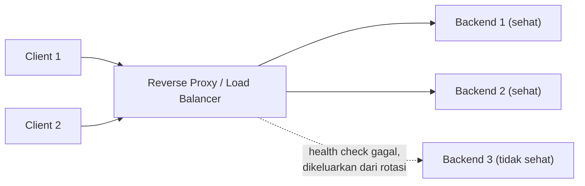

## TL;DR

Reverse proxy adalah lapisan yang **selalu** dihubungi client, meneruskan request ke satu atau lebih server backend di baliknya, lalu meneruskan response kembali — client tidak pernah tahu (dan tidak perlu tahu) berapa banyak atau instance mana yang sebenarnya memproses request-nya. Load balancer adalah peran spesifik dari reverse proxy: mendistribusikan request masuk ke beberapa instance backend memakai algoritma tertentu (round robin, least connections) plus **health check** yang secara otomatis mengeluarkan instance yang sedang tidak sehat dari rotasi. Sering kali satu software (seperti Nginx) melakukan kedua peran ini sekaligus.

## The Problem

Bayangkan sebuah tim menjalankan satu instance service Go, diekspos langsung ke internet tanpa lapisan apa pun di depannya. Ini bekerja baik selama trafik rendah. Begitu tim perlu menskalakan ke beberapa instance sekaligus (untuk menangani beban lebih tinggi), atau ingin melakukan deployment tanpa downtime (mengganti instance lama dengan versi baru tanpa memutus trafik yang sedang berjalan), mereka menyadari **tidak ada mekanisme apa pun** untuk mendistribusikan trafik ke banyak instance atau menyembunyikan topologi internal dari client — setiap client sudah terlanjur menunjuk langsung ke satu alamat IP instance tunggal.

Tanpa reverse proxy di depan, menambah instance kedua berarti client harus tahu dan memilih sendiri instance mana yang dihubungi (jelas tidak masuk akal), dan mengganti instance saat deployment berarti memutus koneksi yang sedang menunjuk ke instance lama tanpa cara halus untuk mengalihkannya. Reverse proxy menyelesaikan ini dengan menjadi satu-satunya titik yang dihubungi client, bebas mengarahkan trafik ke instance mana pun di baliknya tanpa client pernah menyadari perubahan itu terjadi.

## Intuition

Bayangkan reverse proxy seperti **meja resepsionis hotel** — tamu (client) selalu mendatangi meja depan, tidak pernah langsung menuju kamar atau kantor staf tertentu (instance backend). Resepsionis memutuskan staf/kamar mana yang menangani kebutuhan tamu, dan bisa dengan mulus mengarahkan tamu ke kamar berbeda tanpa tamu perlu tahu kamar-kamar itu ditukar, ditambah, atau dihapus di belakang layar (instance discala naik/turun, diganti saat deployment). Load balancing adalah kebijakan spesifik resepsionis untuk membagi tamu ke beberapa staf yang setara kemampuannya (round robin: bergiliran ketat sesuai urutan; least connections: kirim ke staf yang paling sedikit sedang melayani tamu lain).

Analogi "resepsionis" ini bocor pada soal kedalaman penilaian. Resepsionis sungguhan bisa membuat keputusan berdasarkan konteks kaya (tamu ini terlihat butuh bantuan ekstra). Algoritma load balancing biasanya aturan mekanis sederhana yang bekerja dengan sinyal terbatas (jumlah koneksi aktif, atau sekadar penghitung bergilir) tanpa benar-benar memahami **biaya** request. Request yang jauh lebih berat dari rata-rata tetap bisa diarahkan lewat round robin murni ke backend yang sudah kelebihan beban, karena algoritmanya tidak benar-benar memahami biaya request seperti resepsionis manusia yang membaca bahasa tubuh.

## How It Works



Reverse proxy **menutup** koneksi client di sisi depan dan membuka **koneksi terpisah** ke backend di sisi belakang — artinya pengaturan timeout dan TLS di sisi client-facing dan backend-facing dikonfigurasi **independen** (lihat [[Timeouts in HTTP Servers]] dan [[Request Size Limits Along The Path]] soal disiplin menyelaraskan setiap lapisan). Health check secara berkala memeriksa apakah setiap backend masih responsif — inilah yang membuat load balancing tangguh terhadap kegagalan, bukan sekadar membagi beban.

## In Go

Stdlib Go menyediakan blok bangunan dasar reverse proxy lewat `httputil.ReverseProxy` — berguna untuk membangun proxy/gateway internal ringan, meski untuk load balancing production skala besar menghadap internet, dedicated tool seperti Nginx atau load balancer cloud biasanya lebih matang soal fitur (health check, algoritma load balancing yang kaya, observability bawaan):

```go
func buildInternalProxy(targetURL string) (*httputil.ReverseProxy, error) {
    target, err := url.Parse(targetURL)
    if err != nil {
        return nil, fmt.Errorf("parse target url: %w", err)
    }
    return httputil.NewSingleHostReverseProxy(target), nil
}
```

## In His Stack

**Nginx** persis mengisi peran ini di stack yang sudah disebut berulang di note-note sebelumnya — sebagai reverse proxy di depan PHP-FPM atau service Go. **Kubernetes** menambah lapisan serupa di dalam cluster: `Service` melakukan load balancing sederhana antar Pod replika (lewat `kube-proxy`), dan `Ingress` bertindak sebagai reverse proxy untuk trafik dari luar cluster — keduanya mengimplementasikan konsep yang sama dengan Nginx, hanya beroperasi di lapisan Kubernetes sendiri, dan bergantung pada mekanisme [[../70 Infrastructure and Delivery/Service Discovery|Service Discovery]] untuk tahu Pod mana saja yang sedang tersedia dan sehat.

## Trade-offs and When Not To Use It

Untuk apa pun yang mendekati production dengan lebih dari satu instance atau kebutuhan deployment tanpa downtime, reverse proxy/load balancer nyaris wajib — bukan lagi soal "kapan tidak dipakai", tapi soal memilih algoritma load balancing dan strategi health check yang tepat untuk beban kerja tertentu. `least connections` cenderung menangani campuran request murah dan mahal lebih baik dibanding `round robin` murni, dengan biaya perlu melacak jumlah koneksi aktif per backend — pilihan ini sebaiknya disengaja berdasarkan karakteristik trafik nyata, bukan default yang dibiarkan begitu saja.

## Common Mistakes

> [!warning] Jebakan
> Mengekspos instance backend langsung ke internet tanpa reverse proxy sama sekali, kehilangan kemampuan menambah instance, melakukan deployment tanpa downtime, atau mengelola TLS secara terpusat.

> [!warning] Jebakan
> Berasumsi round robin sederhana sudah adil untuk semua jenis request. Campuran request murah dan mahal tetap bisa membuat satu backend kelebihan beban meski secara jumlah request terlihat "merata", karena algoritma ini tidak memahami biaya sesungguhnya tiap request.

> [!warning] Jebakan
> Tidak mengonfigurasi atau memverifikasi health check dengan benar, membuat load balancer terus mengirim trafik ke instance yang sebenarnya sudah tidak sehat/crash — sebagian request terus gagal sampai ada yang menyadari dan campur tangan manual.

## Exercises

1. Apa perbedaan peran reverse proxy secara umum dan load balancer secara spesifik?
2. Kenapa timeout di sisi client-facing dan backend-facing pada reverse proxy dikonfigurasi independen?
3. Kenapa round robin sederhana tidak selalu adil untuk campuran request dengan biaya berbeda-beda?
4. Desain terbuka: sebuah service dengan tiga instance backend mengalami satu instance yang sesekali crash dan restart otomatis (karena bug memory leak yang belum diperbaiki), dan tim menyadari sebagian kecil request pengguna gagal secara konsisten meski dua instance lain sehat. Rancang konfigurasi load balancer yang memastikan trafik tidak diarahkan ke instance yang sedang tidak sehat, sambil tim memperbaiki akar masalah memory leak-nya secara terpisah.

> [!success]- Kunci jawaban
> Konfigurasikan health check aktif (misalnya endpoint `/health` yang diperiksa load balancer setiap beberapa detik) dengan ambang kegagalan yang wajar (misalnya dikeluarkan dari rotasi setelah dua atau tiga kali gagal berturut-turut, bukan langsung setelah satu kegagalan yang mungkin cuma gangguan sesaat) — ini memastikan instance yang sedang crash/restart otomatis dikeluarkan sementara dari rotasi sampai ia kembali sehat, tanpa perlu campur tangan manual setiap kali terjadi. Ini adalah mitigasi operasional yang menjaga pengalaman pengguna tetap baik **sementara** akar masalah (memory leak, lihat [[../50 Concurrency and Performance/Goroutine Leaks|Goroutine Leaks]] atau [[../50 Concurrency and Performance/Reducing Allocations|Reducing Allocations]] sebagai kemungkinan penyebab) diselidiki dan diperbaiki secara terpisah — health check bukan pengganti perbaikan akar masalah, hanya jaring pengaman sementara.

## Self-Check

- Apa perbedaan reverse proxy dan load balancer?
- Kenapa reverse proxy membuka koneksi backend yang terpisah dari koneksi client?
- Kenapa round robin sederhana tidak selalu adil untuk campuran request yang biayanya berbeda?
- Apa fungsi health check dalam load balancing?

## Connected Notes

- [[../10 Foundations/How An OS Handles Network Connections|How An OS Handles Network Connections]] — prasyarat: accept queue dan koneksi TCP yang menjadi dasar teknis reverse proxy.
- [[Timeouts in HTTP Servers]] dan [[Request Size Limits Along The Path]] — disiplin menyelaraskan konfigurasi di setiap lapisan, termasuk lapisan reverse proxy ini.
- [[../92 Tools/Nginx|Nginx]] — implementasi konkret dari konsep di note ini, dibahas mendalam sebagai tool.
- [[../70 Infrastructure and Delivery/Service Discovery|Service Discovery]] — mekanisme yang dibutuhkan load balancer untuk tahu instance mana saja yang tersedia.
- [[Graceful Shutdown]] — deployment tanpa downtime bergantung pada kombinasi graceful shutdown aplikasi dan load balancer yang mengarahkan trafik menjauh dari instance yang sedang berhenti.

## Further Reading

- Dokumentasi resmi Nginx tentang *reverse proxy* dan *load balancing* (nginx.org/en/docs) — referensi konfigurasi praktis yang matang.

## Catatan Saya

*Tulis di sini algoritma load balancing yang dipakai infrastruktur di kerjaanmu saat ini, dan apakah health check sudah dikonfigurasi dengan baik.*
