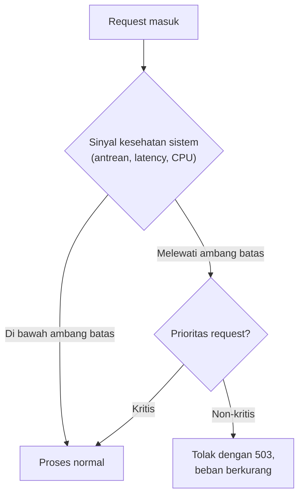

## TL;DR

**Load shedding** adalah keputusan sengaja menolak sebagian request ketika sistem mendekati kapasitas maksimumnya, supaya sistem tetap bisa melayani sisanya dengan baik — alih-alih mencoba melayani semua request dan berakhir melayani **semuanya dengan buruk**, atau lebih parah, crash total dan tidak melayani siapa pun. Ini berbeda dari rate limiting yang membatasi laju berdasarkan aturan tetap per client (dibahas di [[Rate Limiting Algorithms]]) — load shedding bereaksi terhadap **kondisi kesehatan sistem saat itu juga** (antrean yang menumpuk, latency yang memburuk, resource yang hampir habis), menolak request secara adaptif berdasarkan kondisi nyata, bukan aturan tetap yang ditentukan di awal tanpa memperhitungkan beban aktual.

## The Problem

Sistem legal-services mengalami lonjakan traffic ekstrem menjelang tenggat waktu layanan tahunan — jauh melebihi rate limit yang sudah ditetapkan per client secara individual, karena lonjakan ini datang dari **banyak client berbeda** secara bersamaan, bukan satu client yang melanggar batas. Rate limiting per client tidak menyelesaikan masalah ini karena setiap client individual masih berada dalam batas wajarnya sendiri — masalahnya adalah jumlah client yang mengirim traffic bersamaan, bukan perilaku satu client yang berlebihan.

Tanpa mekanisme tambahan, server mencoba melayani semua request yang masuk. Antrean pemrosesan menumpuk, latency setiap request memburuk drastis (dari normalnya di bawah 200ms menjadi lebih dari 10 detik), dan pada titik tertentu, hampir **semua** request — termasuk yang seharusnya bisa dilayani cepat — mulai timeout di sisi client sebelum server sempat menyelesaikannya. Server terus bekerja keras memproses request yang hasilnya toh akan dibuang karena client sudah menyerah menunggu, membuang seluruh kapasitas pemrosesan untuk pekerjaan yang sia-sia — kondisi yang dikenal sebagai **congestive collapse**, di mana sistem yang kelebihan beban justru menyelesaikan **lebih sedikit** pekerjaan berguna dibanding kalau ia secara sengaja menolak sebagian request sejak awal.

## Intuition

Cara paling mudah memahaminya lewat perumpamaan restoran yang penuh pengunjung. Restoran tanpa kebijakan apa pun akan terus menerima tamu baru meski dapur sudah kewalahan — hasilnya, waktu tunggu semua orang (yang sudah duduk maupun yang baru masuk) memburuk drastis, makanan datang dingin atau salah, dan pada akhirnya semua pengunjung kecewa, termasuk yang datang lebih awal dan seharusnya bisa dilayani baik. Restoran yang menerapkan load shedding memasang kebijakan yang jelas: begitu kapasitas dapur mendekati batas, pelayan di pintu masuk mulai menolak tamu baru ("maaf, penuh, coba lagi nanti") — pengunjung yang sudah di dalam tetap dilayani dengan baik, dan tamu yang ditolak tahu persis kondisinya, bisa memilih menunggu atau pergi ke tempat lain, alih-alih menunggu tanpa kepastian di restoran yang kacau.

Analogi ini berhenti bekerja pada satu titik: pelayan restoran menolak tamu berdasarkan penilaian kasar dan intuitif. Sistem software yang menerapkan load shedding butuh **sinyal kuantitatif yang jelas** untuk memutuskan kapan mulai menolak — panjang antrean, latency p99 yang melewati ambang batas, atau penggunaan CPU/memori — sinyal yang harus dipilih dan diukur secara eksplisit, tidak bisa hanya mengandalkan intuisi.

## How It Works



Diagram ini menunjukkan bahwa load shedding yang baik tidak menolak secara acak — ia memakai **prioritas** untuk memutuskan request mana yang ditolak lebih dulu ketika kapasitas terbatas. Beberapa strategi prioritas yang umum:

**Berdasarkan jenis operasi** — request baca (yang mungkin bisa dilayani dari cache atau ditunda) diprioritaskan lebih rendah dibanding request tulis yang mengubah state penting (misalnya submit permohonan).

**Berdasarkan identitas client** — client internal atau yang membayar tier layanan lebih tinggi diprioritaskan dibanding traffic anonim atau tier gratis.

**Berdasarkan usia request** — request yang sudah menunggu lama di antrean punya kemungkinan lebih kecil hasilnya masih berguna bagi client (yang mungkin sudah timeout dan menyerah di sisinya sendiri) dibanding request yang baru masuk — beberapa sistem menerapkan **load shedding di sisi server berdasarkan berapa lama request sudah mengantre**, menolak yang sudah terlalu lama menunggu daripada terus memprosesnya untuk hasil yang kemungkinan besar sudah tidak dibutuhkan.

## In Go

```go
package main

import (
	"fmt"
	"net/http"
	"runtime"
	"sync/atomic"
)

type LoadShedder struct {
	requestAktif    int64
	batasMaksimal   int64
}

func NewLoadShedder(batasMaksimal int64) *LoadShedder {
	return &LoadShedder{batasMaksimal: batasMaksimal}
}

func (ls *LoadShedder) Middleware(next http.Handler) http.Handler {
	return http.HandlerFunc(func(w http.ResponseWriter, r *http.Request) {
		aktifSaatIni := atomic.AddInt64(&ls.requestAktif, 1)
		defer atomic.AddInt64(&ls.requestAktif, -1)

		if aktifSaatIni > ls.batasMaksimal {
			// Sudah melewati kapasitas — tolak segera, jangan
			// biarkan request ini ikut memperparah antrean.
			w.Header().Set("Retry-After", "5")
			http.Error(w, "server sedang kelebihan beban, coba lagi nanti", http.StatusServiceUnavailable)
			return
		}

		next.ServeHTTP(w, r)
	})
}

func contohPenggunaan() {
	shedder := NewLoadShedder(500) // maksimal 500 request diproses bersamaan

	mux := http.NewServeMux()
	mux.HandleFunc("/status", handleStatus)

	server := &http.Server{
		Addr:    ":8080",
		Handler: shedder.Middleware(mux),
	}
	fmt.Println("Jumlah CPU tersedia:", runtime.NumCPU())
	server.ListenAndServe()
}
```

Contoh ini memakai jumlah request aktif bersamaan sebagai sinyal beban — pendekatan sederhana yang efektif untuk banyak kasus. Sistem produksi yang lebih matang sering menggabungkan beberapa sinyal sekaligus (panjang antrean, latency p99 berjalan, penggunaan CPU) untuk keputusan yang lebih akurat daripada satu metrik tunggal.

## In His Stack

Load shedding paling relevan untuk API publik yang menghadapi lonjakan traffic dari banyak client independen sekaligus — persis skenario tenggat waktu layanan tahunan di sistem legal-services. Untuk sistem internal antar service di Kubernetes, load shedding tetap berguna tapi kombinasinya dengan **Horizontal Pod Autoscaler** perlu dipikirkan bersama: autoscaler menambah kapasitas (pod baru) sebagai respons jangka menengah terhadap beban tinggi, sementara load shedding melindungi sistem selama jeda waktu sebelum pod baru itu benar-benar siap melayani traffic (autoscaling tidak instan — butuh waktu untuk pod baru start dan lulus readiness probe).

## Trade-offs and When Not To Use It

Load shedding berarti sebagian request sah ditolak, sesuatu yang harus dikomunikasikan jelas ke pengguna (pesan error yang informatif, bukan sekadar gagal diam-diam) supaya pengalaman itu tidak terasa seperti bug. Untuk sistem dengan traffic yang bisa diprediksi dengan baik dan kapasitas yang selalu mencukupi dengan margin aman, load shedding jarang benar-benar terpicu dan mungkin terasa seperti kompleksitas berlebihan untuk kasus yang jarang terjadi — tapi untuk sistem yang menghadapi lonjakan traffic tak terduga (seperti tenggat waktu layanan publik), load shedding adalah perbedaan antara sistem yang tetap sebagian berfungsi versus sistem yang runtuh total.

## Common Mistakes

> [!warning] Jebakan
> Menolak request secara acak tanpa mempertimbangkan prioritas, sehingga request kritis (submit permohonan sebelum tenggat waktu) punya peluang ditolak sama besarnya dengan request non-kritis (cek status yang bisa ditunda) — load shedding tanpa prioritas kehilangan sebagian besar manfaatnya.

> [!warning] Jebakan
> Menetapkan ambang batas load shedding terlalu tinggi (mendekati kapasitas maksimum sungguhan), sehingga sistem baru mulai menolak request tepat ketika sudah terlalu terlambat untuk benar-benar mencegah degradasi — ambang batas sebaiknya diberi margin aman sebelum kapasitas maksimum benar-benar tercapai.

> [!warning] Jebakan
> Tidak memberi informasi yang jelas ke client yang ditolak (header `Retry-After`, status code yang tepat), membuat client tidak tahu apakah harus mencoba lagi segera atau menunggu — respons yang informatif membantu client (dan tim yang mendiagnosis masalah) memahami kondisi sistem sesungguhnya.

## Exercises

1. Jelaskan kenapa rate limiting per client tidak cukup mengatasi lonjakan traffic yang datang dari banyak client berbeda secara bersamaan.
2. Jelaskan apa itu congestive collapse dan kenapa sistem yang mencoba melayani semua request saat kelebihan beban bisa berakhir menyelesaikan lebih sedikit pekerjaan berguna dibanding sistem yang menolak sebagian sejak awal.
3. Rancang skema prioritas untuk API sistem legal-services yang membedakan request "submit permohonan baru" dan request "cek status permohonan" saat load shedding aktif.
4. **(Open-ended)** Sistem di skenario Masalah di atas sekarang punya load shedding sederhana berdasarkan jumlah request aktif bersamaan. Tim menemukan bahwa selama lonjakan traffic, request "submit permohonan" (kritis, harus diterima sebelum tenggat waktu) kadang ikut ditolak load shedding bersama request "cek status" (non-kritis) yang jauh lebih sering muncul. Rancang perbaikan yang memastikan request kritis punya peluang lebih besar tetap diterima meski sistem sedang mendekati kapasitas maksimum.

> [!success]- Kunci jawaban
> Untuk soal 4: pisahkan `LoadShedder` menjadi dua kelompok dengan ambang batas berbeda — atau lebih tepat, terapkan satu shedder dengan kesadaran prioritas: request "submit permohonan" boleh terus diproses sampai mendekati kapasitas maksimum sungguhan (misalnya 95% kapasitas), sementara request "cek status" mulai ditolak jauh lebih awal (misalnya di 70% kapasitas) — menyisakan ruang kapasitas yang lebih besar untuk request kritis bahkan saat sistem sudah cukup terbebani. Implementasinya bisa berupa middleware yang memeriksa endpoint atau header prioritas request sebelum menentukan ambang batas mana yang berlaku, alih-alih satu ambang batas tunggal untuk semua jenis request.

## Self-Check

- Apa perbedaan mendasar antara rate limiting dan load shedding?
- Apa itu congestive collapse, dan kenapa load shedding mencegahnya?
- Kenapa load shedding tanpa skema prioritas kehilangan sebagian besar manfaatnya?

## Connected Notes

- [[Rate Limiting Algorithms]] — pola komplementer: rate limiting membatasi laju per client berdasarkan aturan tetap, load shedding bereaksi terhadap kondisi kesehatan sistem secara keseluruhan.
- [[Latency Percentiles (p50, p95, p99)]] — latency p99 yang memburuk adalah salah satu sinyal paling umum dipakai untuk memicu load shedding.
- [[Graceful Degradation]] — kelanjutan langsung: alih-alih menolak request sepenuhnya, sistem bisa melayani versi yang lebih sederhana saat kelebihan beban.
- [[Circuit Breakers]] — konsep terkait: keduanya sama-sama menolak pekerjaan secara sengaja untuk melindungi sistem, tapi circuit breaker fokus pada dependensi yang gagal, load shedding fokus pada kapasitas sistem itu sendiri.

## Further Reading

- Tidak ada tambahan di luar konsep yang sudah dirujuk di note-note resiliensi sebelumnya.

## Catatan Saya

*Tulis pertanyaanmu sendiri, contoh kode dari pekerjaanmu, atau bagian yang belum jelas di sini.*
