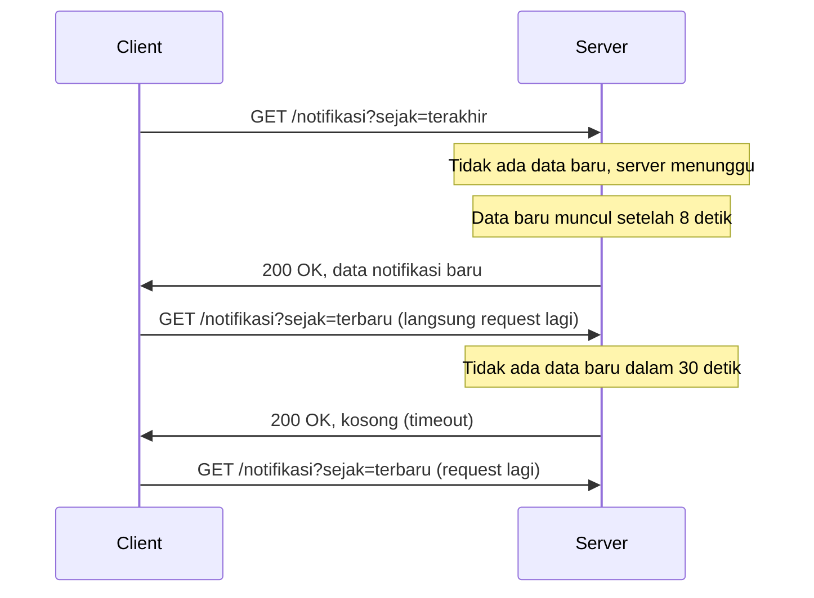

## TL;DR

**Long polling** adalah kompromi di antara polling biasa dan push sungguhan: client mengirim request seperti polling normal, tapi server **tidak langsung membalas** — ia menahan request itu terbuka sampai ada data baru untuk dikirim, atau sampai batas waktu tertentu tercapai, baru kemudian membalas dan menutup request itu. Client langsung mengirim request baru begitu response diterima, sehingga dari sudut pandang pengguna terasa seperti push, padahal secara mekanis tetap request/response HTTP biasa yang diulang-ulang. Ini menjadikannya fallback paling kompatibel ketika WebSocket dan Server-Sent Events sama-sama tidak bisa dipakai — kompatibel dengan hampir semua proxy dan firewall karena bentuknya persis request HTTP biasa, hanya durasinya yang lebih panjang.

## The Problem

Sebagian petugas di note [[WebSocket]] dan [[Server-Sent Events]] mengakses dashboard dari jaringan kantor pemerintah yang firewall-nya memblokir koneksi HTTP yang bertahan lebih dari beberapa detik, kebijakan keamanan yang umum di jaringan instansi yang berhati-hati terhadap koneksi "aneh" yang tidak selesai cepat. WebSocket gagal di-upgrade, dan SSE yang koneksinya juga dibiarkan terbuka lama kena batasan yang sama. Notifikasi real-time tetap dibutuhkan, tapi mekanismenya harus terlihat seperti request HTTP biasa yang selesai dalam waktu wajar.

Polling biasa (request pendek berulang setiap beberapa detik) lolos dari firewall, tapi kembali ke masalah awal: boros request untuk kasus di mana sebagian besar waktu tidak ada apa pun yang baru. Yang dibutuhkan adalah pola yang tetap berbentuk request/response pendek berulang, tapi tidak boros — request yang "menunggu" sampai ada sesuatu untuk dilaporkan, bukan langsung membalas kosong.

## Intuition

Pikirkan long polling sebagai bertanya ke resepsionis "apakah tamu saya sudah datang?" — alih-alih resepsionis langsung menjawab "belum" dan kamu harus bertanya lagi tiga puluh detik kemudian (polling biasa), resepsionis berkata "saya akan beri tahu begitu tamu Anda datang, tunggu di sini" dan baru menjawab ketika tamu itu benar-benar tiba, atau setelah menunggu cukup lama tanpa hasil. Begitu dijawab, kamu langsung bertanya lagi dengan pertanyaan yang sama untuk kedatangan tamu berikutnya.

Analogi ini berhenti bekerja pada satu titik: resepsionis manusia bisa mengingat banyak orang yang menunggu tanpa biaya tambahan berarti. Server yang menahan ribuan request long polling terbuka bersamaan harus menahan **resource nyata** per request yang menunggu (memori untuk goroutine dan koneksi yang tertahan), sehingga jumlah client yang menunggu bersamaan punya batas praktis yang jauh lebih ketat daripada jumlah orang yang bisa diingat resepsionis.

## How It Works



Diagram ini menunjukkan dua kemungkinan alur: server membalas begitu ada data (jalur cepat), atau server membalas kosong setelah batas waktu tertentu tercapai supaya koneksi tidak menggantung selamanya (jalur timeout). Kedua kasus berujung sama: client langsung mengirim request baru begitu menerima balasan apa pun, menciptakan efek "selalu ada satu request yang sedang menunggu" tanpa pernah benar-benar idle lama seperti polling biasa.

## In Go

```go
package main

import (
	"context"
	"encoding/json"
	"net/http"
	"time"
)

const batasWaktuTunggu = 30 * time.Second

func handleLongPolling(w http.ResponseWriter, r *http.Request) {
	ctx, cancel := context.WithTimeout(r.Context(), batasWaktuTunggu)
	defer cancel()

	sejakID := r.URL.Query().Get("sejak")

	// notifikasiBaru mengembalikan channel yang menerima data begitu
	// ada notifikasi baru setelah sejakID — implementasinya bisa
	// berupa polling internal ke database dengan interval pendek,
	// atau langganan ke sistem pub/sub internal.
	hasil := notifikasiBaru(ctx, sejakID)

	select {
	case data := <-hasil:
		w.Header().Set("Content-Type", "application/json")
		if err := json.NewEncoder(w).Encode(data); err != nil {
			http.Error(w, "gagal mengirim response", http.StatusInternalServerError)
		}
	case <-ctx.Done():
		// Timeout tercapai tanpa data baru — balas kosong dengan
		// status 200, bukan error, supaya client tahu ini kondisi
		// normal dan langsung mengirim request long polling baru.
		w.Header().Set("Content-Type", "application/json")
		json.NewEncoder(w).Encode(map[string]any{"data": nil})
	}
}
```

Pola `select` dengan `ctx.Done()` ini adalah alasan long polling relatif murah diimplementasikan di Go dibanding di model server yang satu thread per request tanpa mekanisme non-blocking — `context.WithTimeout` menangani batas waktu tanpa perlu goroutine tambahan untuk mengelola timer secara manual.

## In His Stack

Long polling adalah pilihan yang realistis ketika target penggunanya menyertakan jaringan instansi pemerintah dengan kebijakan firewall yang tidak bisa dinegosiasikan — situasi yang relevan langsung dengan konteks kerja di 13+ aplikasi legal-services pemerintah. Yii2 dengan model PHP-FPM tradisional bisa menangani long polling sampai batas tertentu (server menahan request lebih lama dari biasanya), tapi PHP-FPM punya jumlah worker proses yang terbatas — setiap request long polling yang menunggu berarti satu worker terpakai penuh selama itu, sehingga jumlah client yang bisa menunggu bersamaan jauh lebih kecil dibanding server Go yang menangani penantian lewat goroutine ringan, bukan proses OS penuh.

## Trade-offs and When Not To Use It

Long polling adalah fallback, bukan solusi utama — pilih ini ketika WebSocket dan SSE sama-sama tidak bisa dipakai karena keterbatasan jaringan client, bukan sebagai pilihan pertama. Dibanding SSE, long polling tetap membawa overhead HTTP request/response penuh (header lengkap, koneksi baru berulang kali kalau tidak memakai keep-alive) untuk setiap siklus tunggu, sementara SSE memakai satu koneksi yang tetap terbuka untuk banyak event. Untuk server dengan ribuan client menunggu bersamaan, long polling menahan resource per request yang menunggu — di Go relatif murah karena goroutine ringan, tapi tetap bukan gratis, dan pada skala sangat besar tetap perlu load testing untuk memastikan batas resource server tidak terlampaui.

## Common Mistakes

> [!warning] Jebakan
> Tidak menetapkan batas waktu tunggu di sisi server, sehingga request bisa menggantung tanpa batas kalau tidak ada data baru — menghabiskan resource server dan berpotensi memicu timeout tak terduga di layer infrastruktur lain (load balancer, proxy) yang punya batas waktunya sendiri.

> [!warning] Jebakan
> Membalas dengan status error (4xx/5xx) saat timeout tercapai tanpa data baru, padahal ini kondisi normal, bukan kegagalan — client yang menganggap ini error bisa salah menerapkan strategi retry-with-backoff yang justru memperlambat notifikasi berikutnya.

> [!warning] Jebakan
> Client tidak langsung mengirim request baru setelah menerima balasan, melainkan menunggu jeda tertentu — ini mengubah long polling kembali menjadi polling biasa dengan overhead ekstra, kehilangan keunggulan latency rendahnya.

## Exercises

1. Jelaskan perbedaan mekanis antara long polling dan polling biasa, meski keduanya sama-sama request/response HTTP.
2. Kenapa server harus tetap membalas dengan status 200 (bukan error) saat batas waktu tunggu tercapai tanpa data baru?
3. Sebuah server long polling menangani sepuluh ribu client menunggu bersamaan. Jelaskan kenapa ini lebih murah dilakukan di Go dibanding di PHP-FPM tradisional.
4. **(Open-ended)** Timmu punya budget infrastruktur terbatas dan harus mendukung notifikasi real-time untuk client di jaringan kantor pemerintah yang membatasi koneksi lama, sekaligus client di aplikasi mobile modern yang bisa memakai WebSocket dengan bebas. Rancang strategi yang tidak memaksa kedua jenis client memakai mekanisme yang sama, tapi tetap berbagi sumber data notifikasi yang sama di backend.

> [!success]- Kunci jawaban
> Untuk soal 4: backend menyimpan satu sumber kebenaran untuk notifikasi (misalnya lewat pub/sub internal atau tabel dengan timestamp), lalu mengekspos dua endpoint berbeda yang membaca dari sumber yang sama — satu endpoint WebSocket untuk client yang mendukungnya, satu endpoint long polling untuk client di jaringan terbatas. Client memilih endpoint mana yang dipakai berdasarkan deteksi kemampuan jaringan (mencoba WebSocket dulu, jatuh ke long polling kalau gagal), persis pola fallback yang sudah dibahas di [[WebSocket]]. Logika bisnis "apa yang dianggap notifikasi baru" tetap satu implementasi, hanya cara mengirimkannya ke client yang berbeda.

## Self-Check

- Apa yang membedakan long polling dari polling biasa, secara mekanis?
- Kenapa server long polling wajib menetapkan batas waktu tunggu maksimum?
- Kenapa long polling lebih murah diimplementasikan di Go dibanding di server berbasis proses per-request seperti PHP-FPM tradisional?

## Connected Notes

- [[Polling vs Push]] — long polling adalah titik tengah di antara polling biasa dan push sungguhan yang dibahas di note itu.
- [[WebSocket]] — alternatif dua arah yang lebih efisien ketika jaringan client mendukungnya; long polling jadi fallback saat WebSocket gagal.
- [[Server-Sent Events]] — alternatif satu arah yang lebih efisien untuk kasus yang sama; long polling dipilih hanya ketika keduanya sama-sama diblokir jaringan client.
- [[Context for Cancellation and Deadlines]] — `context.WithTimeout` yang dipakai di contoh Go di atas adalah aplikasi langsung dari konsep yang dibahas di note itu.

## Further Reading

- MDN Web Docs, bagian "Long Polling" dalam artikel tentang Server-Sent Communication

## Catatan Saya

*Tulis pertanyaanmu sendiri, contoh kode dari pekerjaanmu, atau bagian yang belum jelas di sini.*
