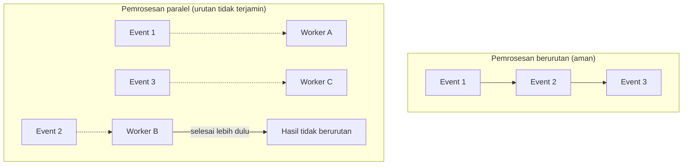

## TL;DR

Jaminan urutan pesan di sistem streaming seperti Kafka **hanya berlaku di dalam satu partition** — ini sudah disinggung di [[Topics, Partitions, and Offsets]], tapi note ini membahas apa yang benar-benar merusak urutan itu di praktik, meski desain partisi sudah benar. Tiga sumber gangguan urutan yang paling umum: pesan yang dipindahkan ke [[Dead Letter Queues]] lalu diproses ulang belakangan (keluar dari urutan aslinya), retry di sisi producer yang mengirim ulang pesan gagal setelah pesan berikutnya sudah terkirim, dan consumer yang memproses pesan secara paralel di dalam satu partition untuk kecepatan, tanpa menyadari itu menghilangkan urutan yang tadinya dijamin Kafka.

## The Problem

Sistem legal-services mengirim event status permohonan secara berurutan per `permohonan_id` — `dibuat`, `diverifikasi`, `disetujui` — semuanya masuk partition yang sama karena memakai key yang tepat, persis seperti dianjurkan di [[Topics, Partitions, and Offsets]]. Tim berasumsi urutan ini otomatis terjaga sampai muncul dua bug berbeda.

Bug pertama: event `diverifikasi` untuk sebuah permohonan gagal diproses (layanan verifikasi eksternal sedang down) dan dipindahkan ke DLQ setelah beberapa kali retry. Event `disetujui` untuk permohonan yang sama, yang datang setelahnya di stream, berhasil diproses normal. Ketika tim memperbaiki masalah layanan verifikasi dan memproses ulang isi DLQ secara manual keesokan harinya, event `diverifikasi` diproses **setelah** `disetujui` — urutan logis yang terbalik, meski keduanya tetap berasal dari partition yang sama.

Bug kedua, lebih halus: untuk menaikkan throughput, seorang engineer mengubah consumer supaya memproses beberapa pesan dari partition yang sama secara paralel memakai worker pool (pola dari [[Worker Pools]]) alih-alih satu per satu secara berurutan. Ini menaikkan throughput seperti diharapkan, tapi juga menghilangkan jaminan urutan yang tadinya dijaga Kafka — pesan `diverifikasi` dan `disetujui` bisa selesai diproses dalam urutan berbeda dari urutan mereka dibaca, karena keduanya berjalan di goroutine terpisah yang selesainya tidak terjamin berurutan.

## Intuition

Cara paling mudah memahaminya: Kafka menjamin urutan **pengiriman** dari satu partition, seperti nomor antrean yang dipanggil berurutan dari mesin nomor. Tapi begitu beberapa loket melayani nomor dari mesin yang sama secara bersamaan (paralel), orang dengan nomor lebih besar bisa selesai dilayani lebih dulu daripada orang dengan nomor lebih kecil, kalau loket yang melayani nomor kecil kebetulan butuh waktu lebih lama. Nomor antrean tetap berurutan; **penyelesaian layanan** tidak.

Analogi ini berhenti bekerja pada satu titik: mesin nomor antrean tidak punya konsep "kembalikan nomor yang terlewat ke barisan nanti" — begitu nomor dipanggil dan orangnya tidak ada, biasanya dilewati permanen. DLQ justru sebaliknya: pesan yang gagal **sengaja** dikembalikan untuk diproses lagi nanti, tapi "nanti" itu tidak lagi selaras dengan urutan asli stream, sehingga proses ulang dari DLQ harus disadari sebagai peristiwa **out-of-order** secara desain, bukan kecelakaan yang harus dihindari sebisa mungkin.

## How It Works



Diagram ini menunjukkan bahwa satu-satunya cara mempertahankan urutan pemrosesan yang benar-benar ketat adalah memproses pesan dalam satu partition **secara serial**, satu per satu, di dalam satu goroutine yang sama — begitu pemrosesan dipecah ke worker paralel demi kecepatan, jaminan urutan hilang kecuali ada mekanisme tambahan yang secara eksplisit menyusun ulang hasil sesuai urutan offset aslinya sebelum efeknya diterapkan.

Untuk kasus di mana urutan **memang** kritis (seperti status permohonan yang tidak boleh terbalik), dua pendekatan umum:

**Serial per key, paralel antar key.** Alih-alih satu goroutine untuk seluruh partition, gunakan satu goroutine per `permohonan_id` — pesan untuk permohonan yang sama tetap diproses berurutan, tapi permohonan berbeda bisa diproses paralel karena tidak saling bergantung urutannya. Ini memberi paralelisme tanpa mengorbankan urutan yang benar-benar penting.

**Versioning eksplisit di level data**, bukan bergantung pada urutan pemrosesan. Alih-alih mengandalkan "event terakhir yang diproses adalah yang benar", setiap event membawa nomor versi atau timestamp sumber, dan consumer menolak menerapkan event yang versinya lebih lama dari state yang sudah tersimpan — pendekatan ini membuat sistem toleran terhadap out-of-order processing, alih-alih berusaha mencegahnya sepenuhnya.

## In Go

```go
package main

import (
	"context"
	"fmt"
)

// terapkanStatusJikaLebihBaru menghindari status lama menimpa status
// baru yang sudah tersimpan, tidak peduli urutan pemrosesan pesan.
func terapkanStatusJikaLebihBaru(ctx context.Context, permohonanID string, statusBaru string, versiEvent int64) error {
	versiTersimpan, err := repoPermohonan.AmbilVersiStatus(ctx, permohonanID)
	if err != nil {
		return fmt.Errorf("gagal mengambil versi status permohonan %s: %w", permohonanID, err)
	}

	if versiEvent <= versiTersimpan {
		// Event ini lebih lama dari state yang sudah tersimpan —
		// kemungkinan datang dari DLQ atau pemrosesan out-of-order.
		// Bukan error, cukup diabaikan.
		return nil
	}

	if err := repoPermohonan.PerbaruiStatus(ctx, permohonanID, statusBaru, versiEvent); err != nil {
		return fmt.Errorf("gagal memperbarui status permohonan %s: %w", permohonanID, err)
	}
	return nil
}
```

Pola `versiEvent <= versiTersimpan` ini adalah pertahanan yang sama sekali tidak bergantung pada asumsi urutan pemrosesan — ia bekerja benar tidak peduli apakah event datang dalam urutan asli, terbalik karena paralelisme, atau terlambat karena keluar dari DLQ.

## In His Stack

Untuk sistem legal-services, keputusan mana yang lebih penting — throughput lewat paralelisme atau kepastian urutan — harus dibuat sadar per jenis event, bukan diseragamkan. Event status permohonan yang menentukan alur legal (dibuat → diverifikasi → disetujui/ditolak) hampir selalu butuh salah satu dari dua pendekatan di atas, karena urutan yang salah bisa berarti keputusan yang secara hukum keliru dicatat. Event yang lebih longgar (misalnya log aktivitas untuk analitik, di mana urutan pemrosesan tidak memengaruhi kesimpulan akhirnya) bisa memakai pemrosesan paralel penuh tanpa penjagaan tambahan, karena biaya menjaga urutan ketat tidak sepadan dengan manfaatnya di situ.

## Trade-offs and When Not To Use It

Menjaga urutan ketat (serial per key atau versioning eksplisit) membawa biaya nyata: serial per key membatasi paralelisme sampai batas jumlah key unik yang aktif, dan versioning eksplisit menambah kompleksitas skema data serta satu query tambahan sebelum setiap penulisan. Untuk event yang benar-benar tidak peduli urutan (idempotent dan commutative — hasil akhirnya sama tidak peduli urutan penerapannya, seperti menambahkan tag ke sebuah dokumen), memaksakan penjagaan urutan ini adalah overhead yang tidak perlu. Pertanyaan yang harus dijawab jujur di setiap jenis event: kalau dua event untuk entitas yang sama diproses dalam urutan terbalik, apakah hasil akhirnya benar-benar berbeda dan salah? Kalau jawabannya tidak, urutan bukan masalah yang perlu dipecahkan.

## Common Mistakes

> [!warning] Jebakan
> Menambahkan paralelisme ke consumer (worker pool per partition) untuk menaikkan throughput tanpa menyadari itu menghilangkan jaminan urutan yang sebelumnya dijaga Kafka secara implisit — throughput naik, tapi korektnya data mulai dipertanyakan tanpa ada yang menyadari hubungannya.

> [!warning] Jebakan
> Memproses ulang isi Dead Letter Queue secara massal tanpa mempertimbangkan bahwa pesan-pesan itu sekarang keluar dari urutan asli stream-nya — menerapkan efeknya secara naif seolah masih dalam urutan normal bisa menimpa state yang lebih baru dengan data yang lebih lama.

> [!warning] Jebakan
> Mengasumsikan versioning eksplisit di level data menggantikan kebutuhan idempotency — keduanya menyelesaikan masalah berbeda: idempotency mencegah duplikasi efek dari pesan yang sama, versioning mencegah pesan lama menimpa pesan baru. Sistem produksi yang serius butuh keduanya, bukan salah satu.

## Exercises

1. Jelaskan kenapa memproses pesan dari satu partition secara paralel (worker pool) menghilangkan jaminan urutan yang tadinya dijamin Kafka.
2. Bandingkan pendekatan "serial per key" dan "versioning eksplisit" dari sisi trade-off paralelisme yang bisa dicapai.
3. Sebuah event `diverifikasi` untuk permohonan tertentu masuk DLQ dan diproses ulang keesokan harinya, setelah event `disetujui` untuk permohonan yang sama sudah diproses. Jelaskan bagaimana pendekatan versioning eksplisit mencegah event lama ini merusak status yang sudah benar.
4. **(Open-ended)** Timmu ingin menaikkan throughput consumer status permohonan tanpa mengorbankan urutan per permohonan. Rancang implementasi konkret memakai pola "serial per key, paralel antar key" di Go, termasuk struktur data yang menjamin semua event untuk `permohonan_id` yang sama diproses oleh goroutine yang sama.

> [!success]- Kunci jawaban
> Untuk soal 4: buat peta dari `permohonan_id` ke channel buffered, masing-masing dilayani satu goroutine worker yang memproses pesan dari channel-nya secara serial. Dispatcher utama membaca dari partition Kafka, menentukan `permohonan_id` dari setiap pesan, dan mengirimkannya ke channel yang sesuai (membuat channel dan worker baru kalau `permohonan_id` itu belum punya, dengan mekanisme membersihkan worker yang sudah lama tidak menerima pesan supaya tidak bocor). Karena setiap `permohonan_id` selalu diarahkan ke channel dan worker yang sama, urutan pemrosesan untuk satu permohonan tetap serial, sementara permohonan berbeda diproses oleh worker berbeda secara paralel — paralelisme dibatasi oleh jumlah `permohonan_id` unik yang aktif bersamaan, bukan oleh jumlah pesan mentah.

## Self-Check

- Sejauh mana Kafka menjamin urutan pesan, dan apa yang bisa merusak urutan itu meski desain partisi sudah benar?
- Apa perbedaan tujuan idempotency dan versioning eksplisit dalam menangani pesan yang keluar dari urutan?
- Kapan menjaga urutan ketat tidak sepadan dengan biayanya?

## Connected Notes

- [[Topics, Partitions, and Offsets]] — prasyarat langsung: jaminan urutan dasar per partition yang dibahas lebih dalam konsekuensinya di note ini.
- [[Dead Letter Queues]] — salah satu sumber utama gangguan urutan: pesan yang diproses ulang dari DLQ keluar dari urutan asli stream-nya.
- [[Worker Pools]] — pola paralelisme yang, kalau diterapkan naif ke consumer streaming, menghilangkan jaminan urutan yang dibahas di note ini.
- [[Idempotent Consumers]] — pertahanan komplementer terhadap duplikasi, berbeda tujuan dari versioning yang menjaga terhadap pesan lama menimpa yang baru.

## Further Reading

- Tidak ada tambahan di luar dokumentasi resmi Kafka yang sudah dirujuk di note-note sebelumnya.

## Catatan Saya

*Tulis pertanyaanmu sendiri, contoh kode dari pekerjaanmu, atau bagian yang belum jelas di sini.*
