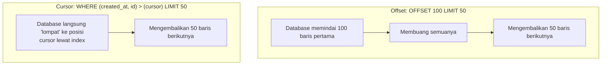

## TL;DR

**Offset pagination** (`OFFSET n LIMIT m`) sederhana untuk diimplementasikan dan mendukung "lompat ke halaman tertentu", tapi database harus memindai dan membuang `n` baris pertama setiap kali — biayanya bertambah seiring `n` membesar, dan hasilnya bisa tidak konsisten kalau data berubah di antara satu halaman dan halaman berikutnya. **Cursor pagination** memakai posisi terakhir yang dilihat (biasanya kombinasi kolom yang unik dan stabil urutannya) sebagai "penanda", meminta baris **setelah** penanda itu — performanya konsisten tidak peduli seberapa dalam halamannya, dan tahan terhadap data yang berubah di tengah proses paging, tapi tidak bisa "lompat ke halaman 50" secara langsung.

## The Problem

Bayangkan seorang petugas verifikasi di sebuah instansi menelusuri daftar permohonan yang menunggu diproses, diurutkan dari yang terlama, memakai halaman bernomor (offset pagination) 50 item per halaman. Sambil ia memproses halaman demi halaman, permohonan baru terus masuk ke sistem dan permohonan lama yang sudah selesai diverifikasi dihapus dari daftar "menunggu".

Karena offset pagination menghitung posisi dari awal setiap kali (`OFFSET 100 LIMIT 50` berarti "lewati 100 baris pertama, ambil 50 berikutnya"), begitu ada permohonan yang dihapus dari bagian awal daftar sebelum petugas membuka halaman berikutnya, **seluruh posisi bergeser** — permohonan yang seharusnya muncul di halaman 3 kini bergeser ke halaman 2, dan sebaliknya. Akibatnya, petugas bisa **melewatkan** sejumlah permohonan sepenuhnya tanpa pernah menyadarinya (permohonan itu "tergeser" melewati batas halaman yang sudah dilihat) — bug yang jauh lebih berbahaya daripada sekadar tampilan yang kurang rapi, karena berarti ada permohonan yang tidak pernah diproses tanpa ada yang sadar.

## Intuition

Bayangkan offset pagination seperti **"lewati 100 buku pertama di rak, tunjukkan 50 buku berikutnya"** — dihitung ulang dari awal setiap kali. Kalau seseorang mengambil atau menaruh buku baru di bagian awal rak sebelum kamu kembali menghitung, hitunganmu langsung meleset, dan kamu bisa melewatkan atau melihat ulang buku yang sama tanpa sadar. Cursor pagination lebih seperti **"tunjukkan buku-buku setelah buku dengan judul ini persis"** — sebuah penanda yang mengacu ke buku tertentu, bukan ke posisi hitungan — tetap valid meski buku lain ditambah atau dihapus di tempat lain di rak.

Analogi "penanda buku tertentu" ini bocor pada satu detail teknis penting: penanda itu hanya bekerja benar kalau mengacu pada urutan yang **unik dan stabil** (misalnya kombinasi timestamp dan ID, bukan sekadar satu kolom yang bisa punya nilai kembar). Kalau kolom pengurutan yang dipakai sebagai cursor tidak unik, masalah yang sama seperti offset (item terlewat atau terduplikasi) bisa muncul lagi — cursor bukan solusi ajaib, ia hanya benar kalau dasarnya (kolom pengurutan yang unik) juga benar.

## How It Works



Cursor pagination bekerja dengan menyertakan nilai kolom pengurutan dari baris terakhir yang dilihat (biasanya di-encode jadi token buram, misalnya base64 dari `created_at` + `id`) di request berikutnya, lalu query memakai `WHERE (created_at, id) > (nilai_cursor)` — kalau kolom itu di-index dengan benar (lihat [[../40 Databases/Composite Indexes and the Leftmost-Prefix Rule|Composite Indexes and the Leftmost-Prefix Rule]]), database bisa langsung "melompat" ke posisi itu lewat index tanpa perlu memindai dan membuang baris-baris sebelumnya.

## In Go

```go
// Offset: sederhana, tapi biaya query bertambah seiring offset membesar,
// dan rawan skip/duplikasi kalau data berubah di antara halaman.
func listPermohonanOffset(ctx context.Context, db *sql.DB, offset, limit int) ([]Permohonan, error) {
    rows, err := db.QueryContext(ctx,
        `SELECT id, created_at, status FROM permohonan
         ORDER BY created_at, id
         LIMIT ? OFFSET ?`, limit, offset)
    if err != nil {
        return nil, fmt.Errorf("query permohonan offset: %w", err)
    }
    defer rows.Close()
    return scanPermohonan(rows)
}

// Cursor: performa konsisten, tahan terhadap perubahan data di tengah proses.
type Cursor struct {
    CreatedAt time.Time
    ID        string
}

func encodeCursor(c Cursor) string {
    raw := fmt.Sprintf("%d|%s", c.CreatedAt.UnixNano(), c.ID)
    return base64.URLEncoding.EncodeToString([]byte(raw))
}

func listPermohonanCursor(ctx context.Context, db *sql.DB, cursor *Cursor, limit int) ([]Permohonan, error) {
    var rows *sql.Rows
    var err error
    if cursor == nil {
        rows, err = db.QueryContext(ctx,
            `SELECT id, created_at, status FROM permohonan
             ORDER BY created_at, id LIMIT ?`, limit)
    } else {
        rows, err = db.QueryContext(ctx,
            `SELECT id, created_at, status FROM permohonan
             WHERE (created_at, id) > (?, ?)
             ORDER BY created_at, id LIMIT ?`, cursor.CreatedAt, cursor.ID, limit)
    }
    if err != nil {
        return nil, fmt.Errorf("query permohonan cursor: %w", err)
    }
    defer rows.Close()
    return scanPermohonan(rows)
}
```

Kombinasi `(created_at, id)` dipakai sebagai kolom pengurutan tepat karena `created_at` saja bisa punya nilai kembar (dua permohonan dibuat di detik yang sama) — menambahkan `id` (yang selalu unik) sebagai tie-breaker memastikan urutan benar-benar deterministik, prasyarat mutlak untuk cursor pagination bekerja benar.

## In His Stack

**Yii2** dengan komponen `Pagination` bawaannya (dipakai bersama `GridView`/`ActiveDataProvider`) secara default berbasis **offset** — inilah kenapa laporan atau daftar panjang di aplikasi Yii2 yang sudah berjalan lama sering terasa melambat drastis begitu pengguna membuka halaman-halaman jauh di belakang, dan kenapa daftar yang sering berubah (seperti antrean permohonan yang terus bertambah/berkurang) rawan menampilkan hasil yang tidak konsisten antar halaman — persis masalah yang dijelaskan di "The Problem".

## Trade-offs and When Not To Use It

Offset pagination unggul untuk kebutuhan UI yang butuh navigasi ke nomor halaman tertentu secara langsung ("lompat ke halaman 12") dan untuk dataset kecil yang jarang berubah — kompleksitas implementasinya jauh lebih rendah. Cursor pagination unggul untuk dataset besar dan terus berubah, terutama untuk pola scroll tak berujung (infinite scroll) atau daftar yang butuh konsistensi ketat (antrean kerja, feed aktivitas) — tapi tidak bisa mendukung "lompat ke halaman N" secara alami, hanya navigasi berurutan (next/previous).

## Common Mistakes

> [!warning] Jebakan
> Memakai offset pagination untuk daftar yang sering berubah dan butuh konsistensi tinggi (antrean kerja, permohonan yang menunggu diproses), tanpa menyadari risiko item terlewat atau terduplikasi saat data berubah di antara permintaan halaman.

> [!warning] Jebakan
> Mengimplementasikan cursor pagination dengan kolom pengurutan yang tidak unik (misalnya hanya `created_at` tanpa tie-breaker), menghasilkan masalah non-determinisme yang sama persis dengan offset pagination — cursor bukan solusi ajaib tanpa dasar pengurutan yang benar.

> [!warning] Jebakan
> Mengabaikan degradasi performa offset pagination pada halaman yang jauh (offset besar) sampai partner atau fitur laporan benar-benar meminta halaman jauh di kemudian hari, dan query yang tadinya cepat tiba-tiba terasa lambat tanpa perubahan kode apa pun.

## Exercises

1. Kenapa offset pagination bisa membuat item terlewat atau muncul dua kali saat data berubah di antara permintaan halaman?
2. Apa syarat kolom pengurutan supaya cursor pagination bekerja benar?
3. Kenapa cursor pagination tidak bisa mendukung "lompat ke halaman tertentu" secara alami?
4. Desain terbuka: sebuah laporan bulanan berbasis offset pagination sudah dipakai lama, dan mulai terasa sangat lambat karena tabelnya kini berisi jutaan baris dan laporan sering diminta sampai halaman yang jauh. Rancang migrasi ke cursor pagination yang tetap kompatibel dengan kebutuhan pengguna yang mungkin masih ingin melihat "halaman berapa" secara kasar, tanpa mengorbankan performa.

> [!success]- Kunci jawaban
> Migrasikan endpoint API ke cursor pagination untuk navigasi utama (next/previous), tapi tetap sediakan estimasi "halaman keberapa" secara terpisah dan tidak presisi — misalnya dengan menghitung total baris secara approximate (dari statistik tabel database, bukan `COUNT(*)` penuh yang mahal di tabel besar) untuk ditampilkan sebagai konteks ("sekitar halaman 340 dari 1200"), tanpa benar-benar mendukung lompat langsung ke halaman itu lewat query cursor. Kalau kebutuhan "lompat ke halaman spesifik" benar-benar kritis (bukan sekadar nice-to-have), pertimbangkan hybrid: cursor untuk navigasi sehari-hari yang cepat, dan endpoint offset terpisah (dengan peringatan performa jelas) khusus untuk kasus jarang seperti export laporan penuh yang memang harus memproses seluruh dataset secara berurutan.

## Self-Check

- Kenapa biaya query offset pagination bertambah seiring offset membesar?
- Apa syarat kolom pengurutan untuk cursor pagination bekerja benar?
- Kenapa cursor pagination lebih tahan terhadap data yang berubah di tengah proses paging?
- Kapan offset pagination tetap menjadi pilihan yang wajar?

## Connected Notes

- [[Resource Modelling]] — prasyarat: desain endpoint collection yang menjadi tempat pagination diterapkan.
- [[../40 Databases/Index Basics|Index Basics]] dan [[../40 Databases/Composite Indexes and the Leftmost-Prefix Rule|Composite Indexes and the Leftmost-Prefix Rule]] — index yang membuat cursor pagination benar-benar cepat, bukan sekadar teori.
- [[Filtering and Sorting]] — pagination selalu bekerja berdampingan dengan sorting yang konsisten.
- [[../94 Case Studies/Case - The Just Add An Index Request|Case - The Just Add An Index Request]] — pertimbangan index yang relevan saat mengoptimalkan query pagination.

## Further Reading

- Artikel *"Pagination: You're (Probably) Doing It Wrong"* — berbagai tulisan komunitas database (PostgreSQL wiki, blog engineering perusahaan besar) membahas topik ini mendalam; cari dengan judul serupa untuk perbandingan implementasi.

## Catatan Saya

*Tulis di sini laporan atau daftar di kerjaanmu yang memakai offset pagination dan mulai terasa lambat di halaman jauh.*
