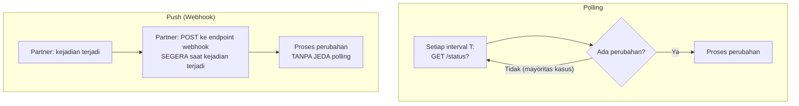

## TL;DR

**Polling** — kamu secara berkala bertanya ke partner "ada yang baru?" — adalah pendekatan paling sederhana untuk mengetahui perubahan data di sistem lain, tapi membebani kedua sisi dengan pertanyaan yang seringkali dijawab "tidak ada yang baru" (waste), dan memperkenalkan **jeda** antara kejadian sesungguhnya dan kamu mengetahuinya (bergantung interval polling). **Push** (webhook, dibahas di note sebelumnya) membalik model ini — partner yang memberi tahu begitu ada kejadian, menghilangkan waste dan jeda, tapi butuh partner punya kapasitas teknis mengirim notifikasi terarah dan butuh endpoint publik di sisimu yang bisa menerimanya. Pilihan antara keduanya sering ditentukan bukan oleh preferensi teknis, tapi oleh **kapasitas partner** — banyak partner (terutama sistem legacy) tidak punya kemampuan mengirim webhook sama sekali, membuat polling menjadi satu-satunya pilihan realistis meski secara teori kurang efisien.

## The Problem

Sebuah sistem butuh mengetahui begitu status permohonan berubah di sistem instansi lain — pilihan pertama yang terpikirkan adalah polling setiap satu menit, tapi ini berarti untuk permohonan yang jarang berubah status (mayoritas kasus), sistem mengirim ribuan pertanyaan "ada perubahan?" yang dijawab "tidak" — beban yang terus-menerus dibebankan ke sistem partner meski tidak ada informasi baru yang sebenarnya perlu disampaikan. Menaikkan interval polling (misalnya setiap satu jam) mengurangi beban tapi memperbesar jeda — perubahan status yang terjadi tepat setelah polling terakhir baru diketahui hampir satu jam kemudian, jeda yang bisa berarti keterlambatan nyata bagi warga yang menunggu kepastian status permohonannya.

Masalah kedua: sistem instansi partner sebenarnya **mendukung** webhook, tapi tim internal memilih tetap memakai polling karena tidak nyaman membuka endpoint publik baru (kekhawatiran keamanan yang sah, tapi bisa diselesaikan dengan mekanisme verifikasi signature yang tepat, lihat [[Webhooks and How to Secure Them]]) — keputusan yang menghindari kompleksitas jangka pendek (membuka endpoint baru) dengan mengorbankan efisiensi jangka panjang (beban polling terus-menerus, jeda yang tidak perlu ada).

## Intuition

Bayangkan polling seperti **menelepon berulang kali untuk bertanya "sudah selesai belum?"**, dan push seperti **meminta orang itu meneleponmu balik begitu benar-benar selesai**. Menelepon berulang membuang waktu kedua pihak kalau jawabannya berkali-kali "belum" — tapi kalau orang yang kamu tunggu tidak bisa (atau tidak tahu cara) meneleponmu balik secara proaktif (mungkin mereka sendiri sibuk dan lupa, atau memang tidak terbiasa melakukan itu), satu-satunya cara memastikan kamu tahu kabar terbaru adalah terus menelepon berkala, meski secara prinsip kurang efisien.

Analogi ini bocor pada satu hal: menelepon manusia dan menunggu telepon balik keduanya sama-sama "gratis" secara teknis (hanya butuh waktu manusia). Polling sistem software punya biaya **komputasi nyata** di kedua sisi (setiap pertanyaan butuh proses request-response penuh, termasuk overhead jaringan dan autentikasi), sehingga waste dari polling yang terlalu sering bisa terakumulasi jadi beban infrastruktur yang signifikan, bukan sekadar "waktu yang terbuang" seperti telepon manusia yang tidak benar-benar membebani sistem apa pun.

## How It Works



**Faktor yang menentukan pilihan**: kapasitas teknis partner (bisakah mereka mengirim webhook sama sekali?); toleransi jeda (seberapa penting mengetahui perubahan dalam hitungan detik vs bisa menerima jeda beberapa menit/jam?); volume perubahan relatif terhadap volume pertanyaan (kalau perubahan sangat sering terjadi — hampir setiap polling menemukan sesuatu yang baru — waste polling jadi kecil, dan push tidak memberi manfaat proporsional besar dibanding polling yang sering).

## Under The Hood

**Polling adaptif** adalah kompromi yang mengurangi sebagian kelemahan polling murni — interval polling disesuaikan secara dinamis berdasarkan riwayat aktivitas: kalau beberapa polling terakhir menemukan perubahan, polling berikutnya dipercepat (kemungkinan perubahan lagi lebih tinggi); kalau sudah lama tidak ada perubahan, interval diperlambat (mengurangi waste untuk periode yang kemungkinan besar tenang). Ini tidak menghilangkan jeda sepenuhnya seperti push, tapi memberi keseimbangan yang lebih baik dibanding interval tetap yang tidak menyesuaikan pola aktivitas sesungguhnya.

**Hybrid polling-push** adalah pola yang kadang dipakai: partner mengirim webhook sebagai notifikasi "ada sesuatu yang berubah, coba cek" **tanpa** menyertakan detail lengkap perubahan itu (mengurangi kebutuhan keamanan yang ketat pada payload webhook, karena payload tidak membawa data sensitif) — penerima kemudian melakukan **satu** panggilan API langsung ke partner untuk mengambil detail sesungguhnya, dipicu oleh webhook, bukan polling berkala. Pola ini memberi sebagian manfaat push (jeda minimal, tidak ada waste polling terus-menerus) sambil mengurangi kerumitan keamanan webhook penuh (payload webhook hanya berisi sinyal "ada perubahan", bukan data yang perlu diverifikasi ketat).

## In Go

```go
package polling

import (
	"context"
	"time"
)

// PollingAdaptif menyesuaikan interval berdasarkan RIWAYAT aktivitas —
// mengurangi waste dibanding interval TETAP, tanpa perlu partner
// mendukung webhook sama sekali.
type PollingAdaptif struct {
	intervalMin     time.Duration
	intervalMaks    time.Duration
	intervalSaatIni time.Duration
}

func NewPollingAdaptif(min, maks time.Duration) *PollingAdaptif {
	return &PollingAdaptif{intervalMin: min, intervalMaks: maks, intervalSaatIni: maks}
}

// SesuaikanInterval mempercepat polling berikutnya kalau ADA perubahan
// ditemukan (kemungkinan perubahan lagi lebih tinggi), memperlambat
// kalau TIDAK ADA (periode yang kemungkinan tenang).
func (p *PollingAdaptif) SesuaikanInterval(adaPerubahan bool) time.Duration {
	if adaPerubahan {
		p.intervalSaatIni = p.intervalMin
	} else {
		p.intervalSaatIni *= 2
		if p.intervalSaatIni > p.intervalMaks {
			p.intervalSaatIni = p.intervalMaks
		}
	}
	return p.intervalSaatIni
}

func JalankanPollingAdaptif(ctx context.Context, cekPerubahan func(ctx context.Context) (bool, error)) {
	p := NewPollingAdaptif(10*time.Second, 5*time.Minute)

	for {
		select {
		case <-ctx.Done():
			return
		case <-time.After(p.intervalSaatIni):
			adaPerubahan, err := cekPerubahan(ctx)
			if err != nil {
				continue // tangani error, lanjut polling berikutnya
			}
			p.SesuaikanInterval(adaPerubahan)
		}
	}
}
```

## In His Stack

Untuk integrasi dengan sistem instansi pemerintah lain, kenyataan yang sering dihadapi adalah partner tidak punya kapasitas teknis mengirim webhook sama sekali (sistem legacy yang hanya menyediakan API baca sederhana) — polling adaptif menjadi pilihan realistis meski secara teori kurang ideal, dan investasi waktu lebih baik dialokasikan untuk menyesuaikan interval polling secara cerdas berdasarkan pola aktivitas nyata, dibanding berharap partner akan menambah dukungan webhook yang mungkin tidak pernah terwujud.

## Trade-offs and When Not To Use It

Push (webhook) tidak selalu lebih baik meski secara prinsip lebih efisien — untuk kasus di mana perubahan terjadi sangat jarang dan jeda beberapa jam sepenuhnya bisa diterima (laporan bulanan, misalnya), investasi membangun dan mengamankan endpoint webhook mungkin tidak sepadan dibanding polling sederhana dengan interval panjang. Polling murni menjadi pilihan yang buruk justru untuk kasus dengan volume perubahan tinggi dan kebutuhan jeda minimal (status pembayaran real-time) — di situ, push (atau alternatif seperti WebSocket untuk komunikasi dua arah yang tetap terbuka, dibahas di note lain domain ini) memberi manfaat yang jauh lebih besar dibanding kompleksitas tambahannya.

## Common Mistakes

> [!warning] Jebakan
> Menggunakan interval polling tetap yang tidak menyesuaikan pola aktivitas nyata — polling terlalu sering membebani kedua sisi tanpa manfaat proporsional, polling terlalu jarang menciptakan jeda yang tidak perlu ada.

> [!warning] Jebakan
> Menghindari webhook karena kekhawatiran keamanan membuka endpoint publik, padahal risiko itu bisa dimitigasi dengan verifikasi signature yang tepat (lihat [[Webhooks and How to Secure Them]]) — mengorbankan efisiensi jangka panjang demi menghindari kompleksitas jangka pendek yang sebenarnya bisa diatasi.

> [!warning] Jebakan
> Memaksakan webhook untuk partner yang jelas-jelas tidak punya kapasitas teknis mendukungnya — menghabiskan waktu negosiasi yang tidak akan pernah berhasil, alih-alih menerima polling sebagai solusi realistis dan mengoptimalkannya.

## Exercises

1. Jelaskan trade-off inti antara polling dan push dari sisi efisiensi dan jeda (latency).
2. Bagaimana polling adaptif mengurangi waste dibanding polling dengan interval tetap?
3. Apa itu pola hybrid polling-push, dan kenapa itu mengurangi kerumitan keamanan dibanding push penuh?
4. Desain terbuka: kamu mengintegrasikan dengan tiga partner berbeda — (a) partner yang mendukung webhook penuh dengan HMAC signature, (b) partner legacy yang hanya punya API baca sederhana tanpa dukungan webhook, (c) partner yang perubahan datanya sangat jarang terjadi (beberapa kali per bulan). Tentukan strategi (polling tetap, polling adaptif, atau push) untuk masing-masing, dan jelaskan alasannya.

> [!success]- Kunci jawaban
> **1.** Polling memberi kontrol penuh di sisi penerima (tidak butuh endpoint publik, tidak bergantung kapasitas partner) tapi membebani kedua sisi dengan pertanyaan yang sering dijawab "tidak ada perubahan", dan menciptakan jeda sebesar interval polling antara kejadian sesungguhnya dan diketahuinya perubahan itu. Push menghilangkan waste dan jeda (notifikasi dikirim segera saat kejadian terjadi), tapi butuh partner punya kapasitas mengirim webhook dan butuh penerima membuka endpoint publik yang bisa menerima notifikasi masuk, dengan risiko keamanan yang harus dimitigasi.
> **4.** (a) Partner dengan webhook + HMAC: pakai **push**, karena inilah keunggulan penuhnya dimanfaatkan — jeda minimal, tidak ada waste polling, dan keamanan terjamin lewat verifikasi signature. (b) Partner legacy tanpa dukungan webhook: **polling adaptif** adalah satu-satunya pilihan realistis — sesuaikan interval berdasarkan pola aktivitas historis partner ini untuk meminimalkan waste tanpa mengorbankan jeda terlalu jauh. (c) Partner dengan perubahan sangat jarang: **polling dengan interval tetap yang panjang** (misalnya sekali per hari, atau bahkan lebih jarang) sudah lebih dari cukup — investasi membangun webhook (kalaupun partner mendukungnya) untuk kasus dengan volume perubahan serendah ini tidak sepadan dengan manfaatnya, karena waste dari polling jarang ini sudah sangat kecil dengan sendirinya.

## Self-Check

- Apa trade-off inti antara polling dan push?
- Bagaimana polling adaptif mengurangi waste dibanding interval tetap?
- Apa itu pola hybrid polling-push?
- Kapan push tetap bukan pilihan terbaik meski secara prinsip lebih efisien?

## Connected Notes

- [[Webhooks and How to Secure Them]] — bentuk konkret dari push yang dibahas mendalam mekanisme keamanannya di note sebelumnya.
- [[File-Based Integration]] — alternatif lain integrasi untuk partner yang bahkan tidak punya API sama sekali, hanya pertukaran file, dibahas di note berikutnya.
- [[Long Polling]] — teknik yang berada di antara polling murni dan push penuh, memberi realtime semu di atas infrastruktur HTTP biasa, dibahas di note lain domain ini.
- [[Batch vs Realtime Integration]] — keputusan polling vs push sering berkaitan langsung dengan keputusan yang lebih luas soal ritme pertukaran data, dibahas di note lain domain ini.
- [[Rate Limiting Algorithms]] — polling yang terlalu agresif bisa terkena rate limit partner, menghubungkan langsung ke topik pembatasan laju request di note lain domain ini.

## Further Reading

- Materi umum tentang pola integrasi sistem (Enterprise Integration Patterns oleh Gregor Hohpe dan Bobby Woolf) — rujukan klasik yang membahas polling, push, dan pola integrasi lain secara mendalam.

## Catatan Saya

*Tulis di sini integrasi di kerjaanmu yang masih memakai polling dengan interval tetap — apakah polling adaptif atau push bisa memperbaikinya.*
