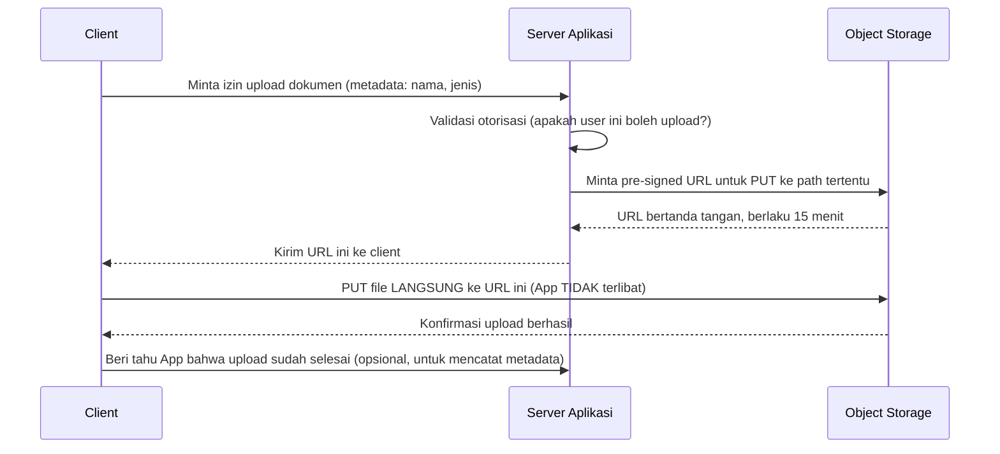

## TL;DR

Pre-signed URL adalah tautan sementara yang ditandatangani secara kriptografis oleh backend-mu, memberi client izin melakukan **satu operasi spesifik** (biasanya `GET` atau `PUT`) langsung ke object storage — **tanpa file itu pernah melewati server aplikasimu sama sekali**. Ini memindahkan peran server aplikasi dari "menyalurkan data" menjadi murni "mengotorisasi": memutuskan apakah client boleh mendapat tautan ini, lalu melepas seluruh beban transfer byte ke storage yang memang dirancang untuk itu.

## The Problem

Bayangkan server aplikasi yang menangani seluruh upload dan download dokumen scan dari lebih dari 100 kantor cabang secara langsung — setiap transfer file, sebesar apa pun, menahan kapasitas jaringan dan slot koneksi satu instance server aplikasi selama **seluruh durasi transfer**, meski server aplikasi sebenarnya tidak perlu "melakukan" apa pun terhadap byte mentah file itu selain menyimpannya atau meneruskannya. Semakin banyak kantor cabang mengunggah/mengunduh dokumen besar bersamaan, semakin server aplikasi tertekan — bukan karena logika bisnisnya berat, tapi murni karena ia menjadi jalur lalu lintas untuk data yang sebenarnya tidak butuh diproses olehnya.

Realisasi kuncinya: untuk kebutuhan penyimpanan/pengambilan murni, server aplikasi tidak perlu berada di jalur data sama sekali — ia hanya perlu mengotorisasi dan menghasilkan tautan langsung yang terbatas cakupan dan waktunya ke object storage, membiarkan storage itu sendiri (yang memang dirancang menangani bandwidth besar) yang benar-benar menangani transfer byte-nya.

## Intuition

Bayangkan pre-signed URL seperti **tiket klaim sementara sekali pakai yang diberikan resepsionis hotel** supaya kamu bisa mengambil sendiri kopermu langsung dari gudang penyimpanan, tanpa resepsionis harus bolak-balik membawakannya untukmu setiap kali. Tugas resepsionis yang sesungguhnya (memastikan kamu memang berhak mengambil koper itu) dipisahkan dari kerja fisik memindahkannya.

Analogi "tiket klaim" ini bocor pada soal fleksibilitas penilaian. Tiket kertas sungguhan masih bisa "dipertimbangkan" secara manusiawi oleh resepsionis (misalnya membiarkan tiket yang baru saja kedaluwarsa tetap dipakai kalau situasinya masuk akal). Validitas pre-signed URL ditegakkan **murni dan kaku** lewat tanda tangan kriptografis dan timestamp kedaluwarsa yang diverifikasi secara terprogram oleh layanan storage — tidak ada keputusan manusiawi yang bisa membuat pengecualian. Ia valid atau tidak valid semata berdasarkan matematika tanda tangan dan waktu, sehingga satu-satunya kesempatan untuk "benar" adalah saat menentukan cakupan dan masa berlakunya di awal — tidak ada ruang koreksi setelahnya.

## How It Works



Server aplikasi hanya terlibat di dua titik: mengotorisasi permintaan dan (opsional) mencatat metadata setelah upload selesai — byte file itu sendiri **tidak pernah** melewati server aplikasi.

## In Go

```go
type ObjectStorageSigner interface {
    // Menghasilkan URL bertanda tangan untuk operasi PUT/GET pada
    // satu object path spesifik, berlaku hanya sampai waktu tertentu.
    URLBertandaTangan(ctx context.Context, path string, operasi string, berlakuSampai time.Duration) (string, error)
}

func handleMintaUploadURL(signer ObjectStorageSigner) http.HandlerFunc {
    return func(w http.ResponseWriter, r *http.Request) {
        var req struct {
            NamaFile string `json:"nama_file"`
        }
        if err := json.NewDecoder(r.Body).Decode(&req); err != nil {
            http.Error(w, "payload tidak valid", http.StatusBadRequest)
            return
        }

        // Otorisasi: apakah user ini memang berhak mengunggah dokumen?
        if !userBolehUpload(r.Context()) {
            http.Error(w, "tidak berwenang", http.StatusForbidden)
            return
        }

        key := uuid.New().String() + filepath.Ext(req.NamaFile)
        // Cakupan MINIMAL: hanya operasi PUT, hanya pada path spesifik ini,
        // berlaku singkat (15 menit) — bukan URL umum yang bisa dipakai
        // untuk operasi lain atau path lain.
        url, err := signer.URLBertandaTangan(r.Context(), key, "PUT", 15*time.Minute)
        if err != nil {
            http.Error(w, "gagal membuat URL upload", http.StatusInternalServerError)
            return
        }

        respondJSON(w, http.StatusOK, map[string]string{
            "upload_url": url,
            "key":        key,
        })
    }
}
```

> [!question] Perlu diverifikasi
> Klaim: signature dan call spesifik untuk menghasilkan pre-signed URL berbeda-beda antar vendor object storage (S3-compatible, GCS, dsb.) dan antar versi SDK masing-masing.
> Kenapa ragu: tidak ada satu API universal — setiap vendor punya SDK dan parameter signing-nya sendiri.
> Cara verifikasi: baca dokumentasi resmi SDK object storage yang benar-benar dipakai proyek (misalnya AWS SDK for Go, atau SDK vendor lokal yang dipakai) untuk detail signing yang akurat.

## In His Stack

Untuk sistem yang melayani banyak kantor cabang dengan dokumen scan berukuran besar, memindahkan transfer file ke pre-signed URL langsung ke object storage adalah salah satu perubahan arsitektur paling berdampak untuk mengurangi beban server aplikasi — server aplikasi tidak lagi jadi bottleneck bandwidth untuk transfer file, hanya untuk logika bisnis yang jauh lebih ringan. Trade-off yang harus disadari: karena file tidak lagi melewati server aplikasi, validasi konten (sniffing jenis file, pemindaian malware) yang tadinya "gratis" terjadi saat file mengalir lewat server (lihat [[Upload and Download Patterns]]) sekarang harus dilakukan secara terpisah — baik divalidasi dari metadata sebelum URL diberikan, dan/atau lewat langkah verifikasi tambahan **setelah** upload selesai (misalnya proses background yang memindai file yang baru masuk).

## Trade-offs and When Not To Use It

Pre-signed URL memberi keuntungan skalabilitas besar untuk transfer file — server aplikasi lepas sepenuhnya dari beban bandwidth. Trade-off utamanya: hilangnya kesempatan memvalidasi/memindai konten file secara inline saat transit, dan kebergantungan langsung pada model kontrol akses object storage yang dipakai. Untuk file kecil dengan volume rendah, kompleksitas tambahan pre-signed URL (perlu SDK storage, perlu proses verifikasi pasca-upload terpisah) mungkin tidak sepadan — upload langsung lewat server aplikasi (lihat [[Upload and Download Patterns]]) tetap valid untuk kasus itu.

## Common Mistakes

> [!warning] Jebakan
> Membuat masa berlaku pre-signed URL sangat panjang "supaya aman" terhadap upload lambat, padahal ini memperlebar jendela waktu di mana URL yang bocor (misalnya tercatat di log, atau ter-share tidak sengaja) bisa disalahgunakan.

> [!warning] Jebakan
> Menganggap pre-signed URL saja sudah cukup untuk validasi konten, lupa bahwa server tidak pernah menyentuh byte file selama transfer — tanpa langkah verifikasi terpisah pasca-upload, celah validasi yang tadinya otomatis ada di upload lewat server jadi hilang begitu saja.

> [!warning] Jebakan
> Menghasilkan pre-signed URL dengan cakupan yang terlalu luas (mengizinkan operasi selain yang dibutuhkan, atau path yang lebih umum dari yang seharusnya), alih-alih membatasi setiap URL hanya pada satu operasi dan satu object path yang spesifik.

## Exercises

1. Kenapa pre-signed URL mengurangi beban server aplikasi dibanding upload langsung lewat server?
2. Kenapa masa berlaku pre-signed URL yang terlalu panjang berisiko?
3. Apa yang hilang dari segi validasi konten saat memakai pre-signed URL, dibanding upload yang melewati server aplikasi?
4. Desain terbuka: sebuah sistem bermigrasi dari upload lewat server aplikasi ke pre-signed URL untuk mengurangi beban bandwidth, tapi tim khawatir kehilangan kemampuan memindai file berbahaya (malware) yang tadinya otomatis terjadi saat file melewati server. Rancang alur lengkap yang tetap memungkinkan validasi konten meski file tidak lagi melewati server aplikasi.

> [!success]- Kunci jawaban
> Setelah client menyelesaikan upload langsung ke object storage lewat pre-signed URL, client memberi tahu server aplikasi bahwa upload sudah selesai (atau server aplikasi memakai notifikasi event dari object storage kalau tersedia, mirip [[../60 Distributed Systems/Change Data Capture|Change Data Capture]] tapi untuk storage). Server aplikasi kemudian memicu proses verifikasi **asinkron** (lihat [[../50 Concurrency and Performance/Worker Pools|Worker Pools]]) yang mengambil file itu dari storage, memindai jenis/konten dan malware-nya, lalu menandai file itu sebagai "terverifikasi" atau "ditolak" di metadata — dokumen yang belum lolos verifikasi ini tidak ditampilkan sebagai tersedia ke pengguna lain sampai proses ini selesai. Ini memindahkan validasi dari "inline saat transit" (yang hilang karena pre-signed URL) menjadi "asinkron setelah upload selesai", tetap menjaga keamanan tanpa mengorbankan keuntungan skalabilitas pre-signed URL.

## Self-Check

- Kenapa pre-signed URL mengurangi beban bandwidth server aplikasi?
- Apa risiko masa berlaku pre-signed URL yang terlalu panjang?
- Apa yang hilang dari segi validasi konten saat file tidak melewati server aplikasi?
- Bagaimana cakupan (scope) pre-signed URL sebaiknya dibatasi?

## Connected Notes

- [[Upload and Download Patterns]] — prasyarat: pola upload langsung lewat server yang menjadi pembanding pre-signed URL.
- [[Request Size Limits Along The Path]] — batas ukuran yang perilakunya berbeda saat transfer tidak lagi melewati server aplikasi.
- [[../80 Security/Secret Management|Secret Management]] — kredensial untuk menandatangani URL ini harus dikelola dengan disiplin yang sama seperti secret lainnya.
- [[../60 Distributed Systems/Change Data Capture|Change Data Capture]] — pola notifikasi event yang relevan untuk mengetahui kapan upload lewat pre-signed URL selesai.
- [[../50 Concurrency and Performance/Worker Pools|Worker Pools]] — mekanisme verifikasi asinkron pasca-upload yang dijelaskan di exercise note ini.

## Further Reading

- Dokumentasi resmi vendor object storage yang dipakai proyek (AWS S3, Google Cloud Storage, MinIO, atau setara) untuk detail signing dan kontrol akses yang akurat sesuai vendor tersebut.

## Catatan Saya

*Tulis di sini apakah sistem di kerjaanmu sudah memakai pre-signed URL untuk file besar, atau masih lewat server aplikasi langsung.*
