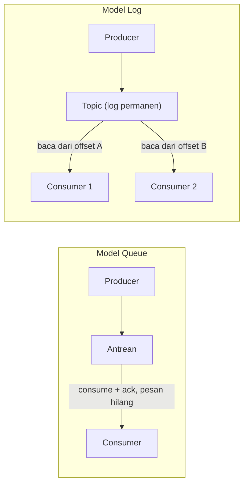

## TL;DR

Sistem pesan asinkron datang dalam dua model dasar yang sering disamakan padahal punya konsekuensi sangat berbeda: **queue** (contoh: RabbitMQ) menghapus pesan dari antrean begitu berhasil diproses satu consumer — pesan bersifat sekali pakai dan hilang setelah dikonsumsi. **Log** (contoh: Kafka) menyimpan pesan secara berurutan dan permanen (sampai batas retensi tertentu) di sebuah **topic**, dan setiap consumer membaca dari posisi (offset) miliknya sendiri tanpa menghapus apa pun — pesan yang sama bisa dibaca ulang, dan beberapa consumer independen bisa membaca urutan yang sama dari titik berbeda. Memilih yang salah bukan soal performa, melainkan soal apakah "membaca ulang riwayat" dan "banyak consumer independen membaca hal yang sama" adalah kebutuhan sungguhan atau tidak.

## The Problem

Sebuah sistem legal-services memakai queue (RabbitMQ) untuk memproses permohonan baru: setiap permohonan masuk sebagai satu pesan, worker mengambilnya, memprosesnya, dan pesan itu hilang dari antrean. Sistem bekerja baik sampai tim audit meminta kemampuan baru: mereka ingin sistem terpisah yang menghitung ulang statistik harian dari **seluruh riwayat permohonan** yang pernah masuk, termasuk yang sudah lama diproses. Dengan queue, ini mustahil — begitu sebuah pesan dikonsumsi dan diakui (acknowledged), ia hilang selamanya. Riwayat itu hanya ada kalau sengaja disimpan terpisah di database, bukan di sistem pesannya sendiri.

Masalah kedua muncul ketika tim ingin menambahkan consumer kedua yang independen: selain worker yang memproses permohonan, mereka ingin worker terpisah yang mengirim notifikasi email setiap kali ada permohonan baru, tanpa mengganggu logika pemrosesan yang sudah ada. Dengan queue klasik, satu pesan hanya bisa dikonsumsi oleh **satu** consumer (kecuali dikonfigurasi fanout eksplisit ke banyak antrean terpisah, yang berarti menduplikasi pesan itu sendiri ke setiap antrean) — menambah consumer baru yang independen berarti mengubah topologi routing, bukan sekadar "menambah pembaca baru" yang murah.

## Intuition

Cara paling mudah memahaminya: queue seperti **loket antrean** di kantor pelayanan — begitu nomor antrean dipanggil dan dilayani, nomor itu tidak berlaku lagi untuk siapa pun. Log seperti **buku tamu** yang terus bertambah — siapa pun boleh membaca buku itu dari halaman mana pun yang mereka mau, mencatat sendiri sudah sampai halaman berapa mereka membaca, dan halaman-halaman lama tidak dihapus hanya karena seseorang sudah membacanya.

Analogi ini berhenti bekerja pada satu titik: buku tamu fisik tidak punya batas halaman praktis, sementara log di sistem seperti Kafka tetap punya **retensi** — halaman-halaman terlalu lama akhirnya dihapus juga (biasanya dikonfigurasi berdasarkan waktu atau ukuran), hanya jauh lebih lambat dan lebih terkontrol dibanding queue yang menghapus pesan segera setelah dikonsumsi.

## How It Works

Diagram ini menunjukkan perbedaan paling mendasar: di model queue, pesan berpindah kepemilikan dari antrean ke consumer dan menghilang dari antrean. Di model log, pesan tetap berada di topic; yang bergerak hanyalah **posisi baca** (offset) milik masing-masing consumer, sehingga dua consumer bisa berada di posisi yang sama sekali berbeda dalam log yang sama tanpa saling mengganggu.

Konsekuensi dari perbedaan ini menjalar ke banyak keputusan desain lain:

**Replay.** Log memungkinkan consumer baru membaca dari awal topic (atau dari titik waktu tertentu), berguna untuk kasus seperti membangun ulang state, debugging, atau menambahkan fitur analitik baru tanpa mengubah producer sama sekali. Queue tidak punya konsep ini — begitu pesan hilang, hilang.

**Multiple independent consumers.** Log secara native mendukung banyak consumer group membaca topic yang sama dari posisi masing-masing, tanpa mengubah producer maupun consumer lain. Queue butuh **fanout exchange** (di RabbitMQ) yang secara eksplisit menyalin pesan ke beberapa antrean terpisah — bekerja, tapi berarti menduplikasi pesan di level infrastruktur, bukan sekadar menambah pembaca.

**Urutan.** Log menjaga urutan pesan dalam satu partition secara ketat (dibahas lebih lanjut di [[Topics, Partitions, and Offsets]]). Queue klasik pada dasarnya FIFO per antrean, tapi begitu ada beberapa consumer bersaing mengambil dari antrean yang sama, urutan pemrosesan antar consumer tidak lagi terjamin.

## In His Stack

Kafka, yang sudah ada di ekosistem, adalah implementasi model log — cocok untuk kasus seperti event sourcing internal, feed audit, atau ketika beberapa service perlu mengonsumsi stream event yang sama secara independen (misalnya service notifikasi dan service laporan sama-sama membaca event "permohonan dibuat" tanpa saling mengenal). RabbitMQ (kalaupun belum dipakai, sering muncul sebagai pembanding) mewakili model queue — lebih cocok untuk task queue klasik: job yang harus dikerjakan tepat sekali oleh tepat satu worker, seperti mengirim satu email atau memproses satu file upload, di mana riwayat pesan yang sudah selesai memang tidak relevan disimpan.

Untuk sistem legal-services yang punya kebutuhan audit trail kuat (pemerintah sering mensyaratkan riwayat lengkap siapa melakukan apa dan kapan), model log punya keunggulan alami: riwayat itu sudah ada di topic itu sendiri, bukan sesuatu yang harus dibangun terpisah di atas sistem pesan yang sifatnya sekali pakai.

## Trade-offs and When Not To Use It

Log unggul ketika riwayat pesan itu sendiri punya nilai (audit, replay, banyak consumer independen), tapi ia membawa kompleksitas operasional lebih besar — mengelola retensi, partition, consumer group offset — dibanding queue yang modelnya jauh lebih sederhana untuk kasus task queue murni. Kalau kebutuhan sungguhan hanya "kerjakan tugas ini tepat sekali lalu lupakan", queue lebih ringan secara operasional dan lebih mudah dipahami tim yang belum familiar dengan konsep partition dan offset. Memaksakan Kafka untuk kasus task queue sederhana berarti membawa kompleksitas operasional yang tidak pernah terpakai manfaatnya.

## Common Mistakes

> [!warning] Jebakan
> Memakai queue untuk kasus yang sebenarnya butuh replay atau banyak consumer independen, lalu membangun ulang mekanisme "log" secara manual di atas queue (menyimpan salinan pesan ke database terpisah) — ini pada dasarnya membangun ulang apa yang sudah disediakan model log secara native, dengan usaha dan risiko bug jauh lebih besar.

> [!warning] Jebakan
> Mengira Kafka "lebih baik" dari RabbitMQ secara umum. Keduanya menyelesaikan masalah berbeda; menilai mana yang lebih baik tanpa menyebut kebutuhan spesifik (replay? banyak consumer independen? atau task queue sederhana?) adalah pertanyaan yang salah bentuk.

> [!warning] Jebakan
> Berasumsi bahwa karena log menyimpan pesan secara permanen, ia menyimpannya **selamanya** tanpa batas — retensi topic Kafka tetap terbatas secara default (berdasarkan waktu atau ukuran), dan pesan lama tetap dihapus kalau retensi dikonfigurasi untuk itu.

## Exercises

1. Jelaskan kenapa menambahkan consumer independen baru jauh lebih murah di model log dibanding model queue.
2. Sebuah tim ingin membangun fitur baru yang menghitung ulang statistik dari seluruh riwayat event yang pernah terjadi di sistem, tanpa mengubah producer yang sudah ada. Jelaskan kenapa ini hanya mungkin secara native di model log, bukan queue.
3. Rancang skenario di mana model queue justru lebih tepat dibanding log, dan jelaskan alasannya.
4. **(Open-ended)** Sebuah sistem legal-services memakai RabbitMQ untuk memproses permohonan (satu pesan = satu permohonan, worker mengambil dan memprosesnya). Tim sekarang ingin menambahkan: (a) service notifikasi email yang membaca event permohonan baru secara independen, dan (b) kemampuan audit untuk melihat seluruh riwayat permohonan yang pernah masuk. Evaluasi apakah tetap memakai RabbitMQ dengan penyesuaian topologi sudah cukup, atau apakah pindah ke model log lebih tepat, dan jelaskan trade-off keputusan itu.

> [!success]- Kunci jawaban
> Untuk soal 4: kedua kebutuhan baru (consumer independen dan riwayat audit) adalah tanda klasik bahwa kebutuhan sistem sudah bergeser dari task queue murni ke kebutuhan model log. RabbitMQ bisa dipaksa mendukung consumer independen lewat fanout exchange, tapi kebutuhan audit riwayat tetap butuh menyimpan salinan setiap pesan secara manual ke database terpisah — pada dasarnya membangun ulang log secara manual. Pindah ke model log (Kafka) menyelesaikan kedua kebutuhan itu sekaligus secara native: consumer group terpisah untuk notifikasi email tanpa mengganggu worker pemrosesan, dan riwayat audit yang sudah tersimpan di topic itu sendiri selama masa retensi. Trade-off-nya: tim harus mempelajari konsep partition dan consumer group offset yang tidak ada di RabbitMQ, dan operasional Kafka (broker, replication, monitoring) lebih berat dibanding RabbitMQ untuk skala kecil.

## Self-Check

- Apa yang terjadi pada sebuah pesan setelah dikonsumsi di model queue, dibanding di model log?
- Kenapa menambahkan consumer independen baru lebih murah di model log?
- Sebutkan satu kasus di mana model queue lebih tepat dibanding model log.

## Connected Notes

- [[Topics, Partitions, and Offsets]] — kelanjutan langsung: bagaimana model log secara konkret disusun jadi topic dan partition di Kafka.
- [[Consumer Groups and Rebalancing]] — mekanisme yang memungkinkan banyak consumer independen membaca log yang sama, dibahas lebih detail di note itu.
- [[The Transactional Outbox Pattern]] — pola yang sering memakai model log (Kafka) sebagai tujuan publish event, karena butuh jaminan urutan dan replay.
- [[Delivery Semantics]] — jaminan pengiriman pesan (at-most-once, at-least-once, exactly-once) berlaku berbeda tergantung model queue atau log yang dipakai.

## Further Reading

- Dokumentasi resmi Apache Kafka, bagian "Introduction": kafka.apache.org
- Dokumentasi resmi RabbitMQ, bagian "Tutorials": rabbitmq.com

## Catatan Saya

*Tulis pertanyaanmu sendiri, contoh kode dari pekerjaanmu, atau bagian yang belum jelas di sini.*
