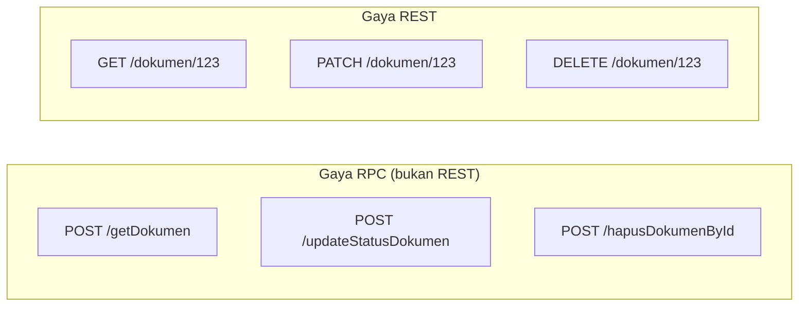

## TL;DR

REST (Representational State Transfer) adalah gaya arsitektur, bukan protokol atau standar formal — didefinisikan lewat serangkaian batasan (constraint): client-server terpisah jelas, komunikasi **stateless** (server tidak menyimpan state sesi antar request), resource diidentifikasi lewat URI, dimanipulasi lewat representasi (biasanya JSON) yang seragam, dan respons boleh menyatakan dirinya bisa di-cache atau tidak. "API pakai JSON lewat HTTP dengan URL yang terlihat rapi" **bukan** definisi REST — itu hanya kemiripan permukaan yang sering disalahartikan sebagai REST sungguhan.

## The Problem

Bayangkan sebuah tim membangun API dengan endpoint `/getDokumen`, `/updateStatusDokumen`, `/hapusDokumenById` — semua lewat method `POST`, semua mengembalikan `200 OK` dengan detail sukses/gagal di body JSON. Tim ini menyebutnya "REST API" karena memakai JSON lewat HTTP, tapi API ini sebenarnya melanggar hampir semua batasan REST sungguhan: nama endpoint menyimpan kata kerja (bukan resource), semua method disamakan jadi `POST`, dan status code tidak dipakai untuk menyatakan hasil sama sekali.

Konsekuensinya baru terasa saat API ini perlu diintegrasikan partner lain, atau saat tooling generik (API gateway, monitoring, dokumentasi otomatis lewat OpenAPI) diharapkan bisa "memahami" API ini tanpa membaca dokumentasi kustom untuk setiap endpoint. Tooling itu mengandalkan konvensi REST (method HTTP yang konsisten, status code yang bermakna) untuk bernalar tentang API secara umum — begitu konvensi itu diabaikan, semua keuntungan itu hilang, dan setiap integrasi baru butuh dokumentasi manual yang detail untuk hal-hal yang seharusnya sudah bisa ditebak dari desain API itu sendiri.

## Intuition

Bayangkan REST seperti **tata bahasa baku dalam berkomunikasi tentang benda dan tindakan padanya** — resource adalah kata benda (`/dokumen/123`), method HTTP adalah kata kerja standar yang sama artinya di mana pun dipakai (`GET` = ambil, `POST` = buat baru, `PUT`/`PATCH` = ubah, `DELETE` = hapus). Karena tata bahasa ini disepakati bersama, siapa pun yang membaca `DELETE /dokumen/123` langsung tahu maksudnya tanpa perlu penjelasan tambahan — beda dengan `POST /hapusDokumenById` yang maknanya harus "diterjemahkan" manual dari nama endpoint kustom.

Analogi tata bahasa ini bocor pada satu hal: REST bukan aturan gramatikal yang kaku dan diformalkan seperti tata bahasa manusia — ia adalah kumpulan **batasan arsitektural** yang didefinisikan Roy Fielding dalam disertasinya, dan banyak API yang menyebut dirinya "RESTful" sebenarnya hanya mengikuti sebagian batasan itu (biasanya: resource-oriented URL dan method HTTP yang benar), bukan seluruhnya (termasuk batasan yang jarang benar-benar diterapkan seperti HATEOAS — respons yang menyertakan link navigasi ke aksi terkait). Ini bukan aib; REST "praktis" yang mengikuti sebagian batasan inti sudah cukup untuk mendapatkan manfaat interoperabilitas yang paling penting.

## How It Works

Batasan inti REST yang paling relevan untuk kerja sehari-hari:

- **Resource-oriented** — URL mengidentifikasi *benda* (`/dokumen/123`), bukan *aksi* (`/getDokumen`). Aksi dinyatakan lewat method HTTP.
- **Method HTTP yang konsisten** — `GET` (ambil, aman, idempotent), `POST` (buat baru, umumnya tidak idempotent), `PUT` (ganti seluruhnya, idempotent), `PATCH` (ubah sebagian), `DELETE` (hapus, idempotent). Detail idempotency ada di [[Idempotency]].
- **Stateless** — setiap request harus membawa semua informasi yang dibutuhkan server untuk memprosesnya; server tidak menyimpan "sesi percakapan" antar request yang membuat urutan pemanggilan jadi penting untuk dipahami server.
- **Uniform interface lewat representasi** — resource yang sama direpresentasikan dalam format standar (JSON) yang konsisten strukturnya lintas endpoint.



## In Go

```go
// Gaya REST: resource di path, method HTTP menyatakan aksi.
// Menggunakan http.ServeMux (Go 1.22+) dengan method matching bawaan.
mux := http.NewServeMux()
mux.HandleFunc("GET /dokumen/{id}", getDokumenHandler)
mux.HandleFunc("PATCH /dokumen/{id}", updateDokumenHandler)
mux.HandleFunc("DELETE /dokumen/{id}", deleteDokumenHandler)

func getDokumenHandler(w http.ResponseWriter, r *http.Request) {
    id := r.PathValue("id")
    doc, err := ambilDokumen(r.Context(), id)
    if errors.Is(err, ErrNotFound) {
        http.Error(w, "dokumen tidak ditemukan", http.StatusNotFound)
        return
    }
    if err != nil {
        http.Error(w, "kesalahan internal", http.StatusInternalServerError)
        return
    }
    w.Header().Set("Content-Type", "application/json")
    json.NewEncoder(w).Encode(doc)
}
```

> [!question] Perlu diverifikasi
> Klaim: `http.ServeMux` bawaan Go mendukung pattern method HTTP (`"GET /path"`) dan wildcard path (`{id}`) sejak versi tertentu.
> Kenapa ragu: fitur routing bawaan `net/http` mengalami penambahan signifikan di rilis Go yang relatif baru — proyek yang memakai versi Go lebih lama mungkin butuh router pihak ketiga untuk fitur yang sama.
> Cara verifikasi: periksa versi Go di `go.mod` proyek dan baca release notes Go terkait `net/http` `ServeMux` enhancements.

## In His Stack

**Yii1/Yii2** dengan konvensi controller-action (`DokumenController::actionUpdate`) secara default cenderung mengarah ke gaya RPC (satu action = satu URL = satu kata kerja) kecuali secara sengaja dikonfigurasi memakai `UrlManager` dengan aturan REST eksplisit dan `VerbFilter` untuk membatasi method HTTP per action. Ini kenapa banyak API PHP yang tumbuh organik dari controller/action klasik berakhir mirip gaya RPC di atas — bukan karena PHP tidak bisa REST, tapi karena konvensi default frameworknya condong ke arah lain, dan REST butuh disiplin desain yang disengaja.

## Trade-offs and When Not To Use It

REST unggul untuk API berorientasi resource dengan operasi CRUD yang jelas — mayoritas API backend biasa. Untuk operasi yang secara alami adalah **aksi/prosedur** ketimbang manipulasi resource (misalnya "hitung ulang seluruh laporan bulanan", "kirim ulang notifikasi ke 500 user") memaksakan gaya resource-oriented murni kadang terasa dipaksakan — dalam kasus ini, endpoint seperti `POST /laporan-bulanan/{id}/hitung-ulang` (resource + sub-aksi) adalah kompromi yang umum diterima, bukan pelanggaran serius terhadap REST. Untuk kebutuhan komunikasi antar service internal dengan performa tinggi dan skema ketat, [[gRPC and Protobuf]] sering jadi pilihan yang lebih tepat daripada REST.

## Common Mistakes

> [!warning] Jebakan
> Menaruh kata kerja di URL (`/getDokumen`, `/updateStatus`) alih-alih menyatakan aksi lewat method HTTP pada resource yang sama. Ini kehilangan manfaat utama REST: kemampuan tooling generik menebak perilaku API dari method dan status code standar.

> [!warning] Jebakan
> Memakai `POST` untuk semua operasi (termasuk yang seharusnya `GET`, `PUT`, atau `DELETE`), membuat setiap operasi terlihat sama dari sisi HTTP meski efeknya sangat berbeda (aman/tidak aman, idempotent/tidak).

> [!warning] Jebakan
> Menganggap REST mengharuskan implementasi HATEOAS penuh (respons menyertakan link navigasi lengkap) sebagai syarat mutlak. Sebagian besar API "RESTful" praktis di industri hanya menerapkan sebagian batasan inti (resource-oriented, method HTTP konsisten, stateless) — ini bukan REST yang "kurang lengkap", ini adalah interpretasi pragmatis yang paling umum diterima.

## Exercises

1. Sebutkan tiga batasan inti REST yang paling relevan untuk desain API sehari-hari.
2. Kenapa `POST /hapusDokumenById` dianggap melanggar prinsip REST, sementara `DELETE /dokumen/{id}` tidak?
3. Kenapa REST disebut "stateless", dan apa konsekuensinya untuk desain endpoint?
4. Desain terbuka: sebuah tim perlu membuat endpoint untuk memicu proses "kirim ulang notifikasi WhatsApp ke seluruh pemohon yang statusnya masih tertunda lebih dari 7 hari" — ini terasa lebih seperti perintah/aksi daripada manipulasi resource biasa. Rancang desain endpoint REST yang tetap idiomatic untuk kebutuhan ini, dan jelaskan pilihan method HTTP serta pertimbangan idempotency-nya.

> [!success]- Kunci jawaban
> Model ini sebagai resource baru yang merepresentasikan "batch pengiriman ulang", bukan memaksakan kata kerja di URL resource utama: `POST /pemohon-tertunda/kirim-ulang-batch` (menciptakan sebuah "job" baru) yang mengembalikan `202 Accepted` dengan ID job yang bisa dipantau lewat `GET /jobs/{id}` untuk status penyelesaiannya. Pola ini ("resource yang merepresentasikan sebuah aksi/proses") tetap konsisten dengan gaya REST resource-oriented, sekaligus menghindari klaim idempotency palsu — `POST` di sini secara jujur **tidak** idempotent (setiap pemanggilan membuat job baru), dan client yang butuh mencegah duplikasi job harus memakai [[Idempotency]] key eksplisit kalau risiko double-submit menjadi perhatian nyata (misalnya karena retry otomatis di sisi client).

## Self-Check

- Sebutkan tiga batasan inti REST.
- Kenapa menaruh kata kerja di URL melanggar prinsip REST?
- Apa arti "stateless" dalam konteks REST?
- Kapan gaya resource-oriented REST murni terasa dipaksakan, dan apa kompromi yang umum diterima?

## Connected Notes

- [[../10 Foundations/HTTP 1.1 In Depth|HTTP 1.1 In Depth]] — prasyarat: method dan status code HTTP yang menjadi fondasi teknis REST.
- [[Resource Modelling]] — kelanjutan langsung: cara memetakan domain bisnis jadi resource dan URL yang tepat.
- [[Choosing Status Codes]] — status code yang bermakna adalah bagian penting dari uniform interface REST.
- [[Idempotency]] — properti method HTTP yang penting dipahami saat mendesain endpoint REST.
- [[gRPC and Protobuf]] — alternatif untuk kasus di mana REST kurang tepat, terutama komunikasi antar service internal.

## Further Reading

- Disertasi Roy Fielding, *"Architectural Styles and the Design of Network-based Software Architectures"* (2000), bab 5 — sumber definisi asli REST.

## Catatan Saya

*Tulis di sini API di kantor yang menyebut dirinya "REST" tapi sebenarnya lebih mirip RPC, dan apa dampaknya saat diintegrasikan.*
