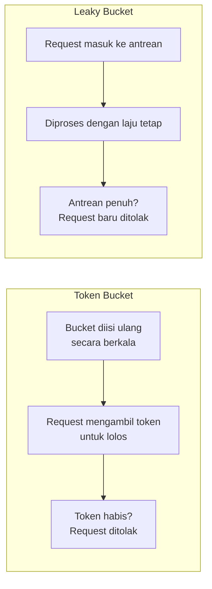

## TL;DR

**Rate limiting** membatasi berapa banyak request yang boleh diterima atau dikirim dalam periode waktu tertentu, melindungi sistem dari kelebihan beban di sisi penerima dan mencegah pelanggaran kuota di sisi pengirim. Tiga algoritma yang paling umum dipakai — **token bucket**, **leaky bucket**, dan **sliding window** — semuanya menyelesaikan masalah yang sama tapi dengan karakteristik berbeda soal seberapa toleran mereka terhadap lonjakan traffic mendadak (burst) dan seberapa presisi mereka menghitung laju rata-rata. Memilih algoritma yang salah untuk kebutuhan yang salah menghasilkan sistem yang terlalu ketat (menolak traffic sah yang sebenarnya wajar) atau terlalu longgar (tidak benar-benar melindungi dari lonjakan yang seharusnya dicegah).

## The Problem

API publik sistem legal-services untuk pengecekan status permohonan dipakai ribuan warga lewat aplikasi mobile. Tanpa rate limiting, satu bug di sisi client (aplikasi mobile yang salah memicu polling berulang tanpa henti karena bug logika retry) bisa mengirim ribuan request per detik dari satu perangkat, membebani server dengan traffic yang sama sekali tidak proporsional dengan kebutuhan sebenarnya. Tim menambahkan rate limiting sederhana: menghitung jumlah request per client dalam jendela satu menit, menolak begitu melebihi seratus request per menit.

Implementasi pertama memakai counter sederhana yang di-reset setiap awal menit (fixed window). Masalahnya baru terlihat di analisis traffic: seorang client bisa mengirim seratus request di detik terakhir menit ke-59, lalu seratus request lagi di detik pertama menit ke-60 — dari sudut pandang counter, kedua batch ini legal (masing-masing di bawah batas seratus per jendela), tapi dari sudut pandang waktu sungguhan, client itu baru saja mengirim dua ratus request dalam rentang dua detik, jauh melebihi maksud sebenarnya dari batasan "seratus per menit".

## Intuition

Cara paling mudah memahaminya lewat tiga cara berbeda mengelola antrean di loket pelayanan. **Token bucket** seperti loket yang memberi satu tiket antrean setiap beberapa detik ke sebuah kotak — pelanggan mengambil tiket dari kotak itu untuk dilayani, dan kalau kotak sedang penuh tiket (karena belum banyak pelanggan datang), pelanggan yang tiba-tiba datang beramai-ramai tetap bisa dilayani sekaligus selama tiketnya masih tersedia di kotak, memberi toleransi terhadap lonjakan mendadak. **Leaky bucket** seperti ember berlubang kecil di bawahnya — air (request) masuk dari atas secepat apa pun, tapi keluar dari lubang bawah dengan laju tetap yang konstan, apa pun yang terjadi di atas; kalau air masuk terlalu deras, ember meluap dan kelebihannya dibuang, tapi laju keluar tidak pernah berubah. **Sliding window** seperti menghitung ulang, di setiap saat, berapa banyak pelanggan yang datang dalam enam puluh detik **terakhir** dihitung mundur dari sekarang, bukan dari batas jendela waktu yang tetap (seperti awal menit) — ini yang mencegah celah "dua ratus request dalam dua detik di sekitar batas jendela" pada skenario di atas.

Analogi ini berhenti bekerja pada satu titik terkait leaky bucket: ember fisik yang meluap benar-benar membuang air yang tidak muat, sementara implementasi leaky bucket software biasanya memilih menolak request yang tidak muat (bukan menerimanya lalu membuangnya begitu saja setelah diterima) — pembuangan terjadi di pintu masuk, bukan setelah air sudah masuk ke ember.

## How It Works



**Token bucket** — bucket punya kapasitas maksimum token, diisi ulang dengan laju tetap (misalnya sepuluh token per detik). Setiap request yang lolos mengambil satu token; kalau bucket kosong, request ditolak. Karena token bisa **menumpuk** sampai kapasitas maksimum selama tidak ada traffic, client yang idle beberapa saat lalu tiba-tiba mengirim banyak request sekaligus tetap bisa dilayani penuh sampai batas kapasitas bucket — cocok untuk kasus yang butuh toleransi burst wajar, seperti client yang secara alami mengirim request bergerombol (batch upload beberapa file sekaligus, misalnya).

**Leaky bucket** — request masuk ke antrean dengan kapasitas terbatas, diproses keluar dengan laju **konstan**, tidak peduli seberapa deras request masuk. Tidak ada konsep "menabung" kapasitas seperti token bucket — laju keluar selalu rata, membuat leaky bucket lebih cocok untuk melindungi sistem hilir yang butuh laju masuk benar-benar stabil, seperti dependensi yang tidak toleran terhadap lonjakan sama sekali.

**Sliding window** — menghitung jumlah request dalam jendela waktu yang **terus bergeser** relatif terhadap waktu sekarang, bukan jendela tetap yang di-reset di titik waktu tertentu. Ini menghilangkan celah di batas jendela yang dialami fixed window counter di skenario Masalah, dengan biaya perhitungan yang sedikit lebih kompleks (butuh menyimpan timestamp setiap request dalam jendela, atau pendekatan hibrida yang menggabungkan dua jendela tetap berdekatan untuk aproksimasi yang lebih murah).

## In Go

```go
package main

import (
	"context"
	"fmt"
	"time"

	"golang.org/x/time/rate"
)

// golang.org/x/time/rate adalah implementasi token bucket standar
// yang dipakai luas di ekosistem Go, bukan library pihak ketiga
// yang eksotis — cocok dipakai langsung di produksi.
func buatRateLimiterPerClient(requestPerDetik float64, burstMaksimal int) *rate.Limiter {
	return rate.NewLimiter(rate.Limit(requestPerDetik), burstMaksimal)
}

func handleDenganRateLimit(limiter *rate.Limiter) func(context.Context) error {
	return func(ctx context.Context) error {
		if !limiter.Allow() {
			return fmt.Errorf("rate limit terlampaui")
		}
		return prosesRequest(ctx)
	}
}

// Untuk kasus yang butuh MENUNGGU token tersedia alih-alih langsung
// menolak (cocok untuk klien internal yang memanggil dependensi
// dengan rate limit, bukan menerima request dari luar), Wait
// memblokir sampai token tersedia atau context dibatalkan.
func panggilDenganRateLimitTunggu(ctx context.Context, limiter *rate.Limiter) error {
	if err := limiter.Wait(ctx); err != nil {
		return fmt.Errorf("gagal menunggu rate limit: %w", err)
	}
	return panggilLayananEksternal(ctx)
}
```

`rate.NewLimiter` di paket `golang.org/x/time/rate` mengimplementasikan token bucket secara langsung — `burstMaksimal` adalah kapasitas bucket, `requestPerDetik` adalah laju pengisian ulang token. `Allow()` untuk penolakan instan (cocok untuk melindungi server dari client), `Wait()` untuk menunggu sampai token tersedia (cocok untuk membatasi laju panggilan keluar ke dependensi yang sendiri punya rate limit, seperti API partner eksternal).

## In His Stack

Rate limiting relevan di dua arah untuk sistem legal-services: **inbound**, melindungi API dari client yang berlebihan (bug, atau penyalahgunaan sengaja) — dan **outbound**, membatasi laju panggilan ke API partner eksternal yang sering punya kuota ketat sendiri (dibahas juga dari sudut pandang berbeda di [[Handling an Unreliable Counterparty]]). Untuk kasus outbound, `limiter.Wait()` sering lebih tepat dibanding `Allow()` — alih-alih menolak pekerjaan yang sebenarnya harus tetap diselesaikan (misalnya job batch yang memanggil API partner untuk seribu dokumen), lebih baik memperlambat laju panggilan supaya tetap dalam kuota partner, biarpun itu berarti job itu selesai lebih lama.

## Trade-offs and When Not To Use It

Token bucket cocok ketika burst wajar perlu ditoleransi, tapi kurang tepat kalau sistem hilir benar-benar tidak toleran terhadap lonjakan sama sekali — di situ leaky bucket yang menjaga laju keluar benar-benar konstan lebih aman. Sliding window paling akurat mencegah celah di batas jendela, tapi butuh lebih banyak memori (menyimpan riwayat timestamp) dibanding fixed window counter yang sederhana — untuk sistem dengan volume sangat tinggi, sliding window presisi penuh bisa jadi terlalu mahal, dan pendekatan hibrida (sliding window aproksimasi berbasis dua jendela tetap) jadi kompromi yang lebih realistis. Rate limiting itu sendiri, apa pun algoritmanya, selalu berarti sebagian request sah akan ditolak pada beban puncak — trade-off yang harus diterima sadar, karena alternatifnya (tidak membatasi sama sekali) membiarkan sistem rentan terhadap kelebihan beban yang jauh lebih merusak.

## Common Mistakes

> [!warning] Jebakan
> Memakai fixed window counter tanpa menyadari celah di batas jendela, membiarkan client mengirim hampir dua kali lipat batas yang dimaksud dalam rentang waktu singkat di sekitar pergantian jendela — persis skenario di bagian Masalah di atas.

> [!warning] Jebakan
> Menerapkan rate limit yang sama untuk semua endpoint tanpa mempertimbangkan bahwa endpoint berbeda punya biaya pemrosesan yang sangat berbeda — endpoint yang murah (baca cache) dan endpoint yang mahal (query database kompleks, panggilan API eksternal) sebaiknya punya batas yang berbeda, bukan satu angka generik untuk semuanya.

> [!warning] Jebakan
> Menerapkan rate limiting hanya di level aplikasi (per instance service) tanpa koordinasi di seluruh instance ketika service di-scale ke banyak pod — setiap pod menghitung rate limit-nya sendiri secara independen, sehingga client bisa mengirim traffic total jauh melebihi batas yang dimaksud dengan menyebar request ke pod berbeda; butuh penyimpanan bersama (Redis, misalnya) untuk rate limiting yang benar-benar akurat di sistem terdistribusi.

## Exercises

1. Jelaskan celah yang dialami fixed window counter di batas jendela, dan bagaimana sliding window mengatasinya.
2. Bandingkan token bucket dan leaky bucket dari sisi toleransi terhadap lonjakan traffic mendadak (burst).
3. Sebuah service dengan lima instance di Kubernetes menerapkan rate limiting dengan counter di memori masing-masing instance secara independen. Jelaskan kenapa ini gagal membatasi laju total dari satu client dengan benar, dan bagaimana memperbaikinya.
4. **(Open-ended)** Timmu perlu menerapkan rate limiting untuk API publik pengecekan status permohonan (banyak client kecil, traffic umumnya stabil tapi sesekali ada lonjakan wajar saat pengumuman hasil) dan untuk job batch yang memanggil API partner eksternal dengan kuota ketat (perlu menyelesaikan seribu panggilan, kuota partner seratus panggilan per menit). Tentukan algoritma rate limiting yang tepat untuk masing-masing kasus, dan jelaskan alasannya.

> [!success]- Kunci jawaban
> Untuk soal 4: untuk API publik pengecekan status, token bucket adalah pilihan tepat — toleransi burst yang dimilikinya cocok dengan pola traffic yang umumnya stabil tapi wajar melonjak sesaat (banyak warga membuka aplikasi bersamaan setelah pengumuman), dan `Allow()` dipakai untuk menolak instan traffic berlebihan tanpa membuat client menunggu lama. Untuk job batch memanggil API partner dengan kuota ketat, leaky bucket (atau token bucket dengan `Wait()`, yang secara efektif menghasilkan perilaku serupa) lebih tepat — laju panggilan harus benar-benar konstan mengikuti kuota partner (seratus per menit), dan job itu sendiri tidak keberatan menunggu lebih lama asal seluruh seribu panggilan akhirnya selesai tanpa melanggar kuota, berbeda dari API publik yang client-nya menunggu response secara langsung dan tidak bisa dibuat menunggu lama.

## Self-Check

- Apa celah yang dimiliki fixed window counter, dan algoritma mana yang mengatasinya?
- Kapan token bucket lebih tepat dibanding leaky bucket, dan sebaliknya?
- Kenapa rate limiting berbasis memori lokal per instance gagal di sistem yang di-scale ke banyak pod?

## Connected Notes

- [[Bulkheads]] — pola komplementer: bulkhead membatasi resource yang dipakai untuk memanggil dependensi, rate limiting membatasi laju panggilan itu sendiri.
- [[Handling an Unreliable Counterparty]] — rate limiting di sisi outbound adalah salah satu cara menghormati kuota partner eksternal yang dibahas secara umum di note itu.
- [[Backpressure]] — rate limiting adalah bentuk backpressure proaktif, membatasi laju masuk sebelum sistem kewalahan, bukan bereaksi setelah kewalahan.
- [[Load Shedding]] — kelanjutan langsung: kebijakan menolak sebagian pekerjaan ketika rate limiting saja tidak cukup melindungi sistem.

## Further Reading

- Dokumentasi paket `golang.org/x/time/rate`: pkg.go.dev/golang.org/x/time/rate

## Catatan Saya

*Tulis pertanyaanmu sendiri, contoh kode dari pekerjaanmu, atau bagian yang belum jelas di sini.*
