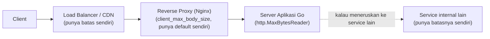

## TL;DR

Batas ukuran request bukan satu angka yang cukup diatur di satu tempat — request melewati beberapa "pos pemeriksaan" (load balancer, reverse proxy, server aplikasi, kadang service internal di baliknya), dan **masing-masing** biasanya punya batas ukurannya sendiri secara default, sering kali berbeda-beda dan tidak sengaja diselaraskan. Kalau batas di satu lapisan lebih ketat dari yang disadari tim (misalnya reverse proxy menolak sebelum request sempat mencapai server aplikasi), hasilnya adalah kegagalan yang membingungkan — client menerima error generik dari lapisan yang bahkan tidak mereka sadari keberadaannya, sementara "kode aplikasi terlihat benar".

## The Problem

Bayangkan sebuah tim mengonfigurasi server aplikasi Go mereka untuk menerima upload hingga 50 MB, memakai `http.MaxBytesReader` dengan batas itu, dan yakin sudah menangani kebutuhan upload dokumen scan besar dengan benar. Tapi di depan server aplikasi itu, ada Nginx sebagai reverse proxy dengan konfigurasi `client_max_body_size` yang masih memakai nilai default-nya — jauh lebih kecil dari 50 MB.

Setiap kali client mencoba mengunggah file yang melebihi batas default Nginx itu (tapi masih di bawah 50 MB yang dikira jadi batas efektif), request ditolak **oleh Nginx**, sebelum pernah mencapai kode Go sama sekali — biasanya dengan response `413` polos tanpa body JSON yang informatif seperti yang sudah dirancang tim di level aplikasi. Client (atau partner) melihat error generik ini dan mengira ada bug di aplikasi, padahal kode aplikasinya sepenuhnya benar — masalahnya ada di lapisan yang bahkan tidak disadari timnya sendiri saat mendesain batas 50 MB itu.

## Intuition

Bayangkan ini seperti **beberapa pos pemeriksaan keamanan berurutan di sebuah gedung besar** — gerbang masuk, lobi lift, meja keamanan khusus di lantai tertentu. Kalau masing-masing pos punya batas berat barang bawaan yang berbeda dan tidak diselaraskan, seorang tamu bisa saja lolos di gerbang masuk hanya untuk ditolak di lobi lift — membuang waktu semua orang dan membingungkan tamu soal aturan mana yang sebenarnya berlaku.

Analogi ini bocor pada soal kualitas komunikasi penolakan. Penjaga manusia di pos keamanan biasanya bisa menjelaskan dengan jelas "maaf, lantai ini punya aturan lebih ketat". Load balancer atau reverse proxy yang menolak request terlalu besar sering kali hanya memberi error generik yang tidak informatif (koneksi diputus, body kosong) — jauh lebih buruk dari penjelasan penjaga manusia, membuat kesalahan diagnosis jauh lebih mungkin terjadi dibanding yang tersirat dari analogi ini.

## How It Works



Prinsip yang benar: batas di setiap lapisan **luar** harus sama atau lebih longgar dari lapisan di dalamnya, sehingga batas paling ketat yang benar-benar ditegakkan adalah batas di level aplikasi — tempat pesan error yang informatif dan format konsisten (lihat [[Consistent Error Responses]]) bisa diberikan, bukan ditolak diam-diam oleh lapisan infrastruktur di depannya dengan pesan generik.

## In Go

```go
const maxUploadSize = 50 << 20 // 50 MB — batas yang DIDOKUMENTASIKAN ke konsumen API

func uploadHandler(w http.ResponseWriter, r *http.Request) {
    r.Body = http.MaxBytesReader(w, r.Body, maxUploadSize)

    if err := r.ParseMultipartForm(maxUploadSize); err != nil {
        var maxBytesErr *http.MaxBytesError
        if errors.As(err, &maxBytesErr) {
            // Pesan yang jelas dan informatif — TAPI ini hanya berguna
            // kalau request benar-benar sampai ke titik ini. Batas di
            // Nginx/load balancer di depan HARUS diselaraskan supaya
            // tidak menolak lebih dulu dengan pesan generik.
            http.Error(w, fmt.Sprintf("ukuran file melebihi batas %d MB", maxUploadSize>>20), http.StatusRequestEntityTooLarge)
            return
        }
        http.Error(w, "form tidak valid", http.StatusBadRequest)
        return
    }
    // ... proses upload ...
}
```

Komentar di atas adalah inti dari note ini: `http.MaxBytesReader` di level Go **hanya efektif** kalau request benar-benar mencapainya. Konfigurasi lapisan di depannya (Nginx `client_max_body_size`, atau batas bawaan load balancer/CDN) harus secara eksplisit diperiksa dan diselaraskan — biasanya diset **sama atau sedikit lebih besar** dari batas di level aplikasi, supaya lapisan aplikasi yang punya pesan error paling informatif itulah yang benar-benar menangkap kasus melebihi batas.

## In His Stack

**Nginx** sebagai reverse proxy di depan service Go atau PHP-FPM (lihat [[Load Balancing and Reverse Proxies]]) punya direktif `client_max_body_size` dengan nilai default yang **harus** diperiksa eksplisit, bukan diasumsikan. Ini salah satu penyebab paling umum "upload tiba-tiba gagal padahal kode terlihat benar" di stack yang memakai Nginx di depan aplikasi — periksa konfigurasi Nginx setiap kali mengubah batas ukuran di level aplikasi, jangan hanya mengubah satu sisi dan menganggap sudah selesai.

## Trade-offs and When Not To Use It

Ini bukan fitur opsional — setiap lapisan **butuh** semacam batas ukuran sebagai perlindungan dasar dari resource exhaustion (request body tak terbatas adalah vektor denial-of-service). Keputusan desain sesungguhnya bukan "apakah perlu batas", tapi **di mana** angka setiap lapisan diletakkan relatif satu sama lain, dan seberapa jelas batas efektif (yang paling ketat) itu didokumentasikan ke konsumen API — dibiarkan ditemukan lewat trial-and-error adalah pengalaman integrasi yang buruk, terutama untuk partner yang siklus perubahan sisi mereka lambat.

## Common Mistakes

> [!warning] Jebakan
> Mengatur batas ukuran generous di level aplikasi tanpa memeriksa batas default reverse proxy/load balancer di depannya, menyebabkan penolakan membingungkan di lapisan yang bahkan tidak disadari timnya sendiri.

> [!warning] Jebakan
> Tidak mendokumentasikan batas ukuran efektif (yang paling ketat di antara semua lapisan) ke partner/konsumen API, membiarkan mereka menemukannya sendiri lewat kegagalan berulang.

> [!warning] Jebakan
> Hanya mengandalkan validasi ukuran di sisi client (misalnya validasi JavaScript di browser atau di aplikasi mobile) sebagai satu-satunya penegakan batas. Validasi sisi client hanya kenyamanan UX — client yang tidak standar atau sengaja dimodifikasi bisa melewatinya sepenuhnya, sehingga penegakan sungguhan tetap wajib di server.

## Exercises

1. Kenapa batas ukuran yang diatur hanya di level aplikasi tidak cukup untuk mencegah kegagalan yang membingungkan?
2. Apa hubungan yang seharusnya antara batas ukuran di lapisan luar (reverse proxy) dan lapisan dalam (aplikasi)?
3. Kenapa validasi ukuran di sisi client tidak bisa dianggap sebagai penegakan batas yang sesungguhnya?
4. Desain terbuka: sebuah tim menemukan bahwa upload dokumen kadang gagal dengan error generik dari infrastruktur, kadang dengan pesan jelas dari aplikasi, tergantung ukuran file — menandakan ada ketidaksesuaian batas antar lapisan yang belum dipetakan. Rancang proses audit lengkap untuk memetakan dan menyelaraskan seluruh batas ukuran di sepanjang jalur request, dari client sampai server aplikasi.

> [!success]- Kunci jawaban
> Audit dimulai dari ujung terjauh: periksa dokumentasi/konfigurasi setiap komponen infrastruktur di jalur request (load balancer/CDN kalau ada, reverse proxy Nginx, konfigurasi `http.MaxBytesReader` di aplikasi Go, dan batas apa pun di service internal yang dipanggil setelahnya) dan catat angka batas masing-masing secara eksplisit — jangan berasumsi dari memori, verifikasi langsung dari konfigurasi environment production. Susun ulang angka-angka ini supaya monoton mengecil dari luar ke dalam (lapisan terluar paling longgar, lapisan aplikasi paling ketat) sehingga batas aplikasi yang punya pesan error paling informatif itulah yang selalu tercapai lebih dulu. Dokumentasikan batas efektif (angka aplikasi) itu eksplisit di [[OpenAPI]] atau dokumentasi kontrak partner, dan tambahkan test otomatis yang memverifikasi upload sedikit di atas batas ini benar-benar ditolak dengan pesan yang jelas dari aplikasi, bukan dari lapisan infrastruktur di depannya.

## Self-Check

- Kenapa batas ukuran perlu diselaraskan di setiap lapisan, bukan cukup satu tempat saja?
- Bagaimana hubungan yang benar antara batas lapisan luar dan lapisan dalam?
- Kenapa validasi ukuran di sisi client tidak bisa dianggap penegakan yang sesungguhnya?
- Apa risiko tidak mendokumentasikan batas ukuran efektif ke partner?

## Connected Notes

- [[Upload and Download Patterns]] dan [[Binary in JSON and the Base64 Tax]] — prasyarat: kedua konteks di mana batas ukuran ini paling sering relevan.
- [[Load Balancing and Reverse Proxies]] — lapisan infrastruktur yang sering jadi sumber ketidaksesuaian batas yang tidak disadari.
- [[net-http Handlers and Middleware]] — implementasi `http.MaxBytesReader` sebagai bagian dari middleware/handler Go.
- [[Consistent Error Responses]] — pesan error yang informatif hanya bisa diberikan kalau request benar-benar sampai ke level aplikasi.

## Further Reading

- Dokumentasi resmi Nginx, direktif `client_max_body_size` (nginx.org/en/docs) — nilai default dan cara mengonfigurasinya sesuai versi yang dipakai.

## Catatan Saya

*Tulis di sini apakah kamu pernah mengalami "upload gagal padahal kode terlihat benar" yang ternyata karena batas ukuran di reverse proxy/load balancer.*
