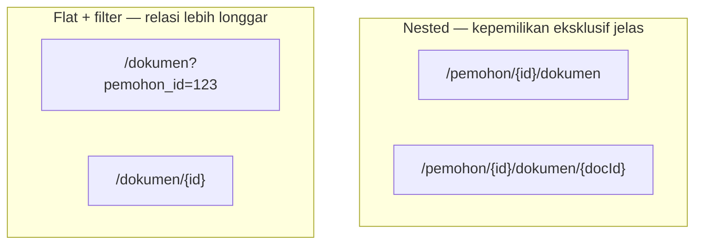

## TL;DR

Resource modelling adalah mendesain URL dan struktur data API di sekitar **konsep bisnis** (kata benda yang dipahami konsumen API) dan relasinya, bukan di sekitar skema database internal atau tampilan UI tertentu. Resource bersarang (`/pemohon/{id}/dokumen`) menyatakan kepemilikan eksklusif yang jelas; resource datar dengan filter (`/dokumen?pemohon_id=123`) lebih tepat untuk relasi yang lebih longgar. Kesalahan paling mahal di sini adalah membiarkan skema database bocor langsung jadi kontrak publik API — begitu partner mengintegrasikan API itu, mengubah model resource jadi jauh lebih mahal daripada sekadar refactor internal.

## The Problem

Bayangkan sebuah tim mendesain API dengan endpoint yang secara langsung mencerminkan struktur tabel database internal mereka — termasuk nama tabel join dan foreign key mentah yang sebenarnya adalah detail implementasi, bukan konsep bisnis yang bermakna bagi partner. Partner yang mengintegrasikan API ini harus memahami struktur database internal timmu hanya untuk memakai API-nya dengan benar.

Beberapa bulan kemudian, tim melakukan refactor database internal (memecah satu tabel jadi dua demi normalisasi yang lebih baik) — sesuatu yang seharusnya sepenuhnya menjadi keputusan internal tanpa dampak eksternal. Tapi karena API tadinya mencerminkan struktur tabel lama secara langsung, refactor internal ini **memaksa** perubahan kontrak API publik, memicu koordinasi mahal dengan setiap partner yang sudah terlanjur bergantung pada bentuk lama. Ini adalah gejala coupling yang seharusnya tidak pernah terjadi: perubahan implementasi internal seharusnya tidak pernah memaksa perubahan kontrak publik, dan itu hanya mungkin kalau resource model API sejak awal dirancang independen dari skema database.

## Intuition

Bayangkan resource modelling seperti **merancang sistem katalog perpustakaan** — pengunjung berpikir dalam istilah buku, penulis, dan genre (konsep yang bermakna bagi mereka), bukan "rak 42B, baris 3" yang kebetulan mencerminkan cara truk gudang menurunkan boks buku (detail implementasi internal). Katalog yang baik disusun di sekitar cara pengunjung *berpikir* tentang koleksi, bukan cara gudang *menyimpan* koleksi itu secara fisik.

Analogi ini bocor pada soal biaya perubahan. Katalog perpustakaan yang salah rancang bisa disusun ulang dalam semalam tanpa dampak besar. Model resource API publik, begitu partner eksternal sudah mengintegrasikannya, jauh lebih "membeku" — inilah kenapa keputusan resource modelling di awal jauh lebih berisiko tinggi daripada sekadar menata ulang katalog: kesalahan di sini tidak bisa diperbaiki semudah menata ulang rak buku.

## How It Works

Identifikasi resource sebagai kata benda bisnis (`Pemohon`, `Permohonan`, `Dokumen`), lalu tentukan hubungannya:

- **Nested resource** (`/pemohon/{id}/dokumen`) — tepat kalau dokumen **selalu** dan **secara eksklusif** milik satu pemohon, dan hampir selalu diakses dalam konteks pemohon tersebut. Nesting menyatakan kepemilikan dengan jelas dan menyederhanakan pemeriksaan otorisasi (memverifikasi dokumen memang milik pemohon yang mengklaimnya).
- **Flat resource dengan filter** (`/dokumen?pemohon_id=123`) — lebih tepat kalau relasinya lebih longgar (banyak-ke-banyak, atau resource itu juga sering diakses independen dari induknya).



Aturan praktis: hindari nesting lebih dari **dua level** (`/a/{id}/b/{id}/c` sudah mulai terasa kaku; `/a/{id}/b/{id}/c/{id}/d` jelas berlebihan). Kalau kebutuhanmu terasa butuh nesting sangat dalam, itu biasanya tanda modelnya perlu didesain ulang jadi lebih datar dengan filter, bukan terus menambah level.

## In Go

```go
// Resource model API tidak harus mencerminkan struktur tabel database
// secara langsung — layer service/repository yang menjembatani.
type DokumenResponse struct {
    ID          string `json:"id"`
    PemohonID   string `json:"pemohon_id"`
    Status      string `json:"status"`
    DibuatPada  string `json:"dibuat_pada"`
}

// Routing mencerminkan resource model yang sudah didesain,
// terlepas dari bagaimana data itu sebenarnya disimpan di database.
mux.HandleFunc("GET /pemohon/{pemohonID}/dokumen", listDokumenByPemohon)
mux.HandleFunc("GET /dokumen/{id}", getDokumenByID)

func listDokumenByPemohon(w http.ResponseWriter, r *http.Request) {
    pemohonID := r.PathValue("pemohonID")
    // repository bisa saja melakukan JOIN kompleks lintas beberapa tabel
    // internal di sini — API konsumen tidak pernah perlu tahu detail itu.
    docs, err := repo.ListDokumenByPemohon(r.Context(), pemohonID)
    if err != nil {
        http.Error(w, "kesalahan internal", http.StatusInternalServerError)
        return
    }
    respondJSON(w, http.StatusOK, toDokumenResponses(docs))
}
```

`DokumenResponse` adalah bentuk kontrak publik yang **sengaja dipisahkan** dari struct internal apa pun yang merepresentasikan baris database — perubahan skema database (menambah kolom, memecah tabel) tidak pernah otomatis mengubah `DokumenResponse` kecuali memang diputuskan sengaja.

## In His Stack

**Yii2** dengan ekstensi `yii2-rest` dan `ActiveRecord` kadang membuat tim tergoda mengekspos relasi `ActiveRecord` (`$model->dokumen`, hasil query relasi otomatis) langsung sebagai response API tanpa lapisan transformasi eksplisit — ini persis jebakan yang dijelaskan di note ini: struktur internal ActiveRecord (nama relasi, nama kolom database) bocor langsung jadi kontrak publik. Praktik yang lebih aman: selalu ada lapisan DTO/resource eksplisit antara `ActiveRecord` dan response JSON, sama seperti `DokumenResponse` di atas — sesuatu yang mudah dilewatkan karena Yii2 membuat serialisasi langsung terasa begitu mudah dilakukan tanpa lapisan tambahan itu.

## Trade-offs and When Not To Use It

Nested resource menyatakan kepemilikan dengan jelas dan memudahkan pemeriksaan otorisasi kontekstual, tapi nesting berlebihan membuat URL kaku dan sulit berkembang — setiap perubahan hubungan bisnis (dokumen yang tadinya eksklusif milik satu pemohon ternyata perlu dibagikan ke pemohon lain) memaksa perubahan struktur URL yang mahal. Flat resource dengan filter lebih fleksibel untuk query lintas relasi, tapi kehilangan sebagian kejelasan "siapa memiliki apa" yang didapat dari nesting. Tidak ada aturan mutlak — keputusan ini harus sengaja dipertimbangkan berdasarkan sifat relasi bisnis yang sesungguhnya, bukan sekadar mengikuti struktur tabel database.

## Common Mistakes

> [!warning] Jebakan
> Mencerminkan skema database internal (nama tabel, foreign key mentah, hasil join) langsung sebagai bentuk resource API publik. Ini mengunci kontrak publik pada detail implementasi internal yang seharusnya bebas berubah kapan saja.

> [!warning] Jebakan
> Melakukan nesting resource lebih dari dua level (`/a/{id}/b/{id}/c/{id}/d`), menghasilkan URL yang kaku dan sulit dievolusi begitu hubungan bisnis di antara resource-resource itu berubah.

> [!warning] Jebakan
> Mendesain resource di sekitar tampilan/alur UI tertentu (misalnya satu endpoint yang mengembalikan persis data yang dibutuhkan satu halaman spesifik) alih-alih entitas bisnis sesungguhnya — endpoint seperti ini sulit dipakai ulang begitu ada klien baru (aplikasi mobile, partner lain) yang butuh kombinasi data yang berbeda dari data yang sama.

## Exercises

1. Kapan nested resource (`/a/{id}/b`) lebih tepat dibanding flat resource dengan filter (`/b?a_id=...`)?
2. Kenapa mengekspos skema database internal langsung sebagai resource API berbahaya untuk evolusi API jangka panjang?
3. Apa aturan praktis untuk membatasi kedalaman nesting resource?
4. Desain terbuka: sebuah sistem permohonan dokumen legal punya entitas `Pemohon` (pemohon), `Permohonan` (satu pengajuan, dimiliki satu pemohon), dan `Dokumen` (lampiran dari satu permohonan, tapi dokumen yang sama kadang perlu dipakai ulang di permohonan lain oleh pemohon yang sama, misalnya KTP yang sama dipakai untuk beberapa jenis permohonan berbeda). Rancang resource model untuk ketiga entitas ini, termasuk keputusan nesting mana yang tepat dan mana yang harus datar dengan filter.

> [!success]- Kunci jawaban
> `Permohonan` bisa di-nest di bawah `Pemohon` (`/pemohon/{id}/permohonan`) karena relasinya eksklusif — satu permohonan selalu dan hanya dimiliki satu pemohon. Tapi `Dokumen` **tidak** sebaiknya di-nest di bawah `Permohonan` (`/permohonan/{id}/dokumen`) karena satu dokumen (KTP yang sama) bisa dipakai ulang lintas beberapa permohonan — relasinya lebih mirip banyak-ke-banyak daripada kepemilikan eksklusif. Model yang lebih tepat: `Dokumen` sebagai resource datar tersendiri (`/dokumen/{id}`, dimiliki oleh `Pemohon` lewat `/pemohon/{id}/dokumen`), dengan tabel penghubung terpisah yang merepresentasikan "dokumen X dilampirkan ke permohonan Y" (`/permohonan/{id}/lampiran` yang isinya referensi ke `Dokumen` yang sudah ada, bukan dokumen baru). Ini mencerminkan realita bisnis (dokumen dipakai ulang) dengan lebih jujur daripada memaksakan nesting eksklusif yang sebenarnya tidak berlaku.

## Self-Check

- Kapan nested resource lebih tepat dibanding flat resource dengan filter?
- Kenapa mengekspos skema database internal langsung sebagai API berbahaya?
- Apa aturan praktis membatasi kedalaman nesting?
- Kenapa mendesain resource di sekitar tampilan UI tertentu bermasalah untuk klien baru?

## Connected Notes

- [[REST Principles]] — prasyarat: prinsip resource-oriented yang dijelaskan penuh konsekuensinya di note ini.
- [[Choosing Status Codes]] — status code yang tepat melengkapi resource model yang sudah didesain dengan baik.
- [[API Versioning]] — strategi mengelola perubahan resource model tanpa mematahkan partner yang sudah terintegrasi.
- [[../90 Architecture and Design/Handler-Service-Repository Layering|Handler-Service-Repository Layering]] — lapisan yang menjembatani resource model publik dengan skema database internal, seperti dicontohkan di note ini.
- [[../94 Case Studies/Case - A Schema Change That Broke a Partner Who Scraped Undocumented Fields|Case - A Schema Change That Broke a Partner Who Scraped Undocumented Fields]] — konsekuensi nyata saat batas resource model tidak dijaga ketat.

## Further Reading

- Buku *"REST API Design Rulebook"* karya Mark Masse — panduan praktis konvensi resource modelling yang banyak dirujuk industri.

## Catatan Saya

*Tulis di sini API di kantor yang resource model-nya terlalu mengikuti skema database, dan masalah apa yang pernah muncul karenanya.*
