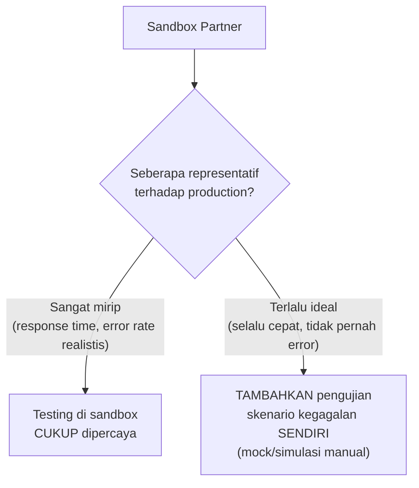

## TL;DR

Mengembangkan dan menguji integrasi langsung terhadap sistem production partner adalah ide buruk yang jelas — data uji coba bisa tercampur dengan data sungguhan, dan bug di kode yang sedang dikembangkan bisa memicu efek nyata (mengirim notifikasi asli, mencatat transaksi asli) di sistem yang seharusnya hanya untuk pengujian. Sandbox adalah lingkungan **terpisah** yang disediakan partner (atau dibangun sendiri sebagai simulasi) khusus untuk pengembangan dan pengujian, meniru perilaku production tanpa efek samping nyata. Masalah yang sering muncul: sandbox partner jarang **benar-benar identik** dengan production-nya — perbedaan performa, data uji yang tidak representatif, atau bahkan fitur yang belum diimplementasikan di sandbox — membuat "sudah lolos testing di sandbox" bukan jaminan penuh akan bekerja mulus di production.

## The Problem

Sebuah tim menguji integrasi pembayaran hanya di sandbox partner yang selalu merespons dalam waktu kurang dari 100ms dan tidak pernah mengalami error — begitu dijalankan di production, partner sesungguhnya punya response time yang jauh lebih bervariasi (kadang beberapa detik) dan sesekali mengembalikan error yang tidak pernah muncul di sandbox (karena sandbox tidak mensimulasikan skenario kegagalan itu sama sekali). Kode yang ditulis tanpa pernah menghadapi kondisi ini di sandbox tidak siap menanganinya di production, menyebabkan insiden yang seharusnya bisa ditemukan lebih awal kalau sandbox mensimulasikan kondisi yang lebih realistis.

Masalah kedua: sebuah tim mengembangkan fitur baru yang bergantung pada endpoint partner yang **belum tersedia** di sandbox (partner baru merilis fitur itu di production, belum sempat memperbarui sandbox mereka) — tim terpaksa menebak-nebak perilaku endpoint itu berdasarkan dokumentasi saja, tanpa bisa benar-benar menguji sebelum deploy ke production, meningkatkan risiko kejutan yang baru ditemukan setelah kode sudah live.

## Intuition

Bayangkan sandbox seperti **simulator penerbangan untuk pilot** — memungkinkan berlatih menghadapi skenario (termasuk skenario darurat) tanpa risiko nyata pada pesawat dan penumpang sungguhan. Simulator yang baik mereproduksi kondisi realistis (turbulensi, kegagalan mesin) supaya pilot benar-benar siap menghadapi kondisi serupa di penerbangan sungguhan. Simulator yang buruk (hanya mensimulasikan kondisi ideal, penerbangan mulus tanpa gangguan apa pun) memberi rasa percaya diri palsu — pilot yang lulus simulator semacam itu belum tentu siap menghadapi kondisi nyata yang jauh lebih bervariasi.

Analogi ini bocor pada satu hal: simulator penerbangan dirancang khusus oleh ahli yang memahami seluruh skenario yang perlu diuji. Sandbox partner API seringkali **bukan** prioritas utama partner — ia dibangun seadanya, kadang oleh tim yang berbeda dari yang mengelola production, dan representativitasnya terhadap kondisi production sungguhan sangat bervariasi tergantung seberapa serius partner itu berinvestasi dalam menyediakannya.

## How It Works



**Pelengkap sandbox yang kurang representatif**: membangun **mock server sendiri** yang secara sengaja mensimulasikan skenario yang tidak dicakup sandbox partner (latency tinggi, timeout, response error, data tidak lengkap) — memberi kontrol penuh untuk menguji ketahanan kode terhadap kondisi yang mungkin tidak pernah terjadi di sandbox tapi realistis terjadi di production. Ini melengkapi (bukan menggantikan) pengujian terhadap sandbox sungguhan, yang tetap penting untuk memverifikasi kode benar-benar berkomunikasi dengan benar sesuai kontrak API partner yang sesungguhnya.

## Under The Hood

**Data uji di sandbox harus representatif** — sandbox yang hanya punya beberapa data uji sederhana ("Budi Santoso", NIK `1234567890123456`) tidak menguji kasus tepi yang mungkin muncul di data sungguhan (nama dengan karakter khusus, format yang tidak biasa) — mengetahui keterbatasan data uji sandbox dan melengkapi dengan data uji tambahan (kalau sandbox mengizinkan input bebas) atau setidaknya menyadari celah pengujian ini secara eksplisit adalah bagian penting menilai seberapa jauh sandbox bisa dipercaya.

**Sandbox yang dibangun sendiri (self-hosted mock)** memberi kontrol penuh tapi menambah tanggung jawab menjaga mock itu tetap sinkron dengan perilaku sebenarnya partner — mock yang dibuat sekali dan tidak pernah diperbarui bisa menjadi usang begitu partner mengubah API mereka, menciptakan rasa aman palsu yang sama seperti masalah sandbox partner yang tidak representatif, hanya dengan penyebab berbeda (mock sendiri yang usang, bukan sandbox partner yang idealis).

## In Go

```go
package sandbox

import (
	"context"
	"math/rand"
	"time"
)

// MockPartnerRealistis mensimulasikan kondisi yang TIDAK dicakup
// sandbox partner (yang terlalu ideal) — latency bervariasi dan
// kegagalan sesekali, melengkapi pengujian terhadap sandbox sungguhan.
type MockPartnerRealistis struct {
	tingkatErrorPersen int // misal 5 = 5% panggilan gagal
}

func (m *MockPartnerRealistis) PanggilAPI(ctx context.Context) (string, error) {
	// Simulasikan LATENCY BERVARIASI, bukan selalu cepat seperti sandbox ideal.
	latensiSimulasi := time.Duration(rand.Intn(3000)) * time.Millisecond
	select {
	case <-time.After(latensiSimulasi):
	case <-ctx.Done():
		return "", ctx.Err()
	}

	// Simulasikan KEGAGALAN SESEKALI, skenario yang mungkin tidak
	// pernah terjadi di sandbox ideal tapi realistis di production.
	if rand.Intn(100) < m.tingkatErrorPersen {
		return "", errSimulasiKegagalanPartner
	}

	return "hasil-sukses", nil
}

var errSimulasiKegagalanPartner = &kegagalanError{}

type kegagalanError struct{}

func (e *kegagalanError) Error() string { return "simulasi kegagalan partner (untuk testing ketahanan)" }
```

## In His Stack

Untuk integrasi dengan instansi pemerintah, sandbox yang disediakan (kalau ada) seringkali kurang matang dibanding sandbox dari perusahaan teknologi besar — investasi tambahan membangun mock server sendiri yang mensimulasikan kondisi realistis (termasuk kelambatan dan kegagalan yang diketahui pernah terjadi di production instansi itu) adalah kompensasi yang sepadan untuk sandbox yang kurang representatif, memberi kepercayaan lebih tinggi bahwa kode benar-benar siap sebelum menyentuh data warga sungguhan.

## Trade-offs and When Not To Use It

Membangun mock server sendiri yang mensimulasikan berbagai skenario kegagalan menambah waktu pengembangan yang harus dipertimbangkan proporsional dengan risiko integrasi itu — untuk integrasi dengan partner yang sandbox-nya sudah terbukti sangat representatif (jarang ditemukan perbedaan signifikan dengan production), investasi mock tambahan mungkin berlebihan. Untuk integrasi baru dengan partner yang belum ada riwayat (tidak tahu seberapa representatif sandbox-nya), memulai dengan asumsi sandbox **tidak sepenuhnya representatif** (dan menambah pengujian skenario kegagalan sendiri) adalah pendekatan yang lebih aman, disesuaikan kembali seiring pengalaman nyata terkumpul.

## Common Mistakes

> [!warning] Jebakan
> Mempercayai sepenuhnya bahwa "sudah lolos testing di sandbox" berarti siap untuk production — sandbox yang terlalu ideal (selalu cepat, tidak pernah error) tidak menguji ketahanan kode terhadap kondisi realistis yang mungkin terjadi di production.

> [!warning] Jebakan
> Mengembangkan fitur yang bergantung pada endpoint yang belum tersedia di sandbox tanpa strategi mitigasi — menebak-nebak perilaku dari dokumentasi saja meningkatkan risiko kejutan yang baru ditemukan setelah deploy ke production.

> [!warning] Jebakan
> Membangun mock server sendiri sekali di awal proyek dan tidak pernah memperbaruinya seiring partner mengubah API mereka — mock yang usang menciptakan rasa aman palsu yang sama berbahayanya dengan sandbox partner yang tidak representatif.

## Exercises

1. Jelaskan kenapa "lolos testing di sandbox" tidak selalu berarti siap untuk production.
2. Bagaimana mock server yang dibangun sendiri melengkapi (bukan menggantikan) pengujian terhadap sandbox partner sungguhan?
3. Kenapa data uji di sandbox yang tidak representatif bisa melewatkan kasus tepi penting?
4. Desain terbuka: kamu memulai integrasi baru dengan instansi yang belum pernah kamu integrasikan sebelumnya, dan mereka menyediakan sandbox yang terlihat berfungsi dengan baik tapi kamu tidak tahu seberapa representatif itu terhadap production mereka. Rancang strategi pengujian yang memberi kepercayaan wajar sebelum go-live, tanpa mengasumsikan sandbox mereka pasti representatif atau pasti tidak representatif.

> [!success]- Kunci jawaban
> **1.** Sandbox seringkali dibangun dengan kondisi yang lebih ideal dibanding production sungguhan (response time konsisten cepat, tidak pernah mengalami error yang sebenarnya bisa terjadi di production karena beban nyata atau gangguan infrastruktur) — kode yang hanya pernah diuji terhadap kondisi ideal ini tidak pernah benar-benar diverifikasi ketahanannya terhadap skenario yang realistis terjadi di production (latency tinggi, error sesekali, data tidak lengkap), sehingga "lolos" di sandbox hanya membuktikan kode bekerja dalam kondisi ideal, bukan kondisi nyata yang lebih keras.
> **4.** Strategi bertahap: (1) uji fungsi dasar terhadap sandbox sungguhan untuk memverifikasi kode benar-benar berkomunikasi sesuai kontrak API yang didokumentasikan (format request/response yang benar); (2) **tambahkan** pengujian terhadap mock server sendiri yang secara sengaja mensimulasikan skenario yang mungkin tidak dicakup sandbox (latency tinggi, timeout, response error, data tidak lengkap) — ini menguji ketahanan kode terhadap kondisi yang mungkin belum pernah terjadi di sandbox tapi masuk akal terjadi di production; (3) rencanakan **periode observasi ketat** di production setelah go-live pertama kali (monitoring lebih intensif, siap merespons cepat kalau ada perilaku tak terduga) — mengakui bahwa ketidaktahuan soal representativitas sandbox berarti beberapa kejutan production masih mungkin terjadi meski testing sudah dilakukan sebaik mungkin, dan kesiapan merespons cepat adalah mitigasi yang realistis untuk ketidakpastian yang tersisa itu.

## Self-Check

- Kenapa lolos testing di sandbox tidak selalu berarti siap untuk production?
- Bagaimana mock server sendiri melengkapi pengujian sandbox partner?
- Kenapa data uji yang tidak representatif bisa melewatkan kasus tepi penting?
- Kapan investasi mock server tambahan tidak sepadan?

## Connected Notes

- [[Handling an Unreliable Counterparty]] — skenario kegagalan yang disimulasikan mock server sendiri berkaitan langsung dengan strategi menangani counterparty tidak andal yang dibahas di note sebelumnya.
- [[Integration Testing Across an Organisational Boundary]] — kelanjutan langsung: bagaimana menguji integrasi secara menyeluruh melintasi batas organisasi, dibahas di note berikutnya.
- [[OpenAPI]] — mock server yang di-generate otomatis dari skema OpenAPI adalah salah satu bentuk sandbox environment yang sudah disinggung di note junior itu.
- [[Contract Negotiation and Versioning]] — representativitas sandbox idealnya menjadi bagian dari kontrak yang disepakati dengan partner, bukan diasumsikan begitu saja.
- [[Circuit Breakers]] — pengujian ketahanan terhadap kegagalan partner (yang disimulasikan mock server) relevan langsung dengan implementasi circuit breaker yang dibahas di note lain domain ini.

## Further Reading

- Materi umum tentang contract testing dan konsumen-driven contracts (Pact dan tool sejenis) yang membantu memverifikasi kepatuhan sandbox terhadap kontrak yang disepakati.

## Catatan Saya

*Tulis di sini apakah ada sandbox partner di kerjaanmu yang ternyata tidak representatif terhadap production mereka — dan bagaimana perbedaan itu ditemukan (sebelum atau sesudah insiden).*
