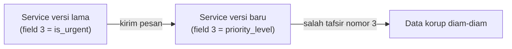

## TL;DR

Protobuf dirancang supaya pesan bisa berubah seiring waktu tanpa mematahkan client lama atau server lama yang belum di-deploy ulang — selama perubahan itu mengikuti aturan kompatibilitas tertentu. Aturan intinya: **nomor field tidak pernah berubah atau dipakai ulang**, field baru harus opsional secara default (proto3 memang begitu), dan menghapus field berarti memesankan nomor itu lewat `reserved` supaya tidak sengaja dipakai ulang di masa depan. Melanggar aturan ini tidak menghasilkan error saat compile — ia menghasilkan bug produksi yang baru muncul saat dua service dengan versi schema berbeda saling bicara, dan payload yang diterima diinterpretasikan salah tanpa panic maupun error yang jelas.

## The Problem

Sebuah tim menambahkan field baru ke pesan `VerifikasiDokumenRequest` yang sudah dipakai di produksi oleh lima service berbeda. Karena terburu-buru, developer menyalin nomor field dari field lain yang sudah dihapus bulan lalu — nomor `3` — dengan asumsi nomor itu "bebas dipakai" karena tidak terlihat di kode saat ini. Service yang sudah di-deploy dengan `.proto` versi lama masih mengenal nomor `3` sebagai field lama (`is_urgent`, boolean), sementara service yang baru di-deploy menafsirkan nomor `3` sebagai field baru (`priority_level`, integer). Selama masa **rolling deployment** — sebagian pod menjalankan versi lama, sebagian versi baru, wajar terjadi di Kubernetes — kedua versi saling mengirim pesan dengan nomor field yang sama tapi arti berbeda. Tidak ada error yang dilempar. Data yang salah ditafsirkan mengalir diam-diam, karena protobuf mem-parsing berdasarkan nomor field, bukan makna semantiknya.

Ini bukan bug yang muncul saat compile atau saat testing lokal biasa (di mana hanya satu versi schema yang berjalan) — ia hanya muncul di produksi, tepat pada window waktu ketika dua versi service hidup berdampingan, situasi yang di Kubernetes bisa berlangsung beberapa menit di setiap deployment.

## Intuition

Padanan terdekatnya di luar dunia software adalah nomor loker penyimpanan barang. Kalau loker nomor 3 pernah berisi barang milik orang A dan sekarang dikosongkan, memberikan loker nomor 3 yang sama ke orang B tanpa mengumumkannya jelas berbahaya — orang A yang masih menyimpan kuncinya bisa saja membuka loker itu dan menemukan barang milik orang B, atau sebaliknya. Solusi yang aman bukan "jangan pernah kosongkan loker", tapi memesankan nomor loker yang sudah pernah dipakai supaya tidak pernah diberikan ke orang lain lagi — itulah fungsi kata kunci `reserved` di protobuf.

Analogi ini berhenti bekerja pada satu titik: loker fisik jumlahnya terbatas sehingga memesankan nomor selamanya terasa boros. Nomor field protobuf jauh lebih murah — ada lebih dari lima ratus juta nomor tersedia dalam rentang normal — jadi memesankan nomor selamanya bukan trade-off yang berat sama sekali.

## How It Works

Tiga aturan inti kompatibilitas protobuf:

**Field baru harus opsional (default di proto3).** Client lama yang belum tahu field itu akan mengabaikannya saat membaca pesan dari server baru. Server lama yang menerima pesan dari client baru yang menyertakan field itu juga akan mengabaikannya. Tidak ada pihak yang crash — field yang tidak dikenali cuma dilewati.

**Nomor field tidak pernah dipakai ulang.** Ketika sebuah field dihapus, nomornya wajib dipesankan lewat `reserved`, bukan dibiarkan bebas:

```protobuf
message VerifikasiDokumenRequest {
  string dokumen_id = 1;
  bytes konten = 2;
  reserved 3;               // bekas is_urgent, jangan pakai ulang
  reserved "is_urgent";     // nama lama juga dipesankan, jaga-jaga
  int32 priority_level = 4; // field baru pakai nomor baru, bukan 3
}
```

`reserved` membuat `protoc` menolak compile kalau ada yang mencoba memakai nomor atau nama itu lagi di masa depan — aturan yang dipaksakan tooling, bukan cuma konvensi di kepala developer.

**Tipe data field tidak boleh berubah sembarangan.** Mengubah `int32` menjadi `string` pada nomor field yang sama akan membuat penerima salah membaca byte, karena keduanya di-encode dengan cara berbeda di level biner. Beberapa perubahan tipe memang aman karena representasi biner-nya identik (misalnya `int32` ke `int64` untuk nilai positif), tapi ini pengecualian sempit, bukan aturan umum — kalau ragu, tambahkan field baru dengan nomor baru daripada mengubah tipe field yang sudah ada.



Diagram ini menunjukkan akibat memakai ulang nomor field selama masa transisi deployment: penerima tidak tahu bahwa nomor yang sama sekarang punya arti berbeda, dan tidak ada mekanisme di level protobuf yang mendeteksi kesalahan ini secara otomatis.

## Under The Hood

Protobuf meng-encode setiap field sebagai pasangan **tag** (gabungan nomor field dan tipe wire) dan **value** — bukan nama field dalam bentuk teks. Karena itu, dua pesan dengan skema berbeda tapi nomor field yang tumpang tindih akan selalu berhasil di-parse tanpa error: parser protobuf secara desain memang permisif terhadap field yang tidak dikenali (untuk mendukung kompatibilitas maju), dan permisif yang sama inilah yang membuat kesalahan pemakaian ulang nomor field tidak pernah terdeteksi otomatis saat runtime.

Ini berbeda mendasar dari JSON, di mana field diidentifikasi lewat nama teks — mengubah arti sebuah key JSON tanpa mengubah namanya jarang terjadi secara tidak sengaja, karena developer harus secara eksplisit menulis ulang nama key itu. Di protobuf, kesalahan yang setara (memakai ulang nomor) jauh lebih mudah lolos karena nomor tidak "terlihat" secara langsung di kode yang ditulis sehari-hari — ia tersembunyi di belakang nama field yang dibaca compiler.

## In Go

```go
// protoc men-generate kode Go yang menyertakan tag protobuf
// di belakang setiap field struct — inilah yang membawa nomor field.
type VerifikasiDokumenRequest struct {
	DokumenId     string `protobuf:"bytes,1,opt,name=dokumen_id,json=dokumenId,proto3"`
	Konten        []byte `protobuf:"bytes,2,opt,name=konten,proto3"`
	PriorityLevel int32  `protobuf:"varint,4,opt,name=priority_level,json=priorityLevel,proto3"`
}
```

Perhatikan angka `1`, `2`, `4` di dalam tag `protobuf:"..."` — itu nomor field yang sesungguhnya dikirim lewat jaringan. Nomor `3` sengaja dilewati karena dipesankan (`reserved`) di file `.proto`. Kode Go ini tidak pernah ditulis manual; ia selalu hasil generate dari `protoc`, sehingga menjaga file `.proto` sebagai satu-satunya sumber kebenaran tetap konsisten.

Pengecekan kompatibilitas skema sebaiknya tidak bergantung pada disiplin manual saja — tooling seperti `buf breaking` bisa dijalankan di CI untuk menolak pull request yang mengubah nomor field atau tipe secara tidak kompatibel, sebelum perubahan itu sempat di-merge:

```yaml
# buf.yaml — konfigurasi minimal untuk breaking-change check
version: v2
breaking:
  use:
    - FILE
```

## In His Stack

Kalau tim mulai memakai gRPC untuk komunikasi antar service Go internal, disiplin schema evolution ini menjadi jauh lebih penting dibanding di dunia REST/JSON yang selama ini dipakai di Yii2 — API PHP biasanya menambah key baru ke response JSON tanpa proses formal, karena JSON menoleransi field asing dengan mudah dan kesalahan semacam ini jarang senyap. Protobuf menuntut kedisiplinan yang lebih tinggi justru karena formatnya lebih efisien: efisiensi itu didapat dengan membuang informasi nama field dari setiap pesan, dan itulah yang membuat kesalahan nomor field jadi kelas bug tersendiri yang tidak ada padanannya di JSON.

## Trade-offs and When Not To Use It

Aturan schema evolution ini adalah biaya tetap dari memilih protobuf, bukan sesuatu yang bisa dihindari selama masih memakai protobuf itu sendiri — pertanyaannya bukan "kapan menghindari aturan ini" tapi "kapan menghindari protobuf". Untuk tim kecil dengan satu service yang di-deploy dan di-consume oleh dirinya sendiri (tidak ada klien eksternal atau versi lama yang hidup berdampingan), risiko schema drift jauh lebih kecil dan disiplin `reserved` yang ketat terasa berlebihan. Untuk sistem dengan banyak konsumen independen dan siklus deploy yang tidak sinkron — persis situasi khas microservices di Kubernetes — aturan ini bukan opsional.

## Common Mistakes

> [!warning] Jebakan
> Menghapus field dari `.proto` tanpa menambahkan `reserved` untuk nomor dan namanya, sehingga nomor itu bisa dipakai ulang secara tidak sengaja oleh developer lain di masa depan.

> [!warning] Jebakan
> Mengubah field dari `optional` menjadi wajib divalidasi di level aplikasi tanpa menyadari bahwa protobuf sendiri di proto3 tidak punya konsep "required" di level wire format — validasi keberadaan field tetap tanggung jawab kode aplikasi, bukan compiler protobuf.

> [!warning] Jebakan
> Mengasumsikan breaking change akan terdeteksi otomatis saat compile lokal. `protoc` akan tetap berhasil compile meski nomor field dipakai ulang tanpa `reserved` — pengecekan breaking change butuh tooling terpisah (`buf breaking`) yang dijalankan secara eksplisit, biasanya di CI.

## Exercises

1. Sebuah field `string email = 5` dihapus dari pesan yang sudah dipakai di produksi. Tulis deklarasi `reserved` yang benar untuk mencegah nomor dan nama itu dipakai ulang.
2. Jelaskan kenapa mengubah tipe field dari `int32` menjadi `string` pada nomor field yang sama berbahaya, meski keduanya "hanya menyimpan angka" dari sudut pandang aplikasi.
3. Sebuah rolling deployment di Kubernetes membuat versi lama dan versi baru sebuah service hidup berdampingan selama beberapa menit. Jelaskan kenapa window waktu ini adalah saat paling berbahaya untuk breaking change schema protobuf, dibanding deployment yang mengganti semua pod sekaligus (bukan rolling).
4. **(Open-ended)** Timmu ingin menambahkan field `list of tags` (daftar string) ke sebuah pesan protobuf yang sudah dipakai lima service produksi selama setahun. Rancang urutan langkah deployment yang aman, termasuk kapan `buf breaking` sebaiknya dijalankan, dan bagaimana kamu memastikan tidak ada service yang crash selama masa transisi.

> [!success]- Kunci jawaban
> Untuk soal 4: tambahkan field baru dengan nomor field yang belum pernah dipakai (bukan menggandakan nomor lama), jalankan `buf breaking` di CI sebelum merge untuk memverifikasi perubahan ini kompatibel ke belakang, lalu deploy service yang **memproduksi** pesan lebih dulu (mengisi field baru), diikuti service yang **mengonsumsi** pesan (membaca field baru) — urutan ini penting karena field baru yang belum diisi tetap aman dibaca konsumen lama (nilainya default kosong), sementara konsumen baru yang membaca dari produsen lama juga aman karena field itu memang boleh kosong.

## Self-Check

- Kenapa memakai ulang nomor field yang sudah dihapus berbahaya, dan apa yang mencegahnya?
- Apa yang terjadi ketika penerima pesan protobuf menemukan nomor field yang tidak ia kenali?
- Kenapa breaking change protobuf sering tidak terdeteksi saat compile lokal?

## Connected Notes

- [[gRPC and Protobuf]] — prasyarat langsung: note ini mengasumsikan pemahaman dasar bagaimana pesan protobuf disusun dan nomor field bekerja.
- [[Contract Negotiation and Versioning]] — schema evolution protobuf adalah salah satu bentuk konkret dari disiplin versioning kontrak yang dibahas lebih umum di note itu.
- [[Consumer Groups and Rebalancing]] — sama-sama menghadapi masalah "versi lama dan baru hidup berdampingan selama transisi", meski di konteks konsumen streaming, bukan schema RPC.
- [[The Transactional Outbox Pattern]] — pesan yang dikirim lewat outbox sering di-serialize dengan protobuf, sehingga aturan kompatibilitas di note ini berlaku juga di sana.

## Further Reading

- Dokumentasi resmi Protocol Buffers, bagian "Updating a Message Type": protobuf.dev
- Dokumentasi `buf breaking`: buf.build

## Catatan Saya

*Tulis pertanyaanmu sendiri, contoh kode dari pekerjaanmu, atau bagian yang belum jelas di sini.*
