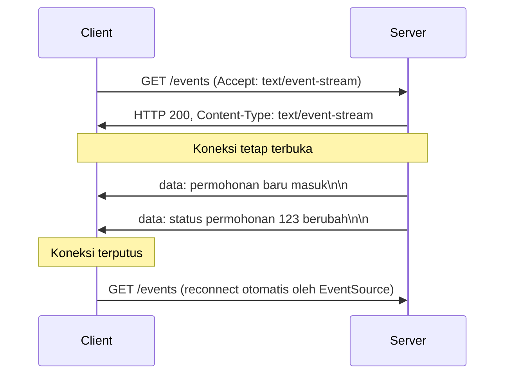

## TL;DR

**Server-Sent Events (SSE)** adalah cara mendorong pesan dari server ke client secara satu arah lewat koneksi HTTP biasa yang dibiarkan tetap terbuka, tanpa perlu upgrade protokol seperti [[WebSocket]]. Client membuka satu request `GET` dengan `Accept: text/event-stream`, server menjaga koneksi itu tetap hidup dan mengirim potongan teks berformat sederhana setiap kali ada event baru, dan browser modern menyediakan API `EventSource` yang menangani reconnect otomatis kalau koneksi terputus. Karena berjalan murni di atas HTTP/1.1 biasa, SSE jauh lebih ramah terhadap proxy, load balancer, dan firewall korporat dibanding WebSocket — harganya, SSE hanya bisa satu arah (server ke client) dan tidak cocok untuk kasus yang benar-benar butuh client mengirim balik lewat koneksi yang sama.

## The Problem

Dashboard petugas legal-services di note [[WebSocket]] butuh notifikasi real-time, tapi setelah dianalisis lebih lanjut, arah komunikasinya sebenarnya cuma satu: server memberi tahu client saat ada permohonan baru atau status berubah. Client tidak pernah perlu mengirim pesan balik lewat koneksi notifikasi itu sendiri — aksi seperti "tandai sudah dibaca" tetap bisa lewat request HTTP biasa terpisah, bukan lewat koneksi real-time itu.

Memilih WebSocket untuk kasus yang sebenarnya satu arah berarti membawa semua kompleksitas WebSocket (handshake upgrade khusus, load balancer yang harus sadar sticky session, firewall korporat yang kadang memblokir upgrade non-standar) untuk kemampuan dua arah yang tidak pernah dipakai. Tim butuh mekanisme push yang lebih sederhana, yang bisa lewat infrastruktur HTTP yang sudah ada tanpa konfigurasi tambahan.

## Intuition

Cara paling mudah memahaminya: kalau WebSocket adalah telepon dua arah, SSE adalah radio siaran — stasiun radio terus mengirim siaran, dan siapa pun yang menyalakan radio bisa mendengarkan, tapi pendengar tidak bisa bicara balik lewat gelombang radio yang sama. Untuk memberi respons, pendengar harus memakai saluran lain (telepon ke studio, bukan lewat radio itu sendiri) — persis seperti aksi client di SSE yang tetap lewat request HTTP biasa terpisah, bukan lewat koneksi SSE itu sendiri.

Analogi ini berhenti bekerja pada titik jumlah pendengar: satu siaran radio bisa didengar jutaan orang tanpa biaya tambahan per pendengar (broadcast fisik), sementara server SSE tetap harus menjaga satu koneksi TCP terbuka **per client**, sama seperti WebSocket — SSE menghemat kompleksitas protokol, bukan menghemat resource koneksi per client.

## How It Works



Diagram ini menunjukkan bahwa SSE tetap request HTTP biasa dari awal sampai akhir — tidak ada langkah upgrade protokol seperti WebSocket. Server membalas dengan header `Content-Type: text/event-stream` dan **tidak pernah menutup response body**; setiap event baru dikirim sebagai potongan teks tambahan ke body yang sama, dipisahkan baris kosong. Format pesannya sederhana:

```
data: permohonan baru masuk

data: status permohonan 123 berubah

id: 42
data: notifikasi dengan ID event, untuk resume setelah reconnect

```

Field `id` opsional memungkinkan client memberi tahu server, saat reconnect, event terakhir yang berhasil diterima (lewat header `Last-Event-ID`) — server bisa memakainya untuk mengirim ulang event yang terlewat selama koneksi terputus, kemampuan resume yang tidak didapat gratis di WebSocket.

## In Go

```go
package main

import (
	"fmt"
	"net/http"
)

func handleEvents(w http.ResponseWriter, r *http.Request) {
	flusher, ok := w.(http.Flusher)
	if !ok {
		http.Error(w, "streaming tidak didukung", http.StatusInternalServerError)
		return
	}

	w.Header().Set("Content-Type", "text/event-stream")
	w.Header().Set("Cache-Control", "no-cache")
	w.Header().Set("Connection", "keep-alive")

	// notifikasiUntukPetugas mengembalikan channel yang menerima
	// pesan baru untuk petugas ini — sumbernya bisa dari pub/sub
	// internal atau langganan Kafka, bukan detail note ini.
	notifikasi := notifikasiUntukPetugas(r.Context(), r.URL.Query().Get("petugas_id"))

	for {
		select {
		case <-r.Context().Done():
			// Client menutup koneksi (tab ditutup, jaringan putus).
			return
		case pesan, ok := <-notifikasi:
			if !ok {
				return
			}
			fmt.Fprintf(w, "data: %s\n\n", pesan)
			flusher.Flush()
		}
	}
}
```

Dua bagian yang wajib ada dan sering terlewat: `http.Flusher` untuk memaksa Go mengirim data yang sudah ditulis ke client segera, bukan menunggu buffer penuh, dan `r.Context().Done()` untuk mendeteksi kapan client memutus koneksi supaya goroutine yang menangani handler ini tidak menunggu selamanya — kebocoran goroutine yang sama persis dengan yang dibahas di [[Goroutine Leaks]] kalau ini terlewat.

## In His Stack

SSE lebih ramah terhadap infrastruktur yang sudah ada di ekosistem Kubernetes dan Nginx dibanding WebSocket — tidak butuh konfigurasi ingress khusus untuk upgrade protokol, karena dari sudut pandang HTTP, ini tetap response biasa yang lambat selesai. Satu hal yang tetap perlu diperhatikan: beberapa konfigurasi Nginx default melakukan buffering response sebelum meneruskannya ke client, yang akan membuat event SSE tertahan di buffer alih-alih langsung diteruskan — butuh `proxy_buffering off` secara eksplisit untuk endpoint SSE. Yii2 sendiri, seperti WebSocket, tidak dirancang untuk menangani koneksi HTTP yang bertahan lama dalam model PHP-FPM tradisional (satu proses per request yang selesai cepat), sehingga endpoint SSE lebih cocok dibangun sebagai service Go terpisah.

## Trade-offs and When Not To Use It

SSE unggul untuk notifikasi satu arah, live feed, progress bar proses panjang, atau update status — kapan pun client hanya perlu menerima, tidak mengirim balik lewat koneksi yang sama. Ia bukan pilihan untuk chat, kolaborasi live, atau game yang butuh client mengirim data secara sinkron lewat koneksi yang sama — di situ WebSocket tetap dibutuhkan. SSE juga dibatasi jumlah koneksi paralel per browser ke domain yang sama pada HTTP/1.1 (browser membatasi jumlah koneksi HTTP/1.1 per domain, sehingga tab lain ke domain sama bisa kehabisan slot koneksi) — batasan yang jauh berkurang di HTTP/2 karena multiplexing, jadi memastikan endpoint SSE berjalan di atas HTTP/2 layak dipertimbangkan untuk aplikasi dengan banyak tab.

## Common Mistakes

> [!warning] Jebakan
> Lupa memanggil `flusher.Flush()` setelah menulis data — tanpa itu, Go (atau layer proxy di depannya) bisa menahan data di buffer, dan client tidak menerima event sampai buffer penuh atau koneksi ditutup.

> [!warning] Jebakan
> Tidak menangani `r.Context().Done()`, sehingga goroutine handler tetap hidup selamanya meski client sudah menutup tab — kebocoran goroutine yang terakumulasi seiring waktu di server dengan banyak koneksi SSE.

> [!warning] Jebakan
> Menaruh endpoint SSE di belakang reverse proxy dengan buffering aktif tanpa menonaktifkannya, membuat event terasa "macet" dan baru muncul dalam gelombang besar, bukan real-time seperti yang dimaksud.

## Exercises

1. Jelaskan kenapa SSE dianggap lebih ramah terhadap infrastruktur korporat dibanding WebSocket.
2. Tulis format pesan SSE yang mengirim event dengan field `id: 7` dan `data` berisi JSON `{"status": "selesai"}`.
3. Jelaskan fungsi header `Last-Event-ID` dan bagaimana server bisa memakainya untuk mengirim ulang event yang terlewat selama client terputus.
4. **(Open-ended)** Timmu perlu memilih antara SSE dan WebSocket untuk fitur "progress upload dokumen besar" — server memproses dokumen dalam beberapa tahap (validasi, OCR, verifikasi) dan ingin menampilkan progress setiap tahap ke client secara real-time. Client tidak perlu mengirim apa pun selama proses berjalan. Tentukan pilihanmu dan jelaskan alasannya, termasuk satu skenario di mana pilihan itu berubah.

> [!success]- Kunci jawaban
> Untuk soal 4: SSE adalah pilihan yang tepat karena komunikasi murni satu arah (server ke client) dan tidak ada kebutuhan client mengirim data lewat koneksi yang sama selama proses berjalan. Skenario yang mengubah pilihan: kalau di tengah proses client perlu bisa mengirim perintah "batalkan proses" lewat koneksi real-time yang sama (bukan lewat request HTTP terpisah), WebSocket jadi lebih masuk akal karena mendukung dua arah secara native tanpa perlu menggabungkan dua mekanisme komunikasi berbeda.

## Self-Check

- Apa perbedaan mendasar arah komunikasi antara SSE dan WebSocket?
- Kenapa `http.Flusher` wajib dipanggil setelah menulis setiap event SSE di Go?
- Bagaimana client SSE bisa melanjutkan dari event terakhir setelah koneksi terputus dan tersambung lagi?

## Connected Notes

- [[WebSocket]] — pembanding langsung: SSE lebih sederhana tapi hanya satu arah, WebSocket dua arah tapi lebih kompleks operasionalnya.
- [[Polling vs Push]] — SSE adalah salah satu bentuk push sungguhan, alternatif dari polling yang dibahas di note itu.
- [[Goroutine Leaks]] — kegagalan menangani `r.Context().Done()` di handler SSE menghasilkan kebocoran goroutine yang persis dibahas di note itu.
- [[Long Polling]] — fallback yang lebih tua dan lebih kompatibel ketika SSE atau WebSocket sama-sama tidak bisa dipakai karena keterbatasan jaringan client.

## Further Reading

- WHATWG HTML Living Standard, bagian "Server-sent events"
- Dokumentasi MDN untuk `EventSource`

## Catatan Saya

*Tulis pertanyaanmu sendiri, contoh kode dari pekerjaanmu, atau bagian yang belum jelas di sini.*
