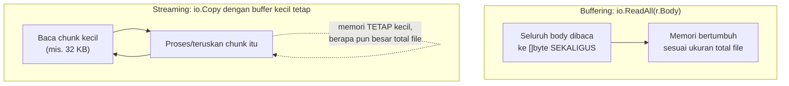

## TL;DR

**Buffering** berarti seluruh body request/response dimuat penuh ke memori sebelum diproses — sederhana untuk ditulis, tapi memori yang dipakai bertumbuh proporsional dengan ukuran datanya. **Streaming** memproses data sepotong demi sepotong (chunk) seiring ia mengalir masuk/keluar, tanpa pernah menampung keseluruhannya di memori sekaligus — memori yang dipakai tetap kecil dan konstan berapa pun besar total datanya. Untuk file besar (dokumen scan, video, dataset ekspor), memilih buffering begitu saja adalah cara paling cepat membuat satu request besar menghabiskan memori server sampai proses lain ikut terganggu.

## The Problem

Bayangkan sebuah endpoint upload dokumen yang ditulis dengan memanggil `io.ReadAll(r.Body)` untuk membaca seluruh isi request ke satu `[]byte` sebelum memprosesnya — pola yang terlihat sederhana dan bekerja sempurna untuk file berukuran kecil di testing. Begitu partner mulai mengirim dokumen scan berukuran puluhan megabyte, dan beberapa upload seperti itu terjadi **bersamaan** (misalnya beberapa petugas di kantor cabang berbeda mengunggah dokumen di jam yang sama), memori server melonjak drastis — setiap request yang sedang diproses menahan seluruh isi file-nya di memori sekaligus, dan jumlah memori total yang dipakai adalah ukuran file dikali jumlah upload konkuren.

Kalau cukup banyak upload besar terjadi bersamaan, server bisa kehabisan memori dan mulai memicu garbage collector bekerja keras (lihat [[../50 Concurrency and Performance/Garbage Collection in Go|Garbage Collection in Go]]) atau bahkan process dimatikan paksa oleh OS (out-of-memory killer) — bukan karena bug logika, tapi murni karena pola buffering yang tidak diperhitungkan untuk skala data yang sesungguhnya.

## Intuition

Bayangkan buffering seperti **menampung seluruh isi truk kontainer ke dalam gudang sebelum mulai menyortir barangnya satu per satu** — sederhana untuk dinalar, tapi gudang harus cukup besar untuk menampung **seluruh** isi truk sekaligus, dan kalau ada beberapa truk datang bersamaan, kamu butuh gudang sebesar itu dikalikan jumlah truk. Streaming lebih seperti **menyortir barang langsung di depan pintu truk saat diturunkan satu per satu**, tanpa pernah butuh gudang yang cukup besar untuk menampung seluruh isi truk sekaligus — barang yang sudah disortir langsung dipindahkan, memori yang dipakai tetap kecil berapa pun besar isi truk itu.

Analogi ini bocor pada satu hal: menyortir barang satu per satu di depan pintu truk (streaming) kadang tidak semudah menyortir dari gudang yang sudah tertata (buffering) — beberapa operasi butuh melihat seluruh data sekaligus untuk memutuskan sesuatu (misalnya menghitung total checksum yang butuh seluruh isi file), dan tidak semua pemrosesan bisa dipecah rapi jadi potongan-potongan independen tanpa penyesuaian logika.

## How It Works



Interface `io.Reader` dan `io.Writer` di Go dirancang tepat untuk mendukung streaming — keduanya bekerja dengan buffer kecil yang dipakai ulang, memungkinkan data mengalir dari sumber ke tujuan tanpa pernah harus ditampung penuh di satu tempat.

## In Go

```go
// Buffering: sederhana, tapi memori bertumbuh sesuai ukuran file.
func simpanDokumenBuffering(w http.ResponseWriter, r *http.Request) {
    data, err := io.ReadAll(r.Body) // SELURUH body masuk memori sekaligus
    if err != nil {
        http.Error(w, "gagal membaca body", http.StatusBadRequest)
        return
    }
    if err := os.WriteFile("/tmp/dokumen.pdf", data, 0644); err != nil {
        http.Error(w, "gagal menyimpan", http.StatusInternalServerError)
        return
    }
}

// Streaming: memori tetap kecil dan konstan, berapa pun besar file-nya.
func simpanDokumenStreaming(w http.ResponseWriter, r *http.Request) {
    f, err := os.Create("/tmp/dokumen.pdf")
    if err != nil {
        http.Error(w, "gagal membuat file", http.StatusInternalServerError)
        return
    }
    defer f.Close()

    // io.Copy membaca dari r.Body dan menulis ke f dalam potongan kecil
    // (buffer internal 32 KB secara default), TIDAK PERNAH menampung
    // seluruh isi file di memori sekaligus.
    if _, err := io.Copy(f, r.Body); err != nil {
        http.Error(w, "gagal menyimpan", http.StatusInternalServerError)
        return
    }
}
```

Perbedaan `simpanDokumenBuffering` dan `simpanDokumenStreaming` bukan soal berapa baris kode — `io.Copy` di versi streaming secara internal memakai buffer kecil yang dipakai ulang, memproses data dalam potongan-potongan sambil mengalir dari `r.Body` (koneksi jaringan) langsung ke `f` (file di disk), tanpa titik mana pun yang menampung seluruh isi file di memori RAM sekaligus.

## In His Stack

**PHP** dengan konfigurasi default `memory_limit` per proses (dan model PHP-FPM di mana setiap request punya worker/memory sendiri, lihat [[../10 Foundations/Processes vs Threads|Processes vs Threads]]) secara alami membatasi dampak buffering berlebihan — satu request yang menghabiskan banyak memori "hanya" memengaruhi worker itu sendiri sampai batas `memory_limit`-nya. Di Go, satu process yang sama melayani **semua** request sekaligus — buffering berlebihan di satu goroutine bisa menekan memori yang dipakai bersama oleh **semua** goroutine lain yang sedang melayani request berbeda, membuat dampaknya jauh lebih luas dibanding model PHP-FPM tradisional.

## Trade-offs and When Not To Use It

Buffering lebih sederhana untuk ditulis dan cukup aman untuk payload kecil yang ukurannya bisa diprediksi dan dibatasi (respons API JSON biasa, form kecil). Streaming wajib dipertimbangkan untuk file besar atau ukuran data yang tidak bisa dipastikan batasnya di muka. Streaming juga punya batasan: operasi yang butuh melihat seluruh data sekaligus (menghitung checksum penuh, validasi yang butuh konteks keseluruhan file) butuh penyesuaian logika tambahan atau tetap butuh buffering parsial untuk bagian tertentu — bukan berarti streaming selalu bisa menggantikan buffering sepenuhnya tanpa penyesuaian.

## Common Mistakes

> [!warning] Jebakan
> Memakai `io.ReadAll` sebagai default untuk membaca body request tanpa mempertimbangkan ukuran data yang mungkin diterima, terutama untuk endpoint yang menerima upload file.

> [!warning] Jebakan
> Mengasumsikan streaming selalu bisa menggantikan buffering tanpa penyesuaian, padahal beberapa operasi (menghitung checksum penuh, validasi yang butuh melihat keseluruhan data) tetap butuh strategi tambahan untuk bekerja dengan pola streaming.

> [!warning] Jebakan
> Lupa bahwa satu process Go yang menangani banyak goroutine sekaligus berarti buffering berlebihan di satu request bisa menekan memori yang dipakai bersama seluruh request lain yang sedang berjalan — dampaknya jauh lebih luas dibanding model satu-proses-per-request seperti PHP-FPM.

## Exercises

1. Apa perbedaan mendasar pola akses memori antara buffering dan streaming?
2. Kenapa `io.Copy` tidak menampung seluruh isi file di memori, berbeda dari `io.ReadAll`?
3. Sebutkan satu jenis operasi yang tetap butuh melihat keseluruhan data, sehingga streaming murni sulit diterapkan langsung.
4. Desain terbuka: sebuah endpoint upload dokumen scan mulai menerima file berukuran hingga 200 MB dari beberapa cabang instansi secara bersamaan, dan server mulai kehabisan memori sesekali di jam sibuk. Rancang perbaikan menyeluruh (bukan hanya mengganti satu function) untuk menangani skala ini dengan aman.

> [!success]- Kunci jawaban
> Ubah seluruh jalur pemrosesan upload ke pola streaming penuh — dari `r.Body` langsung ke tujuan akhir (file lokal sementara atau langsung ke object storage lewat streaming upload API, lihat [[Upload and Download Patterns]]), tanpa titik mana pun yang menampung seluruh file di memori. Tambahkan batas ukuran eksplisit di level `http.MaxBytesReader` (lihat [[Request Size Limits Along The Path]]) untuk mencegah upload yang jauh melampaui batas wajar sama sekali sampai memproses sebagian besar isinya. Untuk operasi yang butuh checksum/validasi penuh, hitung checksum **seiring streaming berjalan** (misalnya lewat `io.MultiWriter` yang menulis ke file sekaligus ke hash function secara bersamaan dalam satu pass), alih-alih membaca ulang seluruh file dari awal setelah selesai disimpan — ini menghindari kebutuhan membaca file dua kali sekaligus tetap mendapat checksum penuh tanpa buffering di memori.

## Self-Check

- Apa perbedaan pola akses memori antara buffering dan streaming?
- Kenapa `io.Copy` cocok dipakai untuk file besar dibanding `io.ReadAll`?
- Sebutkan satu operasi yang sulit dilakukan murni dengan streaming.
- Kenapa dampak buffering berlebihan di Go bisa lebih luas dibanding di PHP-FPM?

## Connected Notes

- [[Binary in JSON and the Base64 Tax]] — base64 encoding di JSON pada dasarnya memaksa buffering penuh, salah satu alasan lain menghindarinya untuk file besar.
- [[../20 Go Language/Slice Internals|Slice Internals]] — pemahaman slice yang relevan saat menulis buffer streaming secara manual.
- [[Upload and Download Patterns]] — pola production lengkap yang menerapkan streaming untuk file besar.
- [[Request Size Limits Along The Path]] — batas ukuran yang tetap perlu diterapkan meski sudah memakai streaming.
- [[../50 Concurrency and Performance/Garbage Collection in Go|Garbage Collection in Go]] — dampak buffering berlebihan terhadap tekanan garbage collector.

## Further Reading

- Dokumentasi resmi package `io` (pkg.go.dev/io) — referensi lengkap `io.Reader`, `io.Writer`, dan `io.Copy`.

## Catatan Saya

*Tulis di sini endpoint di kerjaanmu yang memakai `io.ReadAll` atau setara untuk file besar, dan apakah ini pernah jadi masalah memori.*
