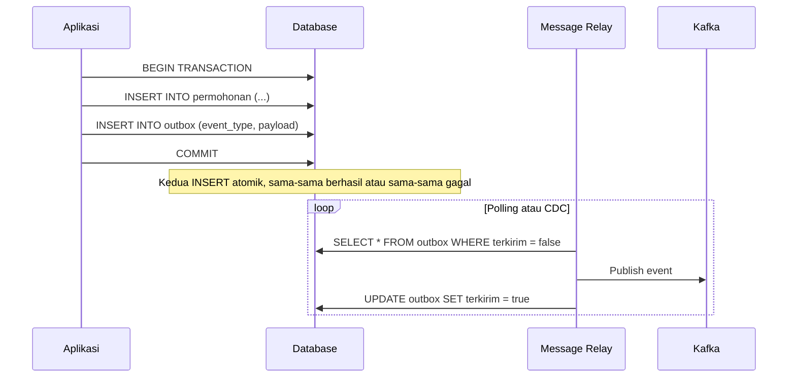

## TL;DR

**Transactional outbox** menyelesaikan masalah **dual write**: bagaimana memastikan menulis ke database dan mengirim event ke sistem pesan (Kafka, RabbitMQ) terjadi secara konsisten, padahal keduanya adalah sistem terpisah yang tidak berbagi mekanisme transaksi yang sama. Alih-alih menulis ke database lalu langsung publish ke message broker sebagai dua operasi terpisah yang bisa gagal secara independen, aplikasi menulis baris data **dan** baris "pesan yang perlu dikirim" ke tabel outbox dalam **satu transaksi database yang sama**, lalu proses terpisah (biasanya disebut message relay) membaca tabel outbox itu dan mem-publish-nya ke message broker secara asinkron. Konsistensi antara data dan event dijamin oleh atomicity transaksi database, bukan oleh mengandalkan dua sistem berbeda sama-sama berhasil.

## The Problem

Service permohonan legal-services menyimpan permohonan baru ke database, lalu langsung memanggil `producer.Publish()` untuk mengirim event "permohonan dibuat" ke Kafka, supaya service notifikasi bisa mengirim email konfirmasi. Kode ini terlihat benar sampai suatu insiden: database berhasil menyimpan permohonan, tapi tepat setelah itu koneksi ke Kafka broker terputus sesaat (masalah jaringan sesaat, bukan hal aneh di infrastruktur produksi manapun). Publish event gagal, permohonan tersimpan tapi tidak pernah ada event yang terkirim — pemohon tidak pernah menerima email konfirmasi, dan tidak ada jejak bahwa sesuatu yang seharusnya terjadi justru tidak terjadi.

Solusi naif pertama tim adalah membalik urutan: publish event dulu, baru simpan ke database. Ini memindahkan masalah, bukan menyelesaikannya — sekarang mungkin event terkirim (notifikasi email terkirim ke pemohon) padahal penyimpanan database gagal setelahnya, sehingga sistem mengklaim "permohonan dibuat" ke dunia luar padahal permohonan itu tidak pernah benar-benar tersimpan. Kedua urutan sama-sama rentan: dua operasi terhadap dua sistem berbeda tidak bisa dijamin sama-sama berhasil atau sama-sama gagal hanya dengan mengurutkannya secara berbeda.

## Intuition

Cara paling mudah memahaminya: bayangkan seorang petugas loket yang harus melakukan dua hal setiap kali menerima permohonan — mencatatnya di buku register **dan** menaruh salinan formulir ke kotak surat keluar untuk dikirim ke bagian lain. Kalau kedua tindakan ini dilakukan terpisah (catat di buku, lalu jalan ke kotak surat di ruangan lain), ada jeda waktu di antaranya di mana petugas bisa terganggu — dipanggil urusan lain, atau kotak suratnya ternyata terkunci — dan salah satu tindakan selesai sementara yang lain tidak. Transactional outbox setara dengan mengubah kotak surat itu menjadi **bagian dari buku register yang sama** — mencatat permohonan dan menandai "perlu dikirim ke bagian lain" adalah satu tindakan tunggal menulis di satu buku, dilakukan sekali duduk, tidak bisa terpisah separuh-separuh. Petugas pos yang datang belakangan mengambil semua catatan yang ditandai "perlu dikirim" dari buku itu dan benar-benar mengantarkannya, terpisah waktu tapi tidak pernah kehilangan jejak.

Analogi ini berhenti bekerja pada satu titik: petugas pos di analogi ini melakukan pekerjaannya sekali per catatan dan selesai. Message relay sungguhan harus menangani kemungkinan **ia sendiri** gagal di tengah jalan (crash setelah publish ke Kafka tapi sebelum menandai baris outbox sebagai terkirim) — situasi yang lagi-lagi diselesaikan dengan idempotency di sisi consumer, bukan dengan mencoba membuat message relay itu sendiri sempurna.

## How It Works



Diagram ini menunjukkan bahwa titik kritis konsistensi ada di transaksi pertama — `INSERT` ke tabel `permohonan` dan `INSERT` ke tabel `outbox` terjadi dalam satu `COMMIT`, dijamin atomik oleh database itu sendiri. Message relay yang membaca dan mem-publish tabel outbox berjalan **terpisah** dan **asinkron** — kalau ia lambat, atau bahkan sempat mati beberapa menit, data di tabel outbox tetap menunggu di sana sampai relay kembali hidup dan memprosesnya, tidak pernah hilang seperti pada pendekatan publish-langsung.

Dua cara umum mengimplementasikan message relay:

**Polling** — proses terpisah secara berkala men-query tabel outbox untuk baris yang belum terkirim, mem-publish-nya, lalu menandainya terkirim (atau menghapusnya). Sederhana diimplementasikan, tapi menambah beban query berulang ke database dan punya latency sebesar interval polling.

**Change Data Capture (CDC)** — alat seperti Debezium membaca **binlog/WAL** database secara langsung (log internal yang mencatat setiap perubahan baris, dibahas di [[MVCC]]) dan mem-publish perubahan pada tabel outbox ke Kafka nyaris real-time, tanpa membebani database dengan query polling berulang. Lebih kompleks operasionalnya, tapi jauh lebih efisien dan lebih rendah latency untuk skala besar.

## In Go

```go
package main

import (
	"context"
	"database/sql"
	"encoding/json"
	"fmt"
)

type EventOutbox struct {
	JenisEvent string
	Payload    []byte
}

func buatPermohonanDenganOutbox(ctx context.Context, db *sql.DB, permohonan Permohonan) error {
	tx, err := db.BeginTx(ctx, nil)
	if err != nil {
		return fmt.Errorf("gagal memulai transaksi: %w", err)
	}
	defer tx.Rollback()

	var permohonanID int64
	err = tx.QueryRowContext(ctx,
		"INSERT INTO permohonan (nama_pemohon, status) VALUES ($1, 'baru') RETURNING id",
		permohonan.NamaPemohon,
	).Scan(&permohonanID)
	if err != nil {
		return fmt.Errorf("gagal menyimpan permohonan: %w", err)
	}

	payload, err := json.Marshal(map[string]any{
		"permohonan_id": permohonanID,
		"nama_pemohon":  permohonan.NamaPemohon,
	})
	if err != nil {
		return fmt.Errorf("gagal mengenkode payload event: %w", err)
	}

	// INSERT ke outbox terjadi dalam transaksi yang SAMA dengan
	// penyimpanan permohonan — inilah inti dari pola ini.
	_, err = tx.ExecContext(ctx,
		"INSERT INTO outbox (jenis_event, payload, terkirim) VALUES ($1, $2, false)",
		"permohonan_dibuat", payload,
	)
	if err != nil {
		return fmt.Errorf("gagal mencatat event ke outbox: %w", err)
	}

	if err := tx.Commit(); err != nil {
		return fmt.Errorf("gagal commit transaksi: %w", err)
	}
	return nil
}
```

Perhatikan bahwa fungsi ini **tidak** memanggil producer Kafka sama sekali — publish ke Kafka sepenuhnya menjadi tanggung jawab message relay yang berjalan terpisah, memisahkan kepastian penyimpanan data dari kepastian pengiriman event.

## In His Stack

Pola ini secara langsung relevan untuk MariaDB/Yii2 juga, bukan hanya PostgreSQL — MariaDB punya binlog yang bisa dibaca Debezium dengan cara yang sama seperti WAL PostgreSQL, sehingga sistem Yii2 yang perlu mengirim event ke Kafka tanpa mengubah arsitektur transaksinya secara drastis bisa menerapkan outbox table plus Debezium CDC connector, tanpa perlu menulis ulang seluruh logika bisnis Yii2 dalam Go. Ini jadi jembatan praktis untuk mengintegrasikan sistem lama berbasis PHP ke ekosistem event-driven yang lebih baru tanpa migrasi besar-besaran.

## Trade-offs and When Not To Use It

Transactional outbox menambah kompleksitas nyata: satu tabel tambahan, satu proses relay tambahan yang harus dioperasikan dan dipantau, dan latency antara "data tersimpan" dan "event benar-benar terkirim" yang tidak nol (tergantung interval polling atau kecepatan CDC). Untuk sistem yang bisa menerima kehilangan sesekali event non-kritis (metrik, notifikasi yang tidak esensial), kompleksitas ini mungkin tidak sepadan — publish langsung dengan retry sederhana sudah cukup. Pola ini sepadan justru ketika konsistensi antara data dan event **penting secara bisnis** — status permohonan, pembayaran, audit trail — kasus di mana kehilangan event diam-diam berarti masalah nyata di dunia nyata, bukan sekadar gangguan kecil.

## Common Mistakes

> [!warning] Jebakan
> Memanggil producer message broker langsung di dalam kode aplikasi (dual write klasik) dan berasumsi retry sederhana di level aplikasi cukup mengatasi kegagalan — retry tidak menyelesaikan masalah dasarnya: dua sistem terpisah yang tidak berbagi mekanisme transaksi yang sama.

> [!warning] Jebakan
> Menghapus baris dari tabel outbox segera setelah publish berhasil tanpa jeda audit, sehingga kalau ada masalah di kemudian hari, tidak ada jejak untuk menyelidiki event apa saja yang pernah dikirim dan kapan — menandai `terkirim = true` (soft delete) biasanya lebih membantu debugging dibanding hard delete.

> [!warning] Jebakan
> Menjalankan lebih dari satu instance message relay tanpa koordinasi, sehingga event yang sama dipublish dua kali oleh dua relay berbeda yang sama-sama membaca baris outbox yang belum ditandai terkirim — butuh locking (misalnya `SELECT ... FOR UPDATE SKIP LOCKED`, dibahas di [[Locking and Row Locks]]) kalau relay dijalankan lebih dari satu instance untuk keperluan skala atau ketersediaan.

## Exercises

1. Jelaskan kenapa "publish dulu, simpan database setelahnya" bukan solusi terhadap masalah dual write, hanya memindahkan arah kegagalannya.
2. Bandingkan pendekatan polling dan CDC untuk message relay dari sisi latency dan beban terhadap database.
3. Sebuah message relay berbasis polling crash setelah berhasil publish event ke Kafka tapi sebelum menandai baris outbox sebagai terkirim. Jelaskan apa yang terjadi ketika relay itu hidup kembali, dan kenapa consumer di sisi lain tetap harus idempotent meski sudah memakai transactional outbox.
4. **(Open-ended)** Timmu memutuskan menjalankan dua instance message relay untuk redundansi (kalau satu instance mati, yang lain tetap memproses). Rancang mekanisme yang mencegah kedua instance mem-publish baris outbox yang sama secara bersamaan, dan jelaskan trade-off pendekatan yang kamu pilih.

> [!success]- Kunci jawaban
> Untuk soal 4: pakai `SELECT ... FOR UPDATE SKIP LOCKED` saat mengambil baris outbox yang belum terkirim — instance pertama yang mengunci sebuah baris membuat instance kedua otomatis melewati baris itu (bukan menunggu) dan mengambil baris lain yang belum terkunci. Ini memastikan setiap baris hanya diproses satu instance pada satu waktu tanpa perlu koordinasi eksternal (seperti leader election). Trade-off-nya: pola ini butuh database yang mendukung `SKIP LOCKED` (PostgreSQL dan MySQL/MariaDB versi cukup baru mendukungnya), dan kalau salah satu instance crash tepat setelah mengunci baris tapi sebelum commit, baris itu terkunci sampai transaksi itu di-rollback atau timeout — jendela waktu singkat di mana baris itu tidak diproses instance manapun.

## Self-Check

- Apa masalah dasar "dual write" yang diselesaikan transactional outbox?
- Kenapa `INSERT` ke tabel data dan tabel outbox harus terjadi dalam satu transaksi yang sama?
- Sebutkan dua pendekatan mengimplementasikan message relay dan trade-off masing-masing.

## Connected Notes

- [[Idempotent Consumers]] — consumer yang menerima event dari outbox tetap harus idempotent, karena message relay sendiri bisa mengirim ulang event yang sama saat gagal di tengah jalan.
- [[Database Transactions]] — atomicity transaksi database adalah fondasi yang membuat pola outbox bekerja.
- [[MVCC]] — mekanisme CDC bekerja dengan membaca write-ahead log yang sama dengan yang dibahas untuk MVCC.
- [[Locking and Row Locks]] — `SKIP LOCKED` yang dipakai untuk koordinasi antar instance message relay adalah aplikasi langsung dari locking yang dibahas di note itu.
- [[Dead Letter Queues]] — kelanjutan langsung: apa yang terjadi kalau event dari outbox terus gagal diproses consumer setelah beberapa kali percobaan.

## Further Reading

- Dokumentasi resmi Debezium, bagian "Outbox Event Router": debezium.io

## Catatan Saya

*Tulis pertanyaanmu sendiri, contoh kode dari pekerjaanmu, atau bagian yang belum jelas di sini.*
