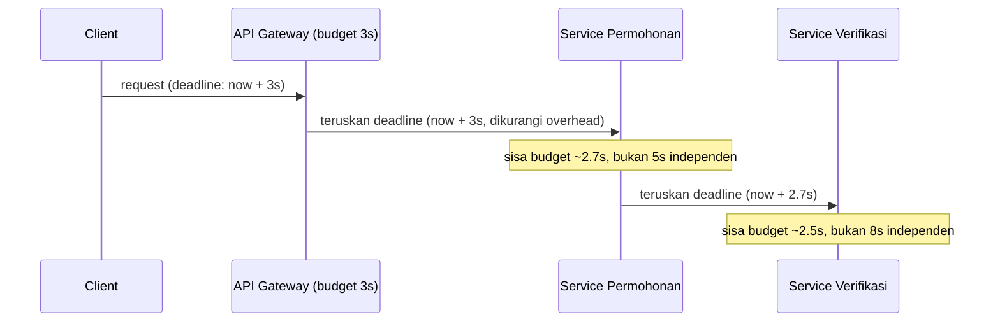

## TL;DR

**Timeout budget** adalah alokasi waktu total yang dimiliki sebuah request untuk menyelesaikan seluruh rantai pemanggilan di baliknya, dibagi secara sadar ke setiap lapisan yang dilewatinya — bukan setiap service di rantai itu masing-masing memakai timeout tetap yang ditentukan sendiri-sendiri tanpa memperhitungkan yang lain. Tanpa budget yang dipikirkan sebagai satu kesatuan, timeout di setiap lapisan bisa saling bertentangan: service A menunggu maksimal 5 detik untuk service B, tapi service B sendiri menunggu maksimal 10 detik untuk service C — service A akan menyerah dan mengembalikan error ke pemanggilnya jauh sebelum B punya kesempatan menyelesaikan pekerjaannya, membuang seluruh usaha yang sudah dikeluarkan B dan C secara sia-sia.

## The Problem

Sistem legal-services punya rantai pemanggilan: API gateway menerima request dari client dengan timeout 3 detik, memanggil service permohonan dengan timeout 5 detik, yang kemudian memanggil service verifikasi dokumen dengan timeout 8 detik. Angka-angka ini ditentukan oleh tim berbeda secara independen, masing-masing berdasarkan "perkiraan wajar" untuk layanan mereka sendiri, tanpa koordinasi eksplisit satu sama lain.

Konsekuensinya baru terlihat di produksi: API gateway menyerah dan mengembalikan error `504 Gateway Timeout` ke client setelah 3 detik, sementara service permohonan yang dipanggilnya masih menunggu jawaban dari service verifikasi selama 2 detik lagi, dan service verifikasi sendiri masih punya sisa 6 detik dari budgetnya. Ketiga service itu terus bekerja dan menghabiskan resource (koneksi database, memori, CPU) untuk sebuah request yang **sudah dianggap gagal** oleh client jauh sebelum pekerjaan itu selesai — pekerjaan yang hasilnya, begitu akhirnya selesai, dibuang begitu saja karena tidak ada lagi yang menunggu jawabannya.

## Intuition

Cara paling mudah memahaminya: bayangkan estafet lari empat pelari dengan total waktu yang dijanjikan ke penonton adalah 40 detik. Kalau setiap pelari menetapkan target waktunya sendiri tanpa koordinasi — pelari pertama menargetkan 15 detik, pelari kedua 15 detik, pelari ketiga 15 detik, pelari keempat 15 detik — total waktu yang sebenarnya dibutuhkan adalah 60 detik, jauh melebihi janji ke penonton, dan penonton sudah pergi (timeout) sebelum estafet selesai. Timeout budget berarti keempat pelari sepakat lebih dulu: dari 40 detik total, pelari pertama dapat jatah 8 detik, pelari kedua 10 detik, dan seterusnya — setiap pelari tahu persis berapa sisa waktu yang boleh ia pakai, dan estafet secara keseluruhan tetap selesai dalam waktu yang dijanjikan.

Analogi ini berhenti bekerja pada satu titik: pelari estafet tahu jatah waktunya sejak start, sementara timeout budget di sistem terdistribusi sungguhan harus **mengalir** dari satu service ke service berikutnya secara dinamis — setiap service perlu tahu berapa sisa waktu yang **sebenarnya tersisa** dari budget total, bukan angka tetap yang ditentukan di awal tanpa memperhitungkan waktu yang sudah terpakai di lapisan sebelumnya.

## How It Works



Diagram ini menunjukkan prinsip inti: **deadline mengalir sebagai satu nilai absolut** (titik waktu tertentu, bukan durasi tetap) dari lapisan pertama ke lapisan berikutnya, dan setiap lapisan menghitung sisa waktu yang benar-benar tersisa dari deadline itu, bukan menetapkan durasi barunya sendiri dari nol. Ini persis apa yang dilakukan `context.WithDeadline` di Go, dibanding `context.WithTimeout` yang dipanggil ulang secara independen di setiap lapisan tanpa memperhitungkan deadline dari lapisan sebelumnya.

Prinsip kedua yang sama pentingnya: **timeout di lapisan luar harus selalu lebih pendek dari total timeout lapisan-lapisan di dalamnya**, bukan lebih panjang atau sama. Kalau API gateway punya budget 3 detik, service permohonan yang dipanggilnya tidak boleh diberi budget 5 detik — itu berarti gateway bisa menyerah sebelum service permohonan sempat mencoba menyelesaikan pekerjaannya dalam batas waktu yang **diketahuinya sendiri** masih berlaku.

## In Go

```go
package main

import (
	"context"
	"fmt"
	"net/http"
	"time"
)

func handlePermohonan(w http.ResponseWriter, r *http.Request) {
	// context dari http.Server SUDAH membawa deadline milik client,
	// kalau server dikonfigurasi dengan ReadTimeout/WriteTimeout yang
	// sesuai. Di sini kita perketat lagi sesuai budget internal kita.
	ctx, cancel := context.WithTimeout(r.Context(), 3*time.Second)
	defer cancel()

	if err := prosesPermohonan(ctx, r); err != nil {
		http.Error(w, "gagal memproses permohonan", http.StatusGatewayTimeout)
		return
	}
	fmt.Fprintln(w, "permohonan diterima")
}

func prosesPermohonan(ctx context.Context, r *http.Request) error {
	// TIDAK membuat context.WithTimeout baru dari nol di sini —
	// ctx yang diteruskan SUDAH membawa deadline dari handler di
	// atas, dikurangi waktu yang sudah terpakai sejauh ini.
	if err := panggilServiceVerifikasi(ctx); err != nil {
		return fmt.Errorf("verifikasi gagal: %w", err)
	}
	return nil
}

func panggilServiceVerifikasi(ctx context.Context) error {
	// Deadline yang sama terus mengalir turun — kalau sisa waktu
	// di ctx sudah habis, panggilan HTTP ini akan langsung gagal
	// dengan context.DeadlineExceeded, tanpa perlu timeout baru.
	req, err := http.NewRequestWithContext(ctx, http.MethodPost, "http://service-verifikasi/verify", nil)
	if err != nil {
		return fmt.Errorf("gagal membuat request: %w", err)
	}

	resp, err := http.DefaultClient.Do(req)
	if err != nil {
		return fmt.Errorf("panggilan ke service verifikasi gagal: %w", err)
	}
	defer resp.Body.Close()
	return nil
}
```

Kunci di contoh ini: `ctx` yang sama, dengan deadline yang sama, diteruskan turun dari `handlePermohonan` sampai `panggilServiceVerifikasi` — tidak ada lapisan yang membuat `context.WithTimeout` baru dari nol yang mengabaikan berapa banyak waktu sudah terpakai di lapisan sebelumnya. Inilah penerapan langsung dari [[Context for Cancellation and Deadlines]] untuk kasus spesifik timeout budget.

## In His Stack

Untuk sistem dengan banyak service Go yang saling memanggil — persis situasi arsitektur microservices di ekosistem Kubernetes — timeout budget harus menjadi keputusan desain yang didokumentasikan secara eksplisit, bukan diserahkan ke masing-masing tim menentukan sendiri tanpa koordinasi. Praktik yang membantu: mendokumentasikan **anggaran waktu maksimum** untuk setiap rantai pemanggilan kritis (misalnya di ADR atau dokumentasi API governance, lihat [[API Governance]]) dan meninjau ulang setiap kali service baru ditambahkan ke rantai itu. Untuk integrasi dengan partner eksternal yang latency-nya di luar kendali kamu (dibahas di [[Handling an Unreliable Counterparty]]), budget yang dialokasikan untuk panggilan ke partner itu harus mempertimbangkan bahwa mereka mungkin lebih lambat dari layanan internal, dan sisa budget untuk lapisan lain harus disesuaikan.

## Trade-offs and When Not To Use It

Timeout budget yang ketat berarti sebagian request akan gagal lebih cepat (dan lebih sering) dibanding kalau setiap lapisan diberi kebebasan menunggu selama mungkin — trade-off yang tepat untuk sistem yang mementingkan kepastian batas waktu ke client di atas segalanya. Untuk proses batch atau asinkron yang tidak punya client yang menunggu secara langsung (misalnya job yang berjalan di latar belakang lewat Kafka consumer), konsep timeout budget yang ketat kurang relevan — di situ yang lebih penting adalah timeout per operasi individual (mencegah satu panggilan macet selamanya) daripada anggaran waktu total ujung ke ujung yang harus dipenuhi untuk seorang client yang menunggu.

## Common Mistakes

> [!warning] Jebakan
> Menentukan timeout di setiap service secara independen berdasarkan "perkiraan wajar" masing-masing, tanpa memeriksa apakah total timeout dari lapisan-lapisan di dalam lebih besar dari timeout lapisan di luar — pola yang persis menyebabkan skenario di atas, di mana pekerjaan diselesaikan setelah pemanggilnya sudah menyerah.

> [!warning] Jebakan
> Membuat `context.WithTimeout` baru dari nol di setiap lapisan pemanggilan, alih-alih meneruskan `ctx` yang sudah membawa deadline dari lapisan sebelumnya — ini secara efektif memberi setiap lapisan budget waktu penuh yang baru, mengabaikan waktu yang sudah terpakai di lapisan sebelumnya.

> [!warning] Jebakan
> Tidak menyisakan margin antara timeout lapisan luar dan total timeout lapisan-lapisan di dalamnya — bahkan kalau totalnya "pas" secara matematis, tidak ada ruang untuk overhead jaringan dan serialisasi yang selalu ada di setiap panggilan nyata, membuat timeout lapisan luar tetap sering terpicu lebih cepat dari yang diharapkan.

## Exercises

1. Jelaskan kenapa memberi setiap lapisan timeout independen tanpa koordinasi bisa menyebabkan pekerjaan diselesaikan setelah client sudah menerima error timeout.
2. Bandingkan `context.WithTimeout` yang dipanggil ulang di setiap lapisan dengan meneruskan `ctx` yang sudah membawa deadline dari lapisan sebelumnya — jelaskan konsekuensi masing-masing terhadap timeout budget.
3. Sebuah rantai pemanggilan punya budget total 5 detik dan melewati tiga service. Rancang pembagian budget yang masuk akal untuk masing-masing service, dengan mempertimbangkan bahwa layanan eksternal di lapisan terakhir cenderung lebih lambat dan tidak terprediksi.
4. **(Open-ended)** Timmu menemukan bahwa rantai pemanggilan permohonan-verifikasi-OCR di sistem legal-services sering gagal dengan timeout di gateway, padahal service di lapisan dalam sering kali sebenarnya berhasil menyelesaikan pekerjaannya tak lama setelah gateway menyerah. Rancang perbaikan konkret, termasuk bagaimana kamu memastikan seluruh tim yang memiliki masing-masing service sepakat dengan pembagian budget yang baru.

> [!success]- Kunci jawaban
> Untuk soal 4: langkah pertama adalah mengukur latency aktual setiap lapisan (lewat distributed tracing, atau logging manual sementara kalau tracing belum tersedia) untuk memahami di mana waktu sungguhan terpakai, bukan menebak dari perkiraan. Setelah data itu ada, tetapkan satu budget total yang realistis berdasarkan p95 latency gabungan seluruh rantai, lalu bagikan ke setiap lapisan dengan margin yang cukup — dan pastikan `ctx` dengan deadline yang sama diteruskan turun di seluruh rantai (bukan timeout independen). Untuk kesepakatan antar tim, tuliskan pembagian budget ini sebagai dokumen yang disepakati bersama (bisa berupa ADR ringkas) yang menyatakan secara eksplisit: "gateway 3 detik, service permohonan meneruskan deadline yang sama dikurangi overhead, service verifikasi wajib menyelesaikan atau menyerah dalam sisa waktu yang diberikan" — sehingga perubahan di satu service (menambah lapisan baru, memperlambat pemrosesan) memicu diskusi ulang eksplisit tentang budget, bukan penyesuaian diam-diam yang merusak keseimbangan yang sudah disepakati.

## Self-Check

- Kenapa timeout di lapisan luar harus selalu lebih pendek dari total timeout lapisan-lapisan di dalamnya?
- Apa perbedaan meneruskan `ctx` yang sudah membawa deadline dibanding membuat `context.WithTimeout` baru di setiap lapisan?
- Kapan konsep timeout budget yang ketat kurang relevan diterapkan?

## Connected Notes

- [[Context for Cancellation and Deadlines]] — mekanisme dasar Go (`context.Context`, `WithDeadline`) yang mewujudkan timeout budget secara konkret di kode.
- [[Timeouts in HTTP Servers]] — prasyarat langsung: pengaturan timeout di level server HTTP yang menjadi titik awal budget mengalir ke lapisan-lapisan berikutnya.
- [[Retries with Exponential Backoff and Jitter]] — retry yang tidak memperhitungkan sisa timeout budget bisa memperburuk masalah yang dibahas di note ini, bukan memperbaikinya.
- [[Handling an Unreliable Counterparty]] — alokasi budget untuk partner eksternal yang lambat harus mempertimbangkan bahwa latency mereka di luar kendali langsung sistem.

## Further Reading

- Tidak ada tambahan di luar dokumentasi paket `context` Go yang sudah dirujuk di note-note sebelumnya.

## Catatan Saya

*Tulis pertanyaanmu sendiri, contoh kode dari pekerjaanmu, atau bagian yang belum jelas di sini.*
