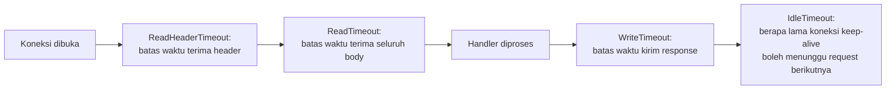

## TL;DR

`http.Server` di Go punya beberapa field timeout terpisah — `ReadHeaderTimeout`, `ReadTimeout`, `WriteTimeout`, `IdleTimeout` — masing-masing menjaga fase berbeda dari siklus hidup sebuah koneksi. **Nilai default semuanya adalah nol, yang berarti tidak ada batas waktu sama sekali.** Memakai jalan pintas `http.ListenAndServe(addr, handler)` tanpa pernah membangun `*http.Server` eksplisit berarti server-mu **tidak punya timeout apa pun** — satu client yang lambat (sengaja atau tidak) bisa menahan koneksi selamanya, menghabiskan resource server sedikit demi sedikit sampai kehabisan.

## The Problem

Bayangkan sebuah tim men-deploy service Go dengan `http.ListenAndServe(":8080", handler)` — pola paling umum di tutorial dan contoh kode, tapi tanpa pernah membangun `*http.Server` dengan timeout eksplisit. Di kondisi normal, semua request selesai cepat dan tidak ada yang menyadari masalah ini. Tapi begitu ada client yang mengirim data sangat lambat (baik karena koneksi jaringan yang buruk, atau — lebih berbahaya — sengaja dirancang untuk menahan koneksi selama mungkin), koneksi itu **tidak pernah di-timeout** oleh server.

Satu koneksi lambat saja mungkin tidak terasa. Tapi begitu banyak koneksi seperti ini menumpuk bersamaan — baik dari client yang genuinely lambat maupun serangan yang sengaja memanfaatkan celah ini — server perlahan kehabisan file descriptor (lihat [[../10 Foundations/Syscalls and File Descriptors|Syscalls and File Descriptors]]) dan goroutine yang menunggu tanpa batas, sampai akhirnya tidak bisa menerima koneksi baru sama sekali. Ini murni celah konfigurasi infrastruktur — tidak ada bug di logika bisnis mana pun, hanya satu baris kode yang tidak pernah ditulis.

## Intuition

Bayangkan keempat timeout ini seperti **jam yang berbeda-beda di sebuah persidangan pengadilan** — satu jam membatasi berapa lama pembelaan boleh menyampaikan pernyataan pembuka (`ReadHeaderTimeout` — batas waktu menerima header request), jam lain membatasi total waktu untuk seluruh kesaksian (`ReadTimeout` — seluruh body request), jam lain lagi membatasi berapa lama hakim boleh membacakan putusan (`WriteTimeout` — menulis response), dan jam terpisah untuk berapa lama ruang sidang tetap "dipesan" saat kosong sebelum dialihkan ke sidang lain (`IdleTimeout` — koneksi keep-alive yang idle).

Analogi "jam-jam terpisah yang rapi" ini bocor pada satu hal: jam di pengadilan biasanya dikoordinasikan satu jadwal besar dengan panitera yang bisa mengambil keputusan situasional. Field timeout `http.Server` Go punya interaksi yang terdokumentasi tapi kadang tidak intuitif satu sama lain (misalnya cakupan pasti `WriteTimeout` relatif terhadap `ReadTimeout` di beberapa skenario) — detail interaksi ini sebaiknya selalu diverifikasi lewat dokumentasi resmi versi Go yang dipakai, bukan diasumsikan sepenuhnya independen seperti jam-jam terpisah dalam analogi ini.

## How It Works



> [!question] Perlu diverifikasi
> Klaim: cakupan dan interaksi persis antara `ReadTimeout` dan `WriteTimeout` (apakah salah satunya mencakup total siklus, atau keduanya benar-benar independen per fase) bisa berbeda nuansa antar versi Go dan butuh pembacaan dokumentasi cermat.
> Kenapa ragu: dokumentasi resmi Go sendiri mencatat nuansa ini dengan hati-hati, dan kesalahpahaman umum soal cakupan timeout ini pernah jadi sumber diskusi komunitas.
> Cara verifikasi: baca dokumentasi resmi `net/http.Server` (pkg.go.dev/net/http) untuk versi Go yang dipakai, khususnya deskripsi lengkap `ReadTimeout` dan `WriteTimeout`.

## In Go

```go
// SALAH (atau lebih tepatnya: berbahaya untuk production) — tidak ada
// timeout sama sekali, koneksi lambat bisa bertahan selamanya.
func jalankanServerBerbahaya(handler http.Handler) error {
    return http.ListenAndServe(":8080", handler)
}

// BENAR — setiap fase siklus hidup koneksi punya batas waktu eksplisit.
func jalankanServerAman(handler http.Handler) error {
    srv := &http.Server{
        Addr:              ":8080",
        Handler:           handler,
        ReadHeaderTimeout: 5 * time.Second,  // cegah slow-header attack
        ReadTimeout:       15 * time.Second, // batas waktu terima seluruh body
        WriteTimeout:      15 * time.Second, // batas waktu kirim response
        IdleTimeout:       60 * time.Second, // batas koneksi keep-alive idle
    }
    return srv.ListenAndServe()
}
```

Nilai-nilai di atas bukan angka universal yang benar untuk semua kasus — mereka harus disesuaikan dengan pola trafik nyata: layanan yang menerima upload besar dari koneksi lambat (lihat [[Upload and Download Patterns]]) butuh `ReadTimeout` yang jauh lebih longgar dibanding endpoint JSON kecil biasa.

## In His Stack

**Nginx** yang biasa berada di depan service Go (lihat [[Load Balancing and Reverse Proxies]]) punya set konfigurasi timeout-nya sendiri (`proxy_read_timeout`, `proxy_send_timeout`, dan sejenisnya) — mengikuti disiplin yang sama seperti [[Request Size Limits Along The Path|batas ukuran di sepanjang jalur]]: timeout di setiap lapisan (Nginx, server Go, dan kalau relevan, database di baliknya) harus diperiksa dan diselaraskan secara eksplisit, bukan dibiarkan berbeda-beda secara tidak sengaja antar lapisan.

## Trade-offs and When Not To Use It

Timeout yang terlalu ketat memotong client yang lambat tapi sah (misalnya upload besar dari kantor cabang dengan koneksi buruk, lihat [[Upload and Download Patterns]]) sebelum sempat selesai — nilai timeout harus disesuaikan dengan pola client nyata, bukan disalin mentah dari tutorial generik. Tidak menyetel timeout sama sekali, di sisi lain, **tidak pernah** merupakan pilihan yang tepat untuk service apa pun yang menghadap jaringan yang tidak sepenuhnya tepercaya — ini bukan fitur opsional, hanya nilai spesifiknya yang perlu penilaian sengaja.

## Common Mistakes

> [!warning] Jebakan
> Memakai `http.ListenAndServe` polos di production tanpa pernah membangun `*http.Server` dengan timeout eksplisit, membiarkan service rentan terhadap client lambat yang menahan koneksi tanpa batas.

> [!warning] Jebakan
> Hanya menyetel satu timeout (misalnya `ReadTimeout` saja) dan membiarkan yang lain di nilai default nol, lupa bahwa masing-masing menjaga fase yang benar-benar berbeda — celah di satu fase tetap membuka vektor resource exhaustion.

> [!warning] Jebakan
> Menyetel nilai timeout yang terlalu ketat tanpa mempertimbangkan skenario client lambat tapi sah (koneksi buruk, upload besar), memotong request valid sebelum sempat selesai.

## Exercises

1. Apa risiko memakai `http.ListenAndServe` tanpa membangun `*http.Server` dengan timeout eksplisit?
2. Sebutkan fase siklus hidup koneksi yang dijaga masing-masing oleh `ReadHeaderTimeout`, `ReadTimeout`, `WriteTimeout`, dan `IdleTimeout`.
3. Kenapa nilai timeout yang tepat berbeda-beda tergantung jenis endpoint (misalnya endpoint upload besar vs endpoint JSON kecil)?
4. Desain terbuka: sebuah service Go menerima dua jenis trafik yang sangat berbeda — endpoint JSON kecil yang harus merespons cepat, dan endpoint upload dokumen besar dari kantor cabang dengan koneksi lambat. Rancang strategi konfigurasi timeout yang mengakomodasi keduanya tanpa mengorbankan proteksi salah satunya.

> [!success]- Kunci jawaban
> Karena `http.Server` hanya punya satu set timeout global per instance server, satu strategi yang umum adalah menjalankan dua listener/server terpisah dengan konfigurasi timeout berbeda — satu untuk endpoint JSON kecil dengan `ReadTimeout`/`WriteTimeout` ketat (mendeteksi masalah cepat), satu lagi khusus untuk endpoint upload dengan timeout yang jauh lebih longgar. Alternatif lain: pakai timeout global yang cukup longgar untuk mengakomodasi upload (fase terlama), tapi terapkan batas yang lebih ketat secara spesifik di level handler untuk endpoint JSON kecil lewat `context.WithTimeout` (lihat [[Context Propagation in HTTP Servers]]) yang membatalkan pemrosesan lebih awal meski koneksi TCP-nya sendiri masih dalam batas server yang longgar.

## Self-Check

- Apa nilai default timeout di `http.Server` kalau tidak diset, dan apa konsekuensinya?
- Sebutkan keempat field timeout utama dan fase yang masing-masing dijaga.
- Kenapa nilai timeout harus disesuaikan dengan pola client nyata, bukan disalin dari tutorial?
- Apa risiko hanya menyetel sebagian timeout dan membiarkan yang lain di default?

## Connected Notes

- [[Context Propagation in HTTP Servers]] — prasyarat: context dengan deadline adalah mekanisme pelengkap timeout di level server ini untuk kontrol yang lebih granular.
- [[../10 Foundations/TCP Handshake and Connection Lifecycle|TCP Handshake and Connection Lifecycle]] — koneksi TCP yang menjadi dasar teknis timeout ini bekerja.
- [[Graceful Shutdown]] — kelanjutan langsung: bagaimana server berhenti dengan aman, berkaitan erat dengan timeout yang sudah dikonfigurasi.
- [[Load Balancing and Reverse Proxies]] — timeout di lapisan Nginx/load balancer yang harus diselaraskan dengan timeout server Go.
- [[Timeout Budgets]] — pembahasan lebih luas soal timeout lintas beberapa panggilan berantai, bukan hanya satu server.

## Further Reading

- Dokumentasi resmi package `net/http`, struct `Server` (pkg.go.dev/net/http) — deskripsi lengkap dan akurat setiap field timeout.

## Catatan Saya

*Tulis di sini apakah service Go-mu sudah memakai `http.Server` eksplisit dengan timeout, atau masih memakai `http.ListenAndServe` polos.*
