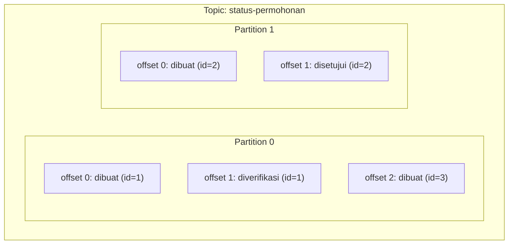

## TL;DR

Sebuah **topic** di sistem log seperti Kafka bukan satu log tunggal — ia dibagi menjadi beberapa **partition**, dan urutan pesan hanya dijamin **di dalam satu partition**, tidak lintas partition. Setiap pesan di dalam sebuah partition punya **offset**: angka urut yang menunjukkan posisinya, mirip nomor halaman di buku tamu dari analogi note sebelumnya. Pembagian ke banyak partition inilah yang memungkinkan satu topic diproses paralel oleh banyak consumer sekaligus — tapi paralelisme itu punya harga: begitu urutan pemrosesan lintas partition tidak lagi terjamin, desain sistem harus secara sadar memilih pesan mana yang boleh tersebar bebas ke partition mana pun, dan mana yang harus selalu jatuh ke partition yang sama untuk menjaga urutannya.

## The Problem

Sebuah sistem legal-services memakai Kafka untuk mengalirkan event perubahan status permohonan — dibuat, diverifikasi, disetujui, ditolak. Awalnya topic ini hanya punya satu partition, dan semuanya berjalan sesuai urutan yang diharapkan. Ketika volume permohonan naik drastis menjelang tenggat waktu layanan tahunan, satu consumer tunggal tidak sanggup mengimbangi laju pesan masuk, dan antrean yang belum diproses terus menumpuk.

Tim menambah jumlah partition topic itu untuk memungkinkan beberapa consumer memproses secara paralel — solusi yang tepat untuk masalah throughput. Tapi setelah perubahan itu, muncul bug aneh: status sebuah permohonan kadang terlihat "ditolak" sebelum "diverifikasi" di dashboard, urutan yang secara logis mustahil. Penyebabnya: event untuk permohonan yang sama tersebar ke partition berbeda secara acak (karena tidak ada **key** yang dipakai producer saat mengirim), dan partition-partition itu diproses oleh consumer berbeda dengan kecepatan berbeda pula — urutan antar partition tidak pernah dijamin, hanya urutan di dalam satu partition yang dijamin.

## Intuition

Padanan terdekatnya di luar dunia software: bayangkan satu topic sebagai gedung dengan beberapa lorong arsip paralel, masing-masing punya rak buku tamu sendiri yang tersusun urut dari halaman pertama sampai terbaru. Kalau semua catatan tentang **orang yang sama** selalu ditaruh di lorong yang sama, siapa pun yang membaca lorong itu akan melihat riwayat orang itu berurutan dengan benar. Tapi kalau petugas menaruh catatan secara acak ke lorong mana pun yang sedang kosong, riwayat satu orang bisa tersebar ke lorong berbeda-beda, dan tidak ada cara membaca "urutan sungguhan" tanpa menggabungkan semua lorong dan mengurutkannya ulang secara manual.

Analogi ini berhenti bekerja pada satu titik: lorong arsip fisik jumlahnya tetap setelah gedung dibangun, sementara jumlah partition Kafka **bisa ditambah** di kemudian hari (meski tidak bisa dikurangi) — tapi menambah partition mengubah cara pesan baru didistribusikan, sementara pesan lama tetap di partition asalnya, sebuah detail yang dibahas di bagian trade-off.

## How It Works



Diagram ini menunjukkan bahwa satu topic terdiri dari beberapa partition independen, masing-masing dengan urutan offset-nya sendiri dimulai dari nol. Semua event untuk permohonan `id=1` berada di Partition 0 secara berurutan, sementara `id=2` berada di Partition 1. Ini bukan kebetulan — producer menentukan partition tujuan berdasarkan **key** pesan (biasanya di-hash), dan Kafka menjamin pesan dengan key yang sama selalu jatuh ke partition yang sama, selama jumlah partition tidak berubah.

Producer yang mengirim event dengan `id` permohonan sebagai key akan selalu mengirim seluruh riwayat satu permohonan ke partition yang sama, menjaga urutannya. Producer yang mengirim tanpa key (atau dengan key acak) membiarkan Kafka mendistribusikan pesan ke partition mana pun — cocok untuk throughput maksimal, tapi hanya aman kalau urutan antar pesan itu memang tidak penting.

**Offset** sendiri adalah angka yang murni menandai posisi di dalam satu partition, dinaikkan satu setiap pesan baru ditulis. Consumer menyimpan offset terakhir yang berhasil diproses (dibahas lebih detail di [[Consumer Groups and Rebalancing]]), sehingga ia tahu dari mana melanjutkan kalau restart.

## Under The Hood

Setiap partition secara fisik adalah **file log yang append-only** di disk broker Kafka — pesan baru selalu ditambahkan di akhir file, tidak pernah disisipkan di tengah atau diubah setelah ditulis, kemiripan struktural dengan write-ahead log yang dibahas di [[MVCC]] untuk alasan yang mirip: menulis secara sekuensial ke disk jauh lebih cepat daripada menulis acak, karena disk (bahkan SSD) punya karakteristik performa yang lebih baik untuk pola akses sekuensial.

Jumlah partition sebuah topic menentukan **batas atas paralelisme** consumer: kalau sebuah topic punya empat partition, maksimal empat consumer di dalam satu consumer group bisa memproses topic itu secara paralel pada satu waktu — consumer kelima di grup yang sama akan menganggur karena tidak ada partition tersisa untuk dijatahkan kepadanya. Menambah partition di kemudian hari memungkinkan lebih banyak paralelisme, tapi tidak retroaktif mengubah distribusi pesan lama yang sudah tertulis di partition sebelumnya.

## In Go

```go
package main

import (
	"context"
	"fmt"

	"github.com/segmentio/kafka-go"
)

func kirimEventPermohonan(ctx context.Context, writer *kafka.Writer, permohonanID string, event string) error {
	pesan := kafka.Message{
		// Key yang sama (permohonanID) akan selalu di-hash ke
		// partition yang sama, menjaga urutan event per permohonan.
		Key:   []byte(permohonanID),
		Value: []byte(event),
	}

	if err := writer.WriteMessages(ctx, pesan); err != nil {
		return fmt.Errorf("gagal mengirim event permohonan %s: %w", permohonanID, err)
	}
	return nil
}
```

Tanpa `Key` yang eksplisit di atas, `kafka-go` (dan client Kafka pada umumnya) akan mendistribusikan pesan secara round-robin atau berbasis hash acak ke seluruh partition — tepat untuk throughput, salah untuk kasus yang butuh urutan per entitas seperti event permohonan di atas.

## In His Stack

Menentukan key partition yang tepat adalah keputusan desain yang harus dibuat sejak awal mengintegrasikan Kafka ke sebuah alur kerja — untuk sistem legal-services dengan banyak entitas (permohonan, dokumen, petugas), key yang masuk akal biasanya adalah ID entitas utama yang riwayatnya harus berurutan, seperti `permohonan_id`. Kesalahan umum saat memindahkan sistem dari RabbitMQ (yang tidak punya konsep partition) ke Kafka adalah menganggap satu topic Kafka setara satu antrean RabbitMQ dan mengabaikan keputusan key sama sekali — bekerja baik saat volume rendah dengan satu partition, lalu pecah begitu partition ditambah untuk menaikkan throughput, persis skenario di bagian Masalah di atas.

## Trade-offs and When Not To Use It

Menambah partition adalah cara utama menaikkan throughput sebuah topic, tapi trade-off-nya nyata: lebih banyak partition berarti lebih banyak file yang harus dikelola broker, lebih banyak overhead koordinasi saat consumer group melakukan rebalancing (dibahas di note berikutnya), dan pada topic dengan sangat banyak partition, latency end-to-end bisa justru naik karena overhead ini. Jumlah partition juga **tidak bisa dikurangi** setelah dibuat di Kafka — hanya bisa ditambah — sehingga menentukan jumlah awal yang terlalu besar "untuk jaga-jaga" bukan keputusan yang bisa dibatalkan dengan mudah; lebih aman mulai dengan jumlah yang wajar berdasarkan estimasi throughput dan menambah kalau benar-benar terbukti perlu.

## Common Mistakes

> [!warning] Jebakan
> Mengirim pesan tanpa key untuk event yang urutannya penting (seperti riwayat status satu entitas), lalu terkejut ketika urutan itu tidak terjamin begitu topic punya lebih dari satu partition.

> [!warning] Jebakan
> Menganggap menambah partition di tengah jalan otomatis mendistribusikan ulang pesan lama secara merata — pesan yang sudah tertulis tetap di partition asalnya; hanya pesan baru yang mengikuti skema distribusi yang diperbarui (dan bahkan itu pun, key yang sama tetap konsisten ke partition yang sama selama fungsi hashing dan jumlah partition tidak berubah lagi setelahnya).

> [!warning] Jebakan
> Menyamakan jumlah partition dengan jumlah consumer tanpa mempertimbangkan pertumbuhan — kalau topic dibuat dengan jumlah partition yang persis sama dengan jumlah consumer saat ini, menambah consumer baru di masa depan tidak akan menaikkan paralelisme sama sekali karena partition sudah habis dijatahkan.

## Exercises

1. Jelaskan kenapa Kafka hanya menjamin urutan pesan di dalam satu partition, bukan di seluruh topic.
2. Sebuah topic punya tiga partition dan producer mengirim event dengan `permohonan_id` sebagai key. Jelaskan kenapa seluruh riwayat satu permohonan tertentu akan selalu berurutan, meski permohonan lain bisa diproses di partition berbeda secara paralel.
3. Kenapa jumlah partition tidak bisa dikurangi setelah topic dibuat, dan apa implikasinya terhadap keputusan menentukan jumlah partition awal?
4. **(Open-ended)** Sebuah topic `status-permohonan` awalnya dibuat dengan satu partition dan tanpa key eksplisit (semua pesan otomatis masuk partition tunggal itu, urut secara alami). Sistem tumbuh dan butuh empat partition untuk menangani throughput. Rancang langkah migrasi yang aman: bagaimana menambah partition dan memastikan urutan event per permohonan tetap terjaga setelah migrasi, termasuk penanganan pesan lama yang sudah ada di partition tunggal sebelumnya.

> [!success]- Kunci jawaban
> Untuk soal 4: langkah pertama adalah menetapkan `permohonan_id` sebagai key sebelum menambah partition apa pun — dengan satu partition, key belum berpengaruh (semua pesan tetap masuk partition yang sama), tapi ini memastikan begitu partition ditambah, distribusi baru langsung konsisten per entitas. Setelah key ditetapkan di kode producer dan di-deploy, baru tambah jumlah partition topic menjadi empat. Pesan lama yang sudah ada di partition tunggal tidak perlu (dan tidak bisa) dipindahkan — mereka tetap valid di posisi asalnya, dan consumer yang membaca dari awal akan tetap membaca partition lama itu secara berurutan sebelum sampai ke pesan-pesan baru yang sudah tersebar ke empat partition.

## Self-Check

- Apa perbedaan cakupan jaminan urutan antara "di dalam satu partition" dan "di seluruh topic"?
- Bagaimana Kafka menentukan partition tujuan sebuah pesan ketika producer menyertakan key?
- Kenapa jumlah partition topic membatasi jumlah maksimum consumer paralel dalam satu consumer group?

## Connected Notes

- [[Queue vs Log Semantics]] — prasyarat langsung: note ini menjelaskan struktur konkret di balik model log yang dibahas secara umum di sana.
- [[Consumer Groups and Rebalancing]] — kelanjutan langsung: bagaimana partition dibagi di antara consumer dalam satu consumer group.
- [[MVCC]] — struktur append-only log yang mendasari partition Kafka punya kemiripan alasan desain dengan write-ahead log yang dibahas di note itu.
- [[Ordering Guarantees in Streaming Systems]] — pembahasan lebih dalam tentang jaminan urutan yang dibangun di atas konsep partition ini.

## Further Reading

- Dokumentasi resmi Apache Kafka, bagian "Topics and Logs": kafka.apache.org

## Catatan Saya

*Tulis pertanyaanmu sendiri, contoh kode dari pekerjaanmu, atau bagian yang belum jelas di sini.*
