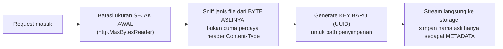

## TL;DR

Upload dan download file yang benar di production butuh lebih dari sekadar "baca body, tulis ke disk": streaming (bukan buffering penuh), batas ukuran yang ditegakkan **sebelum** seluruh file selesai dibaca, validasi jenis file yang tidak sekadar percaya header dari client, **penamaan file di server yang tidak pernah dipercaya langsung dari input client** (mencegah path traversal dan tabrakan nama file), dan untuk download, dukungan `Range` request supaya unduhan besar bisa dilanjutkan, bukan diulang dari nol, saat koneksi terputus.

## The Problem

Bayangkan sebuah endpoint upload menyimpan file langsung memakai nama yang dikirim client — `os.Create(header.Filename)` — tanpa validasi apa pun. Ini punya dua bahaya sekaligus. Pertama, dua user yang kebetulan mengunggah file bernama `dokumen.pdf` di waktu yang berbeda akan **saling menimpa** file satu sama lain, karena nama file dipakai langsung sebagai path penyimpanan tanpa mempertimbangkan tabrakan. Kedua, dan jauh lebih berbahaya: nama file yang dikirim client sepenuhnya bisa dikendalikan pengirim — nama file seperti `../../../../etc/passwd` atau path serupa yang sengaja dibuat jahat bisa membuat server menulis (atau membaca) file di lokasi yang sama sekali tidak dimaksudkan, sebuah kerentanan **path traversal**.

Masalah kedua muncul di sisi download: sebuah endpoint mengunduh dokumen scan besar (puluhan megabyte) ke kantor cabang dengan koneksi internet yang tidak selalu stabil. Tanpa dukungan `Range` request, setiap kali koneksi terputus di tengah unduhan, petugas harus mengulang unduhan **dari nol** — untuk file besar lewat koneksi yang sering putus, ini bisa membuat file itu nyaris mustahil diunduh sama sekali.

## Intuition

Bayangkan alur upload/download yang baik seperti **fasilitas penyortiran surat profesional dengan beberapa titik pemeriksaan** — memeriksa ukuran paket, memindai isinya, dan **memberi label baru sendiri** (nomor pelacakan internal) alih-alih mempercayai label yang ditulis pengirim — dibanding kotak drop-box naif yang menerima apa pun yang dimasukkan dan meneruskannya mentah-mentah dengan label apa pun yang tertulis di luarnya. Disiplin pemeriksaan ini ada justru karena **tidak boleh ada yang dipercaya begitu saja** dari sisi pengirim.

Analogi "fasilitas penyortiran" ini pas untuk sisi upload, tapi bocor untuk sisi download: kekhawatiran di sisi download bukan "jangan percaya pengirim", tapi justru terbalik — **jangan berasumsi jaringan akan tetap hidup sampai selesai**. Inilah kenapa dukungan `Range` request penting: bukan soal keamanan seperti sisi upload, tapi soal ketahanan terhadap koneksi yang bisa putus kapan saja, sebuah kekhawatiran yang berbeda arah sepenuhnya dari sisi upload.

## How It Works

**Checklist upload yang aman:**



**Checklist download yang tahan koneksi tidak stabil:** stream dari storage ke response, set `Content-Disposition` dan `Content-Type` yang benar, dan dukung header `Range` supaya client bisa meminta "lanjutkan dari byte sekian" alih-alih mengunduh ulang dari awal.

## In Go

Upload yang aman — key penyimpanan dihasilkan server, bukan dari nama file client:

```go
func uploadHandlerAman(w http.ResponseWriter, r *http.Request) {
    const maxUkuran = 20 << 20 // 20 MB
    r.Body = http.MaxBytesReader(w, r.Body, maxUkuran)

    if err := r.ParseMultipartForm(maxUkuran); err != nil {
        http.Error(w, "file terlalu besar atau form tidak valid", http.StatusBadRequest)
        return
    }

    file, header, err := r.FormFile("file")
    if err != nil {
        http.Error(w, "file tidak ditemukan", http.StatusBadRequest)
        return
    }
    defer file.Close()

    // Sniff jenis file dari BYTE ASLINYA, jangan hanya percaya header.Header.Get("Content-Type")
    buf := make([]byte, 512)
    n, _ := file.Read(buf)
    jenisTerdeteksi := http.DetectContentType(buf[:n])
    if !jenisDiizinkan(jenisTerdeteksi) {
        http.Error(w, "jenis file tidak diizinkan", http.StatusUnsupportedMediaType)
        return
    }
    file.Seek(0, io.SeekStart) // kembali ke awal setelah sniffing

    // Key penyimpanan dihasilkan SERVER, TIDAK PERNAH dari header.Filename langsung.
    key := uuid.New().String() + filepath.Ext(header.Filename)
    dst, err := os.Create(filepath.Join("/data/dokumen", key))
    if err != nil {
        http.Error(w, "gagal menyimpan", http.StatusInternalServerError)
        return
    }
    defer dst.Close()

    if _, err := io.Copy(dst, file); err != nil {
        http.Error(w, "gagal menyalin file", http.StatusInternalServerError)
        return
    }

    // Nama asli disimpan sebagai METADATA untuk ditampilkan, bukan sebagai path.
    simpanMetadata(r.Context(), key, header.Filename)
    respondJSON(w, http.StatusCreated, map[string]string{"key": key})
}
```

Download dengan dukungan `Range` — `http.ServeContent` menangani ini otomatis kalau diberi `io.ReadSeeker`:

```go
func downloadHandler(w http.ResponseWriter, r *http.Request) {
    key := r.PathValue("key")
    f, err := os.Open(filepath.Join("/data/dokumen", key))
    if err != nil {
        http.Error(w, "file tidak ditemukan", http.StatusNotFound)
        return
    }
    defer f.Close()

    namaAsli := ambilNamaAsliDariMetadata(r.Context(), key)
    w.Header().Set("Content-Disposition", fmt.Sprintf("attachment; filename=%q", namaAsli))

    fi, _ := f.Stat()
    // http.ServeContent MENANGANI header Range secara otomatis,
    // memungkinkan client melanjutkan unduhan yang terputus.
    http.ServeContent(w, r, namaAsli, fi.ModTime(), f)
}
```

`http.ServeContent` secara otomatis merespons header `Range` dari client dengan `206 Partial Content` dan hanya mengirim byte yang diminta — client yang koneksinya terputus di tengah unduhan bisa meminta ulang hanya sisa byte yang belum diterima, bukan mengulang dari awal.

## In His Stack

Untuk kantor cabang instansi dengan koneksi internet yang tidak selalu stabil mengunduh dokumen scan besar, dukungan `Range` di atas bukan fitur "bagus untuk dimiliki" — ia adalah perbedaan antara unduhan yang **bisa** diselesaikan dan yang **tidak pernah** bisa diselesaikan sama sekali di koneksi yang sering putus. Di sisi upload, kebiasaan lama Yii2 yang kadang langsung memakai `UploadedFile::getBaseName()` atau nama asli sebagai nama file penyimpanan (tanpa sanitasi eksplisit) adalah kebiasaan yang perlu sengaja dihindari saat membangun ulang alur upload di service Go — jangan mewarisi kebiasaan itu begitu saja.

## Trade-offs and When Not To Use It

Menghasilkan key penyimpanan sendiri di server (bukan memakai nama file client apa adanya) mengorbankan sedikit kenyamanan (path penyimpanan tidak lagi bisa dibaca manusia langsung dari nama aslinya), tapi manfaat keamanan (tidak ada path traversal) dan korektnes (tidak ada tabrakan nama) jauh lebih besar daripada kenyamanan itu. Mendukung `Range` request menambah sedikit kompleksitas implementasi (atau cukup didelegasikan ke `http.ServeContent`/dukungan native object storage) — untuk file kecil yang jarang gagal diunduh, ini mungkin terasa berlebihan, tapi untuk file besar mana pun yang diunduh lewat jaringan yang tidak sepenuhnya andal, ini bukan lagi soal "lebih sederhana tanpanya" — itu hanya menunda masalah keandalan nyata ke production.

## Common Mistakes

> [!warning] Jebakan
> Memakai nama file yang dikirim client langsung sebagai path penyimpanan tanpa sanitasi, membuka risiko path traversal dan tabrakan nama file antar user yang berbeda.

> [!warning] Jebakan
> Mempercayai header `Content-Type` dari client apa adanya untuk validasi keamanan, tanpa memeriksa byte asli file lewat sniffing (`http.DetectContentType` atau setara) — header ini sepenuhnya bisa dipalsukan client.

> [!warning] Jebakan
> Tidak mendukung `Range` request untuk unduhan file besar, memaksa pengguna dengan koneksi tidak stabil mengulang unduhan dari nol setiap kali koneksi terputus.

## Exercises

1. Kenapa nama file dari client tidak boleh dipercaya langsung sebagai path penyimpanan di server?
2. Apa perbedaan memvalidasi jenis file lewat header `Content-Type` dan lewat sniffing byte asli file?
3. Apa fungsi header `Range`, dan siapa (client atau server) yang menginisiasinya?
4. Desain terbuka: sebuah sistem menerima upload dokumen scan dari lebih dari 100 kantor cabang instansi dengan kualitas koneksi internet yang sangat bervariasi, dan tim menerima banyak keluhan "upload selalu gagal di tengah, harus ulang dari awal". Rancang perbaikan menyeluruh untuk upload besar yang tahan terhadap koneksi tidak stabil, sejalan dengan pola download yang sudah dijelaskan di note ini.

> [!success]- Kunci jawaban
> Untuk upload (bukan hanya download) yang tahan koneksi tidak stabil, pertimbangkan **resumable upload** — protokol yang memecah upload jadi beberapa chunk bernomor, masing-masing dikonfirmasi server secara terpisah, sehingga kalau koneksi putus di tengah, client hanya perlu mengirim ulang chunk yang belum terkonfirmasi, bukan seluruh file dari awal (banyak object storage cloud mendukung protokol upload multipart/resumable bawaan yang bisa dimanfaatkan langsung alih-alih membangun sendiri dari nol). Ini prinsip yang sama dengan `Range` request di sisi download di note ini, hanya diterapkan terbalik — memecah transfer besar jadi unit-unit kecil yang masing-masing bisa dikonfirmasi dan dilanjutkan secara independen, alih-alih memperlakukan seluruh transfer sebagai satu unit besar yang gagal total kalau terputus di titik mana pun.

## Self-Check

- Kenapa nama file client tidak boleh dipakai langsung sebagai path penyimpanan?
- Apa perbedaan mempercayai header Content-Type dan sniffing byte asli file?
- Bagaimana `http.ServeContent` mendukung `Range` request secara otomatis?
- Kenapa resumable upload/download penting untuk konteks koneksi yang tidak stabil?

## Connected Notes

- [[Streaming vs Buffering]] — prasyarat: pola streaming yang menjadi dasar upload/download yang aman dari segi memori.
- [[Content Types and multipart-form-data]] — mekanisme upload multipart yang jadi dasar teknis note ini.
- [[Pre-signed URLs]] — alternatif memindahkan seluruh beban transfer file besar keluar dari server aplikasi.
- [[Request Size Limits Along The Path]] — batas ukuran yang harus tetap ditegakkan bersamaan dengan pola di note ini.
- [[../80 Security/The OWASP Top 10|The OWASP Top 10]] — path traversal dan validasi input tidak tepercaya adalah kelas kerentanan yang dibahas lebih luas di sana.

## Further Reading

- Dokumentasi resmi package `net/http`, function `ServeContent` (pkg.go.dev/net/http) — detail penanganan `Range` request bawaan Go.

## Catatan Saya

*Tulis di sini pengalaman upload/download besar di kerjaanmu yang bermasalah karena koneksi tidak stabil, dan apakah ada dukungan resume saat ini.*
