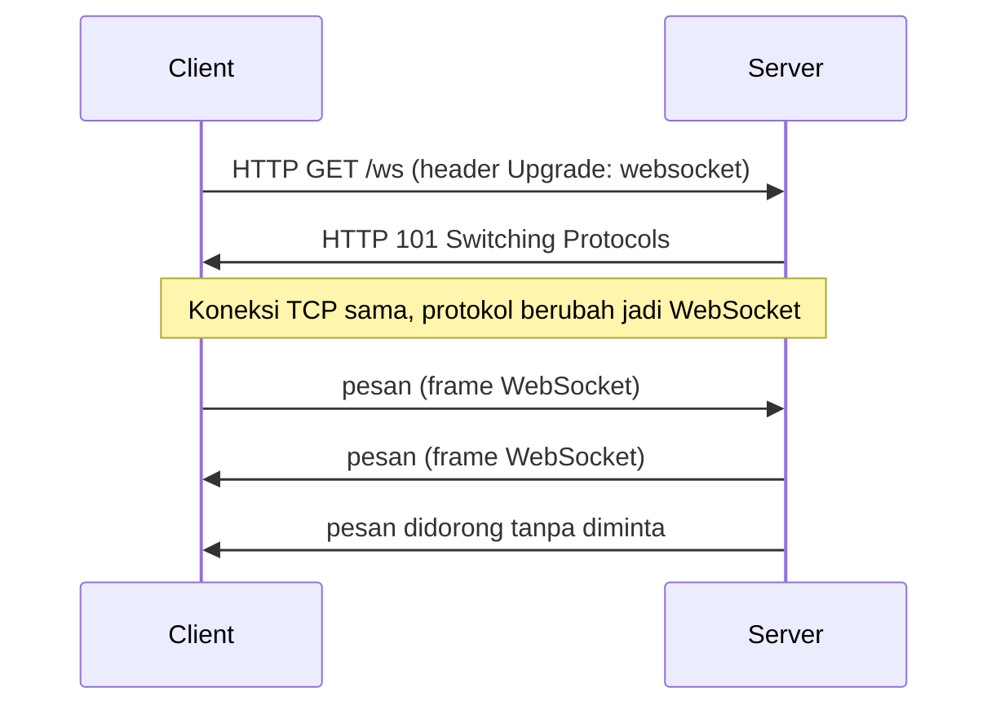

## TL;DR

**WebSocket** adalah protokol yang membuka satu koneksi TCP tunggal dan menjaganya tetap hidup untuk komunikasi dua arah antara client dan server, dimulai lewat satu HTTP handshake lalu "upgrade" ke protokol WebSocket murni. Setelah koneksi terbuka, kedua pihak bisa mengirim pesan kapan saja tanpa harus membungkusnya dalam request/response HTTP baru — cocok untuk kasus yang butuh latency rendah dan komunikasi dua arah sungguhan, seperti notifikasi real-time atau chat. Harganya: koneksi yang tetap terbuka berarti server harus menyimpan state per koneksi (jauh lebih mahal dari HTTP yang stateless per request), load balancing jadi lebih rumit karena koneksi harus tetap lengket ke satu server yang sama, dan sebagian besar infrastruktur (proxy, firewall, API gateway lama) tidak dirancang untuk koneksi yang bertahan lama.

## The Problem

Dashboard petugas legal-services perlu menampilkan notifikasi begitu ada permohonan baru yang masuk, tanpa petugas harus me-refresh halaman. Solusi pertama tim adalah polling: browser memanggil endpoint `/notifikasi/terbaru` setiap tiga detik. Dengan seratus petugas online bersamaan, ini menghasilkan lebih dari dua ribu request per menit ke server, sebagian besar besar mengembalikan "tidak ada yang baru" — beban server yang hampir seluruhnya sia-sia, persis masalah yang dibahas di [[Polling vs Push]].

Menurunkan interval polling justru memperburuk keadaan; menaikkannya membuat notifikasi terasa lambat. Yang sebenarnya dibutuhkan bukan polling yang lebih pintar, tapi mekanisme di mana server bisa **mendorong** pesan ke client kapan saja terjadi sesuatu, tanpa menunggu client bertanya lebih dulu — dan idealnya, client juga bisa mengirim balik tanpa membuka koneksi baru setiap kali (misalnya menandai notifikasi sudah dibaca).

## Intuition

Cara paling mudah memahaminya: HTTP biasa seperti mengirim surat — setiap kali kamu ingin bicara, kamu menulis surat baru, mengirimkannya, dan menunggu balasan surat baru. WebSocket seperti menelepon: sekali sambungan tersambung, kedua pihak bisa bicara bolak-balik kapan saja tanpa menutup dan membuka telepon lagi untuk setiap kalimat.

Analogi ini berhenti bekerja pada satu titik: telepon biasa hanya menyambungkan dua orang secara langsung, sedangkan WebSocket di server produksi biasanya menyambungkan ribuan "penelepon" sekaligus ke satu server, dan server itu harus mengingat siapa saja yang sedang tersambung serta apa yang perlu dikirim ke masing-masing — beban mengingat inilah yang tidak ada padanannya di telepon biasa.

## How It Works



Diagram ini menunjukkan bahwa WebSocket **bukan** protokol yang terpisah dari HTTP di titik awal — ia dimulai sebagai request HTTP biasa yang meminta upgrade protokol lewat header `Upgrade: websocket` dan `Connection: Upgrade`. Setelah server menyetujui lewat status `101 Switching Protocols`, koneksi TCP yang sama dipakai ulang untuk frame WebSocket, bukan HTTP lagi. Inilah yang membuat WebSocket bisa lewat infrastruktur yang sudah memahami HTTP (port 80/443) tanpa protokol jaringan baru, meski setelah upgrade, isi yang lewat koneksi itu bukan HTTP lagi.

Setelah handshake, kedua pihak bertukar **frame** — unit pesan WebSocket yang bisa berupa teks, biner, atau kontrol (ping/pong untuk menjaga koneksi tetap hidup, close untuk menutup dengan rapi). Tidak ada konsep request/response berpasangan lagi; server bisa mengirim beberapa pesan berturut-turut tanpa client meminta apa pun di antaranya.

## In Go

```go
package main

import (
	"fmt"
	"log"
	"net/http"

	"github.com/gorilla/websocket"
)

var upgrader = websocket.Upgrader{
	ReadBufferSize:  1024,
	WriteBufferSize: 1024,
	// Produksi wajib memvalidasi origin, bukan menerima semua asal
	// permintaan — default gorilla/websocket menolak cross-origin
	// kecuali CheckOrigin diberikan eksplisit.
	CheckOrigin: func(r *http.Request) bool {
		return r.Header.Get("Origin") == "https://dashboard.legalservice.go.id"
	},
}

func handleNotifikasi(w http.ResponseWriter, r *http.Request) {
	conn, err := upgrader.Upgrade(w, r, nil)
	if err != nil {
		log.Printf("gagal upgrade ke websocket: %v", err)
		return
	}
	defer conn.Close()

	// Setiap koneksi WebSocket biasanya ditangani goroutine sendiri
	// yang berjalan selama koneksi itu hidup — bukan selesai setelah
	// satu request seperti handler HTTP biasa.
	for {
		_, pesan, err := conn.ReadMessage()
		if err != nil {
			// Client menutup koneksi, atau jaringan terputus.
			log.Printf("koneksi ditutup: %v", err)
			return
		}
		log.Printf("pesan diterima: %s", pesan)
	}
}

// kirimNotifikasi dipanggil dari bagian lain aplikasi (misalnya
// handler yang memproses permohonan baru) untuk mendorong pesan
// ke koneksi WebSocket yang relevan.
func kirimNotifikasi(conn *websocket.Conn, isi string) error {
	if err := conn.WriteMessage(websocket.TextMessage, []byte(isi)); err != nil {
		return fmt.Errorf("gagal mengirim notifikasi: %w", err)
	}
	return nil
}
```

Pola produksi yang umum: satu goroutine per koneksi untuk membaca pesan masuk (`ReadMessage` di dalam loop), dan sebuah **hub** terpusat yang menyimpan peta koneksi aktif (misalnya per petugas atau per ruangan chat) sehingga event dari bagian lain aplikasi bisa didorong ke koneksi yang tepat tanpa setiap goroutine saling mengenal satu sama lain secara langsung.

## In His Stack

Kubernetes membuat WebSocket lebih rumit dari yang terlihat: load balancer default sering membagi request secara round-robin per request HTTP, cocok untuk REST yang stateless, tapi salah untuk WebSocket yang butuh **koneksi yang sama** bertahan ke **pod yang sama** selama sesi itu hidup (session affinity / sticky session). Ingress controller harus dikonfigurasi eksplisit untuk mendukung upgrade WebSocket dan sticky session, dan probe kesehatan (readiness/liveness) yang mematikan pod di tengah banyak koneksi WebSocket aktif bisa memutus semuanya sekaligus — pertimbangan yang tidak muncul sama sekali untuk service REST biasa.

Yii2 punya dukungan WebSocket lewat library pihak ketiga (biasanya berjalan sebagai proses terpisah dari PHP-FPM, karena model PHP tradisional per-request tidak cocok untuk koneksi yang bertahan lama), sehingga fitur real-time semacam ini di ekosistem PHP sering ditangani service Go terpisah yang memang dirancang untuk menyimpan banyak koneksi hidup sekaligus — persis kekuatan goroutine yang dibahas di [[Goroutines]].

## Trade-offs and When Not To Use It

WebSocket unggul untuk kasus yang benar-benar butuh dua arah dan latency rendah: chat, notifikasi real-time, kolaborasi live, game. Ia berlebihan untuk kasus yang sebenarnya hanya butuh **satu arah** (server ke client) — [[Server-Sent Events]] lebih sederhana untuk itu, dengan infrastruktur yang lebih ramah HTTP biasa. WebSocket juga bukan pilihan baik ketika klien berada di balik jaringan korporat atau pemerintah yang firewall-nya memblokir upgrade protokol non-standar, kasus yang plausibel di lingkungan instansi pemerintah dengan kebijakan jaringan ketat — di situasi ini, long polling (dibahas di note berikutnya) kadang jadi fallback yang lebih realistis meski kurang efisien.

## Common Mistakes

> [!warning] Jebakan
> Tidak memvalidasi `Origin` header saat upgrade, sehingga situs mana pun bisa membuka koneksi WebSocket ke server — celah yang setara dengan tidak adanya proteksi CSRF untuk endpoint WebSocket.

> [!warning] Jebakan
> Lupa menangani ping/pong untuk menjaga koneksi tetap hidup lewat load balancer atau proxy yang memutus koneksi idle setelah beberapa waktu tanpa data — koneksi WebSocket yang terlihat "terbuka" di sisi aplikasi tapi sebenarnya sudah mati di tengah jalan tanpa terdeteksi.

> [!warning] Jebakan
> Menyimpan state penting (misalnya sesi transaksi) hanya di memori koneksi WebSocket tanpa persistensi terpisah — begitu pod di Kubernetes di-restart atau koneksi terputus karena jaringan, seluruh state itu hilang tanpa jejak.

## Exercises

1. Jelaskan kenapa WebSocket dimulai sebagai request HTTP biasa, bukan protokol terpisah sejak awal.
2. Sebuah load balancer round-robin membagi request WebSocket secara acak ke beberapa pod backend. Jelaskan apa yang salah dengan setup ini dan bagaimana memperbaikinya.
3. Rancang struktur data Go sederhana (`hub`) yang menyimpan peta petugas ID ke koneksi WebSocket aktifnya, dan jelaskan bagaimana `kirimNotifikasi` memakainya untuk mengirim pesan ke petugas tertentu.
4. **(Open-ended)** Dashboard petugas butuh notifikasi real-time, dan sebagian petugas mengakses dari jaringan kantor pemerintah yang firewall-nya kadang memblokir upgrade WebSocket. Rancang strategi fallback yang membuat fitur notifikasi tetap berfungsi (meski kurang optimal) untuk petugas di jaringan yang membatasi itu, tanpa menulis dua implementasi backend yang sepenuhnya terpisah.

> [!success]- Kunci jawaban
> Untuk soal 4: server bisa mendukung dua jalur sekaligus dari satu sumber event yang sama — begitu ada notifikasi baru, dorong ke koneksi WebSocket yang tersambung, dan simpan juga di penyimpanan sementara (misalnya Redis list per petugas) yang bisa diambil lewat endpoint polling biasa untuk client yang gagal melakukan upgrade WebSocket. Client di sisi frontend mencoba WebSocket lebih dulu, dan jatuh ke long polling otomatis kalau upgrade gagal atau terputus berulang kali — pola yang dipakai library seperti Socket.IO secara built-in, meski di sini dirancang manual dari sumber event yang sama supaya logika bisnis tidak diduplikasi.

## Self-Check

- Kenapa WebSocket dimulai lewat handshake HTTP, bukan protokol TCP mentah sejak awal?
- Apa masalah utama load balancing untuk koneksi WebSocket dibanding request HTTP biasa?
- Kapan WebSocket adalah pilihan berlebihan dibanding Server-Sent Events atau long polling?

## Connected Notes

- [[Polling vs Push]] — WebSocket adalah salah satu bentuk push sungguhan yang jadi alternatif polling yang dibahas di note itu.
- [[TCP Handshake and Connection Lifecycle]] — WebSocket berjalan di atas satu koneksi TCP yang sama sepanjang sesi, memakai konsep connection lifecycle yang sama.
- [[Server-Sent Events]] — alternatif yang lebih sederhana ketika komunikasi hanya perlu satu arah dari server ke client.
- [[Goroutines]] — pola satu goroutine per koneksi WebSocket adalah salah satu kasus pakai goroutine paling umum di server Go.
- [[Graceful Shutdown]] — server yang menangani banyak koneksi WebSocket aktif perlu strategi shutdown yang menutup koneksi itu dengan rapi, bukan memutusnya paksa.

## Further Reading

- RFC 6455 — The WebSocket Protocol
- Dokumentasi `gorilla/websocket`: github.com/gorilla/websocket

## Catatan Saya

*Tulis pertanyaanmu sendiri, contoh kode dari pekerjaanmu, atau bagian yang belum jelas di sini.*
