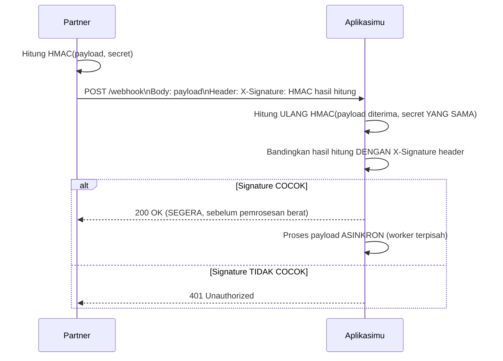

## TL;DR

Webhook membalik arah komunikasi biasa — alih-alih kamu memanggil API partner untuk mendapat data terbaru, **partner** memanggil endpoint yang kamu sediakan setiap kali ada kejadian yang relevan (permohonan disetujui, pembayaran berhasil). Ini menghilangkan kebutuhan polling berulang (lihat [[Polling vs Push]]), tapi membuka masalah keamanan yang unik: endpoint webhook-mu **harus** bisa diakses publik (partner mana pun bisa mengirim request ke sana), yang berarti kamu butuh cara membuktikan bahwa request yang masuk **benar-benar** dari partner yang sah, bukan dari siapa pun yang kebetulan menemukan URL endpoint-mu dan mengirim data palsu.

## The Problem

Sebuah endpoint webhook menerima notifikasi "pembayaran berhasil" dari partner pembayaran, dan langsung memproses permohonan sebagai lunas tanpa verifikasi apa pun soal siapa pengirim request itu — endpoint ini secara struktural harus publik (tidak di belakang autentikasi pengguna biasa, karena partner yang memanggilnya, bukan pengguna), tapi tanpa verifikasi identitas pengirim, **siapa pun** yang menemukan URL endpoint ini (lewat pemindaian otomatis, atau kebocoran informasi) bisa mengirim payload palsu "pembayaran berhasil" untuk permohonan mana pun, menyebabkan sistem memproses sesuatu sebagai lunas padahal tidak pernah benar-benar dibayar.

Masalah kedua: sebuah webhook memproses payload yang diterima secara langsung dalam request handler yang sama, tanpa memberi respons cepat ke partner — kalau pemrosesan itu lambat (memanggil beberapa layanan internal lain), partner yang mengirim webhook bisa timeout menunggu respons dan menganggap pengiriman **gagal**, lalu mengirim ulang webhook yang **sama** berkali-kali (retry otomatis dari sisi partner) — dan kalau pemrosesan tidak idempotent (lihat [[Idempotency]]), setiap pengiriman ulang itu memproses efek yang sama berkali-kali, seperti mencatat pembayaran yang sama beberapa kali.

## Intuition

Bayangkan webhook seperti **kotak surat di depan rumah yang bisa diisi siapa saja yang lewat** — berbeda dari menerima tamu di pintu depan (di mana kamu bisa melihat langsung dan memverifikasi siapa yang datang), kotak surat menerima apa pun yang dimasukkan tanpa kamu tahu langsung siapa pengirimnya. Untuk memastikan surat yang masuk benar-benar dari pengirim resmi (bukan surat kaleng dari siapa saja), kamu butuh mekanisme verifikasi tambahan — seperti materai resmi atau cap khusus yang hanya bisa dibuat pengirim sah, yang kamu periksa **setelah** surat itu masuk kotak, bukan mengandalkan asumsi bahwa "kotak surat di depan rumahku pasti hanya diisi pengirim resmi".

Analogi ini bocor pada satu hal: materai fisik sulit dipalsukan karena butuh alat khusus. Verifikasi webhook memakai **signature kriptografis** (HMAC) yang dihitung dari isi payload dan sebuah secret yang hanya diketahui kamu dan partner — jauh lebih kuat dibanding materai fisik, tapi juga berarti keamanannya sepenuhnya bergantung pada **kerahasiaan secret** itu; kalau secret bocor, signature bisa dipalsukan sepenuhnya oleh siapa pun yang mengetahuinya, mirip materai resmi yang dicuri dan dipakai orang yang tidak berhak.

## How It Works



Diagram ini menunjukkan dua pertahanan inti: **verifikasi signature** (memastikan payload benar-benar dari partner yang mengetahui secret bersama, dan belum diubah di tengah jalan) dan **respons cepat sebelum pemrosesan berat** (mencegah partner timeout dan mengirim ulang webhook yang sama karena mengira pengiriman gagal).

## Under The Hood

**HMAC (Hash-based Message Authentication Code)** menghasilkan signature yang **tergantung pada isi payload** — mengubah satu karakter saja di payload akan menghasilkan signature yang sama sekali berbeda, sehingga signature yang cocok membuktikan dua hal sekaligus: payload **belum diubah** sejak ditandatangani (integritas), dan penandatangan **benar-benar mengetahui secret bersama** (autentikasi) — kombinasi yang jauh lebih kuat dibanding sekadar mengirim secret mentah di header (yang bisa dicegat dan dipakai ulang oleh siapa pun yang berhasil menyadapnya, meski tetap harus dikirim lewat HTTPS untuk mencegah penyadapan itu sendiri).

**HMAC saja tidak mencegah replay.** Signature membuktikan payload asli dan belum diubah — ia tidak membuktikan payload itu **baru**. Siapa pun yang berhasil merekam satu request sah (misalnya dari log proxy, atau dari sisi jaringan partner sendiri) bisa mengirimkannya ulang berkali-kali, dan verifikasi akan selalu lolos karena signature-nya memang asli.

Pertahanan standarnya: masukkan **timestamp** ke dalam data yang ditandatangani, bukan hanya payload-nya. Partner mengirim `X-Timestamp` bersama `X-Signature`, dan signature dihitung dari `timestamp + "." + payload`. Penerima menolak request yang timestamp-nya di luar jendela toleransi (biasanya beberapa menit — cukup longgar untuk menoleransi selisih jam antar server, cukup ketat untuk mempersempit jendela replay). Ini pola yang dipakai penyedia webhook besar, dan ia hanya bekerja kalau timestamp ikut ditandatangani — kalau timestamp dikirim di luar signature, penyerang tinggal menggantinya.

**Idempotency key** pada payload webhook (biasanya berupa ID unik kejadian yang dikirim partner) memungkinkan penerima **mendeteksi** pengiriman ulang dan menghindari memproses efek yang sama dua kali — menyimpan daftar ID kejadian yang sudah diproses (dengan TTL yang wajar) dan memeriksa apakah ID yang masuk sudah pernah diproses sebelum menjalankan efek samping apa pun.

## In Go

```go
package webhook

import (
	"context"
	"crypto/hmac"
	"crypto/sha256"
	"encoding/hex"
	"io"
	"log/slog"
	"net/http"
	"strconv"
	"time"
)

var secretBersama = []byte("secret-yang-disepakati-dengan-partner")

const toleransiWaktu = 5 * time.Minute

// VerifikasiSignature menghitung ULANG HMAC dari timestamp+payload yang
// diterima dan membandingkannya dengan signature yang dikirim partner.
// Timestamp ikut ditandatangani dan diperiksa terhadap jendela toleransi —
// ini yang mencegah replay dari request sah yang direkam ulang, bukan
// hanya membuktikan payload berasal dari partner yang tahu secret.
func VerifikasiSignature(payload []byte, timestampHeader, signatureDiterima string) bool {
	waktuKirim, err := strconv.ParseInt(timestampHeader, 10, 64)
	if err != nil {
		return false
	}
	if usia := time.Since(time.Unix(waktuKirim, 0)); usia < 0 || usia > toleransiWaktu {
		return false // di luar jendela toleransi -> tolak, kemungkinan replay
	}

	mac := hmac.New(sha256.New, secretBersama)
	mac.Write([]byte(timestampHeader + "."))
	mac.Write(payload)
	signatureDihitung := hex.EncodeToString(mac.Sum(nil))

	// hmac.Equal (BUKAN ==) mencegah timing attack, sama seperti
	// perbandingan hash password.
	return hmac.Equal([]byte(signatureDihitung), []byte(signatureDiterima))
}

// PenyimpanKejadian melacak ID kejadian yang sudah diproses, supaya webhook
// yang dikirim ulang partner (baik karena timeout maupun karena partner
// retry demi keandalan) tidak diproses dua kali.
type PenyimpanKejadian interface {
	SudahDiproses(ctx context.Context, idKejadian string) (bool, error)
	TandaiDiproses(ctx context.Context, idKejadian string) error
}

func TanganiWebhook(antrean chan<- []byte, kejadian PenyimpanKejadian) http.HandlerFunc {
	return func(w http.ResponseWriter, r *http.Request) {
		payload, err := io.ReadAll(r.Body)
		if err != nil {
			http.Error(w, "gagal baca body", http.StatusBadRequest)
			return
		}

		timestamp := r.Header.Get("X-Timestamp")
		signature := r.Header.Get("X-Signature")
		if !VerifikasiSignature(payload, timestamp, signature) {
			http.Error(w, "signature tidak valid", http.StatusUnauthorized)
			return
		}

		idKejadian := r.Header.Get("X-Event-ID")
		sudah, err := kejadian.SudahDiproses(r.Context(), idKejadian)
		if err != nil {
			http.Error(w, "kesalahan internal", http.StatusInternalServerError)
			return
		}
		if sudah {
			// Kejadian ini sudah pernah diproses — balas 200 tanpa
			// memproses ulang, supaya partner berhenti retry.
			w.WriteHeader(http.StatusOK)
			return
		}
		if err := kejadian.TandaiDiproses(r.Context(), idKejadian); err != nil {
			http.Error(w, "kesalahan internal", http.StatusInternalServerError)
			return
		}

		// RESPONS SEGERA setelah verifikasi — TIDAK menunggu pemrosesan
		// berat selesai, mencegah partner timeout dan retry berulang.
		select {
		case antrean <- payload:
			w.WriteHeader(http.StatusOK)
		default:
			// Antrean penuh: JANGAN balas 200. Balas 503 supaya partner
			// mengirim ulang nanti — kehilangan notifikasi jauh lebih mahal
			// daripada satu retry tambahan dari sisi partner.
			slog.WarnContext(r.Context(), "antrean webhook penuh, meminta partner retry",
				"event_id", idKejadian)
			w.Header().Set("Retry-After", "30")
			http.Error(w, "sedang sibuk, coba lagi", http.StatusServiceUnavailable)
		}
	}
}
```

Perhatikan bahwa jawaban yang benar di sini adalah **menolak dengan jujur**, bukan menerima lalu membuang. `503` memberi tahu partner untuk mengirim ulang; `200` yang palsu menghancurkan satu-satunya jaring pengaman yang tersedia. Kalau antrean in-memory sering penuh, itu sinyal bahwa antrean seharusnya durabel (database atau message broker) — bukan alasan untuk menaikkan ukuran channel.

## In His Stack

Untuk sistem legal-services yang menerima notifikasi status dari sistem instansi lain (misalnya status verifikasi dokumen dari instansi terkait), webhook yang tidak diverifikasi signature-nya adalah celah keamanan serius — siapa pun yang menemukan endpoint itu bisa memalsukan notifikasi "dokumen terverifikasi" untuk permohonan siapa pun, berpotensi memengaruhi keputusan hukum berdasarkan data palsu. Menyepakati mekanisme signature (dan secret bersama yang dikelola sesuai prinsip di [[../80 Security/Secret Management|Secret Management]]) harus menjadi bagian eksplisit dari kontrak integrasi (lihat [[Contract Negotiation and Versioning]]) sejak awal, bukan ditambahkan belakangan setelah insiden.

## Trade-offs and When Not To Use It

Webhook membutuhkan endpoint yang bisa diakses publik dari internet, yang menambah permukaan serangan (attack surface) dibanding API yang hanya dipanggil keluar (kamu yang memanggil partner, bukan sebaliknya) — untuk partner yang tidak mendukung mekanisme signature yang memadai, atau untuk kasus di mana membuka endpoint publik dianggap risiko yang tidak bisa diterima (jaringan internal yang benar-benar terisolasi), polling (lihat [[Polling vs Push]]) tetap menjadi alternatif yang lebih aman meski kurang efisien. Webhook juga menambah kompleksitas operasional — kamu harus memastikan endpoint itu selalu tersedia (downtime berarti kehilangan notifikasi, kecuali partner punya mekanisme retry yang andal), berbeda dari polling yang sepenuhnya dikendalikan oleh sisimu sendiri.

## Common Mistakes

> [!warning] Jebakan
> Memproses payload webhook tanpa verifikasi signature sama sekali — siapa pun yang menemukan URL endpoint bisa mengirim payload palsu yang diproses seolah-olah berasal dari partner resmi.

> [!warning] Jebakan
> Memproses payload webhook secara sinkron dalam request handler tanpa merespons cepat — partner bisa timeout dan mengirim ulang webhook yang sama, menyebabkan pemrosesan ganda kalau tidak idempotent.

> [!warning] Jebakan
> Membandingkan signature dengan operator `==` biasa alih-alih `hmac.Equal` (constant-time comparison) — membuka celah timing attack yang sama seperti perbandingan hash password yang tidak aman.

## Exercises

1. Jelaskan bagaimana HMAC signature membuktikan payload webhook belum diubah DAN benar-benar berasal dari partner yang mengetahui secret.
2. Kenapa webhook handler sebaiknya merespons cepat sebelum pemrosesan berat selesai, bukan memproses semuanya secara sinkron?
3. Kenapa idempotency key pada payload webhook penting, mengingat partner bisa mengirim ulang webhook yang sama?
4. Desain terbuka: partner pembayaranmu mengirim webhook "pembayaran berhasil" tapi tidak mendukung mekanisme HMAC signature sama sekali (keterbatasan sistem lama mereka) — hanya mengirim payload polos lewat HTTPS. Rancang lapisan keamanan alternatif yang bisa kamu terapkan di sisi sendiri untuk mengurangi risiko payload palsu, mengingat kamu tidak bisa memaksa partner menambah signature.

> [!success]- Kunci jawaban
> **1.** HMAC dihitung dari kombinasi isi payload **dan** secret rahasia yang hanya diketahui pengirim (partner) dan penerima (kamu) — mengubah satu karakter saja di payload akan menghasilkan hasil HMAC yang sama sekali berbeda (membuktikan payload belum diubah di tengah jalan/integritas), dan hanya pihak yang benar-benar mengetahui secret yang bisa menghasilkan HMAC yang cocok untuk payload tertentu (membuktikan pengirim memang partner yang sah/autentikasi) — dua jaminan sekaligus dari satu mekanisme.
> **4.** Beberapa lapisan mitigasi yang bisa diterapkan sepihak: (1) **whitelist IP** — kalau partner punya rentang IP tetap yang diketahui, batasi endpoint webhook hanya menerima request dari rentang IP itu, mengurangi (meski tidak menghilangkan sepenuhnya) risiko payload dari sumber sembarangan; (2) **URL webhook yang tidak mudah ditebak** — alih-alih `/webhook/pembayaran`, gunakan path dengan token acak panjang (`/webhook/pembayaran/a8f3e9d2...`) sebagai lapisan "security through obscurity" tambahan (bukan pengganti verifikasi sungguhan, tapi mengurangi risiko ditemukan lewat pemindaian otomatis); (3) **verifikasi ulang lewat API terpisah** — setelah menerima webhook "pembayaran berhasil", panggil balik API partner (bukan mempercayai webhook itu sendiri) untuk mengonfirmasi status pembayaran sebenarnya sebelum benar-benar memproses efek finansial — langkah ekstra yang menambah latensi tapi memberi verifikasi independen yang tidak bergantung pada kepercayaan penuh terhadap payload webhook yang diterima.

## Self-Check

- Bagaimana HMAC signature membuktikan integritas dan autentisitas payload webhook sekaligus?
- Kenapa webhook handler sebaiknya merespons cepat sebelum pemrosesan berat?
- Kenapa idempotency key penting untuk payload webhook?
- Apa risiko utama endpoint webhook dibanding API yang hanya dipanggil keluar?

## Connected Notes

- [[../80 Security/CSRF|CSRF]] — konsep verifikasi keaslian request yang serupa filosofinya, meski mekanisme dan konteksnya berbeda (CSRF untuk browser, HMAC untuk server-to-server).
- [[Idempotency]] — prinsip idempotency yang dibahas di note junior itu adalah pertahanan kunci terhadap webhook yang dikirim ulang oleh partner.
- [[../80 Security/Secret Management|Secret Management]] — secret HMAC yang dibagikan dengan partner harus dikelola dengan disiplin yang sama seperti credential lainnya.
- [[Polling vs Push]] — alternatif webhook untuk kasus di mana endpoint publik dianggap risiko yang tidak bisa diterima, dibahas di note berikutnya.
- [[Contract Negotiation and Versioning]] — mekanisme keamanan webhook idealnya disepakati sebagai bagian eksplisit dari kontrak integrasi, dibahas di note sebelumnya.

## Further Reading

- Dokumentasi resmi penyedia webhook populer (Stripe, GitHub) mengenai verifikasi signature — meski bukan produk spesifik yang dipakai, pola implementasinya menjadi referensi standar industri yang banyak diadopsi.

## Catatan Saya

*Tulis di sini apakah endpoint webhook di kerjaanmu sudah memverifikasi signature — kalau belum, partner mana yang paling mendesak diperbaiki keamanannya.*
