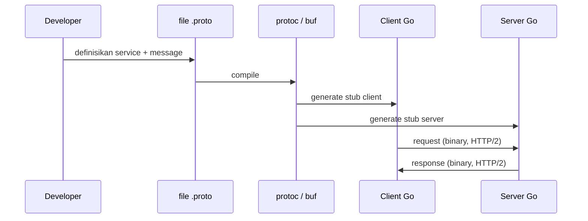

## TL;DR

**gRPC** adalah framework RPC (Remote Procedure Call) dari Google yang berjalan di atas HTTP/2 dan menggunakan **Protocol Buffers (protobuf)** sebagai format serialisasi biner dan bahasa definisi kontrak. Alih-alih menulis endpoint REST dan mendeskripsikannya lewat OpenAPI setelah fakta, kamu mendefinisikan service dan pesan lebih dulu dalam file `.proto`, lalu men-generate kode client dan server dari situ — kontrak menjadi sumber kebenaran, bukan dokumentasi yang menyusul. Hasilnya payload jauh lebih kecil dan lebih cepat di-parse dibanding JSON, plus dukungan native untuk streaming dua arah lewat HTTP/2. Harga yang dibayar: payload tidak bisa dibaca manusia langsung, tooling debugging butuh langkah ekstra, dan integrasi dengan partner yang hanya bicara JSON over HTTP/1.1 (kasus umum di sistem pemerintah lama) menjadi tidak mungkin tanpa gateway penerjemah.

## The Problem

Sebuah tim di internal platform legal-services membangun beberapa service Go yang saling memanggil dengan frekuensi tinggi — service verifikasi dokumen memanggil service OCR ribuan kali per menit, dan service OCR memanggil service ekstraksi metadata. Semua lewat REST + JSON. Saat traffic naik, CPU di setiap service didominasi bukan oleh logika bisnis, melainkan oleh **marshalling dan unmarshalling JSON**: mengubah struct Go ke teks, mengirim teks lewat jaringan, mem-parsing teks itu kembali jadi struct di sisi penerima. JSON adalah format teks — angka disimpan sebagai karakter ASCII, nama field diulang di setiap pesan, dan parser harus menebak tipe data dari sintaks.

Masalah kedua yang lebih halus: kontrak REST antar service-service internal itu didokumentasikan di OpenAPI yang ditulis manual, dan dokumentasi itu perlahan menyimpang dari implementasi sungguhan karena tidak ada mekanisme yang memaksa keduanya tetap sinkron. Seorang engineer baru menambahkan field ke response tanpa memperbarui spec, dan client lain yang mengandalkan spec itu untuk code generation mulai gagal parsing diam-diam.

Untuk komunikasi **antar service internal** — bukan API publik yang harus ramah ke browser dan partner eksternal — kedua masalah ini punya jawaban yang sama: pindah ke kontrak yang dipaksa oleh tooling, bukan disiplin manusia, dan format biner yang tidak perlu di-parse teks.

## Intuition

Cara paling mudah memahaminya: JSON over REST seperti mengirim surat dalam bahasa natural — fleksibel, siapa saja bisa membacanya tanpa kamus, tapi setiap kalimat panjang dan penerima harus membaca kata demi kata untuk mengerti strukturnya. Protobuf seperti mengirim formulir dengan kotak-kotak bernomor yang sudah disepakati sebelumnya oleh pengirim dan penerima — pengirim cukup menulis angka di kotak nomor 3, dan penerima yang punya salinan formulir yang sama tahu persis kotak nomor 3 itu artinya apa, tanpa perlu membaca label sama sekali. Itulah kenapa payload protobuf begitu kecil: nama field tidak pernah dikirim ulang, hanya nomor field dan nilainya.

Analogi ini berhenti bekerja pada satu titik: formulir kertas tidak berubah setelah dicetak, sementara kontrak protobuf memang dirancang untuk berubah seiring waktu (dibahas di [[Schema Evolution in Protobuf]]) — bedanya, perubahan itu harus lewat aturan kompatibilitas yang ketat, bukan editan bebas seperti field JSON yang bisa ditambah kapan saja tanpa koordinasi.

## How It Works



Diagram ini menunjukkan bahwa kode client dan server tidak ditulis tangan untuk bagian serialisasi — keduanya di-generate dari sumber yang sama, sehingga tidak mungkin drift antara apa yang dikirim client dan apa yang diharapkan server, selama keduanya men-generate ulang dari file `.proto` yang sama.

Sebuah file `.proto` mendefinisikan pesan dan service:

```protobuf
syntax = "proto3";

package legalservice.v1;

message VerifikasiDokumenRequest {
  string dokumen_id = 1;
  bytes konten = 2;
}

message VerifikasiDokumenResponse {
  bool valid = 1;
  string alasan_penolakan = 2;
}

service VerifikasiService {
  rpc VerifikasiDokumen(VerifikasiDokumenRequest) returns (VerifikasiDokumenResponse);
  rpc StreamVerifikasi(stream VerifikasiDokumenRequest) returns (stream VerifikasiDokumenResponse);
}
```

Angka di belakang setiap field (`= 1`, `= 2`) bukan nilai default — itu adalah **nomor field**, identitas permanen field itu di dalam pesan biner. Nomor ini yang dikirim lewat jaringan, bukan nama `dokumen_id`. Inilah yang membuat perubahan nomor field jadi hal paling berbahaya dalam evolusi schema protobuf, dibahas di note berikutnya.

gRPC mengenal empat pola komunikasi, semuanya dibangun di atas kemampuan HTTP/2 mengalirkan banyak pesan dalam satu koneksi (multiplexing):

- **Unary** — satu request, satu response. Setara REST biasa.
- **Server streaming** — satu request, banyak response mengalir dari server (misalnya progress upload besar).
- **Client streaming** — banyak request mengalir dari client, satu response akhir (misalnya upload chunk demi chunk).
- **Bidirectional streaming** — kedua pihak mengirim pesan secara independen di koneksi yang sama, tanpa menunggu giliran — cocok untuk kasus seperti notifikasi real-time dua arah.

## In Go

```go
package main

import (
	"context"
	"fmt"
	"log"
	"net"

	"google.golang.org/grpc"
	pb "example.com/legalservice/proto/gen"
)

// server mengimplementasikan interface yang di-generate dari .proto.
type server struct {
	pb.UnimplementedVerifikasiServiceServer
}

func (s *server) VerifikasiDokumen(ctx context.Context, req *pb.VerifikasiDokumenRequest) (*pb.VerifikasiDokumenResponse, error) {
	// ctx di sini membawa deadline dari client — kalau client
	// menetapkan timeout 2 detik, ctx.Done() akan menutup otomatis
	// setelah 2 detik meskipun logika di bawah belum selesai.
	if len(req.Konten) == 0 {
		return &pb.VerifikasiDokumenResponse{
			Valid:            false,
			AlasanPenolakan: "dokumen kosong",
		}, nil
	}
	return &pb.VerifikasiDokumenResponse{Valid: true}, nil
}

func main() {
	lis, err := net.Listen("tcp", ":50051")
	if err != nil {
		log.Fatalf("gagal listen: %v", err)
	}

	grpcServer := grpc.NewServer()
	pb.RegisterVerifikasiServiceServer(grpcServer, &server{})

	fmt.Println("gRPC server berjalan di :50051")
	if err := grpcServer.Serve(lis); err != nil {
		log.Fatalf("gagal serve: %v", err)
	}
}
```

Sisi client memakai stub yang sama-sama di-generate, sehingga tidak ada penulisan manual untuk encoding request atau decoding response:

```go
conn, err := grpc.NewClient("localhost:50051", grpc.WithTransportCredentials(insecure.NewCredentials()))
if err != nil {
	return fmt.Errorf("gagal membuka koneksi grpc: %w", err)
}
defer conn.Close()

client := pb.NewVerifikasiServiceClient(conn)

ctx, cancel := context.WithTimeout(context.Background(), 2*time.Second)
defer cancel()

resp, err := client.VerifikasiDokumen(ctx, &pb.VerifikasiDokumenRequest{
	DokumenId: "doc-123",
	Konten:    kontenBytes,
})
if err != nil {
	return fmt.Errorf("verifikasi dokumen gagal: %w", err)
}
```

Perhatikan bahwa error dari pemanggilan gRPC bukan `error` biasa — ia membawa **status code** gRPC (`codes.DeadlineExceeded`, `codes.NotFound`, dst.) yang bisa diperiksa lewat paket `google.golang.org/grpc/status`, setara konsep dengan HTTP status code tapi dengan set nilai yang berbeda dan lebih sedikit.

## In His Stack

Ekosistem sehari-hari — Yii2 dan MariaDB — tidak bicara gRPC secara native; PHP bisa memakai gRPC lewat ekstensi C, tapi ekosistemnya jauh lebih tipis dibanding Go atau Java. Konsekuensi praktisnya: gRPC masuk akal untuk komunikasi **antar service Go internal** (misalnya service verifikasi dokumen memanggil service OCR), tapi begitu salah satu ujungnya adalah aplikasi Yii2 atau partner eksternal yang cuma sanggup HTTP/1.1 + JSON, gRPC bukan pilihan langsung — butuh gateway penerjemah (grpc-gateway, yang men-generate endpoint REST/JSON di depan service gRPC yang sama) atau tetap pakai REST di titik itu.

Kubernetes yang dipakai untuk orkestrasi juga relevan: load balancing gRPC berbeda karakter dari load balancing HTTP/1.1 biasa, karena satu koneksi HTTP/2 bisa membawa ribuan request secara multiplexed — load balancer L4 biasa (yang membagi berdasarkan koneksi TCP) bisa berakhir mengirim semua request ke satu pod saja kalau tidak dikonfigurasi sadar gRPC (butuh L7 load balancing atau client-side load balancing).

## Trade-offs and When Not To Use It

gRPC unggul untuk komunikasi service-to-service bervolume tinggi di dalam batas kepercayaan yang sama, di mana kedua ujung sama-sama kamu kendalikan dan bisa meng-generate stub dari `.proto` yang sama. Ia kalah telak untuk API publik yang harus dikonsumsi browser langsung (browser tidak bisa membuka koneksi HTTP/2 trailer-based gRPC tanpa proxy tambahan seperti grpc-web), untuk partner eksternal yang keahlian teknisnya terbatas pada `curl` dan Postman, atau untuk kasus di mana kemudahan debugging manual (baca payload mentah, tempel di browser) lebih penting daripada efisiensi. Payload biner protobuf juga tidak bisa di-`cat` dan dibaca langsung dari log — butuh tooling tambahan (`protoc --decode`, atau logging di level aplikasi sebelum encoding) untuk memeriksa isi pesan saat debugging produksi.

## Common Mistakes

> [!warning] Jebakan
> Menganggap gRPC otomatis lebih cepat untuk **semua** kasus. Untuk payload kecil dan traffic rendah, overhead operasional tambahan (tooling code generation, kesulitan debugging) sering tidak sepadan dengan penghematan performa yang nyaris tidak terasa di skala itu.

> [!warning] Jebakan
> Mengekspos service gRPC langsung ke internet publik sebagai pengganti REST API tanpa mempertimbangkan bahwa sebagian besar tooling HTTP klasik (browser, banyak API gateway lama, sebagian WAF) tidak memahami gRPC secara native.

> [!warning] Jebakan
> Lupa bahwa `grpc.WithTransportCredentials(insecure.NewCredentials())` di contoh di atas hanya untuk pengembangan lokal — produksi wajib memakai TLS, dan gRPC tanpa TLS mengirim seluruh payload (termasuk data sensitif) tanpa enkripsi di jaringan.

## Exercises

1. Definisikan file `.proto` untuk service pencarian dokumen dengan satu RPC unary `CariDokumen` yang menerima kata kunci dan mengembalikan daftar ID dokumen.
2. Jelaskan kenapa nomor field di protobuf (`= 1`, `= 2`) tidak boleh diubah setelah pesan itu dipakai di produksi, meski nama field-nya boleh berubah.
3. Rancang RPC streaming yang tepat (server streaming, client streaming, atau bidirectional) untuk kasus: klien meng-upload dokumen besar dalam potongan-potongan (chunk) dan menerima satu konfirmasi di akhir.
4. **(Open-ended)** Tim kamu punya lima service Go internal yang saat ini saling bicara lewat REST + JSON, dan satu service PHP Yii2 lama yang juga perlu bicara dengan salah satu dari lima service itu. Rancang arsitektur komunikasi yang memakai gRPC di mana ia unggul, tanpa memaksa Yii2 ikut bicara gRPC. Sebutkan komponen tambahan apa (kalau ada) yang kamu perlukan, dan di mana batasnya.

> [!success]- Kunci jawaban
> Untuk soal 4: keempat service Go yang sepenuhnya internal bisa bicara gRPC langsung satu sama lain — itu kasus idealnya. Service kelima yang perlu bicara dengan Yii2 sebaiknya tetap mengekspos endpoint REST/JSON biasa (atau dilewatkan lewat grpc-gateway kalau service itu sendiri ditulis gRPC-first), supaya Yii2 tidak perlu ekstensi gRPC yang tidak matang di ekosistem PHP. Batasnya: grpc-gateway menambah satu lapis proses (translasi REST ke gRPC dan sebaliknya), jadi ada biaya latency dan operasional tambahan yang harus dijustifikasi — kalau trafik ke Yii2 kecil, REST langsung di service itu sudah cukup tanpa perlu grpc-gateway sama sekali.

## Self-Check

- Kenapa payload protobuf lebih kecil dari JSON untuk pesan yang sama?
- Apa fungsi nomor field (`= 1`, `= 2`) di dalam pesan protobuf?
- Sebutkan keempat pola komunikasi gRPC dan satu contoh kasus pakai untuk masing-masing.
- Kenapa gRPC bukan pilihan langsung untuk API publik yang diakses browser?

## Connected Notes

- [[REST Principles]] — gRPC adalah alternatif RPC-style terhadap REST, dengan trade-off keterbacaan versus efisiensi.
- [[Schema Evolution in Protobuf]] — kelanjutan langsung: aturan yang membuat perubahan pesan protobuf tetap kompatibel ke belakang.
- [[Context Propagation in HTTP Servers]] — `context.Context` yang membawa deadline di contoh Go di atas memakai mekanisme yang sama dengan yang dibahas di note itu.
- [[Contract Negotiation and Versioning]] — file `.proto` adalah salah satu bentuk kontrak formal yang dibahas di note itu, tapi dipaksa oleh tooling alih-alih hanya dokumentasi.
- [[GraphQL and Its Trade-offs]] — pembanding gaya lain untuk merancang API selain REST dan gRPC, dengan trade-off fleksibilitas query di sisi klien.

## Further Reading

- Dokumentasi resmi gRPC: grpc.io
- Dokumentasi resmi Protocol Buffers: protobuf.dev

## Catatan Saya

*Tulis pertanyaanmu sendiri, contoh kode dari pekerjaanmu, atau bagian yang belum jelas di sini.*
