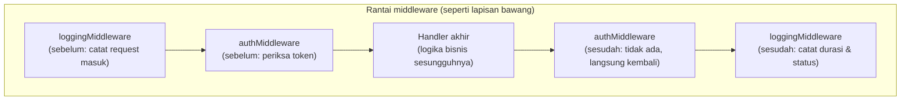

## TL;DR

`http.Handler` adalah interface dengan satu method, `ServeHTTP(w, r)` — fondasi seluruh HTTP server di Go. `http.HandlerFunc` adalah adapter yang membuat function biasa memenuhi interface itu. **Middleware** adalah function berbentuk `func(http.Handler) http.Handler` — menerima satu handler, mengembalikan handler baru yang membungkusnya dengan perilaku tambahan (logging, autentikasi, recovery) sebelum dan/atau sesudah memanggil handler yang dibungkus. Ini adalah pola yang mendasari hampir semua yang lain di domain ini — routing, context propagation, timeout — semuanya dibangun di atas komposisi handler dan middleware ini.

## The Problem

Bayangkan sebuah tim menulis puluhan handler HTTP, dan setiap handler dimulai dengan baris kode yang sama persis: mencatat log request masuk, memeriksa token autentikasi. Kode ini disalin-tempel di setiap handler baru. Ini bekerja — sampai suatu hari format logging perlu diubah, dan perubahan itu harus disebarkan manual ke puluhan handler yang sudah ada. Lebih buruk lagi: seorang engineer menambahkan handler baru untuk endpoint yang seharusnya butuh autentikasi, tapi lupa menyalin baris pemeriksaan token — endpoint itu diam-diam terbuka tanpa proteksi, sebuah celah keamanan nyata yang lahir murni dari copy-paste yang terlewat.

Middleware menyelesaikan ini dengan memindahkan logic yang berulang ini keluar dari setiap handler individual, jadi satu lapisan yang membungkus **semua** handler yang relevan sekaligus — perubahan cukup dilakukan di satu tempat, dan tidak ada handler baru yang bisa "lupa" memakainya asal didaftarkan lewat jalur yang benar.

## Intuition

Bayangkan middleware seperti **serangkaian stasiun pemrosesan bersarang di jalur perakitan** — setiap stasiun (middleware) bisa memeriksa/mengubah paket (request) yang lewat dan memutuskan apakah meneruskannya ke stasiun berikutnya atau menolaknya di situ juga, dengan stasiun paling dalam (handler akhir) melakukan pekerjaan spesifik yang sesungguhnya. Menyusun beberapa middleware seperti menumpuk stasiun-stasiun ini dalam urutan tertentu — urutan penting: stasiun logging yang "di luar" stasiun autentikasi tetap mencatat request yang ditolak autentikasi; kalau posisinya dibalik, request yang ditolak tidak pernah tercatat sama sekali.

Analogi "jalur perakitan fisik" ini bocor pada satu hal: stasiun fisik yang sudah terpasang tidak bisa dilewati begitu saja. Middleware di Go hanyalah kode — sebuah handler yang didaftarkan langsung ke router **tanpa** melewati rantai middleware yang dimaksudkan bisa dengan mudah "melewati" seluruh proteksi itu hanya karena satu baris registrasi yang salah, sebuah risiko yang murni soal organisasi kode, tanpa padanan fisik yang setara.

## How It Works

```go
type Handler interface {
    ServeHTTP(ResponseWriter, *Request)
}

type HandlerFunc func(ResponseWriter, *Request)

func (f HandlerFunc) ServeHTTP(w ResponseWriter, r *Request) {
    f(w, r) // HandlerFunc memenuhi interface Handler dengan memanggil dirinya sendiri
}
```



## In Go

```go
type Middleware func(http.Handler) http.Handler

func loggingMiddleware(next http.Handler) http.Handler {
    return http.HandlerFunc(func(w http.ResponseWriter, r *http.Request) {
        mulai := time.Now()
        log.Printf("masuk: %s %s", r.Method, r.URL.Path) // SEBELUM handler dipanggil

        next.ServeHTTP(w, r) // panggil lapisan berikutnya (bisa middleware lain, atau handler akhir)

        log.Printf("selesai: %s %s (%s)", r.Method, r.URL.Path, time.Since(mulai)) // SESUDAH handler selesai
    })
}

func authMiddleware(next http.Handler) http.Handler {
    return http.HandlerFunc(func(w http.ResponseWriter, r *http.Request) {
        token := r.Header.Get("Authorization")
        if !tokenValid(token) {
            http.Error(w, "tidak berwenang", http.StatusUnauthorized)
            return // handler yang dibungkus TIDAK PERNAH dipanggil — request berhenti di sini
        }
        next.ServeHTTP(w, r)
    })
}

func chain(h http.Handler, mws ...Middleware) http.Handler {
    for i := len(mws) - 1; i >= 0; i-- {
        h = mws[i](h)
    }
    return h
}

func main() {
    handlerAkhir := http.HandlerFunc(func(w http.ResponseWriter, r *http.Request) {
        w.Write([]byte("halo dunia"))
    })

    // Urutan penting: logging DI LUAR auth, supaya request yang
    // ditolak auth TETAP tercatat di log.
    final := chain(handlerAkhir, loggingMiddleware, authMiddleware)
    http.ListenAndServe(":8080", final)
}
```

Kalau urutan `chain` dibalik (`authMiddleware` di luar `loggingMiddleware`), request yang ditolak karena token tidak valid **tidak akan pernah** sampai ke `loggingMiddleware` — jejak audit soal siapa yang mencoba mengakses tanpa otorisasi akan hilang begitu saja.

## In His Stack

**Yii2** punya mekanisme serupa lewat *behaviors* dan *filters* (misalnya `AccessControl` filter) yang dilekatkan secara deklaratif di konfigurasi controller — bukan lewat komposisi function eksplisit seperti di Go. Pola Yii2 ini punya keuntungan: filter global di level aplikasi lebih sulit "terlewat" secara tidak sengaja dibanding middleware Go yang harus didaftarkan manual per rute. Konsekuensinya: kedisiplinan memastikan **setiap** rute baru benar-benar melewati rantai middleware yang seharusnya (bukan didaftarkan langsung ke mux mentah tanpa dibungkus) sepenuhnya jadi tanggung jawab tim, bukan dijamin otomatis oleh framework seperti di Yii2.

## Trade-offs and When Not To Use It

Middleware nyaris wajib untuk server HTTP non-trivial mana pun — mekanismenya sendiri (function yang membungkus function lain) sangat sederhana untuk dinalar tanpa "magic" framework tersembunyi, tapi menuntut disiplin manual untuk memastikan konsistensi (setiap rute yang seharusnya terlindungi benar-benar melewati rantai middleware yang tepat). Untuk tool command-line kecil dengan satu endpoint sederhana, overhead menyusun rantai middleware mungkin tidak sepadan — tapi untuk API production dengan lebih dari beberapa endpoint, middleware untuk logging, recovery, dan auth adalah standar minimum yang wajar.

## Common Mistakes

> [!warning] Jebakan
> Menduplikasi logic cross-cutting (logging, pemeriksaan auth) dengan copy-paste di setiap handler, alih-alih memfaktorkannya jadi middleware bersama. Risiko nyata: handler baru yang lupa menyalin pemeriksaan penting (terutama auth) jadi celah keamanan yang diam-diam terbuka.

> [!warning] Jebakan
> Salah urutan menyusun middleware, terutama saat satu middleware bergantung pada nilai yang di-set middleware lain di context — kalau middleware yang bergantung itu diletakkan sebelum middleware yang men-set nilainya, bug yang muncul (nilai kosong/nil) sering membingungkan karena kodenya "terlihat benar" secara terpisah.

> [!warning] Jebakan
> Mendaftarkan sebagian handler langsung ke router/mux tanpa melewati rantai middleware bersama, secara diam-diam melewati proteksi (logging, auth) yang diasumsikan berlaku universal ke semua rute.

## Exercises

1. Apa yang membuat `http.HandlerFunc` bisa memenuhi interface `http.Handler` meski ia sebenarnya sebuah function, bukan struct?
2. Kenapa urutan middleware penting — beri contoh konkret di mana urutan yang salah menyebabkan masalah.
3. Apa risiko mendaftarkan sebuah handler langsung ke router tanpa melewati rantai middleware bersama?
4. Desain terbuka: sebuah API perlu menambahkan middleware baru untuk mencatat correlation ID (lihat [[../70 Infrastructure and Delivery/Correlation IDs|Correlation IDs]]) yang harus tersedia untuk **semua** middleware lain (logging, auth) supaya log dari ketiganya bisa dikorelasikan lewat ID yang sama. Rancang urutan penyusunan middleware yang tepat untuk kebutuhan ini, dan jelaskan alasan urutannya.

> [!success]- Kunci jawaban
> Middleware correlation ID harus diletakkan **paling luar** dari semua middleware lain — ia harus jadi yang pertama dijalankan (menghasilkan atau mengambil correlation ID dari header request, lalu menyimpannya di `context.Context`) sebelum middleware logging dan auth berjalan, supaya keduanya bisa membaca correlation ID yang sama dari context saat mencatat log mereka masing-masing. Urutan penyusunan: `chain(handlerAkhir, correlationIDMiddleware, loggingMiddleware, authMiddleware)` — correlation ID di-set paling awal (lapisan terluar), logging dan auth di lapisan setelahnya bisa mengasumsikan nilai itu sudah tersedia di context. Kalau urutannya dibalik (correlation ID di dalam logging), log yang dicatat middleware logging tidak akan pernah punya correlation ID sama sekali, karena nilainya belum di-set saat logging middleware itu berjalan.

## Self-Check

- Apa method yang harus dipenuhi sebuah tipe supaya memenuhi interface `http.Handler`?
- Apa fungsi `http.HandlerFunc` sebagai adapter?
- Kenapa urutan menyusun middleware penting?
- Apa risiko mendaftarkan handler langsung ke router tanpa melewati rantai middleware bersama?

## Connected Notes

- [[../20 Go Language/Interfaces and Implicit Satisfaction|Interfaces and Implicit Satisfaction]] — prasyarat: `http.Handler` adalah contoh nyata interface kecil yang dipenuhi implisit.
- [[../20 Go Language/Defer, Panic, and Recover|Defer, Panic, and Recover]] — middleware `recover` adalah salah satu middleware paling penting dalam praktik, dibahas penuh di note itu.
- [[Routing in Go]] — router yang menentukan handler/middleware mana yang dipanggil untuk setiap rute.
- [[Context Propagation in HTTP Servers]] — mekanisme yang memungkinkan middleware berbagi nilai (seperti correlation ID) lewat request yang sama.
- [[../70 Infrastructure and Delivery/Correlation IDs|Correlation IDs]] — penerapan konkret middleware yang dijelaskan di exercise note ini.

## Further Reading

- Dokumentasi resmi package `net/http` (pkg.go.dev/net/http) — referensi lengkap `Handler`, `HandlerFunc`, dan `ServeMux`.

## Catatan Saya

*Tulis di sini middleware yang dipakai di service Go-mu (atau yang menurutmu perlu ditambahkan), dan urutan penyusunannya saat ini.*
