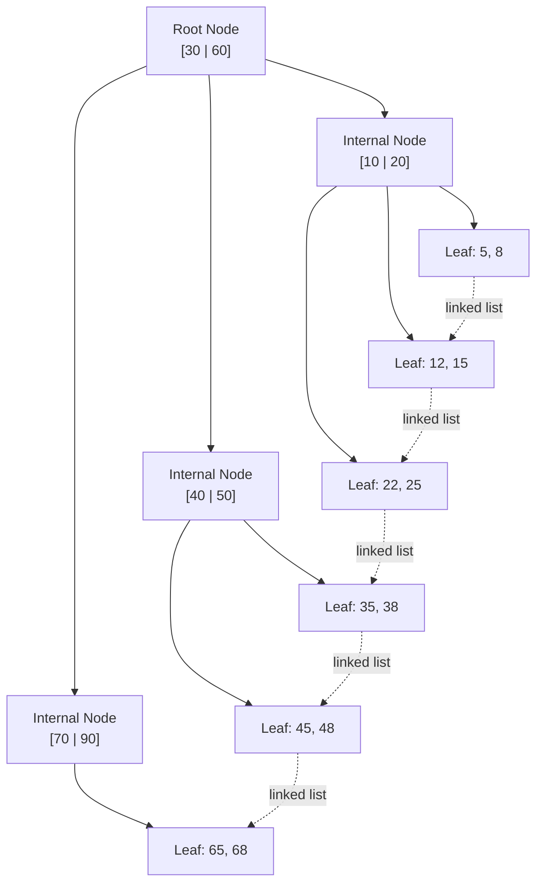

## TL;DR

[[Index Basics|Index basics]] menjelaskan *bahwa* index mempercepat pencarian; B+Tree menjelaskan *bagaimana* — hampir setiap index di database relasional (MySQL/MariaDB InnoDB, PostgreSQL default B-tree index) sebenarnya adalah struktur data B+Tree yang disusun agar setiap pencarian, penyisipan, atau penghapusan membutuhkan jumlah operasi baca disk yang **logaritmik** terhadap jumlah baris, bukan linear. Kuncinya bukan sekadar "pohon biner yang sudah dikenal" — B+Tree dirancang khusus mengikuti realita mesin: disk dibaca per **halaman (page)** berukuran tetap, bukan per byte, dan B+Tree mengoptimalkan struktur pohonnya supaya satu halaman menampung sebanyak mungkin kunci, meminimalkan jumlah halaman yang harus dibaca dari disk untuk satu pencarian.

## The Problem

Sebuah tabel `permohonan` dengan lima juta baris punya index pada kolom `nomor_permohonan`. Query `SELECT * FROM permohonan WHERE nomor_permohonan = 'X'` kembali dalam hitungan milidetik meski tabelnya besar — sementara query serupa tanpa index pada kolom lain butuh waktu beberapa detik karena harus memindai seluruh tabel (*full table scan*). Perbedaan performa yang begitu drastis ini sering diterima begitu saja sebagai "index memang cepat", tanpa pernah dipertanyakan **kenapa** ia bisa secepat itu — dan tanpa pemahaman itu, keputusan seperti "kenapa index pada kolom dengan banyak nilai duplikat kurang efektif" atau "kenapa index pada kolom yang sering diubah punya biaya penulisan lebih tinggi" tidak bisa dijelaskan, hanya dihafal sebagai aturan tanpa alasan.

Masalah kedua yang lebih konkret: seorang engineer menambahkan index baru pada kolom `email` di tabel pengguna, berharap query pencarian jadi lebih cepat, tapi tidak menyadari bahwa struktur B+Tree index itu sendiri butuh **ruang disk tambahan** dan setiap `INSERT`/`UPDATE`/`DELETE` pada tabel itu sekarang juga harus memperbarui struktur pohon index tersebut — termasuk kemungkinan **membelah node** (*node split*) yang untuk sesaat memblokir operasi lain pada bagian pohon yang sedang dibelah. Index bukan sekadar "daftar tambahan yang mempercepat baca tanpa biaya" — ia adalah struktur data hidup yang harus dipelihara setiap kali data berubah.

## Intuition

Bayangkan B+Tree seperti **struktur arsip perpustakaan kota** dengan lemari indeks kartu bertingkat: lemari paling atas hanya berisi label rentang huruf besar ("A–M" di satu laci, "N–Z" di laci lain), yang menunjuk ke lemari tingkat kedua dengan rentang lebih sempit ("A–D", "E–H", dst.), sampai akhirnya di tingkat terbawah kartu-kartu berisi lokasi rak buku sebenarnya diurutkan berdampingan. Mencari satu buku berarti membuka beberapa laci berturut-turut (setiap laci = satu halaman disk), bukan memeriksa satu per satu semua kartu dari awal. Karena setiap laci menampung banyak label sekaligus, jumlah laci yang perlu dibuka untuk mencapai lokasi mana pun tetap kecil bahkan ketika perpustakaan itu punya jutaan buku — inilah sifat logaritmik B+Tree.

Analogi ini bocor pada satu hal penting: kartu-kartu di rak paling bawah lemari arsip fisik biasanya menunjuk ke lokasi rak buku yang **terpisah** dari kartu itu sendiri. Di B+Tree, **hanya node daun (leaf node)** yang menyimpan data sesungguhnya (atau pointer ke baris data, tergantung jenis index), dan yang lebih penting, seluruh node daun ini **saling terhubung lewat linked list** — begitu pencarian sampai ke daun yang tepat, membaca rentang nilai berikutnya (misalnya untuk `BETWEEN` atau `ORDER BY`) berarti mengikuti pointer linked list itu ke daun sebelah, tanpa perlu naik-turun pohon lagi. Ini yang membuat B+Tree secara khusus unggul untuk *range query*, dibanding struktur pohon biner biasa yang tidak punya sambungan horizontal semacam ini.

## How It Works



Diagram ini menunjukkan dua sifat inti B+Tree: (1) **hanya leaf node yang menyimpan data (atau pointer ke baris)** — internal node murni berisi kunci pemandu untuk navigasi, tidak ada data ganda tersimpan di sana; (2) **leaf node saling terhubung** lewat linked list, memungkinkan range scan berjalan lurus ke kanan tanpa pernah kembali ke root.

Pencarian nilai spesifik (misalnya `50`) dimulai dari root, membandingkan dengan kunci pemandu untuk memutuskan cabang mana yang dituju, turun satu level setiap langkah, sampai mencapai leaf — jumlah langkah ini sama dengan **tinggi pohon**, yang untuk B+Tree tumbuh sangat lambat (logaritmik) terhadap jumlah baris karena setiap node menampung **banyak** kunci sekaligus (disebut *fanout* atau *branching factor* tinggi), bukan hanya dua seperti pohon biner biasa.

**Kenapa fanout tinggi penting secara mekanis**: setiap node B+Tree dirancang berukuran sama dengan satu halaman disk (umumnya 4KB atau 16KB, tergantung storage engine) — semakin banyak kunci yang muat dalam satu halaman, semakin sedikit level pohon dibutuhkan untuk jumlah baris yang sama, dan semakin sedikit pula operasi baca disk (yang jauh lebih lambat dibanding operasi CPU/memori) yang dibutuhkan satu pencarian. Dengan fanout ratusan kunci per node, pohon dengan lima juta baris mungkin hanya butuh tiga atau empat level — tiga sampai empat kali baca halaman untuk menemukan baris mana pun, bukan lima juta.

## Under The Hood

**Penyisipan dan pembelahan node (node split).** Saat sebuah leaf node penuh dan butuh menampung kunci baru, ia **dibelah** jadi dua leaf node, masing-masing berisi separuh kunci, dan kunci pemandu baru disisipkan ke node induk untuk menunjuk ke leaf baru itu. Kalau node induk itu sendiri jadi penuh akibat penyisipan ini, ia juga dibelah, dan proses ini bisa merambat sampai ke root — kalau root sendiri penuh dan harus dibelah, tinggi pohon bertambah satu level untuk **seluruh** pohon sekaligus, bukan hanya sebagian. Ini kenapa penyisipan data secara berurutan (misalnya `AUTO_INCREMENT`/`SERIAL` yang selalu naik) cenderung lebih efisien dibanding penyisipan dengan nilai acak (seperti UUID v4 sebagai primary key) — nilai acak menyisipkan ke lokasi acak di seluruh pohon, memicu node split yang lebih sering dan tersebar, sementara nilai berurutan hampir selalu menyisip di leaf paling kanan yang sama.

**Clustered vs non-clustered index.** Di InnoDB (storage engine default MySQL/MariaDB), **primary key selalu berupa clustered index** — leaf node dari B+Tree ini **adalah** baris data itu sendiri, disusun fisik berurutan mengikuti urutan primary key. Index sekunder (index pada kolom selain primary key) di InnoDB adalah B+Tree terpisah yang leaf node-nya menyimpan **nilai primary key**, bukan baris data langsung — artinya pencarian lewat index sekunder butuh satu langkah tambahan: temukan primary key di index sekunder, lalu pakai clustered index untuk menemukan baris sesungguhnya (dikenal sebagai *bookmark lookup* atau *key lookup*). Ini salah satu alasan kenapa memilih primary key yang tepat (pendek, berurutan) berdampak luas — ia memengaruhi ukuran **setiap** index sekunder di tabel itu, karena setiap index sekunder menyimpan salinan nilai primary key di setiap entrinya.

> [!question] Perlu diverifikasi
> Klaim: PostgreSQL tidak memakai clustered index secara default seperti InnoDB.
> Kenapa ragu: PostgreSQL punya perintah `CLUSTER` yang bisa mengurutkan ulang tabel fisik berdasarkan index tertentu, tapi ini operasi sekali jalan (bukan dipertahankan otomatis setiap insert seperti clustered index InnoDB) — detail teknis persisnya perlu dicek ulang terhadap dokumentasi resmi versi PostgreSQL yang relevan.
> Cara verifikasi: cek dokumentasi resmi PostgreSQL mengenai `CLUSTER` dan heap table storage.

## In Go

B+Tree adalah struktur internal database, bukan sesuatu yang biasanya diimplementasikan ulang di kode aplikasi — tapi memahami mekanismenya mengubah cara menulis skema dan query. Contoh berikut menunjukkan bagaimana pemilihan tipe primary key memengaruhi perilaku B+Tree di baliknya:

```go
package migration

import (
	"context"
	"database/sql"
	"fmt"
)

// BuatTabelDenganPrimaryKeyBerurutan sengaja memakai AUTO_INCREMENT
// (nilai selalu naik) alih-alih UUID acak sebagai primary key — karena
// primary key adalah clustered index di InnoDB, nilai yang selalu naik
// berarti penyisipan baris baru hampir selalu terjadi di leaf node paling
// kanan, meminimalkan node split acak di tengah pohon.
func BuatTabelDenganPrimaryKeyBerurutan(ctx context.Context, db *sql.DB) error {
	_, err := db.ExecContext(ctx, `
		CREATE TABLE permohonan (
			id BIGINT UNSIGNED AUTO_INCREMENT PRIMARY KEY,
			nomor_permohonan VARCHAR(32) NOT NULL,
			status VARCHAR(20) NOT NULL,
			-- index sekunder pada nomor_permohonan: leaf node-nya menyimpan
			-- nilai id (primary key), bukan baris lengkap.
			INDEX idx_nomor_permohonan (nomor_permohonan)
		) ENGINE=InnoDB
	`)
	if err != nil {
		return fmt.Errorf("buat tabel permohonan: %w", err)
	}
	return nil
}

// KalauMemakaiUUID menunjukkan pola alternatif yang JAUH lebih rawan
// fragmentasi B+Tree kalau UUID dipakai sebagai primary key murni acak
// (UUID v4). Penyisipan baris baru menyebar ke lokasi acak di seluruh
// pohon, memicu node split yang lebih sering dan page yang kurang padat.
func KalauMemakaiUUID(ctx context.Context, db *sql.DB) error {
	_, err := db.ExecContext(ctx, `
		CREATE TABLE sesi_login (
			-- CHAR(36) UUID v4 acak sebagai primary key: valid secara
			-- fungsional, tapi secara mekanis lebih mahal untuk InnoDB
			-- dibanding primary key berurutan pada tabel dengan volume
			-- insert tinggi.
			id CHAR(36) PRIMARY KEY,
			user_id BIGINT UNSIGNED NOT NULL
		) ENGINE=InnoDB
	`)
	if err != nil {
		return fmt.Errorf("buat tabel sesi_login: %w", err)
	}
	return nil
}
```

## In His Stack

MariaDB (InnoDB) dan PostgreSQL sama-sama memakai varian B+Tree sebagai struktur index default, tapi dengan perbedaan mekanis yang berdampak nyata: InnoDB selalu punya clustered index (baris data tersimpan langsung di leaf node primary key), sementara PostgreSQL memakai *heap table* terpisah dari struktur index-nya — index PostgreSQL (termasuk B-tree default-nya) selalu menyimpan pointer ke lokasi fisik baris di heap (disebut *TID*, tuple identifier), bukan data itu sendiri, bahkan untuk primary key. Konsekuensi praktis: pemilihan tipe primary key (UUID acak vs berurutan) berdampak jauh lebih besar di MariaDB/InnoDB dibanding di PostgreSQL, karena di InnoDB seluruh struktur fisik tabel ikut terpengaruh, sementara di PostgreSQL dampaknya lebih terbatas pada index itu sendiri. Ini salah satu alasan kenapa rekomendasi "hindari UUID acak sebagai primary key" lebih sering dan lebih tegas ditemukan dalam konteks MySQL/MariaDB dibanding PostgreSQL.

## Trade-offs and When Not To Use It

B+Tree unggul untuk pencarian titik (equality) dan range query pada data yang terurut secara alami (angka, tanggal, string dengan urutan leksikografis) — tapi ia bukan struktur data universal. Untuk pencarian **kesamaan** murni tanpa kebutuhan range/urutan (misalnya "apakah nilai X ada di kolom ini"), struktur hash memberi kompleksitas O(1) yang secara teoretis lebih cepat dibanding O(log n) B+Tree — inilah kenapa beberapa database menawarkan hash index sebagai alternatif untuk kasus spesifik itu, meski B+Tree tetap default paling umum karena keserbagunaannya untuk range query. B+Tree juga bukan gratis: setiap index tambahan berarti struktur data tambahan yang harus dipelihara di setiap `INSERT`/`UPDATE`/`DELETE`, menambah beban tulis dan ruang disk secara nyata — trade-off yang sudah disinggung di [[Index Basics]] dan sekarang punya penjelasan mekanis yang lebih dalam: setiap perubahan data berarti kemungkinan node split, penulisan ulang beberapa halaman disk, bukan sekadar "menambah satu baris ke daftar".

## Common Mistakes

> [!warning] Jebakan
> Memakai UUID v4 acak sebagai primary key pada tabel InnoDB dengan volume insert tinggi tanpa menyadari konsekuensinya terhadap clustered index — menyebabkan fragmentasi B+Tree yang lebih parah dan page yang kurang padat dibanding primary key berurutan, berdampak nyata pada performa insert dan ukuran tabel di disk.

> [!warning] Jebakan
> Mengira "menambah index" selalu murni menguntungkan tanpa biaya — setiap index tambahan adalah B+Tree terpisah yang harus diperbarui di setiap operasi tulis, dan tabel dengan terlalu banyak index bisa mengalami penurunan performa tulis yang signifikan.

> [!warning] Jebakan
> Menyamakan mental model B+Tree dengan pohon biner biasa (binary search tree) — B+Tree punya fanout jauh lebih tinggi per node (dirancang mengikuti ukuran halaman disk) dan leaf node yang saling terhubung lewat linked list, dua sifat yang tidak ada di pohon biner biasa dan justru menjadi alasan utama B+Tree dipilih untuk index database.

## Exercises

1. Jelaskan kenapa tinggi B+Tree tumbuh sangat lambat (logaritmik) terhadap jumlah baris, dan bagaimana ini berkaitan dengan ukuran halaman disk.
2. Apa perbedaan clustered index dan non-clustered (secondary) index di InnoDB, dan kenapa pencarian lewat secondary index butuh langkah tambahan?
3. Kenapa leaf node B+Tree saling terhubung lewat linked list, dan query semacam apa yang paling diuntungkan oleh sifat ini?
4. Desain terbuka: tim di kantormu memutuskan memakai UUID v4 sebagai primary key untuk tabel `permohonan` yang menerima ribuan insert per menit di jam sibuk, dengan alasan "supaya ID tidak bisa ditebak urutan pendaftarannya oleh pihak luar" (kebutuhan keamanan yang sah). Rancang pendekatan yang tetap memenuhi kebutuhan keamanan itu (ID publik tidak berurutan/tidak bisa ditebak) tanpa mengorbankan efisiensi clustered index InnoDB sepenuhnya.

> [!success]- Kunci jawaban
> **1.** Tinggi B+Tree ditentukan oleh berapa kali harus turun level untuk mencapai leaf, dan itu bergantung pada **fanout** (berapa banyak kunci per node) — semakin banyak kunci muat dalam satu halaman disk, semakin sedikit level dibutuhkan untuk jumlah baris yang sama. Karena fanout biasanya ratusan (dibatasi oleh ukuran halaman, bukan angka kecil tetap seperti 2 di pohon biner), tinggi pohon tumbuh sangat lambat: dari beberapa ratus ke beberapa juta baris mungkin hanya menambah satu atau dua level, bukan proporsional dengan jumlah barisnya.
> **4.** Pola yang umum dipakai: pertahankan primary key internal sebagai `BIGINT AUTO_INCREMENT` berurutan (menjaga clustered index InnoDB tetap efisien untuk insert bervolume tinggi), dan tambahkan kolom terpisah `kode_publik` bertipe UUID atau string acak (dengan **secondary index**, bukan primary key) yang diekspos ke luar sistem (URL, API response, dokumen dikirim ke warga) — kebutuhan keamanan "ID tidak bisa ditebak" terpenuhi lewat `kode_publik` yang acak, sementara struktur fisik tabel dan performa insert-nya tetap diuntungkan oleh primary key internal yang berurutan. Trade-off-nya: butuh satu kolom dan satu index tambahan (beban penyimpanan dan penulisan sedikit lebih besar dibanding satu primary key saja), tapi jauh lebih kecil dibanding biaya UUID acak sebagai primary key penuh di tabel dengan volume insert tinggi.

## Self-Check

- Kenapa B+Tree dirancang dengan fanout tinggi per node, bukan sekadar dua cabang seperti pohon biner?
- Apa perbedaan clustered index dan secondary index dari sisi apa yang disimpan di leaf node?
- Kenapa primary key berurutan lebih ramah terhadap InnoDB dibanding UUID acak?
- Query semacam apa yang paling diuntungkan oleh linked list antar leaf node B+Tree?

## Connected Notes

- [[Index Basics]] — note ini menjelaskan mekanisme di balik trade-off "index mempercepat baca, memperlambat tulis" yang sudah diperkenalkan di note itu.
- [[Composite Indexes and the Leftmost-Prefix Rule]] — aturan leftmost-prefix pada composite index adalah konsekuensi langsung dari bagaimana kunci disusun berurutan di dalam node B+Tree.
- [[Covering Indexes]] — index yang menghindari bookmark lookup ke clustered index adalah optimasi lanjutan yang baru masuk akal setelah memahami struktur B+Tree di note ini.
- [[Reading EXPLAIN]] — istilah seperti "index scan" vs "index only scan" yang muncul di output EXPLAIN merujuk langsung ke perilaku B+Tree yang dijelaskan di sini.
- [[LSM-Trees vs B-Trees]] — kontras langsung dengan struktur penyimpanan alternatif yang mengoptimalkan trade-off write/read secara berbeda, dibahas di note intermediate lain di domain ini.

## Further Reading

- Dokumentasi resmi MySQL/InnoDB mengenai "Clustered and Secondary Indexes".
- Dokumentasi resmi PostgreSQL mengenai "Index Types" dan struktur heap table.

## Catatan Saya

*Tulis di sini tipe primary key yang dipakai tabel-tabel besar di sistem kerjaanmu — apakah berurutan atau acak, dan apakah pernah ada masalah performa insert yang bisa dikaitkan dengan ini.*
