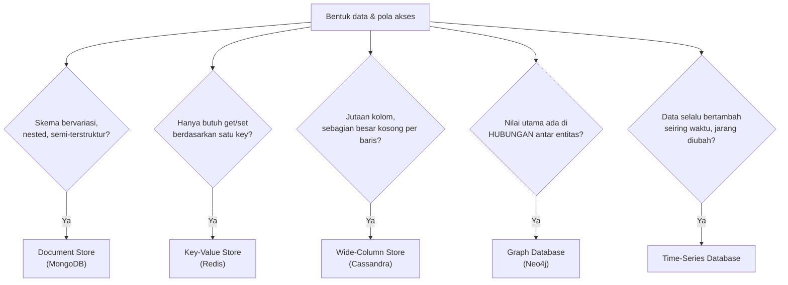

## TL;DR

Database relasional (MariaDB, PostgreSQL) memaksa data ke bentuk tabel dengan skema tetap — pilihan yang tepat untuk data yang secara alami punya struktur relasional dan butuh konsistensi ketat. Tapi tidak semua data punya bentuk itu secara natural, dan memaksakan bentuk relasional pada data yang tidak cocok adalah sumber friksi nyata. Lima kategori model data "beyond relational" masing-masing mengoptimalkan pola akses yang berbeda: **document store** untuk data semi-terstruktur yang bentuknya bervariasi, **key-value store** untuk pencarian tercepat berdasarkan satu kunci, **wide-column store** untuk data dengan jutaan kolom yang jarang semuanya terisi, **graph database** untuk data yang nilainya justru ada di **hubungan** antar entitas, dan **time-series database** untuk data yang selalu bertambah seiring waktu dan jarang diubah. **NoSQL tidak lebih cepat dari SQL** — ia membuat trade-off yang berbeda, biasanya melonggarkan konsistensi atau skema demi fleksibilitas atau skala tertentu.

## The Problem

Sebuah fitur baru butuh menyimpan "formulir dinamis" — setiap jenis layanan pemerintah punya field formulir yang berbeda-beda (izin usaha butuh NPWP dan alamat usaha, izin mendirikan bangunan butuh luas tanah dan IMB sebelumnya), dan field baru bisa ditambahkan admin instansi kapan saja tanpa perlu deployment kode baru. Memaksakan ini ke skema relasional berarti salah satu dari dua pendekatan yang sama-sama canggung: menambah kolom baru di tabel `permohonan` setiap kali ada field baru (migrasi skema tak berkesudahan, banyak kolom `NULL` untuk jenis layanan yang tidak memakainya), atau membuat tabel *Entity-Attribute-Value* (satu baris per field, dengan kolom `key`/`value` generik) yang menjadikan setiap query sederhana berubah jadi `JOIN` berulang yang canggung dan lambat.

Masalah kedua yang berbeda sifat: sebuah dashboard butuh menjawab pertanyaan "petugas mana saja yang pernah menangani permohonan yang disetujui petugas X, yang kemudian ditangani ulang oleh petugas yang juga menangani permohonan milik petugas Y" — pertanyaan yang melibatkan **rantai hubungan** antar entitas (petugas-permohonan-petugas-permohonan-petugas), bukan sekadar filter pada satu tabel. Di database relasional, ini berarti `JOIN` berlapis-lapis yang performanya menurun drastis seiring kedalaman rantai hubungan bertambah — pola akses yang secara struktural lebih cocok dijawab model data yang berbeda sama sekali.

## Intuition

Bayangkan kelima model data ini seperti lima jenis wadah penyimpanan berbeda di rumah, masing-masing untuk barang dengan bentuk berbeda:

- **Document store** seperti **kotak penyimpanan fleksibel** yang bisa menampung barang berbagai bentuk dan ukuran tanpa perlu kompartemen tetap — cocok untuk barang yang bentuknya berubah-ubah tergantung isinya.
- **Key-value store** seperti **loker bernomor** — kamu hanya butuh tahu nomor lokernya untuk langsung mengambil isinya secepat mungkin, tanpa peduli struktur di dalamnya.
- **Wide-column store** seperti **rak dengan ribuan slot label**, di mana setiap baris punya kombinasi slot terisi yang sangat berbeda-beda (baris A mengisi slot 1, 5, 900; baris B mengisi slot 2, 3, 4) — memaksakan ini ke tabel dengan kolom tetap berarti kebanyakan sel kosong terbuang percuma.
- **Graph database** seperti **peta jaringan pertemanan** yang secara eksplisit menggambar garis hubungan antar orang — pertanyaan seperti "teman dari teman dari teman" dijawab dengan mengikuti garis itu, bukan mencari lewat daftar nama satu per satu.
- **Time-series database** seperti **buku catatan harian yang halamannya selalu ditambah di akhir**, tidak pernah disisipkan di tengah atau diubah — cocok untuk data yang selalu berjalan maju seiring waktu.

Analogi ini bocor pada satu hal: memilih wadah yang salah di rumah hanya berarti sedikit tidak efisien menyimpan barang. Memilih model data yang salah untuk pola akses yang dominan bisa berarti performa yang menurun **secara struktural** seiring data bertambah — bukan sekadar "kurang rapi", tapi benar-benar tidak scalable untuk pola akses yang dibutuhkan.

## How It Works



Diagram ini adalah kerangka keputusan, bukan aturan kaku — banyak kasus nyata cocok dengan lebih dari satu kategori, dan keputusan akhirnya tetap bergantung pada pola akses **dominan** aplikasi, bukan kategorisasi teoretis semata.

**Karakteristik masing-masing secara ringkas:**

- **Document store** (MongoDB) — menyimpan data sebagai dokumen JSON/BSON dengan skema fleksibel per dokumen; unggul untuk data dengan struktur bervariasi/nested, tapi query lintas dokumen yang kompleks (mirip `JOIN` relasional) kurang natural dan seringkali harus didenormalisasi.
- **Key-value store** (Redis) — model paling sederhana: get/set berdasarkan key; sangat cepat karena strukturnya minimal, tapi tidak mendukung query berdasarkan isi value tanpa index tambahan.
- **Wide-column store** (Cassandra) — setiap baris bisa punya kombinasi kolom yang sama sekali berbeda dari baris lain, dioptimalkan untuk skala tulis sangat tinggi lintas banyak node, dengan model konsistensi yang biasanya lebih longgar dibanding relasional.
- **Graph database** (Neo4j) — node dan edge (hubungan) adalah warga negara kelas satu; traversal hubungan (mengikuti rantai koneksi) adalah operasi native yang cepat, sesuatu yang butuh `JOIN` berlapis mahal di relasional.
- **Time-series database** — dioptimalkan untuk tulis berurutan berdasarkan waktu dan query berdasarkan rentang waktu, sering memakai kompresi agresif karena data time-series punya pola yang sangat predictable (nilai berdekatan waktu seringkali mirip).

## Under The Hood

**NoSQL bukan "tanpa skema" dalam artian tanpa struktur.** Ia lebih tepat disebut "skema fleksibel" atau "skema di aplikasi, bukan di database": document store tidak menegakkan struktur di level database, tapi aplikasi yang membaca dokumen itu tetap mengasumsikan struktur tertentu ada di dalamnya. Bedanya, database tidak memvalidasi asumsi itu — aplikasi yang harus menanganinya (termasuk kasus field yang hilang atau berubah tipe seiring waktu, yang di database relasional akan ditangkap sebagai error skema sejak awal).

**Konsistensi adalah trade-off yang paling sering dikorbankan**: banyak database NoSQL (khususnya wide-column dan beberapa document store dalam konfigurasi tertentu) menawarkan model konsistensi yang lebih longgar (eventual consistency) demi skala horizontal yang lebih mudah. Ini bukan cacat — ini pilihan desain yang masuk akal untuk beban kerja yang bisa mentolerir keterlambatan konsistensi (lihat pendahuluan singkat soal ini sebelum pembahasan formalnya di [[../60 Distributed Systems/Consistency Models|Consistency Models]], level senior). Tapi ini jadi masalah serius kalau dipilih untuk data yang butuh konsistensi ketat (misalnya saldo keuangan) tanpa disadari trade-off-nya sejak awal.

## In Go

```go
package formulir

import (
	"context"
	"encoding/json"
	"fmt"

	"go.mongodb.org/mongo-driver/mongo"
)

// FormulirDinamis menunjukkan kecocokan document store untuk kasus
// "The Problem" pertama — skema field yang berbeda per jenis layanan,
// tanpa migrasi skema setiap kali field baru ditambahkan.
type FormulirDinamis struct {
	ID           string                 `bson:"_id"`
	JenisLayanan string                 `bson:"jenis_layanan"`
	Field        map[string]interface{} `bson:"field"` // struktur BEBAS, ditentukan aplikasi
}

func SimpanFormulir(ctx context.Context, koleksi *mongo.Collection, formulir FormulirDinamis) error {
	_, err := koleksi.InsertOne(ctx, formulir)
	if err != nil {
		return fmt.Errorf("simpan formulir dinamis: %w", err)
	}
	return nil
}

// contohField menunjukkan dua jenis layanan dengan field yang SAMA SEKALI
// berbeda, disimpan dalam koleksi yang sama tanpa perlu migrasi skema.
func contohField() {
	izinUsaha := FormulirDinamis{
		JenisLayanan: "izin_usaha",
		Field: map[string]interface{}{
			"npwp":          "01.234.567.8-901.000",
			"alamat_usaha":  "Jl. Merdeka No. 1",
		},
	}
	izinBangunan := FormulirDinamis{
		JenisLayanan: "izin_bangunan",
		Field: map[string]interface{}{
			"luas_tanah_m2": 250,
			"imb_sebelumnya": "IMB-2019-00123",
		},
	}
	_ = izinUsaha
	_ = izinBangunan
}
```

```go
package cache

import (
	"context"
	"fmt"
	"time"

	"github.com/redis/go-redis/v9"
)

// SesiPengguna menunjukkan kecocokan key-value store untuk pola akses
// yang murni get/set berdasarkan satu key — session ID, di sini.
func SimpanSesi(ctx context.Context, rdb *redis.Client, sessionID string, userID int64, ttl time.Duration) error {
	if err := rdb.Set(ctx, "sesi:"+sessionID, userID, ttl).Err(); err != nil {
		return fmt.Errorf("simpan sesi ke redis: %w", err)
	}
	return nil
}
```

## In His Stack

Redis (key-value/struktur data in-memory) sudah menjadi bagian ekosistem kerja untuk caching dan session — pemahaman "kenapa key-value store, bukan tabel relasional" untuk kasus ini menjelaskan kenapa Redis terasa jauh lebih cepat untuk kasus get/set sederhana dibanding query setara di MariaDB, karena strukturnya memang diminimalkan khusus untuk pola akses itu. Elasticsearch, meski sering dikategorikan terpisah (dibahas lebih dalam sebagai "search" di sisa domain ini), berbagi filosofi dengan document store dalam hal skema yang fleksibel per dokumen. Untuk 13 aplikasi pemerintah yang kemungkinan besar tetap mayoritas menggunakan model relasional (data warga, permohonan, status, semuanya secara alami relasional dan butuh konsistensi ketat), model "beyond relational" ini paling relevan dipertimbangkan untuk kebutuhan **spesifik** yang tidak natural di relasional (formulir dinamis, cache, audit trail bervolume sangat tinggi), bukan sebagai pengganti database utama.

## Trade-offs and When Not To Use It

Setiap model "beyond relational" mengorbankan sesuatu yang diberikan gratis oleh database relasional: document store kehilangan kemudahan `JOIN` lintas koleksi dan penegakan skema; key-value store kehilangan kemampuan query berdasarkan isi value; wide-column store biasanya kehilangan transaction ACID lintas baris yang sekuat relasional; graph database kurang optimal untuk agregasi lintas seluruh dataset (kebalikan dari kekuatannya di traversal); time-series database biasanya tidak dirancang untuk update sewenang-wenang pada data lama. Memilih salah satu dari ini bukan soal "NoSQL lebih modern". Bahkan untuk kebanyakan kebutuhan aplikasi bisnis biasa (termasuk sebagian besar sistem legal-services pemerintah), data yang secara alami relasional dan butuh konsistensi ketat **tetap** paling baik disimpan di database relasional. "Beyond relational" dipilih untuk kebutuhan spesifik yang pola aksesnya benar-benar tidak cocok dengan model tabel, bukan sebagai default baru.

## Common Mistakes

> [!warning] Jebakan
> Memilih NoSQL karena "katanya lebih cepat/scalable" tanpa menganalisis apakah pola akses data sesungguhnya cocok dengan model itu — NoSQL bukan lebih cepat secara universal, ia membuat trade-off berbeda yang bisa jadi salah untuk kasus tertentu.

> [!warning] Jebakan
> Menyimpan data yang butuh konsistensi ketat (transaksi keuangan, misalnya) di database dengan model eventual consistency tanpa menyadari trade-off itu — bisa menghasilkan bug yang sangat sulit dilacak karena "kadang data terlihat tidak konsisten sesaat" bukan bug, tapi karakteristik model yang dipilih.

> [!warning] Jebakan
> Memaksakan data yang secara alami graph (rantai hubungan kompleks) ke model relasional lewat `JOIN` berlapis-lapis yang terus bertambah dalam seiring kompleksitas pertanyaan bisnis bertambah — performa menurun drastis seiring kedalaman rantai hubungan, gejala bahwa model data yang dipilih tidak cocok dengan pola akses sesungguhnya.

## Exercises

1. Jelaskan kenapa "NoSQL lebih cepat dari SQL" adalah klaim yang keliru, dan trade-off apa yang sebenarnya dibuat setiap model NoSQL.
2. Kapan document store lebih tepat dipilih dibanding tabel relasional dengan kolom `NULL` untuk field yang tidak selalu dipakai?
3. Kenapa graph database secara struktural lebih cocok untuk pertanyaan "teman dari teman dari teman" dibanding `JOIN` berlapis di database relasional?
4. Desain terbuka: sistemmu butuh menyimpan riwayat perubahan status setiap permohonan (log audit) — data ini selalu ditambah (append), hampir tidak pernah diubah setelah ditulis, dan query yang paling sering dijalankan adalah "tampilkan riwayat status permohonan X, diurutkan berdasarkan waktu" dan "hitung berapa lama rata-rata status Y bertahan sebelum berubah, per bulan". Rancang pilihan model data yang tepat untuk kasus ini (relasional biasa, atau salah satu model "beyond relational"), dan jelaskan alasannya berdasarkan pola akses yang disebutkan.

> [!success]- Kunci jawaban
> **1.** "NoSQL lebih cepat" keliru karena setiap model NoSQL mencapai kecepatannya justru dengan **mengorbankan** sesuatu yang diberikan database relasional secara default — key-value store cepat karena strukturnya sangat minimal (tidak ada query berdasarkan isi value), wide-column store cepat untuk tulis skala besar karena melonggarkan konsistensi lintas baris. Kecepatan itu spesifik untuk pola akses yang cocok dengan trade-off itu; untuk pola akses yang butuh fitur yang dikorbankan (misalnya query kompleks lintas entitas), model yang sama bisa jauh lebih lambat atau bahkan tidak mendukungnya sama sekali dibanding database relasional.
> **4.** Data ini punya karakteristik time-series yang jelas (append-only, diurutkan waktu, agregasi berdasarkan rentang waktu). Time-series database, atau pendekatan yang mengikuti prinsipnya (misalnya tabel di-partition berdasarkan waktu, lihat [[Partitioning]], dikombinasikan dengan pola LSM-Tree kalau volumenya sangat tinggi), adalah pilihan yang tepat berdasarkan pola akses yang disebutkan. Alternatif yang tetap masuk akal untuk skala sedang: tabel relasional biasa yang di-partition berdasarkan tanggal (menggabungkan kesederhanaan operasional relasional dengan manfaat pruning berbasis waktu). Pilihan ini lebih mudah dioperasikan untuk tim yang sudah familiar dengan MariaDB/PostgreSQL, dan baru beralih ke time-series database khusus (seperti yang dibahas di domain tools, tier working/orientation) kalau volume dan kebutuhan query time-series-nya sudah jauh melampaui yang bisa ditangani baik oleh relasional yang di-partition dengan benar.

## Self-Check

- Kenapa "NoSQL lebih cepat dari SQL" adalah generalisasi yang keliru?
- Sebutkan trade-off utama masing-masing dari kelima model "beyond relational" yang dibahas.
- Kenapa graph database unggul untuk pertanyaan berbasis traversal hubungan?
- Kapan model relasional tetap menjadi pilihan yang lebih baik dibanding model "beyond relational"?

## Connected Notes

- [[Write Amplification and Compression]] — pemilihan model data yang tepat untuk pola akses juga berdampak pada write amplification, tema yang saling melengkapi dari note sebelumnya.
- [[Relational Modelling]] — pemahaman kapan data cocok dimodelkan relasional adalah prasyarat untuk menilai kapan sebaliknya lebih tepat, dibahas di note junior itu.
- [[Inverted Indexes and How Search Engines Work]] — Elasticsearch, yang berbagi filosofi skema fleksibel dengan document store, dibahas lebih dalam soal mekanisme pencarian di note berikutnya.
- [[../60 Distributed Systems/Consistency Models|Consistency Models]] — trade-off konsistensi yang disinggung sekilas di note ini dibahas secara formal dan mendalam di level senior itu.
- [[../92 Tools/Redis|Redis]] — implementasi konkret key-value store yang relevan langsung di ekosistem kerja ini.

## Further Reading

- Martin Kleppmann, "Designing Data-Intensive Applications", bab mengenai data model dan query language — perbandingan konseptual mendalam antara model relasional dan non-relasional.

## Catatan Saya

*Tulis di sini apakah ada kebutuhan data di kerjaanmu yang terasa "dipaksakan" ke bentuk relasional — dan setelah membaca note ini, model mana yang menurutmu lebih cocok.*
