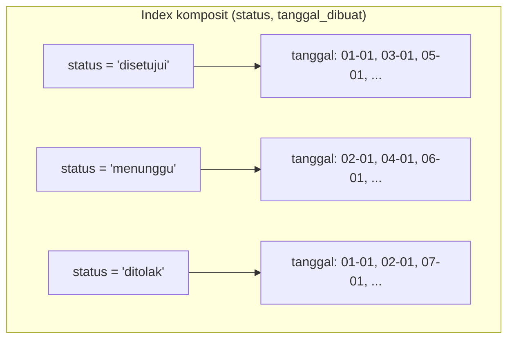

## TL;DR

Sebuah index tidak harus dibangun dari satu kolom saja — index komposit (composite index) dibangun dari beberapa kolom sekaligus, disusun dalam **satu** B+Tree yang mengurutkan baris berdasarkan kolom pertama, lalu kolom kedua di dalam setiap kelompok nilai kolom pertama yang sama, dan seterusnya. Konsekuensi mekanisnya adalah **leftmost-prefix rule**: index komposit `(a, b, c)` bisa dipakai efisien untuk query yang memfilter `a`, atau `a` dan `b`, atau `a`, `b`, dan `c` — tapi **tidak bisa** dipakai efisien untuk query yang hanya memfilter `b` atau `c` saja, karena tanpa kondisi pada `a` lebih dulu, database tidak tahu bagian mana dari pohon yang harus dilompati. Urutan kolom dalam index komposit bukan pilihan kosmetik — ia menentukan query apa saja yang bisa memanfaatkannya.

## The Problem

Sebuah tabel `permohonan` punya index komposit `(status, tanggal_dibuat)` untuk mempercepat query dashboard petugas: `SELECT * FROM permohonan WHERE status = 'menunggu' ORDER BY tanggal_dibuat`. Query ini berjalan cepat. Beberapa minggu kemudian, seorang engineer menambahkan fitur baru yang butuh query `SELECT * FROM permohonan WHERE tanggal_dibuat = '2026-07-29'` (tanpa filter status) — dan bingung kenapa index yang "sudah ada" sepertinya tidak dipakai sama sekali, terlihat dari `EXPLAIN` yang menunjukkan full table scan. Index `(status, tanggal_dibuat)` memang ada, tapi karena query ini tidak menyertakan kondisi pada `status` (kolom pertama index), database tidak bisa melompat langsung ke bagian pohon yang relevan berdasarkan `tanggal_dibuat` saja — ia harus memeriksa setiap kelompok `status` satu per satu untuk mencari `tanggal_dibuat` yang cocok, yang bisa jadi tidak lebih murah dibanding langsung memindai seluruh tabel.

Masalah kedua yang lebih halus: sebuah tim membuat index komposit `(tanggal_dibuat, status)`, urutan terbalik dari kebutuhan dashboard yang paling sering memfilter berdasarkan `status` dulu (jumlah nilai `status` sedikit dan sangat selektif: "menunggu", "disetujui", "ditolak") baru kemudian mengurutkan berdasarkan tanggal. Index dengan urutan kolom yang salah ini secara teknis valid dan bisa dipakai untuk beberapa query, tapi tidak seefisien mungkin untuk pola akses yang paling sering terjadi — sebuah kesalahan desain yang tidak menghasilkan error apa pun, hanya performa yang lebih rendah dari yang seharusnya bisa dicapai.

## Intuition

Bayangkan index komposit seperti **buku telepon yang disusun berdasarkan nama belakang, lalu nama depan** — untuk mencari "Sutrisno, Budi", kamu bisa langsung melompat ke bagian "Sutrisno" (berkat urutan nama belakang), lalu di dalam kelompok "Sutrisno" itu, mencari "Budi" jadi mudah karena sudah terurut lebih lanjut berdasarkan nama depan. Tapi kalau kamu hanya tahu nama depannya "Budi" tanpa tahu nama belakangnya, buku telepon ini **tidak membantu sama sekali** — "Budi" bisa muncul di ratusan tempat berbeda di seluruh buku, tersebar di bawah setiap nama belakang yang berbeda, dan kamu terpaksa membaca seluruh buku dari awal untuk menemukan semua "Budi".

Analogi ini bocor pada satu hal: buku telepon fisik hanya punya satu urutan pengelompokan yang mungkin (nama belakang dulu, karena itu konvensinya). Database mengizinkan kolom mana pun jadi "pengelompokan pertama" tergantung index apa yang dibuat — inilah kenapa urutan kolom dalam `CREATE INDEX idx (a, b, c)` adalah keputusan desain yang harus disesuaikan dengan pola query yang **benar-benar** dijalankan aplikasi, bukan urutan yang "terlihat logis" secara sembarangan.

## How It Works



Diagram ini menunjukkan bahwa di dalam satu B+Tree index komposit, baris **pertama-tama** dikelompokkan berdasarkan `status` (kolom pertama), dan **di dalam** setiap kelompok itu, baru terurut berdasarkan `tanggal_dibuat` (kolom kedua). Query `WHERE status = 'menunggu' AND tanggal_dibuat > '2026-07-01'` bisa langsung melompat ke kelompok `status = 'menunggu'`, lalu memakai keterurutan `tanggal_dibuat` di dalam kelompok itu untuk mempersempit pencarian lebih jauh — dua tingkat efisiensi sekaligus. Query `WHERE tanggal_dibuat = '2026-07-29'` saja, tanpa filter `status`, tidak punya titik masuk yang jelas ke pohon ini — nilai `tanggal_dibuat` yang sama tersebar di ketiga kelompok `status` yang berbeda, sehingga database harus memeriksa ketiganya.

**Aturan leftmost-prefix secara formal**: index komposit `(a, b, c)` bisa dipakai secara efisien (menghindari full scan) untuk kondisi `WHERE` yang menyertakan **prefix kiri berturut-turut** dari kolom index — `(a)`, `(a, b)`, atau `(a, b, c)` — tapi tidak untuk `(b)`, `(c)`, atau `(b, c)` saja. Pengecualian penting: kalau kondisi pada kolom prefix memakai operator kesamaan (`=`), pencarian bisa melanjutkan ke kolom berikutnya secara efisien. Tapi kalau kondisi itu memakai operator rentang (`>`, `<`, `BETWEEN`), kolom-kolom **setelah** kolom rentang itu di dalam index kehilangan urutannya yang berguna untuk pencarian lebih lanjut. Inilah kenapa urutan kolom equality-sebelum-range dalam index komposit umumnya jadi rekomendasi standar.

## Under The Hood

Aturan leftmost-prefix adalah model mental yang benar untuk merancang index, tapi jangan diperlakukan sebagai hukum mutlak soal apa yang akan dilakukan optimizer. Optimizer masih bisa memilih memindai seluruh index komposit itu (lebih murah dari memindai tabel, karena index-nya lebih sempit), dan sebagian mesin database punya optimasi *index skip scan* yang bisa memanfaatkan index komposit meski kolom pertama tidak difilter — biasanya hanya menguntungkan saat kolom pertama berkardinalitas rendah. Kesimpulan praktisnya tetap sama: rancang urutan kolom mengikuti pola query nyata, dan **selalu verifikasi lewat `EXPLAIN`** alih-alih menyimpulkan dari aturan saja.

Pertimbangan penyusunan urutan kolom composite index yang baik mengikuti heuristik umum **"equality, sort, range"**: kolom yang difilter dengan kesamaan (`=`) diletakkan lebih dulu, diikuti kolom yang dipakai untuk `ORDER BY` (kalau ada dan konsisten dengan pola query), lalu kolom yang difilter dengan rentang di posisi terakhir. Alasannya berkaitan langsung dengan sifat B+Tree. Kolom equality mempersempit pencarian ke satu kelompok node yang jelas. Kolom sort memanfaatkan keterurutan yang sudah ada di dalam kelompok itu (menghindari operasi sort tambahan setelah data diambil). Dan kolom range di posisi terakhir tidak merusak keterurutan kolom-kolom sebelumnya, karena tidak ada kolom lagi setelahnya yang bergantung pada urutan itu.

**Kardinalitas (cardinality)** — jumlah nilai unik yang mungkin dalam sebuah kolom — juga memengaruhi efektivitas index, meski tidak selalu berarti "kolom paling selektif harus di depan". Optimizer query modern (baik MySQL/MariaDB maupun PostgreSQL) mempertimbangkan statistik distribusi data untuk memutuskan apakah index tertentu benar-benar lebih murah dipakai dibanding full table scan. Pada kolom dengan kardinalitas sangat rendah (misalnya boolean `is_active` dengan hanya dua nilai), index pada kolom itu sendiri seringkali tidak banyak membantu, karena setiap "kelompok" di index masih mengandung porsi besar dari total baris tabel.

## In Go

```go
package migration

import (
	"context"
	"database/sql"
	"fmt"
)

// BuatIndexKomposit menyusun kolom mengikuti pola akses NYATA aplikasi:
// dashboard petugas SELALU memfilter status lebih dulu (kesamaan, kardinalitas
// rendah tapi sangat selektif secara operasional), baru mengurutkan
// berdasarkan tanggal_dibuat — urutan kolom index harus mengikuti urutan
// pemakaian query, bukan urutan "yang terlihat logis" di skema.
func BuatIndexKomposit(ctx context.Context, db *sql.DB) error {
	_, err := db.ExecContext(ctx, `
		CREATE INDEX idx_status_tanggal ON permohonan (status, tanggal_dibuat)
	`)
	if err != nil {
		return fmt.Errorf("buat index komposit: %w", err)
	}
	return nil
}

// CariPermohonanMenunggu memanfaatkan index (status, tanggal_dibuat) secara
// penuh: kondisi equality pada status (leftmost column), lalu ORDER BY pada
// tanggal_dibuat memanfaatkan keterurutan yang sudah ada di dalam kelompok
// status itu tanpa perlu sort tambahan.
func CariPermohonanMenunggu(ctx context.Context, db *sql.DB) (*sql.Rows, error) {
	rows, err := db.QueryContext(ctx, `
		SELECT id, nomor_permohonan, tanggal_dibuat
		FROM permohonan
		WHERE status = ?
		ORDER BY tanggal_dibuat DESC
		LIMIT 50
	`, "menunggu")
	if err != nil {
		return nil, fmt.Errorf("query permohonan menunggu: %w", err)
	}
	return rows, nil
}

// CariBerdasarkanTanggalSaja adalah query yang TIDAK memanfaatkan index
// (status, tanggal_dibuat) secara efisien, karena tidak menyertakan kondisi
// pada status (leftmost column). Kalau query semacam ini sering dijalankan,
// ia butuh index terpisah (tanggal_dibuat) atau index komposit tambahan
// dengan urutan berbeda — bukan mengandalkan index yang sudah ada.
func CariBerdasarkanTanggalSaja(ctx context.Context, db *sql.DB, tanggal string) (*sql.Rows, error) {
	rows, err := db.QueryContext(ctx, `
		SELECT id, nomor_permohonan, status
		FROM permohonan
		WHERE tanggal_dibuat = ?
	`, tanggal)
	if err != nil {
		return nil, fmt.Errorf("query permohonan by tanggal: %w", err)
	}
	return rows, nil
}
```

## In His Stack

Yii2 Active Record memudahkan menulis kondisi `where()` majemuk tanpa developer secara sadar memikirkan urutan kolom index yang mendasarinya — kode seperti `Permohonan::find()->where(['tanggal_dibuat' => $tgl])->all()` terlihat sama sederhananya dengan query yang memfilter status, padahal performanya bisa sangat berbeda tergantung index apa yang tersedia. Ini salah satu area di mana kenyamanan ORM bisa menyembunyikan keputusan performa penting — memakai `EXPLAIN` (lihat [[Reading EXPLAIN]]) secara rutin terhadap query yang dihasilkan Active Record, bukan hanya mempercayai bahwa "kan sudah ada index di tabel ini", adalah kebiasaan yang perlu dibangun sengaja saat bekerja dengan ORM apa pun, termasuk `sqlx` di Go.

## Trade-offs and When Not To Use It

Menambah composite index untuk setiap kombinasi kolom yang mungkin difilter aplikasi bukan strategi yang sehat. Setiap index tambahan menambah beban tulis (lihat [[B+Tree Structure]]) dan ruang disk, dan composite index yang mencakup banyak kolom sekaligus bisa memakan ruang signifikan tanpa benar-benar dipakai kalau pola query yang dilayaninya jarang terjadi. Praktik yang lebih sehat adalah menganalisis query yang **benar-benar** sering dijalankan (lewat slow query log atau observability, lihat [[../70 Infrastructure and Delivery/The Three Pillars of Observability|The Three Pillars of Observability]]) dan menyusun composite index secara sengaja untuk pola-pola dominan itu, alih-alih membuat index terpisah untuk setiap kolom yang *mungkin* difilter. Satu composite index yang disusun tepat sering bisa menggantikan beberapa index kolom tunggal sekaligus, berkat leftmost-prefix rule.

## Common Mistakes

> [!warning] Jebakan
> Menyusun urutan kolom composite index berdasarkan urutan kolom di skema tabel atau urutan "yang terlihat logis", bukan berdasarkan pola query nyata — index yang secara teknis ada tapi urutannya salah bisa sama tidak bergunanya dengan tidak ada index sama sekali untuk query tertentu.

> [!warning] Jebakan
> Mengasumsikan satu composite index `(a, b, c)` otomatis mempercepat query yang hanya memfilter `b` atau `c` saja — leftmost-prefix rule berarti index itu hanya efisien untuk kondisi yang menyertakan `a` (prefix kiri), tidak untuk kolom di tengah atau akhir tanpa kolom sebelumnya.

> [!warning] Jebakan
> Meletakkan kolom dengan kondisi rentang (`>`, `<`, `BETWEEN`) di tengah composite index, sebelum kolom lain yang seharusnya masih bisa memanfaatkan keterurutan — kolom setelah kondisi rentang kehilangan keterurutan yang berguna, sehingga kolom rentang idealnya diletakkan di posisi terakhir index.

## Exercises

1. Jelaskan kenapa index komposit `(a, b, c)` tidak bisa dipakai efisien untuk query yang hanya memfilter kolom `b`.
2. Apa heuristik "equality, sort, range" dalam menyusun urutan kolom composite index, dan kenapa urutan itu masuk akal secara mekanis?
3. Kenapa satu composite index yang disusun tepat kadang bisa menggantikan beberapa index kolom tunggal sekaligus?
4. Desain terbuka: dashboard petugas di sistemmu menjalankan tiga jenis query terhadap tabel `permohonan` dengan frekuensi hampir sama: (a) `WHERE status = ? ORDER BY tanggal_dibuat`, (b) `WHERE status = ? AND wilayah = ?`, (c) `WHERE wilayah = ? ORDER BY tanggal_dibuat` (tanpa filter status). Rancang strategi index (satu composite index atau kombinasi beberapa index) yang melayani ketiga pola ini seefisien mungkin, dan jelaskan index mana yang melayani query mana.

> [!success]- Kunci jawaban
> **1.** Index komposit menyusun baris pertama-tama berdasarkan kolom pertama (`a`), dan hanya *di dalam* setiap kelompok nilai `a` yang sama barulah terurut berdasarkan `b`. Nilai `b` yang sama bisa tersebar di banyak kelompok `a` yang berbeda di seluruh pohon. Tanpa kondisi pada `a` untuk mempersempit pencarian ke satu kelompok dulu, database tidak punya cara melompat langsung ke bagian pohon yang relevan berdasarkan `b` saja, dan harus memeriksa setiap kelompok satu per satu.
> **4.** Query (a) dan (b) sama-sama memfilter `status` sebagai kondisi kesamaan pertama, sehingga bisa dilayani satu index komposit `(status, wilayah, tanggal_dibuat)` — leftmost-prefix mencakup `(status)` untuk sebagian query lain, `(status, wilayah)` persis untuk query (b), dan `(status, wilayah, tanggal_dibuat)`untuk urutan sort tambahan setelah keduanya. Namun query (c) memfilter `wilayah` **tanpa** `status` — leftmost-prefix index di atas tidak membantu sama sekali di sini karena `status` bukan bagian dari kondisi query (c). Query (c) butuh index terpisah `(wilayah, tanggal_dibuat)` yang leftmost column-nya cocok dengan pola aksesnya sendiri. Kesimpulannya: dua index dibutuhkan (`(status, wilayah, tanggal_dibuat)` untuk (a) dan (b), dan `(wilayah, tanggal_dibuat)` untuk (c)), karena tidak ada satu urutan kolom pun yang leftmost-prefix-nya bisa mencakup ketiga pola berbeda ini sekaligus.

## Self-Check

- Apa itu leftmost-prefix rule, dan kenapa itu konsekuensi langsung dari struktur B+Tree?
- Kenapa urutan kolom dalam composite index bukan pilihan kosmetik?
- Apa heuristik umum menyusun urutan kolom composite index (equality, sort, range)?
- Kenapa kondisi rentang (range) di tengah composite index merusak keterurutan kolom setelahnya?

## Connected Notes

- [[B+Tree Structure]] — leftmost-prefix rule adalah konsekuensi langsung dari bagaimana kunci komposit disusun berurutan bertingkat di dalam satu B+Tree, dijelaskan di note itu.
- [[Covering Indexes]] — composite index yang menyertakan seluruh kolom yang dibutuhkan sebuah query menjadi covering index, optimasi lanjutan dari topik di note ini.
- [[Reading EXPLAIN]] — cara memverifikasi apakah composite index benar-benar dipakai (dan seberapa banyak kolom prefix-nya dimanfaatkan) untuk sebuah query, dibahas di note itu.
- [[../30 APIs and Web/Filtering and Sorting|Filtering and Sorting]] — parameter filter dan sort yang diterima endpoint API secara langsung menentukan pola query yang harus dilayani composite index di database.
- [[Index Basics]] — pengantar dasar index sebagai konsep, sebelum masuk ke nuansa index multi-kolom di note ini.

## Further Reading

- Dokumentasi resmi MySQL mengenai "Multiple-Column Indexes" dan leftmost-prefix optimization.
- Dokumentasi resmi PostgreSQL mengenai "Multicolumn Indexes".

## Catatan Saya

*Tulis di sini satu query lambat di kerjaanmu yang setelah dicek lewat EXPLAIN, ternyata index yang ada tidak cocok urutan kolomnya dengan kondisi WHERE query itu.*
