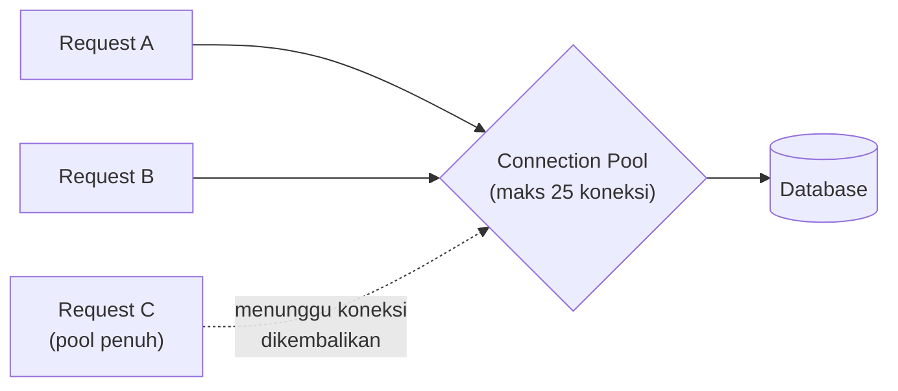

## TL;DR

Membuka koneksi TCP baru ke database untuk **setiap** request — lengkap dengan [[../10 Foundations/TCP Handshake and Connection Lifecycle|TCP handshake]], autentikasi, dan negosiasi di sisi database — adalah salah satu cara paling efektif membunuh performa aplikasi sekaligus membebani database itu sendiri. Connection pool menjaga sejumlah koneksi tetap terbuka dan dipakai ulang lintas request, menghindari biaya pembukaan koneksi berulang-ulang. `*sql.DB` di Go **sudah** adalah connection pool sejak awal — ia bukan koneksi tunggal, dan memanggil `sql.Open()` tidak langsung membuka koneksi fisik apa pun. Masalahnya bukan "apakah pakai pool", karena `database/sql` selalu memakainya; masalahnya adalah **ukuran pool yang tidak dikonfigurasi dengan sadar**, yang defaultnya bisa sangat tidak cocok untuk beban produksi nyata.

## The Problem

Sebuah service baru dijalankan dengan `sql.Open()` tanpa mengatur `SetMaxOpenConns` sama sekali. Di local development semuanya lancar. Begitu di-deploy dan menerima traffic produksi nyata, database mulai menolak koneksi baru dengan error "too many connections" — bukan karena database lemah, tapi karena `*sql.DB` yang tidak dibatasi ukurannya membuka koneksi baru **tanpa batas atas** setiap kali semua koneksi yang ada sedang sibuk, sampai menabrak limit koneksi maksimum yang dikonfigurasi di sisi database itu sendiri. Lebih buruk lagi: aplikasi lain yang berbagi database yang sama (umum di lingkungan dengan banyak service kecil) ikut kehabisan slot koneksi, karena satu service yang tidak dibatasi menghabiskan kuota bersama.

Masalah kebalikannya juga nyata: pool yang **terlalu kecil** untuk beban konkuren yang tinggi membuat request saling antre menunggu koneksi yang sedang dipakai request lain — latensi p99 melonjak bukan karena database lambat memproses, tapi karena request menunggu giliran mendapat koneksi sebelum query-nya bahkan sempat dikirim.

## Intuition

Bayangkan connection pool seperti **antrean taksi di pangkalan** — sejumlah taksi (koneksi) menunggu siap dipakai, penumpang (request) naik taksi yang sudah ada, memakainya, lalu **mengembalikannya ke pangkalan** untuk dipakai penumpang berikutnya, bukan membuang taksi itu dan memesan mobil baru dari pabrik setiap kali. Ini jauh lebih cepat daripada memanggil mobil baru (koneksi TCP baru + handshake + autentikasi) untuk setiap perjalanan.

Analogi ini bocor pada satu hal penting: pangkalan taksi di dunia nyata biasanya tidak "kehabisan" taksi secara permanen — kalau semua taksi sibuk, penumpang baru menunggu, lalu naik begitu ada yang kosong. Connection pool Go bekerja mirip ini (request menunggu koneksi yang tersedia), **tapi** tanpa `SetMaxOpenConns` yang eksplisit, "pangkalan" ini punya perilaku default yang berbeda — ia akan terus **membangun taksi baru** (`unlimited` secara default) alih-alih memaksa penumpang menunggu, sampai sumber daya di sisi database (limit koneksi maksimum server) benar-benar habis. Batas atas yang eksplisit mengubah perilaku ini dari "terus membangun sampai meledak" menjadi "penumpang menunggu dengan tertib".

## How It Works

```go
db, err := sql.Open("mysql", dsn)
// sql.Open TIDAK langsung membuka koneksi fisik apa pun — ia hanya
// menyiapkan struktur *sql.DB. Koneksi fisik pertama baru dibuka
// saat query pertama benar-benar dijalankan (lazy).

db.SetMaxOpenConns(25)   // batas atas jumlah koneksi TERBUKA sekaligus (idle + sedang dipakai)
db.SetMaxIdleConns(25)   // jumlah koneksi yang tetap dipertahankan menganggur, siap dipakai ulang
db.SetConnMaxLifetime(5 * time.Minute) // paksa koneksi ditutup dan dibuka ulang setelah durasi ini
db.SetConnMaxIdleTime(2 * time.Minute) // tutup koneksi yang sudah menganggur terlalu lama
```



Diagram ini menunjukkan Request C menunggu — bukan gagal, dan bukan memicu koneksi baru tanpa batas — begitu pool mencapai `MaxOpenConns`. Perilaku ini jauh lebih aman untuk database dibanding membiarkan koneksi bertumbuh tanpa batas, tapi berarti latensi Request C sekarang bergantung pada seberapa cepat koneksi lain dilepaskan.

`SetConnMaxLifetime` penting terutama untuk lingkungan dengan load balancer atau proxy database (umum di infrastruktur Kubernetes) yang bisa memutus koneksi yang sudah terlalu lama tanpa pemberitahuan ke aplikasi — memaksa rotasi koneksi secara berkala menghindari aplikasi mencoba memakai koneksi yang secara diam-diam sudah mati di sisi jaringan.

## In Go

```go
package main

import (
	"context"
	"database/sql"
	"fmt"
	"time"
)

// BukaKoneksiDatabase mengonfigurasi pool secara eksplisit — tidak
// mengandalkan default yang tidak dibatasi, dan tidak asal menebak angka
// tanpa mempertimbangkan kapasitas database serta jumlah instance service
// yang berbagi database yang sama.
func BukaKoneksiDatabase(ctx context.Context, dsn string) (*sql.DB, error) {
	db, err := sql.Open("mysql", dsn)
	if err != nil {
		return nil, fmt.Errorf("buka koneksi database: %w", err)
	}

	db.SetMaxOpenConns(25)
	db.SetMaxIdleConns(25)
	db.SetConnMaxLifetime(5 * time.Minute)
	db.SetConnMaxIdleTime(2 * time.Minute)

	pingCtx, cancel := context.WithTimeout(ctx, 5*time.Second)
	defer cancel()
	if err := db.PingContext(pingCtx); err != nil {
		return nil, fmt.Errorf("ping database gagal saat inisialisasi: %w", err)
	}

	return db, nil
}
```

`db.PingContext` di akhir memaksa koneksi fisik pertama benar-benar dibuka dan diverifikasi saat startup aplikasi — tanpa ini, aplikasi bisa saja "berhasil start" (karena `sql.Open` tidak pernah gagal untuk kesalahan koneksi) padahal database sebenarnya tidak bisa dihubungi sama sekali, dan baru ketahuan saat request pertama pengguna gagal.

## In His Stack

Yii2 secara default membuka **satu koneksi PDO per request** (siklus hidup PHP tradisional: satu proses menangani satu request, lalu berakhir) — model yang secara fundamental berbeda dari `*sql.DB` Go yang **hidup selama proses aplikasi berjalan** dan dipakai ulang lintas ribuan request berturut-turut. Ini kontras arsitektural yang penting dipahami saat berpindah dari mengelola sistem Yii2/PHP ke menulis service Go: konsep connection pooling ada di kedua dunia (PHP punya ekstensi seperti `pgbouncer` di sisi database atau PHP-FPM connection reuse dalam kondisi tertentu), tapi cara berpikirnya berbeda — di Go, ukuran pool adalah keputusan konfigurasi eksplisit di level aplikasi yang perlu disesuaikan dengan siklus hidup service yang panjang, bukan implisit per-request seperti kebanyakan setup PHP tradisional.

## Trade-offs and When Not To Use It

Pool yang terlalu besar tidak "gratis" — setiap koneksi terbuka memakai resource nyata di sisi database (memori per koneksi, thread/proses di beberapa mesin database), dan `MaxOpenConns` yang terlalu tinggi di banyak instance service sekaligus bisa kolektif menghabiskan limit koneksi database meski masing-masing service terlihat wajar sendirian. Pool yang terlalu kecil membuat request antre tanpa perlu saat beban sebenarnya masih bisa ditangani database. Angka yang tepat **bukan** rumus universal — ia bergantung pada limit koneksi maksimum database, jumlah instance service yang berjalan paralel (di Kubernetes, ini berarti `MaxOpenConns` × jumlah pod harus tetap di bawah limit database), dan karakteristik beban kerja (query cepat vs query lama yang menahan koneksi lebih panjang). Ini keputusan yang harus diukur dan disesuaikan, bukan ditebak sekali lalu dilupakan — dibahas lebih dalam di [[Tuning the Connection Pool]], level intermediate.

## Common Mistakes

> [!warning] Jebakan
> Tidak memanggil `SetMaxOpenConns` sama sekali, membiarkan pool bertumbuh tanpa batas atas — bisa menghabiskan limit koneksi database, terutama kalau banyak instance service berbagi database yang sama.

> [!warning] Jebakan
> Membuka koneksi database baru per request secara manual (bukan memakai `*sql.DB` yang dibuat sekali saat startup dan dipakai ulang) — meniadakan seluruh manfaat pooling dan membebani database dengan handshake berulang-ulang.

> [!warning] Jebakan
> Lupa `defer rows.Close()` atau tidak menghabiskan seluruh baris hasil `Query()` — koneksi yang dipakai query itu tidak dikembalikan ke pool sampai `Rows` benar-benar ditutup, membuat pool tampak "kehabisan" koneksi padahal sebenarnya hanya lupa dikembalikan.

## Exercises

1. Jelaskan kenapa `sql.Open()` tidak langsung membuka koneksi fisik ke database, dan kapan koneksi pertama sebenarnya dibuka.
2. Kenapa aplikasi yang tidak membatasi `MaxOpenConns` bisa membahayakan aplikasi *lain* yang berbagi database yang sama, bukan hanya dirinya sendiri?
3. Jelaskan skenario konkret di mana pool yang terlalu kecil menyebabkan latensi tinggi meski database sendiri sebenarnya tidak overload.
4. Desain terbuka: sebuah service Go di-deploy sebagai 10 pod di Kubernetes, masing-masing terhubung ke database yang sama dengan limit koneksi maksimum 200 (dipakai bersama beberapa service lain juga). Rancang strategi menentukan nilai `MaxOpenConns` yang wajar untuk service ini, dan jelaskan pertimbangan apa saja yang perlu diketahui sebelum angka itu ditetapkan (bukan sekadar menebak satu angka "aman").

> [!success]- Kunci jawaban
> **1.** `sql.Open()` hanya memvalidasi format DSN dan menyiapkan struktur `*sql.DB` secara internal (termasuk driver yang akan dipakai) — ia tidak mencoba menghubungi database sama sekali di titik ini. Koneksi fisik pertama baru benar-benar dibuka secara *lazy*, saat query atau `Ping()` pertama kali dijalankan, dan `*sql.DB` akan membuka koneksi tambahan sesuai kebutuhan (sampai batas `MaxOpenConns` kalau diset) seiring bertambahnya konkurensi.
> **4.** Angka yang wajar untuk 10 pod adalah **limit database dibagi jumlah pod, dikurangi ruang untuk service lain** yang berbagi database yang sama — bukan asal menetapkan angka besar per pod. Kalau limit total 200 dan diperkirakan service lain memakai sekitar 100, sisa 100 untuk 10 pod service ini berarti `MaxOpenConns` sekitar 10 per pod (bukan 20 atau lebih, yang berisiko kolektif melebihi kuota kalau seluruh 10 pod menyentuh beban puncak bersamaan). Pertimbangan yang perlu diketahui sebelum angka final ditetapkan: karakteristik query service ini (cepat atau menahan koneksi lama), apakah jumlah pod bisa bertambah lewat autoscaling (yang berarti kuota per pod harus dihitung ulang berdasarkan **jumlah pod maksimum**, bukan jumlah saat ini), dan koordinasi dengan tim yang mengelola service lain yang berbagi database yang sama supaya total kuota tidak melebihi limit server.

## Self-Check

- Apakah `sql.Open()` langsung membuka koneksi fisik ke database? Kenapa atau kenapa tidak?
- Apa risiko tidak membatasi `MaxOpenConns` pada aplikasi yang berbagi database dengan service lain?
- Kenapa lupa `rows.Close()` bisa membuat pool terlihat "kehabisan" koneksi padahal sebenarnya tidak?
- Apa fungsi `SetConnMaxLifetime`, dan kenapa ini relevan khususnya di lingkungan dengan load balancer/proxy database?

## Connected Notes

- [[../10 Foundations/TCP Handshake and Connection Lifecycle|TCP Handshake and Connection Lifecycle]] — biaya nyata yang dihindari connection pooling adalah biaya handshake TCP berulang untuk setiap koneksi baru, dijelaskan mendalam di note itu.
- [[Database Transactions]] — sebuah transaction terikat pada satu koneksi spesifik dari pool selama durasinya; transaction yang dibuka terlalu lama menahan koneksi itu tidak bisa dipakai request lain.
- [[Prepared Statements]] — di beberapa driver, statement yang di-prepare terikat pada koneksi tertentu, sehingga perilaku pool memengaruhi bagaimana prepared statement dipakai ulang lintas request.
- [[Tuning the Connection Pool]] — kelanjutan langsung di level intermediate: metodologi menentukan ukuran pool yang tepat berdasarkan pengukuran nyata, bukan tebakan.
- [[The N+1 Query Problem]] — pola query yang tidak efisien yang membebani pool jauh lebih cepat dari yang seharusnya, karena setiap query tambahan berarti koneksi ditahan lebih lama secara agregat.

## Further Reading

- Dokumentasi resmi package `database/sql` Go, khususnya `DB.SetMaxOpenConns`, `DB.SetMaxIdleConns`, `DB.SetConnMaxLifetime`.

## Catatan Saya

*Tulis di sini konfigurasi connection pool di service Go kerjaanmu (kalau ada) — apakah MaxOpenConns sudah diset secara sadar, atau masih default?*
