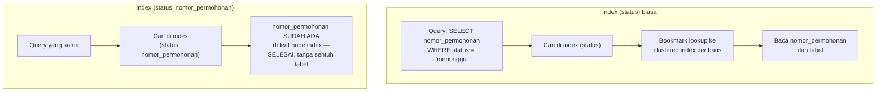

## TL;DR

Seperti dijelaskan di [[B+Tree Structure]], mencari lewat secondary index di InnoDB butuh dua langkah: temukan primary key di index, lalu pakai primary key itu untuk mengambil baris sesungguhnya lewat clustered index (*bookmark lookup*). Covering index menghilangkan langkah kedua ini sepenuhnya — kalau **seluruh kolom yang diminta query** (baik di `SELECT` maupun `WHERE`) sudah tersedia di dalam index itu sendiri, database tidak perlu menyentuh tabel sama sekali. Ini bukan jenis index yang berbeda secara struktural; ini adalah composite index biasa yang **kebetulan** menyertakan kolom tambahan supaya sebuah query bisa terjawab murni dari index, tanpa bookmark lookup.

## The Problem

Sebuah endpoint dashboard menjalankan `SELECT id, status FROM permohonan WHERE status = 'menunggu'` beberapa ribu kali per menit di jam sibuk. Index `(status)` sudah ada, dan `EXPLAIN` menunjukkan index itu dipakai — tapi performa masih terasa lebih lambat dari yang diharapkan untuk query sesederhana ini. Penyebabnya: index `(status)` hanya menyimpan nilai `status` dan primary key `id` di leaf node-nya (karena ini secondary index di InnoDB) — kolom `id` yang diminta `SELECT` **sudah** tersedia langsung dari index, tapi ini contoh kebetulan yang beruntung; kalau query memilih kolom tambahan seperti `nomor_permohonan` yang tidak ada di index, database harus melakukan bookmark lookup ke clustered index untuk **setiap baris** yang cocok kondisi `status = 'menunggu'` — satu operasi baca tambahan per baris, yang untuk ribuan baris berarti ribuan operasi baca tambahan yang sebenarnya bisa dihindari.

Masalah yang sering tidak disadari: menambahkan satu kolom ke `SELECT` yang terlihat sepele (`SELECT id, status, nomor_permohonan FROM ...` alih-alih `SELECT id, status FROM ...`) bisa mengubah query dari "cukup dijawab index" menjadi "butuh bookmark lookup ke setiap baris", turun drastis dalam performa tanpa perubahan apa pun pada `WHERE` clause atau index yang tersedia — perubahan yang mudah luput dari code review karena terlihat seperti penambahan kolom biasa, bukan keputusan performa.

## Intuition

Bayangkan index biasa seperti **katalog perpustakaan yang hanya mencantumkan nomor rak** — kamu menemukan nomor rak dengan cepat lewat katalog, tapi tetap harus berjalan ke rak itu dan mengambil bukunya secara fisik untuk membaca isinya (bookmark lookup). Covering index seperti **katalog yang sudah mencantumkan ringkasan lengkap yang kamu butuhkan langsung di kartu katalognya sendiri** — kalau yang kamu cari hanya judul dan tahun terbit (dan kartu katalog itu sudah mencantumkan keduanya), kamu tidak perlu berjalan ke rak sama sekali; jawabannya sudah lengkap di tangan begitu menemukan kartu yang cocok.

Analogi ini bocor pada satu hal: kartu katalog perpustakaan biasanya dirancang ringkas secara sengaja, tidak dimaksudkan menampung seluruh isi buku. Covering index, sebaliknya, **bisa** dibuat menyertakan kolom tambahan secara sengaja justru untuk menghindari perjalanan ke "rak" (tabel) — tapi ini bukan berarti sebaiknya menyertakan **semua** kolom ke dalam index; setiap kolom tambahan yang disertakan tetap menambah ukuran index dan biaya pemeliharaannya, sama seperti index composite biasa.

## How It Works



Diagram ini menunjukkan perbedaan intinya: index `(status)` biasa memaksa satu bookmark lookup tambahan **per baris** yang cocok untuk mendapatkan `nomor_permohonan`, sementara index `(status, nomor_permohonan)` — dengan `nomor_permohonan` disertakan sebagai kolom tambahan — menjawab query itu murni dari struktur index, tanpa pernah menyentuh clustered index atau tabel sama sekali. Di output `EXPLAIN` MySQL, ini biasanya terlihat sebagai `Using index` di kolom `Extra` (menandakan *index-only scan* terjadi), berbeda dari query yang butuh bookmark lookup.

Penting dibedakan: menambahkan kolom ke index untuk tujuan **covering** berbeda motivasi dari menambahkannya untuk tujuan **filtering/sorting** (seperti dibahas di [[Composite Indexes and the Leftmost-Prefix Rule]]) — kolom yang disertakan murni demi covering tidak harus mengikuti leftmost-prefix rule dengan ketat kalau ia hanya perlu "tersedia", bukan dipakai untuk mempersempit pencarian. PostgreSQL bahkan menyediakan sintaks eksplisit `INCLUDE` untuk kasus ini: `CREATE INDEX ... ON tabel (kolom_filter) INCLUDE (kolom_tambahan)`, menandai jelas bahwa `kolom_tambahan` hanya untuk covering, tidak ikut menentukan struktur pengurutan index.

## Under The Hood

Covering index sangat berharga khususnya untuk query dengan volume tinggi terhadap tabel besar, karena bookmark lookup pada dasarnya adalah baca acak (*random I/O*) ke lokasi lain di disk — jauh lebih mahal dibanding baca berurutan (*sequential I/O*) yang terjadi saat menelusuri leaf node index yang sama. Untuk storage yang berbasis disk mekanis (HDD), perbedaan ini historisnya sangat drastis; untuk SSD modern, perbedaannya lebih kecil tapi tetap nyata, terutama saat working set data jauh lebih besar dari memori yang tersedia untuk cache (buffer pool InnoDB, misalnya) — bookmark lookup yang gagal menemukan halaman di cache berarti operasi I/O fisik tambahan yang bisa didominasi oleh latency, bukan throughput murni.

Trade-off covering index adalah ukuran: menyertakan kolom tambahan (apalagi kolom tipe `TEXT`/`VARCHAR` panjang) ke dalam index memperbesar ukuran index itu sendiri, yang berarti lebih banyak halaman disk yang harus dibaca untuk menelusuri index yang sama, dan lebih banyak ruang disk serta memori cache yang dibutuhkan untuk menampungnya. Covering index paling bernilai untuk kolom kecil dan tetap (angka, tanggal, status enum pendek) yang sering diminta bersamaan dalam query yang sama dan sangat sering dijalankan — bukan strategi yang masuk akal diterapkan serampangan ke setiap index yang ada.

## In Go

```go
package migration

import (
	"context"
	"database/sql"
	"fmt"
)

// BuatCoveringIndexMySQL menyertakan nomor_permohonan sebagai bagian dari
// index, meski tidak pernah dipakai untuk memfilter — tujuannya murni supaya
// SELECT id, nomor_permohonan WHERE status = ? bisa terjawab tanpa bookmark
// lookup ke tabel.
func BuatCoveringIndexMySQL(ctx context.Context, db *sql.DB) error {
	_, err := db.ExecContext(ctx, `
		CREATE INDEX idx_status_covering
		ON permohonan (status, nomor_permohonan)
	`)
	if err != nil {
		return fmt.Errorf("buat covering index: %w", err)
	}
	return nil
}

// BuatCoveringIndexPostgres memakai sintaks INCLUDE eksplisit PostgreSQL —
// menandai jelas bahwa nomor_permohonan hanya untuk covering, bukan bagian
// dari kunci pengurutan index.
func BuatCoveringIndexPostgres(ctx context.Context, db *sql.DB) error {
	_, err := db.ExecContext(ctx, `
		CREATE INDEX idx_status_covering
		ON permohonan (status) INCLUDE (nomor_permohonan)
	`)
	if err != nil {
		return fmt.Errorf("buat covering index postgres: %w", err)
	}
	return nil
}

// QueryDashboardStatus adalah query yang diuntungkan penuh oleh covering
// index di atas — SELECT hanya meminta kolom yang sudah ada di index,
// menghindari bookmark lookup ke clustered index untuk setiap baris.
func QueryDashboardStatus(ctx context.Context, db *sql.DB, status string) (*sql.Rows, error) {
	rows, err := db.QueryContext(ctx, `
		SELECT id, nomor_permohonan FROM permohonan WHERE status = ?
	`, status)
	if err != nil {
		return nil, fmt.Errorf("query dashboard status: %w", err)
	}
	return rows, nil
}
```

## In His Stack

Aktivitas paling umum yang diam-diam merusak keuntungan covering index di kode berbasis ORM (baik Active Record Yii2 maupun kode Go yang memakai `SELECT *`) adalah kebiasaan mengambil **semua kolom** meski hanya sebagian yang dipakai — `SELECT *` nyaris selalu meniadakan kemungkinan index-only scan, karena hampir mustahil satu index menyertakan seluruh kolom tabel. Membiasakan menulis `SELECT` eksplisit hanya untuk kolom yang benar-benar dipakai (bukan sekadar gaya penulisan yang rapi) adalah prasyarat praktis supaya covering index yang sudah dirancang benar-benar bisa dimanfaatkan optimizer.

## Trade-offs and When Not To Use It

Covering index paling bernilai untuk query dengan frekuensi sangat tinggi terhadap tabel besar, di mana bookmark lookup yang dihindari benar-benar berjumlah signifikan secara agregat. Untuk query yang jarang dijalankan atau tabel kecil (yang sepenuhnya muat di cache memori), keuntungan covering index jauh lebih kecil — biaya tambahan ukuran index dan pemeliharaannya mungkin tidak sepadan dengan penghematan yang didapat. Covering index juga bukan solusi yang bertahan selamanya tanpa perawatan: begitu sebuah query berkembang butuh kolom baru yang belum ada di index, "covering"-nya hilang begitu saja dan query kembali butuh bookmark lookup — perubahan `SELECT` di kode aplikasi dan definisi index idealnya selalu ditinjau berdampingan, bukan diperlakukan sebagai dua hal yang terpisah.

## Common Mistakes

> [!warning] Jebakan
> Memakai `SELECT *` pada query yang seharusnya bisa memanfaatkan covering index — hampir selalu memaksa bookmark lookup karena mustahil satu index menyertakan seluruh kolom tabel.

> [!warning] Jebakan
> Menambahkan kolom baru ke `SELECT` sebuah query tanpa memeriksa apakah kolom itu masih tercakup index yang menjadikannya covering index sebelumnya — performa bisa turun signifikan tanpa perubahan apa pun di `WHERE` clause atau skema index.

> [!warning] Jebakan
> Menyertakan kolom besar (`TEXT`, `VARCHAR` panjang, `JSON`) ke dalam covering index tanpa mempertimbangkan dampaknya terhadap ukuran index — covering index yang terlalu besar bisa kehilangan sebagian besar manfaatnya karena index itu sendiri jadi mahal ditelusuri.

## Exercises

1. Jelaskan kenapa covering index menghindari bookmark lookup, dan kenapa bookmark lookup pada dasarnya adalah operasi yang lebih mahal dibanding menelusuri index itu sendiri.
2. Apa perbedaan menyertakan kolom di composite index untuk tujuan filtering/sorting dibanding untuk tujuan covering murni (seperti sintaks `INCLUDE` di PostgreSQL)?
3. Kenapa `SELECT *` hampir selalu meniadakan manfaat covering index?
4. Desain terbuka: query dashboard `SELECT id, nomor_permohonan, status, tanggal_dibuat FROM permohonan WHERE status = ? ORDER BY tanggal_dibuat DESC LIMIT 20` dijalankan ribuan kali per menit. Rancang index yang membuat query ini sepenuhnya index-only scan, dan jelaskan pertimbangan urutan kolom yang kamu pilih (mana yang untuk filtering/sorting, mana yang murni untuk covering).

> [!success]- Kunci jawaban
> **1.** Bookmark lookup adalah operasi baca **acak** (random I/O) ke lokasi berbeda di disk/memori untuk setiap baris yang cocok, sementara menelusuri satu index adalah operasi baca yang relatif **berurutan** dalam struktur pohon yang sama. Baca acak berulang untuk setiap baris hasil (bisa ribuan kali untuk query dengan hasil besar) jauh lebih mahal secara agregat dibanding satu penelusuran index yang menemukan seluruh data yang dibutuhkan sekaligus tanpa perlu berpindah struktur data.
> **4.** Index yang tepat: `(status, tanggal_dibuat, id, nomor_permohonan)` — `status` sebagai kondisi equality (leftmost, mempersempit ke satu kelompok), `tanggal_dibuat` sebagai kolom sort (memanfaatkan keterurutan di dalam kelompok status yang sama untuk `ORDER BY ... DESC` tanpa sort tambahan), dan `id`, `nomor_permohonan` disertakan murni untuk covering — keduanya diminta `SELECT` tapi tidak dipakai untuk filtering atau sorting sama sekali, sehingga posisinya di akhir index (atau lewat `INCLUDE` di PostgreSQL) sudah tepat. Dengan susunan ini, seluruh query — filter, sort, dan kolom yang diminta — terjawab murni dari index tanpa satu pun bookmark lookup ke tabel.

## Self-Check

- Apa yang dihindari covering index, dan kenapa itu operasi yang mahal?
- Bagaimana cara mengenali index-only scan di output `EXPLAIN`?
- Kenapa `SELECT *` biasanya meniadakan manfaat covering index?
- Kapan menambahkan kolom ke index demi covering justru tidak sepadan dengan biayanya?

## Connected Notes

- [[B+Tree Structure]] — bookmark lookup yang dihindari covering index adalah konsekuensi langsung dari perbedaan clustered dan secondary index yang dijelaskan di note itu.
- [[Composite Indexes and the Leftmost-Prefix Rule]] — covering index adalah perluasan dari composite index, dengan tujuan berbeda (covering, bukan filtering/sorting) untuk kolom tambahannya.
- [[Reading EXPLAIN]] — cara memverifikasi apakah sebuah query benar-benar menjadi index-only scan dibahas mendalam di note itu.
- [[The N+1 Query Problem]] — query berulang dalam pola N+1 sering menjadi kandidat kuat untuk covering index, karena volumenya yang tinggi memperbesar dampak bookmark lookup yang dihindari.
- [[../30 APIs and Web/Pagination - Offset vs Cursor|Pagination - Offset vs Cursor]] — query pagination dengan volume tinggi adalah salah satu kandidat paling umum untuk dioptimasi lewat covering index.

## Further Reading

- Dokumentasi resmi MySQL mengenai "Covering Index" dan nilai `Using index` di kolom `Extra` pada `EXPLAIN`.
- Dokumentasi resmi PostgreSQL mengenai "Index-Only Scans and Covering Indexes".

## Catatan Saya

*Tulis di sini satu query dashboard atau API di kerjaanmu yang sering dijalankan, dan cek lewat EXPLAIN apakah ia sudah index-only scan atau masih butuh bookmark lookup.*
