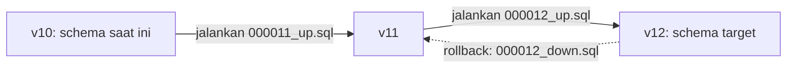

## TL;DR

Migration adalah perubahan skema database (`CREATE TABLE`, `ALTER TABLE`, `ADD COLUMN`, dst.) yang ditulis sebagai **kode versi terurut**, disimpan di repository bersama kode aplikasi, dan dijalankan secara berurutan serta dapat dilacak — bukan diketikkan manual langsung ke database produksi. Setiap migration idealnya punya pasangan `up` (menerapkan perubahan) dan `down` (membatalkannya), dan sistem migration mencatat migration mana saja yang sudah dijalankan di setiap environment, supaya skema database selalu bisa direproduksi dari nol hanya dengan menjalankan seluruh riwayat migration secara berurutan. Tanpa disiplin ini, skema production, staging, dan mesin setiap developer perlahan menyimpang satu sama lain tanpa ada yang benar-benar tahu persis apa bedanya.

## The Problem

Sebuah tim menambahkan kolom `nomor_registrasi` ke tabel `permohonan` langsung lewat `ALTER TABLE` yang dijalankan manual di klien database produksi, karena "hanya perubahan kecil, tidak perlu proses migration formal." Perubahan yang sama lupa diterapkan di environment staging selama dua minggu. Ketika seorang developer lain menjalankan test integrasi di staging yang mengasumsikan kolom itu ada (karena sudah melihatnya di produksi dan menulis kode berdasarkan itu), test-nya gagal dengan error "unknown column" — bukan karena kodenya salah, tapi karena skema staging dan produksi sudah menyimpang tanpa siapa pun secara eksplisit melacak perbedaannya.

Masalah yang lebih serius muncul beberapa bulan kemudian: sebuah developer baru mencoba menyiapkan environment lokal dari nol, menjalankan seluruh file migration yang ada di repository — tapi migration untuk `nomor_registrasi` **tidak pernah ditulis sebagai file migration** (karena dijalankan manual dulu), sehingga skema lokal yang baru dibangun tidak punya kolom itu sama sekali, dan seluruh proses onboarding developer baru terhambat oleh perbedaan skema yang tidak terdokumentasikan di mana pun kecuali di memori orang yang menjalankan `ALTER TABLE` manual itu bulan-bulan sebelumnya.

## Intuition

Bayangkan migration seperti **riwayat commit Git, tapi untuk skema database** — setiap perubahan struktur dicatat sebagai langkah terpisah, bernomor urut, dan bisa direplay dari awal untuk menghasilkan keadaan akhir yang sama persis, di mesin mana pun. Menjalankan `ALTER TABLE` manual langsung ke database produksi seperti mengedit file production secara langsung lewat SSH tanpa commit — mungkin "berhasil" saat itu, tapi tidak ada jejak yang bisa direproduksi, dan tidak ada cara mudah mengembalikannya kalau ternyata salah.

Analogi ini bocor pada satu hal penting: `git revert` pada kode aplikasi hampir selalu aman — kode lama yang di-restore tidak "merusak" apa pun secara permanen. Migration `down` pada skema database **jauh lebih berbahaya** kalau melibatkan penghapusan kolom atau tabel yang sudah berisi data — membatalkan migration yang sudah menghapus kolom berarti kolom itu dibuat ulang **kosong**, datanya tidak otomatis kembali kecuali secara eksplisit di-backup dulu. Migration bukan sepenuhnya "dapat dibatalkan dengan aman" seperti commit kode; sebagian perubahan skema (terutama yang menghapus data) pada praktiknya bersifat satu arah.

## How It Works

Struktur umum satu migration (memakai library migration Go seperti `golang-migrate`, ilustratif):

```sql
-- 000012_add_nomor_registrasi.up.sql
ALTER TABLE permohonan ADD COLUMN nomor_registrasi VARCHAR(20) UNIQUE;

-- 000012_add_nomor_registrasi.down.sql
ALTER TABLE permohonan DROP COLUMN nomor_registrasi;
```

Sistem migration mencatat migration mana yang sudah dijalankan di sebuah tabel khusus (`schema_migrations` atau setara) — setiap kali migration dijalankan, ia diperiksa dulu terhadap tabel ini supaya migration yang sama tidak dijalankan dua kali, dan supaya migration baru selalu dijalankan **sesuai urutan nomornya**, tidak pernah melompat atau terbalik.



Diagram ini menunjukkan migration sebagai urutan langkah linear — setiap environment (lokal, staging, produksi) pada akhirnya harus berada di titik yang sama di garis ini, dicapai dengan menjalankan urutan migration yang identik, bukan lewat perubahan manual yang tidak tercatat di mana pun dalam urutan ini.

## In Go

```go
package main

import (
	"fmt"

	"github.com/golang-migrate/migrate/v4"
	_ "github.com/golang-migrate/migrate/v4/database/mysql"
	_ "github.com/golang-migrate/migrate/v4/source/file"
)

// JalankanMigrasi menerapkan seluruh migration yang belum dijalankan,
// secara berurutan sesuai nomor filenya — dipanggil saat startup
// aplikasi atau sebagai langkah terpisah di pipeline deployment.
func JalankanMigrasi(dsn, pathMigrasi string) error {
	m, err := migrate.New(fmt.Sprintf("file://%s", pathMigrasi), dsn)
	if err != nil {
		return fmt.Errorf("inisialisasi migrate: %w", err)
	}
	defer m.Close()

	if err := m.Up(); err != nil && err != migrate.ErrNoChange {
		return fmt.Errorf("jalankan migrasi: %w", err)
	}
	return nil
}
```

> [!info]
> Menjalankan migrasi otomatis saat startup aplikasi (seperti contoh di atas) nyaman untuk development, tapi berisiko di produksi dengan banyak instance/pod berjalan bersamaan — beberapa instance yang start bersamaan bisa mencoba menjalankan migration yang sama secara paralel. Kebanyakan tim memisahkan langkah migrasi sebagai job terpisah di pipeline deployment (dijalankan sekali, sebelum instance aplikasi baru mulai menerima traffic), bukan bagian dari startup aplikasi itu sendiri.

## In His Stack

Yii2 punya sistem migration bawaan yang matang (`yii migrate/create`, `yii migrate/up`, `yii migrate/down`) — tim yang sudah disiplin memakainya untuk seluruh perubahan skema Yii2 biasanya tidak mengalami masalah "The Problem" di atas. Risiko justru paling sering muncul di titik **integrasi**: sistem eksternal atau script one-off (dashboard reporting terpisah, tool admin internal yang ditulis cepat) yang menyentuh database yang sama tapi berada **di luar** cakupan sistem migration Yii2 manapun — perubahan skema yang dilakukan lewat jalur ini nyaris selalu jadi sumber skema yang menyimpang tanpa tercatat, persis seperti yang dibahas di "The Problem", hanya dengan pelaku yang berbeda (bukan developer aplikasi utama, tapi tim/tool lain yang punya akses langsung ke database yang sama).

## Trade-offs and When Not To Use It

Disiplin migration menambah friksi kecil untuk perubahan skema yang sangat sepele (menambah kolom nullable tanpa data awal, misalnya) — menulis file migration, mereview, menjalankannya lewat pipeline, dibanding sekadar mengetik `ALTER TABLE` langsung. Friksi ini **selalu** sepadan untuk sistem yang punya lebih dari satu environment atau lebih dari satu orang yang menyentuh database — yang mencakup hampir semua sistem produksi nyata. Satu-satunya konteks di mana migration formal terasa berlebihan adalah eksplorasi lokal murni yang tidak pernah dimaksudkan untuk dipromosikan ke environment lain — dan bahkan di situ, kebiasaan menulis migration sejak awal lebih murah daripada kebiasaan buruk yang harus dipatahkan nanti.

## Common Mistakes

> [!warning] Jebakan
> Menjalankan `ALTER TABLE` atau perubahan skema lain secara manual langsung ke database (terutama produksi), tanpa mencatatnya sebagai file migration — skema environment lain akan menyimpang tanpa jejak yang bisa dilacak.

> [!warning] Jebakan
> Mengedit file migration yang **sudah** dijalankan di environment mana pun (termasuk staging), alih-alih membuat migration baru untuk perbaikan — environment yang sudah menjalankan versi lama file itu tidak akan pernah tahu ada perubahan, karena sistem migration hanya melacak "migration nomor sekian sudah dijalankan", bukan isi persis filenya.

> [!warning] Jebakan
> Menulis migration `down` yang menghapus kolom/tabel berisi data tanpa mekanisme backup, lalu berasumsi migration itu "aman dibatalkan" seperti commit kode biasa — data yang terhapus lewat `down` tidak otomatis kembali.

## Exercises

1. Jelaskan kenapa migration yang dijalankan manual langsung ke database produksi bisa menyebabkan skema staging dan produksi menyimpang, meski keduanya "seharusnya" identik.
2. Kenapa mengedit file migration yang sudah pernah dijalankan di environment lain adalah praktik yang berbahaya, dibanding membuat migration baru?
3. Kenapa migration `down` yang menghapus data tidak sepenuhnya setara dengan `git revert` pada kode aplikasi?
4. Desain terbuka: kamu mengoordinasikan migrasi skema yang sama (menambah kolom wajib baru dengan `NOT NULL`, tanpa default) di 13+ aplikasi instansi yang masing-masing punya database terpisah, dijalankan oleh tim yang berbeda-beda dengan tingkat disiplin migration yang bervariasi. Rancang proses untuk memastikan migration ini diterapkan konsisten di seluruh 13+ sistem, dan jelaskan bagaimana kamu akan mendeteksi kalau salah satu sistem gagal atau terlewat menjalankannya.

> [!success]- Kunci jawaban
> **1.** Migration manual tidak tercatat di sistem yang melacak "migration mana yang sudah dijalankan di environment mana" — begitu perubahan itu hanya diterapkan di satu environment (misalnya produksi, karena dianggap "mendesak") dan lupa direplikasi ke environment lain (staging, lokal developer lain), tidak ada mekanisme otomatis apa pun yang akan memberi tahu bahwa mereka sekarang berbeda. Sistem migration formal justru dirancang untuk menghindari skenario ini: setiap environment yang menjalankan seluruh riwayat migration secara berurutan dijamin berakhir di skema yang identik.
> **4.** Untuk 13+ sistem dengan tingkat disiplin bervariasi, migration sebaiknya tidak hanya "dikirim sebagai instruksi" — perlu mekanisme verifikasi terpusat: setiap sistem melaporkan versi migration terakhir yang berhasil dijalankan (banyak tool migration, termasuk `golang-migrate`, sudah punya command untuk query versi ini) ke sebuah dashboard atau checklist terpusat yang kamu pantau sebagai koordinator. Migration `NOT NULL` tanpa default juga berisiko tinggi kalau tabel yang ditargetkan sudah berisi data — pendekatan yang lebih aman adalah pola *expand-contract* (dibahas di [[../60 Distributed Systems/Expand-Contract Schema Migration|Expand-Contract Schema Migration]], level senior): tambahkan kolom sebagai nullable dulu, isi datanya lewat proses backfill terpisah, baru terapkan constraint `NOT NULL` di migration berikutnya setelah dipastikan seluruh baris sudah terisi — mengurangi risiko migration tunggal yang gagal total di tengah jalan pada sistem dengan volume data yang tidak seragam di antara 13+ instansi ini.

## Self-Check

- Kenapa perubahan skema manual langsung ke database berisiko, meski "hanya perubahan kecil"?
- Apa fungsi tabel pencatat versi migration (`schema_migrations` atau setara)?
- Kenapa mengedit file migration lama lebih berisiko dibanding menulis migration baru untuk perbaikan?
- Kenapa migration yang menghapus data tidak sepenuhnya "aman dibatalkan" seperti kode aplikasi?

## Connected Notes

- [[Connection Pooling]] — migration biasanya dijalankan lewat koneksi terpisah dari pool aplikasi utama, sering sebagai langkah tersendiri di pipeline deployment.
- [[Data Types and Constraints]] — migration adalah mekanisme yang menerapkan constraint dan tipe data yang dirancang di note itu ke skema database yang sebenarnya berjalan.
- [[../70 Infrastructure and Delivery/Zero-Downtime Database Migrations|Zero-Downtime Database Migrations]] — kelanjutan langsung: bagaimana migration dijalankan tanpa mematikan layanan, dibahas di domain infrastruktur level intermediate.
- [[../60 Distributed Systems/Expand-Contract Schema Migration|Expand-Contract Schema Migration]] — pola migrasi skema yang aman untuk perubahan besar pada tabel berisi data produksi, dibahas di level senior.
- [[../90 Architecture and Design/Git Workflow and Code Review|Git Workflow and Code Review]] — file migration hidup berdampingan dengan kode aplikasi di repository yang sama, mengikuti alur review dan versioning yang sama.

## Further Reading

- Dokumentasi resmi `golang-migrate/migrate` (GitHub) — salah satu library migration paling umum dipakai di ekosistem Go.
- Dokumentasi resmi Yii2, bagian "Database Migrations" — untuk perbandingan langsung dengan sistem migration yang sudah dipakai di stack harian.

## Catatan Saya

*Tulis di sini kalau kamu pernah menemukan perbedaan skema antara environment yang seharusnya identik — dan bagaimana perbedaan itu akhirnya ditemukan.*
