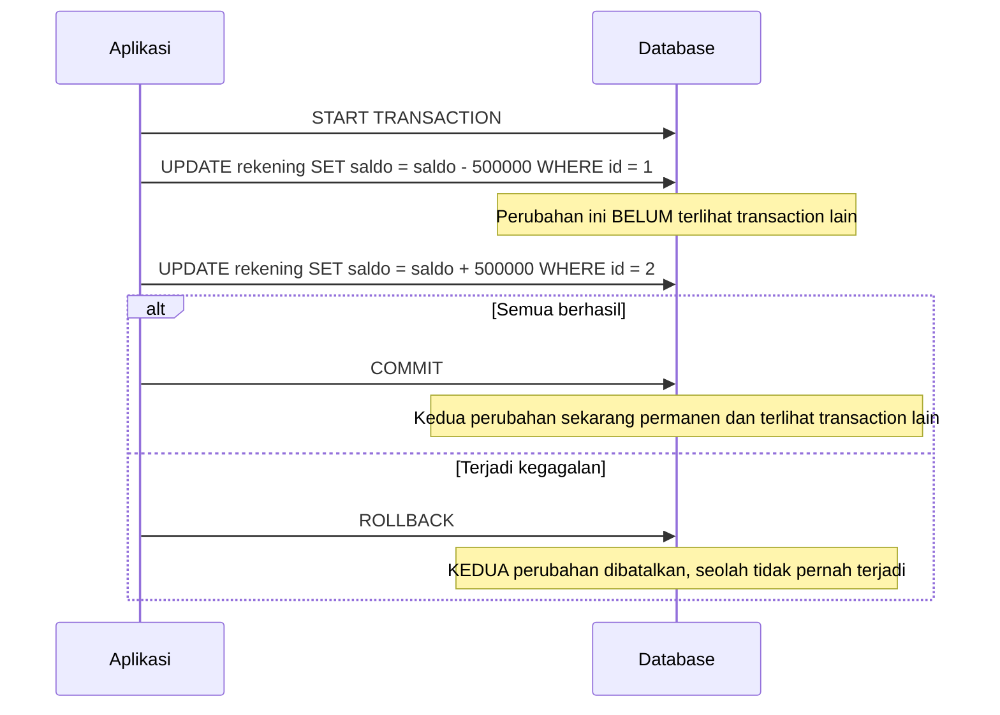

## TL;DR

Transaction adalah sekelompok operasi database yang harus dianggap sebagai **satu unit tunggal** — semuanya berhasil (`COMMIT`), atau semuanya dibatalkan seolah tidak pernah terjadi (`ROLLBACK`). Tidak ada keadaan "separuh berhasil" yang terlihat oleh siapa pun di luar transaction itu. Ini krusial begitu sebuah operasi bisnis butuh mengubah **lebih dari satu baris atau tabel** secara bersamaan — memindahkan saldo antar rekening, membuat permohonan sekaligus mencatat log auditnya, mengurangi stok sekaligus mencatat pesanan. Tanpa transaction, kegagalan di tengah proses (koneksi putus, server crash, error validasi) bisa meninggalkan database dalam keadaan yang secara bisnis tidak pernah seharusnya ada — uang hilang dari satu rekening tanpa pernah masuk ke rekening tujuan.

## The Problem

Sebuah fungsi "transfer saldo antar rekening" ditulis sebagai dua `UPDATE` terpisah, tanpa transaction:

```go
db.ExecContext(ctx, "UPDATE rekening SET saldo = saldo - ? WHERE id = ?", jumlah, rekeningAsal)
db.ExecContext(ctx, "UPDATE rekening SET saldo = saldo + ? WHERE id = ?", jumlah, rekeningTujuan)
```

Ini bekerja sempurna selama tidak ada yang gagal di antara dua baris itu. Tapi bayangkan server aplikasi crash, koneksi database terputus, atau `UPDATE` kedua gagal karena constraint tertentu — persis **setelah** `UPDATE` pertama berhasil dieksekusi. Hasilnya: saldo sudah berkurang dari rekening asal, tapi **tidak pernah** bertambah di rekening tujuan. Uang itu tidak hilang secara fisik — ia hilang secara **logis**, karena tidak ada satu unit kerja yang menjamin kedua perubahan ini terjadi bersama-sama atau tidak sama sekali. Membungkus keduanya dalam satu transaction memastikan: kalau `UPDATE` kedua gagal apa pun alasannya, `UPDATE` pertama otomatis dibatalkan juga — database kembali ke keadaan seolah transfer itu tidak pernah dicoba.

## Intuition

Bayangkan transaction seperti **draft email dengan tombol kirim** — kamu bisa menulis, mengedit, menghapus, menulis ulang berkali-kali, dan **tidak ada satu pun** perubahan itu yang terlihat penerima sampai kamu menekan "kirim" (`COMMIT`). Kalau kamu menutup aplikasi tanpa menekan kirim (`ROLLBACK`, atau kegagalan yang memicu rollback otomatis), draft itu hilang seluruhnya — penerima tidak pernah tahu draft itu pernah ada, apalagi melihat versi setengah jadi.

Analogi ini bocor pada satu hal: draft email hanya kamu sendiri yang melihatnya sebelum dikirim — tidak ada "penerima lain" yang bisa mengintip draft-mu di tengah proses menulis. Database dengan **banyak transaction berjalan bersamaan** justru harus secara eksplisit mendefinisikan **seberapa banyak** satu transaction boleh "mengintip" perubahan transaction lain yang belum di-`COMMIT` — inilah yang diatur oleh isolation level, dibahas terpisah di [[Basic Isolation Levels]]. Analogi draft email tidak menyiratkan ada spektrum "sedikit mengintip" sampai "tidak mengintip sama sekali"; realitas transaction database justru punya spektrum itu, dan pilihannya punya trade-off nyata.

## How It Works

```sql
START TRANSACTION;

UPDATE rekening SET saldo = saldo - 500000 WHERE id = 1;
UPDATE rekening SET saldo = saldo + 500000 WHERE id = 2;

COMMIT;
```

Kalau terjadi error di antara `START TRANSACTION` dan `COMMIT` — baik error yang dideteksi aplikasi (validasi gagal) maupun error dari database sendiri (constraint violation, deadlock) — aplikasi memanggil `ROLLBACK` secara eksplisit, atau koneksi yang terputus tanpa `COMMIT` membuat database melakukan rollback otomatis:

```sql
START TRANSACTION;

UPDATE rekening SET saldo = saldo - 500000 WHERE id = 1;
-- misalkan di titik ini terjadi error yang tidak terduga
ROLLBACK;  -- kembalikan rekening id=1 ke saldo semula, seolah UPDATE di atas tidak pernah terjadi
```



Diagram ini menekankan poin paling penting: `ROLLBACK` membatalkan **seluruh** perubahan sejak `START TRANSACTION`, bukan hanya operasi terakhir — itulah yang membuat transfer saldo aman dari kegagalan parsial.

## In Go

```go
package main

import (
	"context"
	"database/sql"
	"fmt"
)

// TransferSaldo membungkus kedua UPDATE dalam satu transaction. Pola
// "defer tx.Rollback()" aman dipanggil bahkan setelah tx.Commit() berhasil —
// Go database/sql akan mengabaikannya karena transaction sudah selesai.
func TransferSaldo(ctx context.Context, db *sql.DB, rekeningAsal, rekeningTujuan int, jumlah int64) error {
	tx, err := db.BeginTx(ctx, nil)
	if err != nil {
		return fmt.Errorf("mulai transaction transfer saldo: %w", err)
	}
	defer tx.Rollback() // no-op kalau tx.Commit() sudah berhasil dipanggil

	if _, err := tx.ExecContext(ctx, "UPDATE rekening SET saldo = saldo - ? WHERE id = ?", jumlah, rekeningAsal); err != nil {
		return fmt.Errorf("kurangi saldo rekening asal %d: %w", rekeningAsal, err)
	}

	if _, err := tx.ExecContext(ctx, "UPDATE rekening SET saldo = saldo + ? WHERE id = ?", jumlah, rekeningTujuan); err != nil {
		return fmt.Errorf("tambah saldo rekening tujuan %d: %w", rekeningTujuan, err)
	}

	if err := tx.Commit(); err != nil {
		return fmt.Errorf("commit transaction transfer saldo: %w", err)
	}
	return nil
}
```

`defer tx.Rollback()` diletakkan **segera setelah** `BeginTx` berhasil, sebelum operasi apa pun dijalankan — ini pola idiomatic Go untuk transaction: kalau fungsi keluar lewat jalur mana pun sebelum `tx.Commit()` berhasil (return awal karena error, panic, dsb.), `Rollback()` yang di-defer akan otomatis membatalkan transaction. Kalau `Commit()` sudah berhasil, `Rollback()` yang dipanggil setelahnya dijamin aman (`sql.ErrTxDone`, diabaikan) — tidak perlu logika kondisional rumit untuk menghindari "rollback setelah commit".

## In His Stack

Yii2 `ActiveRecord` menyediakan `Yii::$app->db->transaction(function($db) { ... })` sebagai pembungkus yang otomatis melakukan commit kalau closure selesai tanpa exception, dan rollback otomatis kalau closure melempar exception apa pun — pola yang secara semantik identik dengan `defer tx.Rollback()` di Go, hanya diekspresikan lewat exception alih-alih nilai return error. Jebakan yang umum di kode Yii2 lama: memanggil beberapa `->save()` `ActiveRecord` terpisah tanpa membungkusnya dalam `transaction()` sama sekali — persis skenario "The Problem" di note ini, hanya dengan sintaks PHP alih-alih Go.

## Trade-offs and When Not To Use It

Transaction yang dibuka lebih lama dari yang perlu (menahan koneksi database, melakukan panggilan lambat seperti HTTP request ke sistem lain di **dalam** transaction) menahan lock lebih lama, meningkatkan risiko [[Deadlocks|deadlock]] dan menurunkan throughput sistem secara keseluruhan — transaction harus dibuka **sesingkat mungkin**, hanya membungkus operasi database yang benar-benar butuh atomicity, bukan seluruh alur bisnis. Untuk operasi yang secara alami sudah tunggal (satu `INSERT`, satu `UPDATE` pada satu baris), transaction eksplisit tidak dibutuhkan — mesin database sudah memperlakukan setiap statement tunggal sebagai transaction implisit dengan sendirinya.

## Common Mistakes

> [!warning] Jebakan
> Menjalankan beberapa operasi yang secara logis harus atomik sebagai statement terpisah tanpa transaction — kegagalan parsial bisa meninggalkan database dalam keadaan yang secara bisnis tidak pernah seharusnya ada.

> [!warning] Jebakan
> Menahan transaction terbuka selama operasi lambat yang tidak perlu (memanggil API eksternal, menunggu antrean lama) di dalamnya — memperpanjang waktu lock ditahan dan meningkatkan risiko deadlock atau bottleneck koneksi.

> [!warning] Jebakan
> Lupa memanggil `Rollback()` (atau setara pembungkus otomatisnya) pada jalur error, sehingga transaction yang gagal di tengah tetap menahan koneksi dan lock tanpa pernah benar-benar dibatalkan sampai koneksi timeout.

## Exercises

1. Jelaskan kenapa dua `UPDATE` terpisah tanpa transaction bisa meninggalkan database dalam keadaan yang tidak konsisten, meski masing-masing `UPDATE` individual berhasil dieksekusi dengan benar.
2. Kenapa pola `defer tx.Rollback()` aman dipanggil di Go meskipun `tx.Commit()` sudah berhasil sebelumnya?
3. Kenapa transaction sebaiknya tidak menahan panggilan HTTP ke sistem eksternal di dalamnya?
4. Desain terbuka: sebuah alur "ajukan permohonan" harus melakukan tiga hal atomik: menyimpan data permohonan, mengurangi kuota harian instansi, dan mengirim notifikasi ke petugas terkait. Notifikasi dikirim lewat panggilan HTTP ke layanan pesan terpisah yang kadang lambat atau gagal. Rancang bagaimana transaction database seharusnya dibatasi cakupannya untuk alur ini, dan jelaskan di mana pengiriman notifikasi seharusnya diletakkan relatif terhadap transaction itu.

> [!success]- Kunci jawaban
> **1.** Kedua `UPDATE` individual bisa "berhasil" secara teknis (masing-masing adalah statement SQL yang valid dan tereksekusi tanpa error saat dijalankan), tapi kegagalan bisa terjadi **di antara** keduanya — server crash, koneksi putus, atau proses aplikasi dihentikan paksa setelah `UPDATE` pertama commit (implisit, sebagai statement tunggal) tapi sebelum `UPDATE` kedua sempat dijalankan. Tanpa transaction yang membungkus keduanya sebagai satu unit, database tidak punya cara "mengetahui" bahwa dua perubahan ini seharusnya selalu terjadi bersama.
> **4.** Transaction database seharusnya **hanya** membungkus penyimpanan data permohonan dan pengurangan kuota — dua operasi yang benar-benar butuh atomicity terhadap database yang sama. Pengiriman notifikasi (panggilan HTTP eksternal yang lambat/tidak reliable) harus dilakukan **setelah** transaction berhasil di-`COMMIT`, di luar cakupan transaction — memasukkannya ke dalam transaction berarti lock database ditahan selama panggilan HTTP berlangsung, dan kegagalan layanan notifikasi (yang berada di luar kendali langsung operasi database) tidak seharusnya membatalkan permohonan yang sudah sah tersimpan. Kalau notifikasi gagal terkirim, itu ditangani terpisah lewat mekanisme retry atau job asinkron — bukan dengan me-rollback permohonan yang sebenarnya valid. Pola yang lebih matang untuk menjamin notifikasi benar-benar terkirim tanpa menahan transaction adalah [[../30 APIs and Web/The Transactional Outbox Pattern|transactional outbox]], dibahas di level intermediate.

## Self-Check

- Apa yang dijamin transaction yang tidak dijamin oleh serangkaian statement SQL terpisah?
- Apa fungsi `COMMIT` dan `ROLLBACK`, dan kapan masing-masing dipanggil?
- Kenapa transaction sebaiknya dibuka sesingkat mungkin?
- Kenapa pemanggilan sistem eksternal yang lambat sebaiknya tidak dilakukan di dalam transaction database?

## Connected Notes

- [[Index Basics]] — index yang dibahas sebelumnya juga ikut diperbarui secara atomik di dalam transaction yang sama dengan data tabelnya.
- [[ACID]] — transaction adalah unit yang menjadi subjek dari keempat jaminan ACID; note ini prasyarat langsung untuk memahaminya.
- [[Basic Isolation Levels]] — mengatur seberapa banyak sebuah transaction "boleh melihat" perubahan dari transaction lain yang berjalan bersamaan, sesuatu yang disinggung di bagian Intuition note ini.
- [[Deadlocks]] — risiko langsung dari transaction yang menahan lock terlalu lama atau dalam urutan yang tidak konsisten, dibahas mendalam di level intermediate.
- [[Upserts]] — salah satu contoh operasi tunggal yang atomicity-nya sudah dijamin database tanpa perlu transaction eksplisit tambahan.

## Further Reading

- Dokumentasi resmi MySQL/MariaDB dan PostgreSQL, bagian "Transactions" — referensi lengkap sintaks dan perilaku `START TRANSACTION`/`COMMIT`/`ROLLBACK`.
- Dokumentasi `database/sql` Go, bagian `Tx` — pola idiomatic transaction di Go.

## Catatan Saya

*Tulis di sini alur bisnis di kerjaanmu yang melibatkan lebih dari satu perubahan database sekaligus — apakah sudah dibungkus transaction dengan benar?*
