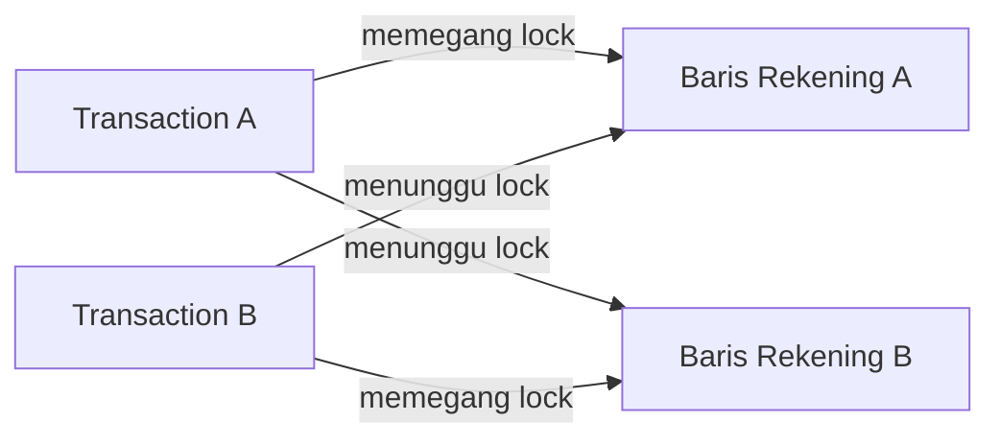

## TL;DR

Deadlock terjadi ketika dua (atau lebih) transaction saling menunggu lock yang dipegang satu sama lain — Transaction A menahan lock pada Baris 1 dan menunggu lock pada Baris 2, sementara Transaction B menahan lock pada Baris 2 dan menunggu lock pada Baris 1. Tidak satu pun bisa lanjut, dan tidak satu pun akan pernah bisa lanjut tanpa intervensi. Inilah kenapa database tidak membiarkan situasi ini berlangsung selamanya: ia secara aktif mendeteksi siklus tunggu-menunggu ini dan **memaksa membatalkan** salah satu transaction (dipilih lewat heuristik seperti "transaction termuda" atau "transaction dengan lock paling sedikit"), melepaskan lock-nya supaya transaction lain bisa lanjut. Deadlock bukan bug database — ia adalah konsekuensi tak terhindarkan dari locking konkuren, dan penyebabnya hampir selalu ada di kode aplikasi: urutan mengunci baris yang tidak konsisten antar transaction berbeda.

## The Problem

Dua endpoint berbeda memproses transfer saldo antar rekening. Endpoint "Transfer A ke B" mengunci baris rekening A lebih dulu (untuk mengurangi saldonya), lalu mengunci baris rekening B (untuk menambah saldonya). Endpoint "Transfer B ke A", ditulis terpisah oleh developer lain tanpa koordinasi, mengunci baris rekening B lebih dulu, lalu rekening A. Ketika kedua endpoint ini dipanggil hampir bersamaan (transfer A→B dan transfer B→A terjadi di waktu yang sama), Transaction pertama berhasil mengunci A dan menunggu B. Transaction kedua berhasil mengunci B dan menunggu A. Keduanya saling menunggu lock yang dipegang satu sama lain, tanpa jalan keluar kecuali salah satunya dipaksa gagal.

Ini bukan skenario langka atau eksotis — di sistem dengan banyak endpoint yang masing-masing mengunci lebih dari satu baris, ditulis oleh developer berbeda tanpa konvensi eksplisit soal urutan locking, deadlock adalah **kepastian statistik**, bukan kemungkinan jauh. Semakin tinggi concurrency dan semakin banyak baris yang dikunci per transaction, semakin sering deadlock terjadi. Tanpa penanganan yang benar di sisi aplikasi, transaction yang gagal akibat deadlock hanya terlihat sebagai error acak yang "kadang muncul, kadang tidak", membingungkan siapa pun yang mencoba mereproduksinya secara konsisten.

## Intuition

Bayangkan deadlock seperti **dua mobil di jalan sempit satu jalur yang saling berhadapan**, masing-masing menunggu yang lain mundur duluan. Tidak ada yang salah dengan keputusan masing-masing pengemudi secara individual (keduanya menunggu dengan sopan), tapi kalau tidak ada yang mengalah, keduanya terjebak selamanya. Solusi jangka pendek: satu pihak berwenang (petugas lalu lintas, atau di database, *deadlock detector*) turun tangan dan memaksa salah satu mobil mundur. Solusi jangka panjang yang sebenarnya dibutuhkan: aturan lalu lintas yang mencegah situasi berhadapan ini terjadi sejak awal — misalnya, aturan "mobil yang menuju utara selalu punya prioritas jalan di jalur ini", yang setara dengan menyepakati **urutan locking yang konsisten** di seluruh aplikasi.

Analogi ini bocor pada satu hal: petugas lalu lintas manusia butuh waktu untuk menyadari situasi macet dan turun tangan. Deadlock detector database bekerja jauh lebih cepat dan otomatis: ia secara aktif memantau graf ketergantungan lock (siapa menunggu siapa) dan begitu mendeteksi siklus, langsung memutuskan salah satu transaction untuk dibatalkan, biasanya dalam hitungan milidetik hingga detik, jauh sebelum "kemacetan" ini terasa sebagai downtime yang signifikan bagi pengguna. Meski begitu, ia tetap terasa sebagai request yang gagal dan perlu ditangani.

## How It Works



Diagram ini menunjukkan siklus tunggu-menunggu klasik: `Transaction A` menunggu sesuatu yang dipegang `Transaction B`, dan `Transaction B` menunggu sesuatu yang dipegang `Transaction A` — sebuah siklus tertutup dalam graf ketergantungan yang, kalau dibiarkan, tidak akan pernah terselesaikan sendiri.

Baik MySQL/InnoDB maupun PostgreSQL menjalankan **deadlock detector** yang berjalan berkala memeriksa graf tunggu-menunggu ini. Begitu siklus terdeteksi, satu transaction dipilih sebagai "korban" (biasanya yang paling murah dibatalkan, misalnya yang paling sedikit mengubah data atau yang paling baru dimulai) dan dipaksa `ROLLBACK` secara otomatis oleh database, mengembalikan error spesifik ke aplikasi (`Error 1213: Deadlock found` di MySQL, kode SQLSTATE `40P01` di PostgreSQL). Transaction yang menang melanjutkan seperti biasa begitu lock yang ditunggunya dilepas oleh korban yang dibatalkan.

**Kenapa urutan locking yang konsisten menghilangkan deadlock**: kalau **setiap** transaction di seluruh aplikasi selalu mengunci baris dalam urutan yang sama (misalnya selalu berdasarkan `id` rekening yang lebih kecil dulu, tanpa peduli mana yang "sumber" dan mana yang "tujuan" transfer), siklus tunggu-menunggu secara matematis tidak mungkin terbentuk. Transaction yang mengunci baris dengan `id` lebih kecil lebih dulu tidak akan pernah menunggu transaction lain yang juga mengikuti urutan yang sama, karena keduanya "antre" dalam arah yang identik.

## Under The Hood

Selain deadlock lock murni (dua transaction saling menunggu row lock), ada bentuk lain yang kurang jelas: **lock queue starvation** dan **deadlock yang melibatkan gap lock** (di InnoDB, terkait next-key locking yang disinggung di [[Locking and Row Locks]]). Dua transaction yang masing-masing menyisipkan baris baru ke rentang yang tumpang tindih bisa saling menunggu gap lock satu sama lain — sebuah bentuk deadlock yang tidak melibatkan baris yang sudah ada sama sekali, murni soal celah (gap) di antara baris-baris index. Ini salah satu alasan kenapa deadlock bisa terasa "muncul entah dari mana" pada operasi `INSERT` yang terlihat independen satu sama lain di permukaan.

Deadlock timeout (parameter seperti `innodb_lock_wait_timeout` di MySQL) adalah mekanisme **terpisah** dari deadlock detector. Timeout menangani kasus transaction yang menunggu lock terlalu lama (mungkin karena transaction lain yang menahan lock itu sedang lambat karena alasan lain, bukan karena deadlock sungguhan), sementara deadlock detector secara spesifik mencari **siklus** tunggu-menunggu. Keduanya bisa sama-sama menyebabkan transaction gagal, tapi dengan pesan error dan penyebab akar yang berbeda — penting dibedakan saat mendiagnosis mengapa sebuah transaction gagal.

## In Go

```go
package transfer

import (
	"context"
	"database/sql"
	"errors"
	"fmt"
	"strings"
	"time"
)

// TransferSaldo SELALU mengunci baris berdasarkan urutan id yang lebih kecil
// dulu, TERLEPAS dari mana yang menjadi sumber dan mana yang tujuan transfer
// secara bisnis — ini yang menghilangkan kemungkinan deadlock antar dua
// transfer berlawanan arah (A ke B dan B ke A) yang berjalan bersamaan.
func TransferSaldo(ctx context.Context, db *sql.DB, idSumber, idTujuan int64, jumlah int64) error {
	idPertama, idKedua := idSumber, idTujuan
	if idPertama > idKedua {
		idPertama, idKedua = idKedua, idPertama
	}

	const percobaanMaks = 3
	for percobaan := 1; percobaan <= percobaanMaks; percobaan++ {
		err := jalankanTransfer(ctx, db, idPertama, idKedua, idSumber, idTujuan, jumlah)
		if err == nil {
			return nil
		}
		if !errDeadlock(err) {
			return fmt.Errorf("transfer saldo: %w", err)
		}
		// Deadlock terdeteksi database — ini BUKAN bug logika, ini sinyal
		// untuk mengulang transaction dari awal setelah jeda singkat.
		time.Sleep(time.Duration(percobaan) * 20 * time.Millisecond)
	}
	return fmt.Errorf("transfer saldo gagal setelah %d percobaan akibat deadlock berulang", percobaanMaks)
}

func jalankanTransfer(ctx context.Context, db *sql.DB, idPertama, idKedua, idSumber, idTujuan, jumlah int64) error {
	tx, err := db.BeginTx(ctx, nil)
	if err != nil {
		return fmt.Errorf("mulai transaction transfer: %w", err)
	}
	defer tx.Rollback()

	// Mengunci kedua baris dalam urutan id yang konsisten, BUKAN urutan
	// sumber-lalu-tujuan yang bisa terbalik tergantung arah transfer.
	if _, err := tx.ExecContext(ctx, `SELECT id FROM rekening WHERE id IN (?, ?) ORDER BY id FOR UPDATE`, idPertama, idKedua); err != nil {
		return fmt.Errorf("kunci baris rekening: %w", err)
	}

	if _, err := tx.ExecContext(ctx, `UPDATE rekening SET saldo = saldo - ? WHERE id = ?`, jumlah, idSumber); err != nil {
		return fmt.Errorf("kurangi saldo sumber: %w", err)
	}
	if _, err := tx.ExecContext(ctx, `UPDATE rekening SET saldo = saldo + ? WHERE id = ?`, jumlah, idTujuan); err != nil {
		return fmt.Errorf("tambah saldo tujuan: %w", err)
	}

	return tx.Commit()
}

// errDeadlock memeriksa apakah error yang dikembalikan database adalah
// deadlock — pemeriksaan sesungguhnya di produksi sebaiknya memakai
// pemeriksaan kode error spesifik driver (misalnya errors.As ke tipe error
// MySQL/pgx yang menyediakan kode SQLSTATE), bukan string matching seperti
// contoh sederhana ini.
func errDeadlock(err error) bool {
	return err != nil && strings.Contains(strings.ToLower(err.Error()), "deadlock")
}
```

## In His Stack

Sistem dengan banyak endpoint yang ditulis developer berbeda (persis konteks 13 aplikasi dengan 10+ developer) sangat rentan terhadap deadlock justru **karena** tidak ada koordinasi eksplisit soal urutan locking antar tim. Developer yang menulis endpoint transfer A-ke-B dan developer yang menulis endpoint transfer B-ke-A mungkin tidak pernah berkomunikasi langsung, dan masing-masing menulis kode yang benar secara terisolasi. Menetapkan **konvensi tertulis** (misalnya, "selalu kunci baris berdasarkan urutan primary key menaik, tidak peduli urutan bisnisnya") sebagai bagian dari standar kode lintas tim (lihat [[../90 Architecture and Design/Cross-Team Code Standards|Cross-Team Code Standards]]) adalah pencegahan yang jauh lebih murah dibanding menangani deadlock secara reaktif setelah insiden production.

## Trade-offs and When Not To Use It

Menghilangkan deadlock sepenuhnya lewat urutan locking yang konsisten butuh disiplin lintas seluruh basis kode — satu endpoint yang lupa mengikuti konvensi ini cukup untuk membuka kembali kemungkinan deadlock. Untuk sistem yang sangat besar dengan banyak tim independen, mengandalkan retry (seperti pada kode Go di atas) sebagai jaring pengaman **selain** urutan locking yang konsisten adalah pendekatan yang lebih realistis daripada berharap disiplin manual tanpa cacat di semua tempat. Retry sendiri bukan solusi gratis — ia menambah latensi (transaction yang gagal harus diulang dari awal) dan mengasumsikan operasi yang di-retry bersifat aman diulang (idempotent dari sisi efek yang sudah ter-`commit` sebagian, yang seharusnya tidak terjadi kalau `ROLLBACK` benar-benar membatalkan seluruh perubahan transaction yang gagal).

## Common Mistakes

> [!warning] Jebakan
> Menulis dua endpoint berbeda yang mengunci baris yang sama tapi dalam urutan berlawanan (tergantung arah operasi bisnis), tanpa konvensi eksplisit urutan locking lintas kode — membuka kemungkinan deadlock yang hanya muncul di production dengan concurrency nyata, jarang tertangkap saat testing manual satu-per-satu.

> [!warning] Jebakan
> Menangkap error deadlock sebagai error generik dan menampilkannya sebagai kegagalan permanen ke pengguna, tanpa retry — deadlock seringkali transient (kondisi sesaat akibat timing), dan retry dengan backoff singkat biasanya berhasil pada percobaan berikutnya.

> [!warning] Jebakan
> Menahan transaction terbuka lama sambil melakukan operasi lambat (memanggil API eksternal) di antara mengunci baris pertama dan baris kedua — memperbesar jendela waktu di mana transaction lain bisa mulai menunggu lock yang ditahan, meningkatkan kemungkinan deadlock murni karena durasi lock yang tidak perlu panjang.

## Exercises

1. Jelaskan kenapa deadlock adalah "kepastian statistik" pada sistem dengan banyak endpoint yang mengunci lebih dari satu baris, bukan kemungkinan langka.
2. Bagaimana urutan locking yang konsisten (misalnya selalu berdasarkan id menaik) menghilangkan kemungkinan deadlock secara matematis?
3. Apa perbedaan deadlock detector dan lock wait timeout, dan kenapa keduanya perlu dibedakan saat mendiagnosis kegagalan transaction?
4. Desain terbuka: sistemmu punya fitur "tukar posisi antrean" di mana dua permohonan bisa saling bertukar nomor urut (permohonan A mengambil posisi permohonan B, dan sebaliknya) — operasi yang secara inheren melibatkan dua baris sekaligus, dipanggil dari banyak endpoint berbeda oleh developer berbeda seiring waktu. Rancang konvensi locking yang mencegah deadlock untuk fitur ini, dan jelaskan bagaimana konvensi itu tetap perlu dikombinasikan dengan retry sebagai jaring pengaman.

> [!success]- Kunci jawaban
> **1.** Setiap transaction yang mengunci lebih dari satu baris punya kemungkinan (betapapun kecil per kejadian) untuk tumpang tindih dengan transaction lain yang mengunci baris-baris yang sama dalam urutan berbeda. Pada volume traffic tinggi dengan banyak transaction konkuren, bahkan probabilitas kecil per pasangan transaction terakumulasi menjadi kejadian yang pasti terjadi berkali-kali dalam periode waktu yang wajar. Ini mirip prinsip di balik "birthday paradox": kemungkinan tabrakan meningkat jauh lebih cepat dari intuisi seiring bertambahnya jumlah percobaan (di sini, jumlah transaction konkuren).
> **4.** Konvensi yang mencegah deadlock: fungsi yang menangani tukar posisi antrean **harus selalu** mengurutkan kedua ID permohonan yang terlibat (misalnya berdasarkan `id` numerik menaik) sebelum mengunci baris manapun, dan mengunci dalam urutan itu — tidak peduli permohonan mana yang "meminta" pertukaran dan mana yang "menerima". Ini memastikan dua panggilan tukar posisi yang melibatkan pasangan ID yang sama (dari dua endpoint atau dua request berbeda) selalu mengunci dalam urutan identik, menghilangkan siklus tunggu-menunggu. Namun ini tidak menghilangkan kebutuhan retry sepenuhnya: kalau ada bug di endpoint lain (ditulis developer yang tidak mengikuti konvensi ini, atau kode lama yang belum diperbarui) yang tetap mengunci dalam urutan berbeda, deadlock tetap bisa terjadi dari sisi itu. Retry dengan backoff di seluruh operasi yang melibatkan locking multi-baris tetap jadi jaring pengaman yang wajar terlepas dari seberapa disiplin konvensi diikuti, karena disiplin manusia lintas banyak developer tidak pernah sempurna.

## Self-Check

- Kenapa deadlock bukan bug database, melainkan konsekuensi tak terhindarkan dari locking konkuren?
- Bagaimana database mendeteksi dan menyelesaikan deadlock secara otomatis?
- Kenapa urutan locking yang konsisten menghilangkan kemungkinan deadlock secara matematis?
- Apa perbedaan deadlock detector dan lock wait timeout?

## Connected Notes

- [[Locking and Row Locks]] — deadlock adalah risiko langsung dari row lock yang ditahan lebih dari satu transaction secara bersilangan, dibahas di note sebelumnya.
- [[MVCC]] — MVCC mengurangi jenis lock yang dibutuhkan (baca tidak perlu lock), tapi tidak menghilangkan kemungkinan deadlock dari locking tulis-tulis yang tetap dibutuhkan.
- [[The N+1 Query Problem]] — transaction dengan banyak query berurutan yang menahan lock lebih lama (mirip pola N+1) memperbesar jendela kemungkinan deadlock.
- [[../90 Architecture and Design/Cross-Team Code Standards|Cross-Team Code Standards]] — konvensi urutan locking lintas tim adalah salah satu bentuk konkret standar kode yang dibahas lebih luas di note senior itu.
- [[../50 Concurrency and Performance/_Overview|Concurrency and Performance Overview]] — retry dengan backoff untuk deadlock adalah pola yang sama dengan retry untuk kegagalan transient lain yang dibahas di domain itu.

## Further Reading

- Dokumentasi resmi MySQL/InnoDB, bagian "Deadlocks in InnoDB" dan cara membaca `SHOW ENGINE INNODB STATUS`.
- Dokumentasi resmi PostgreSQL, bagian "Deadlocks".

## Catatan Saya

*Tulis di sini apakah pernah ada insiden deadlock di kerjaanmu — endpoint apa yang terlibat, dan apakah penyebabnya urutan locking yang tidak konsisten seperti dibahas di note ini.*
