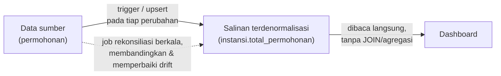

## TL;DR

Denormalisasi berarti sengaja menyimpang dari 3NF — menyalin atau menyimpan data yang **bisa dihitung ulang lewat join atau agregasi** — demi mengurangi biaya baca. Ini bukan kemalasan atau kegagalan desain; ia keputusan trade-off eksplisit: kamu menukar risiko inkonsistensi (data salinan yang bisa jadi tidak sinkron) dengan performa baca yang lebih baik. Bedanya dengan skema yang "kebetulan" melanggar 3NF karena tidak dipikirkan (seperti contoh di [[Normalisation 1NF to 3NF]]) adalah: denormalisasi yang sengaja **selalu punya rencana eksplisit** untuk menjaga salinan itu tetap sinkron — lewat trigger, job terjadwal, atau disiplin di lapisan aplikasi — dan didokumentasikan sebagai keputusan, bukan ditemukan sebagai kejutan.

## The Problem

Dashboard beranda menampilkan "jumlah total permohonan" untuk setiap instansi, dan halaman ini diakses ribuan kali per hari oleh ratusan pengguna internal. Versi ternormalisasi penuh menghitungnya lewat `COUNT()` real-time:

```sql
SELECT i.nama, COUNT(p.id) AS total
FROM instansi i
LEFT JOIN permohonan p ON p.instansi_id = i.id
GROUP BY i.nama;
```

Query ini benar dan selalu akurat — tapi begitu tabel `permohonan` bertumbuh sampai jutaan baris, `COUNT()` yang dihitung ulang di **setiap** kunjungan dashboard mulai membebani database secara nyata, terutama saat banyak pengguna membuka dashboard bersamaan di jam sibuk. Tim memutuskan menambahkan kolom `total_permohonan` langsung di tabel `instansi`, di-increment setiap ada permohonan baru (memakai upsert atomik, lihat [[Upserts]]) — dashboard sekarang cukup `SELECT nama, total_permohonan FROM instansi`, tanpa `JOIN` atau agregasi sama sekali. Trade-off yang diterima secara sadar: kalau proses increment gagal di satu titik (misalnya permohonan dihapus lewat jalur lain yang lupa mengurangi counter), `total_permohonan` bisa perlahan menyimpang dari jumlah baris sebenarnya — risiko yang diterima demi performa baca yang jauh lebih baik, dan dimitigasi lewat job rekonsiliasi berkala yang membandingkan `total_permohonan` dengan `COUNT()` sungguhan.

## Intuition

Bayangkan data ternormalisasi seperti **menghitung ulang kembalian setiap kali diminta**, dan data terdenormalisasi seperti **menyimpan angka kembalian yang sudah dihitung di kertas nota**, diperbarui setiap kali ada transaksi baru. Nota yang sudah dihitung jauh lebih cepat dibaca — tapi kalau ada transaksi yang lupa dicatat di nota, angkanya jadi salah, dan kesalahan itu **tidak terlihat** sampai seseorang repot-repot menghitung ulang dari awal untuk memverifikasi.

Analogi ini bocor pada satu hal: nota kertas di dunia nyata tidak punya cara otomatis untuk "menyegarkan diri" — begitu salah, ia tetap salah sampai seseorang menyadarinya secara manual. Data terdenormalisasi di sistem software **bisa** dirancang untuk menyegarkan diri secara otomatis (trigger database, job rekonsiliasi terjadwal, event-driven update) — bagian penting dari mendenormalisasi secara "sengaja" adalah justru merancang mekanisme penyegaran ini sejak awal, bukan berasumsi salinannya akan tetap benar selamanya tanpa perawatan.

## How It Works

Tiga pola umum denormalisasi:

**Kolom agregat yang di-cache** (seperti `total_permohonan` di "The Problem") — dijaga sinkron lewat upsert atomik setiap ada perubahan pada data sumbernya.

```sql
UPDATE instansi SET total_permohonan = total_permohonan + 1 WHERE id = ?;
```

**Snapshot nilai pada waktu tertentu** — bukan salinan yang harus disinkronkan, tapi memang seharusnya "membeku" (lihat pembahasan di [[Normalisation 1NF to 3NF]] tentang `harga_satuan_saat_pesanan`). Ini bukan denormalisasi yang berisiko drift, karena nilainya memang tidak dimaksudkan mengikuti sumber aslinya.

**Materialized view** — hasil query mahal (biasanya join atau agregasi kompleks) disimpan sebagai tabel fisik, di-refresh secara berkala atau saat trigger tertentu, bukan dihitung ulang tiap baca (dibahas lebih dalam di [[Materialised Views]], catatan intermediate).



Diagram ini menekankan bagian yang sering dilupakan: garis putus-putus job rekonsiliasi **wajib** ada sebagai jaring pengaman, bukan opsional — tanpa itu, drift yang tidak terdeteksi akan terus bertambah.

## In Go

```go
package main

import (
	"context"
	"database/sql"
	"fmt"
)

// SinkronkanTotalPermohonan adalah job rekonsiliasi yang dijalankan
// berkala (misalnya tiap malam) untuk memperbaiki drift antara kolom
// cache instansi.total_permohonan dan jumlah baris sebenarnya di
// permohonan — jaring pengaman untuk data yang sengaja didenormalisasi.
func SinkronkanTotalPermohonan(ctx context.Context, db *sql.DB) error {
	result, err := db.ExecContext(ctx, `
		UPDATE instansi i
		SET total_permohonan = (
			SELECT COUNT(*) FROM permohonan p WHERE p.instansi_id = i.id
		)
		WHERE i.total_permohonan <> (
			SELECT COUNT(*) FROM permohonan p WHERE p.instansi_id = i.id
		)
	`)
	if err != nil {
		return fmt.Errorf("sinkronkan total permohonan: %w", err)
	}
	baris, err := result.RowsAffected()
	if err != nil {
		return fmt.Errorf("baca rows affected sinkronisasi total permohonan: %w", err)
	}
	if baris > 0 {
		// Idealnya dicatat ke structured logging (lihat 70 Infrastructure and Delivery)
		// sebagai sinyal bahwa drift memang terjadi — bukan hanya diam-diam diperbaiki.
		fmt.Printf("rekonsiliasi memperbaiki %d baris instansi yang driftnya terdeteksi\n", baris)
	}
	return nil
}
```

## In His Stack

Laporan bulanan/tahunan di sistem legacy Yii1 sangat sering memakai tabel ringkasan terdenormalisasi yang di-generate lewat cron job semalam — pola ini sudah ada jauh sebelum istilah "materialized view" dikenal tim, dan sering tidak didokumentasikan sebagai keputusan sengaja, hanya "begitu cara laporan itu selalu dibuat". Kalau kamu mewarisi tabel semacam ini, langkah pertama yang berguna adalah memverifikasi: apakah proses penyegarannya masih berjalan (cron job masih aktif, tidak diam-diam gagal), dan apakah ada job rekonsiliasi sama sekali — banyak sistem lama yang hanya punya "salin sekali", tanpa mekanisme penyegaran berkelanjutan, yang berarti datanya makin lama makin basi tanpa siapa pun sadar.

## Trade-offs and When Not To Use It

Denormalisasi menambah kompleksitas nyata: setiap penulisan ke data sumber sekarang punya kewajiban tambahan (menjaga salinan tetap sinkron), dan setiap pembacaan data terdenormalisasi membawa risiko membaca nilai yang sedikit basi. Ini hanya layak dilakukan setelah **mengukur** bahwa versi ternormalisasi benar-benar jadi bottleneck nyata (lihat [[Reading EXPLAIN]] dan profiling performa) — mendenormalisasi secara preemptif "siapa tahu nanti lambat" menambah kompleksitas dan risiko inkonsistensi tanpa manfaat yang terbukti. Untuk data yang jarang dibaca, atau di mana akurasi real-time adalah syarat mutlak (misalnya saldo keuangan), risiko drift denormalisasi biasanya tidak sepadan dengan penghematan performanya.

## Common Mistakes

> [!warning] Jebakan
> Mendenormalisasi tanpa rencana eksplisit menjaga salinan tetap sinkron — ini bukan denormalisasi yang sengaja, ini hanya data yang akan perlahan menjadi salah tanpa siapa pun menyadarinya.

> [!warning] Jebakan
> Mendenormalisasi secara preemptif sebelum ada bukti nyata (lewat profiling atau `EXPLAIN`) bahwa versi ternormalisasi memang jadi bottleneck — menambah kompleksitas dan risiko inkonsistensi tanpa manfaat yang terukur.

> [!warning] Jebakan
> Tidak menyediakan job rekonsiliasi sama sekali, mengandalkan sepenuhnya pada mekanisme sinkronisasi real-time (trigger, upsert) tanpa jaring pengaman — sekali mekanisme itu gagal di satu titik (bug, race condition, downtime), tidak ada cara mendeteksi atau memperbaiki drift-nya.

## Exercises

1. Jelaskan perbedaan antara "kolom yang melanggar 3NF karena tidak dipikirkan" dan "kolom yang sengaja didenormalisasi" — apa yang membedakan keduanya secara operasional, bukan hanya niat?
2. Kenapa job rekonsiliasi berkala dianggap wajib, bukan opsional, untuk data yang didenormalisasi?
3. Berikan satu contoh kasus di mana denormalisasi **tidak** layak dilakukan meskipun performanya akan membaik, dan jelaskan alasannya.
4. Desain terbuka: kamu mengelola dashboard nasional yang menampilkan "jumlah permohonan selesai hari ini" di seluruh 13+ aplikasi instansi, di-refresh tiap beberapa detik oleh banyak pengguna secara bersamaan. Menghitungnya real-time lewat `COUNT()` lintas 13+ database berbeda (masing-masing instansi punya database sendiri) terbukti terlalu lambat. Rancang strategi denormalisasi untuk kasus ini, termasuk bagaimana data dari 13+ sumber terpisah disatukan, seberapa "basi" data yang bisa diterima pengguna dashboard, dan bagaimana mendeteksi kalau salah satu dari 13+ sumber gagal mengirim update-nya.

> [!success]- Kunci jawaban
> **1.** Perbedaannya bukan bentuk skemanya (keduanya sama-sama menyimpan data yang "seharusnya" bisa dihitung ulang), tapi **keberadaan mekanisme sinkronisasi yang eksplisit dan terdokumentasi**. Kolom yang melanggar 3NF secara tidak sengaja tidak punya rencana apa pun untuk tetap sinkron — ia hanya salinan yang dibuat sekali dan dilupakan. Denormalisasi yang sengaja selalu disertai jawaban eksplisit untuk pertanyaan "siapa/apa yang menjaga ini tetap sinkron, dan apa yang terjadi kalau mekanisme itu gagal?"
> **4.** Strategi yang wajar: setiap instansi mengirim update ringkasan (bukan data mentah) ke sebuah tabel agregat pusat lewat mekanisme asynchronous (misalnya lewat message queue, lihat domain Messaging di level intermediate) setiap kali statusnya berubah, alih-alih dashboard pusat query langsung ke 13+ database secara real-time. Dashboard membaca dari tabel agregat pusat yang sudah "sedikit basi" (misalnya beberapa detik hingga semenit tertinggal) — kelambatan ini eksplisit diterima sebagai trade-off yang wajar untuk dashboard monitoring, bukan sistem yang butuh akurasi transaksional. Untuk mendeteksi instansi yang gagal mengirim update, tabel agregat pusat perlu menyimpan `waktu_update_terakhir` per instansi, dan dashboard (atau alerting terpisah) memberi peringatan eksplisit kalau `waktu_update_terakhir` sebuah instansi sudah melewati ambang batas wajar (misalnya lebih dari 10 menit) — membedakan "instansi ini memang belum ada permohonan baru" dari "mekanisme pengiriman update-nya diam-diam mati".

## Self-Check

- Apa yang membedakan denormalisasi yang sengaja dari skema yang kebetulan melanggar 3NF?
- Kenapa job rekonsiliasi berkala penting untuk data terdenormalisasi?
- Kapan denormalisasi sebaiknya tidak dilakukan, meskipun secara teori akan mempercepat pembacaan?
- Sebutkan tiga pola umum denormalisasi yang dibahas di note ini.

## Connected Notes

- [[Normalisation 1NF to 3NF]] — kontras langsung: note ini menjelaskan kapan menyimpangi normalisasi justru keputusan yang tepat, bukan kegagalan desain.
- [[Upserts]] — mekanisme teknis paling umum untuk menjaga kolom agregat terdenormalisasi tetap sinkron secara atomik.
- [[Materialised Views]] — bentuk denormalisasi yang lebih terstruktur dan didukung langsung oleh database, dibahas lebih dalam di level intermediate.
- [[Reading EXPLAIN]] — alat yang seharusnya dipakai untuk **membuktikan** kebutuhan denormalisasi sebelum melakukannya, bukan menebak.
- [[../50 Concurrency and Performance/_Overview|Concurrency and Performance Overview]] — caching (yang dibahas mendalam di domain itu) adalah saudara dekat denormalisasi: keduanya menukar konsistensi dengan performa baca.

## Further Reading

- Dokumentasi resmi PostgreSQL dan MySQL/MariaDB, bagian tentang trigger — mekanisme database-level untuk menjaga data terdenormalisasi tetap sinkron secara otomatis.

## Catatan Saya

*Tulis di sini tabel terdenormalisasi di kerjaanmu yang kamu curigai tidak lagi sinkron dengan sumber aslinya, dan bagaimana memverifikasinya.*
