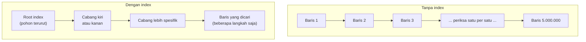

## TL;DR

Index adalah struktur data tambahan yang membiarkan database menemukan baris tanpa memindai seluruh tabel — ia mempercepat pembacaan dengan mengorbankan **ruang penyimpanan** (index butuh disk sendiri) dan **kecepatan tulis** (setiap `INSERT`/`UPDATE`/`DELETE` juga harus memperbarui setiap index yang relevan). Index bukan sesuatu yang "selalu bagus untuk ditambahkan" — index yang tidak pernah dipakai query nyata murni menambah biaya tulis dan ruang tanpa manfaat, dan index yang salah dirancang (kolom yang jarang selektif) bisa saja sama sekali tidak dipakai optimizer meski sudah ada.

## The Problem

Tabel `permohonan` sudah berisi lima juta baris. Query "cari permohonan berdasarkan `nomor_registrasi`" — dipakai puluhan kali per detik oleh sistem pelacakan status yang diakses publik — mulai memakan waktu beberapa detik per query, padahal secara logika seharusnya cukup mencocokkan satu nilai:

```sql
SELECT * FROM permohonan WHERE nomor_registrasi = '2026-00042';
```

Tanpa index, database tidak punya cara lain selain **memindai setiap baris** dari awal sampai akhir tabel, memeriksa satu per satu apakah `nomor_registrasi`-nya cocok — disebut *full table scan*. Pada tabel kecil ini tidak terasa; pada lima juta baris, ini jadi operasi yang jelas terasa lambat dan membebani database untuk setiap request yang datang bersamaan. Menambahkan index pada `nomor_registrasi` mengubah pencarian ini dari "periksa lima juta baris satu per satu" menjadi "telusuri struktur pohon terurut dalam beberapa langkah saja" — perbaikan yang secara kasar berskala logaritmik terhadap jumlah baris, bukan linear.

## Intuition

Bayangkan tabel tanpa index seperti **buku tanpa daftar isi atau indeks di belakang** — mencari topik tertentu berarti membaca dari halaman pertama sampai ketemu. Index seperti **daftar indeks di belakang buku**, tersusun alfabetis, menunjuk langsung ke nomor halaman yang relevan — kamu bisa lompat langsung ke sana tanpa membaca satu halaman pun sebelumnya.

Analogi ini bocor pada satu hal penting yang sering diabaikan: daftar indeks di buku **tidak perlu diperbarui** setiap kali buku itu dibaca ulang — ia statis begitu buku dicetak. Index database sebaliknya harus **terus diperbarui setiap kali data berubah** — setiap `INSERT` baris baru berarti entri baru harus disisipkan ke struktur index di posisi yang tepat (bukan sekadar ditambahkan di akhir), setiap `DELETE` berarti entri harus dihapus dari index juga. Buku dengan sepuluh daftar indeks berbeda tidak jadi sepuluh kali lebih mahal dicetak ulang tiap kali direvisi; tabel dengan sepuluh index jadi jelas lebih mahal setiap kali ditulis, karena kesepuluh index itu semua harus diperbarui bersamaan.

## How It Works

```sql
CREATE INDEX idx_permohonan_nomor_registrasi ON permohonan (nomor_registrasi);
```

Secara internal (dibahas lebih dalam untuk level intermediate di [[B+Tree Structure]]), kebanyakan index relasional adalah struktur pohon terurut — pencarian, penyisipan, dan penghapusan semuanya berjalan dalam waktu yang jauh lebih cepat daripada memindai seluruh tabel, tapi tidak gratis: setiap operasi tulis pada tabel juga berarti operasi tulis pada pohon index itu.



Diagram ini menunjukkan kontras bentuk pencarian: full table scan berjalan linear terhadap jumlah baris, sementara pencarian lewat index berjalan logaritmik — perbedaan yang makin dramatis makin besar tabelnya.

Primary key dan (biasanya) `UNIQUE` constraint otomatis membuat index — kamu tidak perlu membuatnya manual untuk kolom itu. Index perlu ditambahkan manual untuk kolom yang **sering dipakai sebagai syarat pencarian** (`WHERE`), **penggabungan** (`JOIN ... ON`), atau **pengurutan** (`ORDER BY`) — tapi tidak setiap kolom seperti itu layak diberi index.

## In Go

Index adalah keputusan skema, bukan sesuatu yang ditulis di kode Go per-query — tapi keputusan itu dituliskan lewat migration:

```go
package main

import (
	"context"
	"database/sql"
	"fmt"
)

// TambahIndexNomorRegistrasi adalah contoh migration yang menambahkan
// index setelah profiling nyata menunjukkan query pencarian nomor
// registrasi jadi bottleneck (lihat Reading EXPLAIN untuk cara memverifikasi).
func TambahIndexNomorRegistrasi(ctx context.Context, db *sql.DB) error {
	_, err := db.ExecContext(ctx, `
		CREATE INDEX idx_permohonan_nomor_registrasi ON permohonan (nomor_registrasi)
	`)
	if err != nil {
		return fmt.Errorf("buat index nomor_registrasi: %w", err)
	}
	return nil
}
```

> [!info]
> Menambahkan index pada tabel yang sudah sangat besar bisa mengunci tabel itu untuk waktu yang cukup lama tergantung mesin database dan versinya — ini persis skenario yang dibahas di [[../94 Case Studies/Case - The Report Query That Locks a Table During Business Hours|Case - The Report Query That Locks a Table During Business Hours]]. Di produksi, ini hampir selalu perlu dijadwalkan di luar jam sibuk atau memakai mekanisme online DDL kalau tersedia, bukan dijalankan begitu saja lewat migration otomatis saat deployment.

## In His Stack

Yii2 migration (`yii migrate/create`) menyediakan method `createIndex()` yang membuat index lewat kode PHP deklaratif — tapi method ini sama sekali tidak melindungi dari risiko locking tabel besar yang disebutkan di atas; ia hanya generator SQL `CREATE INDEX` biasa. Kalau kamu mengelola migrasi skema lintas 13+ aplikasi dengan volume data yang bervariasi liar (beberapa instansi baru berjalan setahun, beberapa sudah puluhan tahun), pertimbangan "index ini aman dibuat langsung, atau butuh strategi online DDL" harus dinilai per tabel, bukan diasumsikan seragam di semua instansi hanya karena skemanya identik.

## Trade-offs and When Not To Use It

Index tidak gratis: setiap index tambahan memperlambat setiap `INSERT`/`UPDATE`/`DELETE` pada tabel itu (karena index juga harus diperbarui), dan menambah kebutuhan ruang disk. Untuk tabel yang **jarang dibaca tapi sering ditulis** (misalnya tabel log mentah yang hampir tidak pernah di-query langsung, hanya diproses batch), menambahkan banyak index bisa memperlambat sistem secara keseluruhan tanpa manfaat baca yang sepadan. Index juga tidak membantu kalau kolomnya punya **selektivitas rendah** — misalnya kolom `jenis_kelamin` dengan hanya dua nilai kemungkinan di tabel jutaan baris: index di kolom ini biasanya tidak membantu banyak, karena mencocokkan satu nilai masih berarti "sekitar setengah tabel", dan optimizer sering memilih tetap melakukan full table scan yang lebih murah daripada menelusuri index yang tidak cukup selektif.

## Common Mistakes

> [!warning] Jebakan
> Menambahkan index ke setiap kolom yang "kelihatannya mungkin dicari nanti", tanpa bukti dari query nyata atau `EXPLAIN` — setiap index yang tidak dipakai murni menambah biaya tulis tanpa manfaat baca.

> [!warning] Jebakan
> Menambahkan index pada tabel produksi berukuran besar tanpa mempertimbangkan locking — bisa membuat tabel itu tidak bisa ditulis (atau bahkan dibaca, tergantung mesin database) selama proses pembuatan index berjalan.

> [!warning] Jebakan
> Menambahkan index pada kolom dengan selektivitas rendah (sedikit kemungkinan nilai berbeda dibanding jumlah baris) dengan harapan mempercepat query — optimizer sering tetap memilih full table scan karena index yang tidak selektif tidak benar-benar menghemat pekerjaan.

## Exercises

1. Kenapa `PRIMARY KEY` tidak perlu index tambahan secara manual?
2. Jelaskan kenapa menambahkan sepuluh index ke satu tabel bisa memperlambat aplikasi secara keseluruhan, meski setiap index secara individual mempercepat query tertentu.
3. Kolom `status` di tabel `permohonan` hanya punya tiga kemungkinan nilai (`'diajukan'`, `'diproses'`, `'selesai'`) di antara lima juta baris. Apakah index pada kolom ini layak dibuat? Jelaskan alasannya.
4. Desain terbuka: tim melaporkan endpoint "daftar permohonan milik instansi tertentu, difilter berdasarkan rentang tanggal, diurutkan dari terbaru" menjadi lambat setelah data bertambah. Kamu curiga index dibutuhkan, tapi belum tahu index seperti apa yang tepat. Jelaskan langkah investigasi yang akan kamu lakukan sebelum menambahkan index apa pun (bukan langsung menebak), dan index seperti apa yang paling mungkin dibutuhkan berdasarkan pola query ini.

> [!success]- Kunci jawaban
> **1.** `PRIMARY KEY` di hampir semua mesin database relasional otomatis diimplementasikan lewat index (biasanya B+Tree) — ini kebutuhan mendasar karena primary key dipakai terus-menerus untuk mencari baris spesifik (termasuk oleh foreign key di tabel lain yang merujuknya), jadi mesin database membuatnya otomatis tanpa perlu perintah `CREATE INDEX` terpisah.
> **3.** Kemungkinan besar tidak layak sebagai index tunggal — dengan hanya tiga nilai kemungkinan di antara lima juta baris, setiap nilai `status` mewakili sekitar sepertiga dari seluruh tabel (selektivitas sangat rendah). Optimizer kemungkinan besar akan memilih full table scan meski index ada, karena menelusuri index untuk mendapatkan ~1.6 juta baris yang cocok, lalu tetap harus mengambil detail tiap baris dari tabel, seringkali lebih mahal daripada langsung memindai seluruhnya. Index ini baru masuk akal kalau digabung dengan kolom lain yang lebih selektif dalam satu composite index (dibahas di [[Composite Indexes and the Leftmost-Prefix Rule]], level intermediate) — misalnya `(instansi_id, status)`, di mana kombinasi keduanya jauh lebih selektif daripada `status` sendirian.
> **4.** Langkah pertama: jalankan query yang sebenarnya dieksekusi endpoint itu lewat `EXPLAIN` (dibahas mendalam di [[Reading EXPLAIN]], level intermediate) untuk melihat apakah optimizer benar-benar melakukan full table scan, dan pada kolom mana. Berdasarkan pola query ("milik instansi tertentu" = `WHERE instansi_id = ?`, "rentang tanggal" = `WHERE tanggal BETWEEN ? AND ?`, "diurutkan terbaru" = `ORDER BY tanggal DESC`), composite index `(instansi_id, tanggal)` kemungkinan besar paling tepat — `instansi_id` sebagai kolom penyaring utama yang selektif, `tanggal` sebagai kolom kedua yang sekaligus membantu `WHERE ... BETWEEN` dan `ORDER BY` tanpa perlu sort terpisah. Tapi ini tetap perlu diverifikasi lewat `EXPLAIN` setelah index dibuat, bukan diasumsikan otomatis dipakai optimizer.

## Self-Check

- Apa yang ditukar index demi mempercepat pembacaan?
- Kenapa `PRIMARY KEY` otomatis punya index tanpa perlu dibuat manual?
- Kenapa kolom dengan selektivitas rendah biasanya tidak diuntungkan dari index?
- Apa risiko menambahkan index pada tabel produksi berukuran besar tanpa perencanaan?

## Connected Notes

- [[Data Types and Constraints]] — `PRIMARY KEY` dan `UNIQUE` constraint yang dibahas di note itu secara otomatis membuat index, menghubungkannya langsung ke topik ini.
- [[B+Tree Structure]] — struktur data konkret di balik hampir semua index relasional, dibahas satu lapis lebih dalam di level intermediate.
- [[Composite Indexes and the Leftmost-Prefix Rule]] — kelanjutan langsung: bagaimana index pada lebih dari satu kolom bekerja, dan urutan kolom yang tepat.
- [[Reading EXPLAIN]] — satu-satunya cara benar memverifikasi apakah sebuah index benar-benar dipakai optimizer, alih-alih menebak.
- [[../94 Case Studies/Case - The Report Query That Locks a Table During Business Hours|Case - The Report Query That Locks a Table During Business Hours]] — konsekuensi nyata dari menambahkan index (atau menjalankan operasi DDL lain) tanpa mempertimbangkan locking di tabel produksi besar.

## Further Reading

- Dokumentasi resmi MySQL/MariaDB dan PostgreSQL, bagian "Optimization and Indexes" — referensi mendalam tentang kapan dan bagaimana index dipakai optimizer.

## Catatan Saya

*Tulis di sini query lambat di kerjaanmu yang kamu curigai butuh index — dan setelah dicek `EXPLAIN`, apakah dugaanmu benar.*
