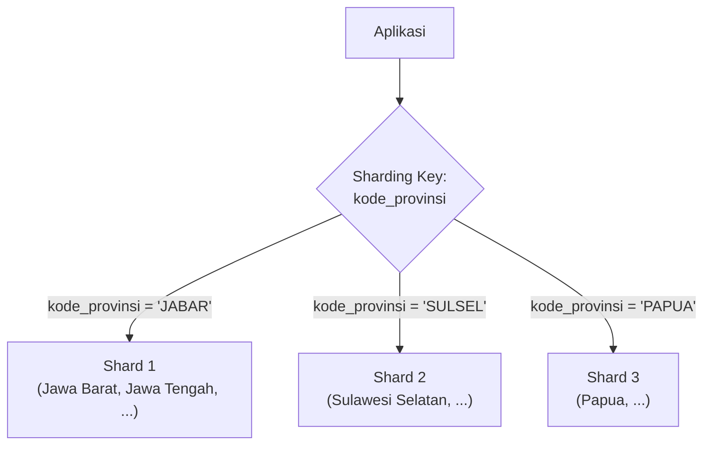

## TL;DR

[[Partitioning]] membelah tabel jadi beberapa bagian fisik dalam **satu instance** database yang sama — batas atasnya tetap kapasitas satu mesin. Sharding melangkah lebih jauh: membelah data lintas **beberapa instance database terpisah**, masing-masing (disebut shard) menyimpan sebagian data dan berjalan di server yang berbeda. Ini bukan lagi soal mengelola tabel besar dengan lebih rapi — ini soal melampaui kapasitas satu mesin sama sekali, sesuatu yang tidak bisa dijawab satu server sekencang apa pun ia di-upgrade. Bedanya dengan read replica juga tegas: replica menyalin **seluruh** data ke banyak tempat untuk kapasitas baca; shard membelah data jadi **potongan-potongan berbeda**, masing-masing shard hanya menyimpan sebagian data, untuk kapasitas baca **dan** tulis sekaligus.

## The Problem

Sebuah sistem nasional yang melayani seluruh provinsi di Indonesia menyimpan seluruh data permohonan dalam satu instance database. Setelah beberapa tahun, volume data dan trafik tulis (bukan hanya baca) sudah melampaui kapasitas satu instance manapun — menambah RAM atau CPU server (*vertical scaling*) sudah mendekati batas praktis dan biaya hardware kelas itu meningkat tidak proporsional dengan manfaatnya. Read replica tidak membantu di sini karena masalahnya bukan kapasitas **baca** — masalahnya adalah volume **tulis** (permohonan baru masuk terus-menerus dari seluruh provinsi) yang harus melalui satu primary yang sama. Partitioning saja tidak cukup, karena partition tetap hidup dalam satu instance yang kapasitasnya sudah mentok.

Pertanyaan yang harus dijawab: bagaimana membagi beban tulis **dan** baca ke banyak mesin sekaligus, sementara aplikasi tetap harus tahu (untuk setiap operasi) data yang dicarinya ada di mesin yang **mana**? Ini pertanyaan yang tidak pernah muncul selama data hidup di satu instance (atau bahkan banyak partition dalam satu instance, karena database yang menyelesaikannya sendiri secara transparan). Begitu data tersebar lintas instance terpisah, keputusan "shard mana" harus dijawab **sebelum** query bisa dikirim ke mesin yang tepat.

## Intuition

Bayangkan sharding seperti **membuka cabang kantor pelayanan di setiap provinsi**, alih-alih satu kantor pusat nasional yang melayani seluruh negeri. Setiap cabang menyimpan berkas warga **provinsinya sendiri saja** — kantor di Jawa Barat tidak menyimpan berkas warga Sulawesi Selatan sama sekali. Kalau seorang warga Jawa Barat datang, petugas tahu persis harus mencari di cabang Jawa Barat (kunci sharding-nya adalah provinsi). Ini membagi beban secara nyata: masing-masing cabang hanya menangani sebagian populasi, bukan seluruh negeri.

Analogi ini bocor pada satu hal penting: kalau suatu saat dibutuhkan laporan nasional (menjumlahkan data dari **semua** provinsi sekaligus), setiap cabang harus dihubungi satu per satu dan hasilnya digabung secara manual. Operasi yang trivial ketika semua data ada di satu kantor pusat menjadi jauh lebih rumit begitu tersebar. Ini adalah trade-off inti sharding: operasi yang menyentuh **satu** shard (kebanyakan operasi CRUD harian) tetap cepat dan sederhana. Operasi yang menyentuh **banyak** shard sekaligus (laporan agregat lintas provinsi, `JOIN` antar data yang kebetulan berada di shard berbeda) menjadi jauh lebih mahal dan rumit dibanding saat semua data ada di satu tempat.

## How It Works



Diagram ini menunjukkan komponen inti sharding: **sharding key** (di sini, `kode_provinsi`) yang menentukan shard mana yang menyimpan baris tertentu, dan sebuah **router** (bisa berupa logika di aplikasi, atau proxy khusus) yang menerjemahkan sharding key jadi keputusan "kirim query ini ke shard mana".

**Strategi memilih sharding key** adalah keputusan paling kritis dan paling sulit dibalik setelah sistem berjalan:

- **Range-based sharding** — membagi berdasarkan rentang nilai kunci (mirip range partitioning, tapi lintas instance). Sederhana, tapi rawan **hot shard** kalau distribusi datanya tidak merata (misalnya shard yang menyimpan provinsi berpenduduk sangat besar menerima beban jauh lebih tinggi dari shard lain).
- **Hash-based sharding** — kunci di-hash lebih dulu untuk menentukan shard, menyebar data lebih merata secara statistik dibanding range-based, tapi kehilangan properti keterurutan (range query lintas kunci jadi mahal, karena data yang "berdekatan" secara logis tersebar acak lintas shard).
- **Directory-based sharding** — sebuah tabel/service lookup terpisah memetakan kunci ke shard secara eksplisit, memberi fleksibilitas paling besar (bisa memindahkan satu entitas ke shard lain kapan pun) dengan biaya satu lapisan indirection tambahan yang harus selalu dikonsultasikan sebelum setiap query.

## Under The Hood

**Kenapa sharding key salah pilih sangat mahal diperbaiki**: begitu data sudah tersebar berdasarkan satu sharding key, mengubah strategi itu berarti **memindahkan data secara fisik** antar shard. Ini proses yang jauh lebih rumit dan berisiko dibanding mengubah index atau menambah partition, karena melibatkan koordinasi lintas banyak instance database yang independen, seringkali sambil sistem tetap harus melayani trafik. Ini kenapa keputusan sharding key idealnya dipikirkan matang di awal berdasarkan pola akses yang benar-benar dominan, bukan ditentukan sembarangan dengan asumsi bisa "diperbaiki nanti".

**Operasi lintas shard adalah pengorbanan intinya**: `JOIN` antara dua tabel yang tersebar di shard berbeda tidak bisa dilakukan database secara native seperti `JOIN` biasa. Aplikasi (atau lapisan middleware) harus melakukan "join" itu sendiri: query ke shard A, query ke shard B, gabungkan hasilnya di memori aplikasi. Transaction yang menyentuh baris di lebih dari satu shard sekaligus (misalnya transfer saldo antar rekening yang kebetulan berada di shard berbeda) kehilangan jaminan ACID sederhana yang biasa didapat dalam satu instance. Ini butuh pola seperti **distributed transaction** atau **saga** (dibahas jauh lebih dalam di level senior, `60 Distributed Systems`) untuk menjaga konsistensi lintas shard.

Pengantar ini sengaja berhenti di prinsip dasar dan risiko sharding. Strategi memilih kunci sharding secara matang untuk menghindari hot shard, dan pola menangani transaction lintas shard, dibahas jauh lebih dalam sebagai topik senior di [[../60 Distributed Systems/Sharding Strategies and Hot Partitions|Sharding Strategies and Hot Partitions]] dan [[../60 Distributed Systems/Consistent Hashing|Consistent Hashing]] — dua note yang secara sengaja ditempatkan di `60 Distributed Systems` karena kompleksitasnya jauh melampaui pengantar level intermediate ini (lihat `Curriculum Changelog.md`, keputusan pemetaan domain).

## In Go

```go
package sharding

import (
	"context"
	"database/sql"
	"fmt"
	"hash/fnv"
)

// Router memetakan sharding key ke koneksi database yang tepat. Pola ini
// sengaja sederhana (hash-based, jumlah shard tetap) untuk pengantar —
// strategi yang lebih matang (consistent hashing, penanganan penambahan
// shard tanpa downtime) dibahas di level senior.
type Router struct {
	shards []*sql.DB
}

func NewRouter(shards []*sql.DB) *Router {
	return &Router{shards: shards}
}

// shardUntukKey menghitung indeks shard dari sharding key memakai hash —
// kunci yang sama SELALU menghasilkan shard yang sama, tapi kunci yang
// berbeda tersebar cukup merata lintas shard yang tersedia.
func (r *Router) shardUntukKey(kunci string) *sql.DB {
	h := fnv.New32a()
	h.Write([]byte(kunci))
	indeks := int(h.Sum32()) % len(r.shards)
	if indeks < 0 {
		indeks += len(r.shards)
	}
	return r.shards[indeks]
}

// AmbilPermohonan mengarahkan query ke SATU shard yang tepat berdasarkan
// kode provinsi — operasi yang menyentuh satu shard tetap secepat query
// biasa terhadap satu instance database.
func (r *Router) AmbilPermohonan(ctx context.Context, kodeProvinsi string, id int64) (string, error) {
	db := r.shardUntukKey(kodeProvinsi)

	var status string
	err := db.QueryRowContext(ctx, `SELECT status FROM permohonan WHERE id = ?`, id).Scan(&status)
	if err != nil {
		return "", fmt.Errorf("ambil permohonan dari shard: %w", err)
	}
	return status, nil
}

// HitungTotalPermohonanSemuaShard adalah operasi LINTAS SHARD — harus
// query SETIAP shard secara terpisah dan menjumlahkan hasilnya di
// aplikasi, karena tidak ada satu query tunggal yang bisa menjangkau
// seluruh shard sekaligus.
func (r *Router) HitungTotalPermohonanSemuaShard(ctx context.Context) (int64, error) {
	var total int64
	for i, db := range r.shards {
		var jumlah int64
		if err := db.QueryRowContext(ctx, `SELECT COUNT(*) FROM permohonan`).Scan(&jumlah); err != nil {
			return 0, fmt.Errorf("hitung permohonan di shard %d: %w", i, err)
		}
		total += jumlah
	}
	return total, nil
}
```

## In His Stack

Sharding adalah lompatan kompleksitas operasional yang jauh lebih besar dibanding read replica atau partitioning. Untuk 13 aplikasi legal-services pemerintah, kemungkinan besar **belum ada** satu pun yang benar-benar butuh sharding sungguhan (volume data dan tulis yang benar-benar melampaui satu instance database yang di-tuning dengan baik jarang terjadi di skala ini), dan mempertimbangkannya lebih awal dari kebutuhan nyata adalah bentuk over-engineering yang mahal untuk dioperasikan. Yang lebih relevan untuk konteks ini justru pemahaman **konseptual** sharding: memahami kapan sebuah sistem benar-benar membutuhkannya (bukan sekadar tren). Ini supaya bisa menilai dengan tepat kalau suatu saat proposal "kita perlu sharding" muncul dari tim atau vendor, apakah itu solusi yang proporsional dengan masalah yang sesungguhnya dihadapi.

## Trade-offs and When Not To Use It

Sharding adalah salah satu keputusan arsitektur paling mahal untuk dibatalkan — begitu diterapkan, seluruh kode aplikasi yang mengakses data harus sadar sharding key, dan operasi lintas shard (laporan agregat, `JOIN` lintas entitas) menjadi jauh lebih rumit secara permanen. Ia hanya sepadan ketika **kapasitas satu instance database benar-benar sudah mentok** — bukan sekadar "terasa besar", tapi terukur (misalnya, `vertical scaling` sudah mencapai batas praktis hardware yang tersedia dan biaya, atau volume tulis sudah melampaui apa yang satu primary bisa proses). Untuk kebanyakan sistem, urutan eskalasi yang lebih murah harus dicoba habis lebih dulu: index yang tepat, query yang dioptimasi (lihat [[Reading EXPLAIN]]), caching, read replica untuk beban baca, partitioning untuk ukuran tabel. Sharding adalah pilihan terakhir setelah semua itu, bukan solusi pertama yang dilompat ke sana karena terdengar canggih.

## Common Mistakes

> [!warning] Jebakan
> Menerapkan sharding sebelum benar-benar dibutuhkan (volume data/trafik masih jauh dari kapasitas satu instance yang di-tuning baik) — menambah kompleksitas operasional permanen untuk masalah yang sebenarnya bisa diselesaikan index, caching, atau read replica yang jauh lebih murah.

> [!warning] Jebakan
> Memilih sharding key berdasarkan kolom yang "kebetulan ada" tanpa menganalisis pola akses nyata — sharding key yang salah menyebabkan hot shard (satu shard menerima beban jauh lebih besar dari yang lain) dan sangat mahal diperbaiki setelah data sudah tersebar.

> [!warning] Jebakan
> Menulis logika bisnis yang mengasumsikan `JOIN`/transaction bisa menyentuh data lintas shard semudah dalam satu instance — operasi lintas shard butuh pola penanganan eksplisit (query terpisah + gabung di aplikasi, atau distributed transaction/saga) yang jauh lebih rumit dari kode biasa.

## Exercises

1. Jelaskan perbedaan mendasar sharding dan read replica — keduanya melibatkan banyak instance database, tapi menyelesaikan masalah yang berbeda.
2. Kenapa memilih sharding key yang salah jauh lebih mahal diperbaiki dibanding memilih index yang salah?
3. Kenapa operasi agregat lintas seluruh shard (seperti menghitung total lintas provinsi) jauh lebih mahal dibanding query yang sama pada satu instance database tunggal?
4. Desain terbuka: sistemmu melayani seluruh Indonesia dan sedang mempertimbangkan sharding berdasarkan kode provinsi. Salah satu provinsi (misalnya DKI Jakarta) diperkirakan akan menyimpan data jauh lebih banyak dari provinsi lain manapun karena populasi dan aktivitas ekonominya. Jelaskan kenapa sharding berdasarkan kode provinsi murni berisiko menimbulkan hot shard untuk kasus ini, dan usulkan satu penyesuaian strategi (tanpa perlu detail teknis penuh — cukup arah pendekatannya) yang bisa mengurangi risiko itu.

> [!success]- Kunci jawaban
> **1.** Read replica **menyalin** seluruh data ke banyak instance untuk membagi beban **baca** — setiap replica punya salinan lengkap data yang sama. Sharding **membelah** data jadi potongan berbeda yang masing-masing hanya ada di satu shard: tidak ada shard yang punya salinan lengkap seluruh data. Sharding membagi beban baca **dan** tulis sekaligus, karena setiap shard menangani subset data dan subset trafik yang menyertainya, bukan seluruh trafik terhadap seluruh data seperti replica.
> **4.** Sharding murni berdasarkan kode provinsi berisiko hot shard karena jumlah data dan trafik antar provinsi di Indonesia sangat tidak merata — shard yang menyimpan data DKI Jakarta bisa menerima beban jauh melebihi shard provinsi dengan populasi/aktivitas jauh lebih kecil, meniadakan tujuan awal sharding (membagi beban merata). Salah satu arah penyesuaian: alih-alih satu provinsi = satu shard secara kaku, pisahkan provinsi dengan volume sangat besar (seperti DKI Jakarta) menjadi **beberapa** shard sendiri (misalnya dipecah lagi berdasarkan kode kecamatan/wilayah dalam provinsi itu), sementara provinsi-provinsi kecil bisa **digabung** dalam satu shard yang sama. Ini pendekatan yang lebih dekat ke hash-based sharding dengan mempertimbangkan bobot volume data per unit, alih-alih range/list sharding naif yang mengasumsikan setiap unit (provinsi) punya volume yang kurang lebih sama.

## Self-Check

- Apa perbedaan sharding dan read replica dalam hal apa yang disalin/dibelah?
- Apa itu hot shard, dan kenapa itu risiko utama pemilihan sharding key yang buruk?
- Kenapa operasi lintas shard (JOIN, transaction) jauh lebih rumit dibanding dalam satu instance?
- Urutan eskalasi apa yang idealnya dicoba sebelum benar-benar mempertimbangkan sharding?

## Connected Notes

- [[Partitioning]] — sharding adalah kelanjutan konseptual partitioning, kali ini lintas instance terpisah alih-alih dalam satu instance yang sama.
- [[Read Replicas and Replication Lag]] — dua strategi skala yang berbeda tujuan (kapasitas baca vs kapasitas baca+tulis) dan sering dikombinasikan, bukan saling menggantikan.
- [[../60 Distributed Systems/Sharding Strategies and Hot Partitions|Sharding Strategies and Hot Partitions]] — kelanjutan langsung di level senior: strategi matang memilih sharding key dan menghindari hot shard.
- [[../60 Distributed Systems/Consistent Hashing|Consistent Hashing]] — teknik yang menyelesaikan masalah menambah/mengurangi shard tanpa memindahkan ulang seluruh data, dibahas di level senior.
- [[../90 Architecture and Design/Modular Monolith vs Microservices|Modular Monolith vs Microservices]] — keputusan sharding database sering berjalan seiringan dengan keputusan memecah layanan itu sendiri, dibahas di domain arsitektur level intermediate.

## Further Reading

- Materi pengantar sharding dari dokumentasi vendor database besar mana pun yang mendukungnya secara native (misalnya Vitess untuk MySQL, atau Citus untuk PostgreSQL), sebagai gambaran implementasi konkret di luar teori.

## Catatan Saya

*Tulis di sini apakah ada diskusi soal sharding pernah muncul di kerjaanmu — dan setelah membaca note ini, menurutmu apakah itu kebutuhan nyata atau solusi yang terdengar canggih tanpa masalah yang benar-benar membutuhkannya.*
