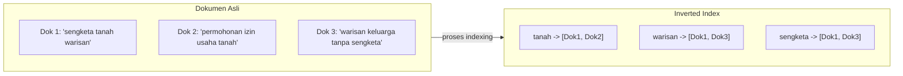

## TL;DR

`LIKE '%kata%'` di SQL harus memindai setiap baris dan memeriksa apakah teksnya mengandung kata itu di mana pun — tidak bisa memanfaatkan [[B+Tree Structure|B+Tree index]] biasa sama sekali, karena B+Tree diurutkan berdasarkan **awal** string, bukan kata-kata yang mungkin muncul di **tengah** teks. Full-text search butuh struktur yang sama sekali berbeda: **inverted index**, yang membalik arah pemetaan biasa — alih-alih memetakan "dokumen → kata-kata di dalamnya", ia memetakan "kata → daftar dokumen yang mengandungnya". Pembalikan arah inilah yang membuat pencarian "dokumen mana saja yang mengandung kata X" menjadi pencarian langsung (lookup), bukan pemindaian, tak peduli di posisi mana pun kata itu muncul dalam dokumen.

## The Problem

Sebuah fitur pencarian dokumen permohonan memakai `SELECT * FROM dokumen WHERE isi LIKE '%tanah%'` untuk mencari dokumen yang menyebut kata "tanah". Query ini bekerja untuk data kecil, tapi begitu tabel `dokumen` tumbuh jadi jutaan baris dengan isi teks panjang, query ini menjadi sangat lambat — `EXPLAIN` (lihat [[Reading EXPLAIN]]) menunjukkan full table scan, karena index B+Tree pada kolom `isi` (kalaupun ada) hanya membantu pencarian yang dimulai dari **awal** string (`LIKE 'tanah%'`), bukan pencarian kata di posisi manapun dalam teks (`LIKE '%tanah%'`) — pola akses yang secara fundamental tidak cocok dengan struktur B+Tree.

Masalah kedua yang lebih halus: bahkan kalau performa `LIKE '%tanah%'` bisa "dipaksa" cukup cepat untuk volume tertentu, ia tidak bisa menjawab pertanyaan pencarian yang lebih realistis: mencari dokumen yang relevan dengan "sengketa tanah warisan" harus mempertimbangkan dokumen yang menyebut "tanah" dan "warisan" (mungkin tidak berdekatan), memberi peringkat lebih tinggi pada dokumen yang menyebut kata-kata itu lebih sering, dan mengabaikan kata umum seperti "yang"/"dan" yang tidak menambah informasi pencarian — kebutuhan yang jauh melampaui kemampuan `LIKE` pattern matching, betapapun dioptimalkan.

## Intuition

Bayangkan cara buku disusun secara normal (dokumen → kata) seperti **membaca setiap halaman buku dari awal untuk mencari di mana kata "tanah" disebut** — kamu harus membuka dan membaca setiap halaman satu per satu. Inverted index seperti **indeks di bagian belakang buku** (yang memang secara harfiah disebut "index" dalam buku fisik) — daftar kata-kata penting diurutkan alfabetis, masing-masing dengan daftar nomor halaman di mana kata itu muncul. Mencari "tanah" tinggal membuka indeks belakang, menemukan entri "tanah: hal. 12, 45, 103", dan langsung menuju halaman-halaman itu — tanpa pernah membaca satu pun halaman yang tidak relevan.

Analogi ini bocor pada satu hal: indeks buku fisik biasanya hanya mencatat istilah-istilah penting yang dipilih manual oleh penulis/editor. Inverted index di search engine mengindeks **hampir setiap kata** secara otomatis (setelah melalui proses filtering seperti menghapus stop word dan normalisasi bentuk kata, dibahas di bawah) — cakupannya jauh lebih menyeluruh daripada indeks buku manual mana pun, dibangun otomatis dari seluruh korpus dokumen yang ada.

## How It Works



Diagram ini menunjukkan pembalikan arah pemetaan: alih-alih menyimpan "Dokumen 1 berisi kata apa saja", struktur ini menyimpan "kata 'tanah' ada di dokumen mana saja" — mencari dokumen yang mengandung "tanah" **dan** "warisan" sekarang tinggal mengambil daftar dokumen dari kedua entri (`[Dok1, Dok2]` dan `[Dok1, Dok3]`) dan mencari irisannya (`Dok1`), operasi himpunan yang jauh lebih cepat dibanding memindai seluruh teks dokumen satu per satu.

**Proses membangun inverted index** melibatkan beberapa tahap sebelum kata benar-benar dimasukkan ke index:

1. **Tokenization** — memecah teks jadi kata-kata individual ("sengketa tanah warisan" → `["sengketa", "tanah", "warisan"]`).
2. **Normalisasi** — mengubah semua ke lowercase, menghapus tanda baca, kadang mengubah kata ke bentuk dasarnya (*stemming*/*lemmatization* — "mengajukan" dan "diajukan" bisa dinormalisasi ke akar kata "ajuk").
3. **Stop word removal** — membuang kata yang sangat umum dan tidak menambah informasi pencarian ("yang", "dan", "di", "ke") — kata-kata ini muncul di hampir semua dokumen sehingga tidak membantu membedakan relevansi.
4. **Membangun posting list** — untuk setiap kata yang tersisa, mencatat daftar dokumen (dan biasanya juga posisi dalam dokumen, untuk mendukung pencarian frasa) yang mengandungnya.

## Under The Hood

Analyzer — komponen yang menjalankan seluruh pipeline tokenization-normalisasi-stop word di atas — adalah bagian paling krusial dan paling sering dikonfigurasi ulang di sistem pencarian nyata, karena keputusan di sini secara langsung menentukan kata apa yang dianggap "sama" saat pencarian. Bahasa Indonesia punya tantangan tersendiri untuk stemming (imbuhan awalan-akhiran yang kompleks: "mengajukan", "pengajuan", "diajukan", "ajukan" semua berasal dari kata dasar "ajuk") — analyzer yang tidak menangani morfologi bahasa Indonesia dengan baik bisa gagal mencocokkan dokumen yang secara semantik relevan hanya karena bentuk kata yang berbeda secara literal.

**Posting list** (daftar dokumen untuk setiap kata) sendiri disimpan dengan struktur yang dioptimalkan untuk operasi himpunan cepat (irisan, gabungan) — sering dikompresi (delta encoding pada ID dokumen yang terurut, mirip semangat kompresi yang dibahas di [[Write Amplification and Compression]]) karena posting list untuk kata umum bisa sangat panjang (jutaan ID dokumen), dan efisiensi penyimpanannya berdampak langsung pada kecepatan operasi irisan/gabungan saat pencarian multi-kata dijalankan.

## In Go

```go
package searchindex

import (
	"context"
	"fmt"
	"strings"
)

// InvertedIndexSederhana mendemonstrasikan PRINSIP inti — bukan
// implementasi produksi (yang butuh analyzer bahasa, kompresi posting
// list, dan penyimpanan persisten sungguhan seperti yang disediakan
// Elasticsearch/Lucene).
type InvertedIndexSederhana struct {
	index map[string][]int64 // kata -> daftar ID dokumen
}

func NewInvertedIndexSederhana() *InvertedIndexSederhana {
	return &InvertedIndexSederhana{index: make(map[string][]int64)}
}

var stopWords = map[string]bool{
	"yang": true, "dan": true, "di": true, "ke": true, "untuk": true,
}

// Indeks memproses satu dokumen lewat tokenization, normalisasi, dan
// stop word removal SEBELUM menambahkannya ke inverted index — urutan
// ini menentukan kata apa yang benar-benar bisa dicari nantinya.
func (idx *InvertedIndexSederhana) Indeks(ctx context.Context, dokumenID int64, teks string) {
	kata := strings.Fields(strings.ToLower(teks))
	for _, k := range kata {
		k = strings.Trim(k, ".,!?")
		if k == "" || stopWords[k] {
			continue
		}
		idx.index[k] = append(idx.index[k], dokumenID)
	}
}

// Cari mengembalikan irisan dokumen yang mengandung SEMUA kata pencarian —
// operasi himpunan pada posting list, bukan pemindaian teks dokumen.
func (idx *InvertedIndexSederhana) Cari(ctx context.Context, kataKunci []string) ([]int64, error) {
	if len(kataKunci) == 0 {
		return nil, fmt.Errorf("kata kunci kosong")
	}

	hasil := idx.index[strings.ToLower(kataKunci[0])]
	for _, k := range kataKunci[1:] {
		hasil = irisan(hasil, idx.index[strings.ToLower(k)])
	}
	return hasil, nil
}

func irisan(a, b []int64) []int64 {
	set := make(map[int64]bool)
	for _, v := range a {
		set[v] = true
	}
	var hasil []int64
	for _, v := range b {
		if set[v] {
			hasil = append(hasil, v)
		}
	}
	return hasil
}
```

## In His Stack

Elasticsearch, bagian ekosistem kerja yang eksplisit disebut sebagai tool `deep` tier, dibangun di atas Lucene, yang pada dasarnya adalah implementasi inverted index yang sangat matang dan teroptimasi, lengkap dengan analyzer bahasa (termasuk dukungan analyzer bahasa Indonesia lewat plugin komunitas), kompresi posting list, dan mekanisme relevance scoring (dibahas di note berikutnya). Memahami inverted index sebagai konsep menjelaskan **kenapa** Elasticsearch begitu berbeda perilakunya dari MariaDB untuk pencarian teks — bukan sekadar "lebih cepat karena produk lain", tapi karena strukturnya secara fundamental dirancang untuk pola akses ini, sementara MariaDB (meski punya fitur `FULLTEXT` index terbatas) dirancang utamanya untuk pola akses relasional biasa.

## Trade-offs and When Not To Use It

Membangun dan memelihara inverted index bukan gratis — setiap dokumen baru harus melalui pipeline tokenization-normalisasi sebelum bisa dicari, menambah latensi antara "dokumen disimpan" dan "dokumen bisa ditemukan lewat pencarian" (topik yang dibahas lebih dalam di [[Keeping Search in Sync with the Source of Truth]]). Untuk kebutuhan pencarian yang sederhana (mencari berdasarkan kolom terstruktur seperti status atau ID, bukan teks bebas), inverted index adalah solusi yang berlebihan — index B+Tree biasa pada kolom yang relevan jauh lebih murah dan sudah cukup. Inverted index juga tidak cocok untuk kolom yang butuh urutan eksak (mengurutkan berdasarkan tanggal, misalnya) — kekuatannya murni pada pencarian "dokumen mana saja yang mengandung X", bukan pengurutan berdasarkan nilai kolom terstruktur, yang tetap lebih baik dilayani struktur seperti B+Tree.

## Common Mistakes

> [!warning] Jebakan
> Memakai `LIKE '%kata%'` di database relasional untuk kebutuhan pencarian teks yang sering dan pada volume data besar — tidak bisa memanfaatkan index B+Tree biasa sama sekali, selalu berakhir sebagai full table scan.

> [!warning] Jebakan
> Mengabaikan kebutuhan analyzer bahasa yang tepat (khususnya untuk bahasa dengan morfologi kompleks seperti Indonesia) — pencarian bisa gagal mencocokkan dokumen yang secara semantik relevan hanya karena bentuk kata (imbuhan) yang berbeda secara literal dari kata kunci pencarian.

> [!warning] Jebakan
> Menerapkan full-text search dengan inverted index untuk kebutuhan pencarian sederhana pada kolom terstruktur (status, ID, tanggal) yang sebenarnya cukup dilayani index B+Tree biasa — menambah kompleksitas infrastruktur (sistem pencarian terpisah) tanpa manfaat yang sepadan.

## Exercises

1. Jelaskan kenapa `LIKE '%kata%'` tidak bisa memanfaatkan index B+Tree biasa, dan kenapa inverted index menyelesaikan masalah ini secara struktural.
2. Sebutkan tiga tahap dalam pipeline analyzer (tokenization, normalisasi, stop word removal), dan jelaskan kenapa urutan tahap ini penting.
3. Kenapa mencari dokumen yang mengandung beberapa kata kunci sekaligus bisa diselesaikan lewat operasi himpunan (irisan) pada inverted index, alih-alih pemindaian teks?
4. Desain terbuka: sistem pencarian dokumenmu saat ini hanya mendukung pencarian bahasa Indonesia standar, tapi banyak dokumen permohonan mengandung istilah hukum dalam bahasa Indonesia yang punya sinonim atau variasi ejaan (misalnya "akta" dan "akte", atau "sertifikat" dan "sertipikat" — keduanya ejaan yang sama-sama umum dipakai di dokumen resmi Indonesia). Rancang penyesuaian pada pipeline analyzer yang membuat pencarian salah satu variasi ejaan ini tetap menemukan dokumen yang memakai variasi lainnya.

> [!success]- Kunci jawaban
> **1.** B+Tree index diurutkan berdasarkan **awal** nilai kolom (mirip urutan alfabetis dari huruf pertama) — ini kenapa `LIKE 'kata%'` (mencari dari awal) bisa memanfaatkan index dengan melompat langsung ke bagian pohon yang relevan, tapi `LIKE '%kata%'` (mencari di posisi manapun) tidak punya titik masuk yang jelas di pohon terurut itu, karena kata yang dicari bisa muncul di tengah string apa pun tanpa pola awalan yang bisa dipakai navigasi. Inverted index menyelesaikan ini dengan mengindeks **setiap kata individual** sebagai entri terpisah (bukan seluruh string sebagai satu kesatuan) — mencari kata "tanah" berarti mencari entri "tanah" secara langsung di index, terlepas di posisi mana kata itu awalnya muncul dalam teks dokumen aslinya.
> **4.** Tambahkan tahap **synonym expansion** ke pipeline analyzer — sebuah kamus sinonim/variasi ejaan yang dikonfigurasi eksplisit (misalnya di Elasticsearch, lewat synonym token filter) yang memetakan `akta ⟷ akte` dan `sertifikat ⟷ sertipikat` sebagai pasangan setara. Saat dokumen di-indeks, kedua variasi ejaan dipetakan ke bentuk kanonis yang sama di index (atau keduanya disimpan sebagai entri yang saling merujuk); saat pencarian dijalankan dengan salah satu variasi, query juga diperluas ke variasi yang setara sebelum dicocokkan terhadap index. Ini memastikan pencarian "akta lahir" tetap menemukan dokumen yang menulis "akte lahir", tanpa pengguna perlu tahu atau mengingat variasi ejaan mana yang dipakai penulis dokumen aslinya.

## Self-Check

- Kenapa `LIKE '%kata%'` tidak bisa memanfaatkan index B+Tree biasa?
- Apa tiga tahap utama pipeline analyzer sebelum kata masuk ke inverted index?
- Kenapa mencari beberapa kata kunci sekaligus bisa diselesaikan lewat operasi himpunan?
- Kapan inverted index adalah solusi yang berlebihan untuk kebutuhan pencarian tertentu?

## Connected Notes

- [[B+Tree Structure]] — kontras langsung: struktur ini menjelaskan kenapa B+Tree tidak cocok untuk pencarian substring/teks bebas, mendorong kebutuhan struktur alternatif di note ini.
- [[Beyond Relational - Document, Key-Value, Wide-Column, Graph, and Time-Series Stores]] — inverted index adalah salah satu bentuk khusus struktur data "beyond relational" yang dioptimalkan untuk kebutuhan pencarian spesifik.
- [[Relevance Scoring]] — kelanjutan langsung: menentukan urutan hasil pencarian, bukan sekadar menemukan dokumen yang cocok, dibahas di note berikutnya.
- [[Keeping Search in Sync with the Source of Truth]] — konsekuensi operasional nyata dari memisahkan sistem pencarian dari database sumber, dibahas di note setelah itu.
- [[../92 Tools/_Overview|Tools Overview]] — Elasticsearch, implementasi konkret inverted index yang relevan langsung di ekosistem kerja ini, dibahas lebih operasional di tool note-nya.

## Further Reading

- Manning, Raghavan, Schütze, "Introduction to Information Retrieval" — rujukan akademik standar untuk inverted index dan information retrieval secara umum.
- Dokumentasi resmi Elasticsearch, bagian "Text analysis" dan "Analyzer".

## Catatan Saya

*Tulis di sini apakah fitur pencarian di sistem kerjaanmu saat ini masih memakai `LIKE`, dan seberapa besar volume data yang membuatnya mulai terasa lambat.*
