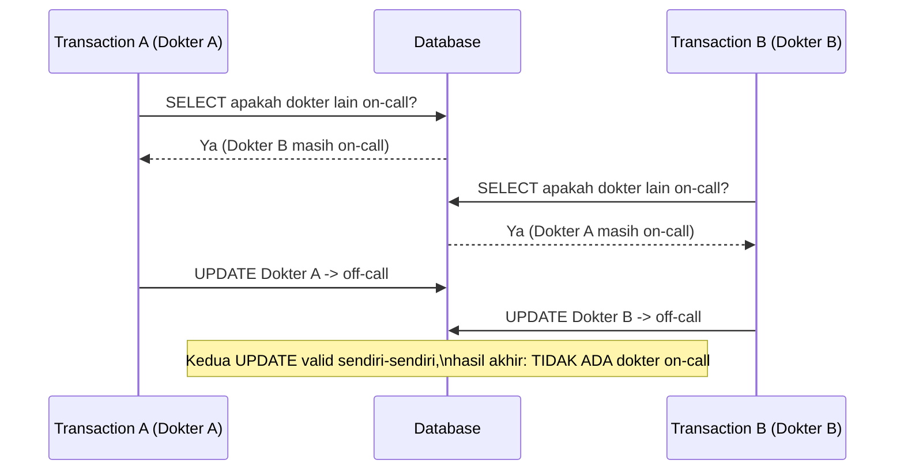

## TL;DR

[[Basic Isolation Levels|Basic isolation levels]] memperkenalkan empat level standar SQL dan menyebut sekilas anomali yang masing-masing izinkan. Note ini masuk ke detail konkret setiap anomali — **dirty read**, **non-repeatable read**, **phantom read**, dan **write skew** — bukan sebagai istilah untuk dihafal, tapi sebagai skenario konkret yang masing-masing bisa dibayangkan sebagai bug produksi nyata. Poin pentingnya: standar SQL mendefinisikan level berdasarkan anomali mana yang **diizinkan**, bukan mekanisme mana yang dipakai untuk mencegahnya — dan implementasi nyata (MySQL/InnoDB, PostgreSQL) tidak selalu persis mengikuti definisi standar untuk kombinasi level tertentu, sebuah detail yang mengejutkan banyak orang yang berasumsi seluruh database "sama" pada level isolasi yang namanya identik.

## The Problem

Dua petugas membuka form yang sama untuk memperbarui status permohonan hampir bersamaan. Petugas A membaca status permohonan sebagai "menunggu", memutuskan untuk mengubahnya jadi "diverifikasi", dan menyimpan. Petugas B, yang membaca status permohonan **sebelum** perubahan petugas A ter-`commit`, juga melihat "menunggu", memutuskan mengubahnya jadi "ditolak" berdasarkan alasan berbeda, dan menyimpan setelah petugas A. Hasil akhirnya "ditolak" menimpa "diverifikasi" tanpa satu pun dari kedua petugas menyadari ada perubahan lain yang terjadi di antaranya — bukan karena mereka lalai, tapi karena isolation level yang dipakai tidak cukup ketat untuk mendeteksi bahwa data yang mereka baca berpotensi sudah usang di titik mereka menyimpan.

Skenario kedua yang lebih halus, dikenal sebagai **write skew**: dua dokter jaga di rumah sakit, aturan bisnis mengatakan minimal satu dokter harus tetap "on call" setiap saat. Dokter A memeriksa: "apakah ada dokter lain yang on call selain saya?" — melihat dokter B masih on call, memutuskan aman untuk dirinya sendiri keluar dari status on call. Nyaris bersamaan, dokter B melakukan pemeriksaan yang sama — melihat dokter A masih on call, memutuskan dirinya juga aman untuk keluar. Kedua transaction ini, dilihat secara terpisah, **masing-masing valid** menurut kondisi yang mereka baca — tapi hasil akhirnya melanggar aturan bisnis (tidak ada dokter yang on call sama sekali), karena masing-masing transaction memeriksa kondisi yang dipengaruhi keputusan transaction lain yang belum terlihat saat pemeriksaan dilakukan. Ini adalah anomali yang **tidak** dicegah oleh `REPEATABLE READ` sekalipun — hanya `SERIALIZABLE` (atau penguncian eksplisit) yang benar-benar menutupnya.

## Intuition

Bayangkan keempat anomali ini sebagai skenario konkret di ruang rapat bersama dengan whiteboard yang bisa dibaca dan ditulisi banyak orang:

- **Dirty read**: kamu membaca angka yang sedang dicoret-coret dan direvisi orang lain, sebelum mereka selesai dan yakin dengan angka finalnya — lalu ternyata mereka menghapus dan mengganti dengan angka lain sebelum benar-benar "selesai". Kamu sudah terlanjur memakai angka yang tidak pernah benar-benar final.
- **Non-repeatable read**: kamu membaca angka di whiteboard, pergi sebentar mengerjakan sesuatu, kembali dan membaca whiteboard yang sama — tapi angkanya sudah berubah karena orang lain menuliskan revisi final di antara dua kali kamu membaca, dan revisi itu sudah "final" (committed), bukan corat-coret sementara.
- **Phantom read**: kamu menghitung jumlah kotak di whiteboard yang memenuhi kriteria tertentu, lalu menghitung ulang beberapa saat kemudian dalam sesi kerja yang sama — jumlahnya berubah karena ada kotak **baru** yang ditambahkan (bukan kotak lama yang berubah nilainya), memenuhi kriteria yang sama.
- **Write skew**: dua orang masing-masing memeriksa kondisi berbeda di whiteboard yang saling terkait, dan masing-masing membuat keputusan yang valid sendiri-sendiri berdasarkan apa yang mereka lihat — tapi begitu kedua keputusan itu digabung, aturan keseluruhan yang melibatkan **hubungan** antar data (bukan satu nilai tunggal) jadi dilanggar.

Analogi ini bocor pada satu hal penting: whiteboard fisik hanya punya satu "versi" yang dilihat semua orang secara bersamaan. Database dengan [[MVCC]] justru sengaja **tidak** bekerja seperti itu — ia menyimpan banyak versi data sekaligus, dan "apa yang kamu lihat" bergantung pada snapshot transaction-mu sendiri, bukan whiteboard tunggal yang sama untuk semua orang. Ini yang membuat sebagian anomali di atas justru **tidak mungkin terjadi** di beberapa isolation level (karena mekanisme versioning-nya), sementara anomali lain (terutama write skew) tetap mungkin terjadi bahkan dengan MVCC yang canggih sekalipun, kecuali level isolasinya benar-benar `SERIALIZABLE`.

## How It Works

| Isolation Level | Dirty Read | Non-Repeatable Read | Phantom Read | Write Skew |
|---|---|---|---|---|
| `READ UNCOMMITTED` | Mungkin | Mungkin | Mungkin | Mungkin |
| `READ COMMITTED` | Dicegah | Mungkin | Mungkin | Mungkin |
| `REPEATABLE READ` | Dicegah | Dicegah | Mungkin* | Mungkin |
| `SERIALIZABLE` | Dicegah | Dicegah | Dicegah | Dicegah |

*Catatan penting: standar SQL mengizinkan phantom read di `REPEATABLE READ`, tapi implementasi InnoDB (MySQL/MariaDB) di level `REPEATABLE READ` **secara praktis mencegah** sebagian besar kasus phantom read lewat mekanisme *next-key locking* — sebuah penyimpangan dari standar yang justru menguntungkan, tapi juga sumber kebingungan karena nama level yang sama tidak menjamin perilaku identik lintas mesin database.

> [!question] Perlu diverifikasi
> Klaim: InnoDB `REPEATABLE READ` mencegah sebagian besar phantom read lewat next-key locking, menyimpang dari standar SQL yang mengizinkannya di level ini.
> Kenapa ragu: perilaku ini spesifik dialek dan detail mekanismenya (next-key locking) cukup rumit dengan banyak kasus tepi tergantung jenis query (SELECT biasa vs SELECT FOR UPDATE); klaim umum ini benar secara garis besar tapi detail persisnya sebaiknya diverifikasi ulang.
> Cara verifikasi: dokumentasi resmi MySQL/InnoDB bagian "Locking Reads" dan "Consistent Nonlocking Reads".



Diagram ini menunjukkan **write skew**: tidak ada satu baris pun yang dibaca dua kali dengan hasil berbeda (bukan non-repeatable read), dan tidak ada baris baru yang muncul (bukan phantom read) — masalahnya murni karena keputusan masing-masing transaction bergantung pada **kondisi gabungan** (jumlah dokter on-call) yang dipengaruhi transaction lain yang belum terlihat saat keputusan dibuat.

## Under The Hood

`SERIALIZABLE` di PostgreSQL diimplementasikan lewat **Serializable Snapshot Isolation (SSI)** — bukan dengan mengunci semuanya secara kaku seperti namanya mungkin menyiratkan, melainkan dengan mendeteksi pola dependensi antar transaction yang **berpotensi** menghasilkan hasil yang tidak mungkin terjadi kalau transaction-transaction itu benar-benar dijalankan berurutan satu per satu — dan membatalkan (memaksa rollback) salah satu transaction yang terlibat kalau pola berbahaya itu terdeteksi, memaksa aplikasi untuk **retry**. Ini konsekuensi penting: memilih `SERIALIZABLE` bukan hanya soal biaya locking yang lebih tinggi, tapi juga berarti kode aplikasi **harus** siap menangani transaction yang gagal dan perlu diulang — sebuah pola yang jarang dibutuhkan di level isolasi lebih rendah.

MySQL/InnoDB mengimplementasikan `SERIALIZABLE` dengan pendekatan berbeda — secara efektif mengubah setiap `SELECT` biasa menjadi `SELECT ... LOCK IN SHARE MODE` implisit, mengambil shared lock pada setiap baris yang dibaca. Pendekatan ini lebih dekat dengan penguncian pesimistik dibanding pendekatan deteksi-konflik-optimistik ala PostgreSQL SSI — konsekuensinya, `SERIALIZABLE` di InnoDB cenderung meningkatkan **contention** locking (baca saling memblokir tulis) dengan cara yang berbeda dari PostgreSQL yang cenderung meningkatkan **tingkat retry**. Keduanya sama-sama mencegah write skew, tapi lewat mekanisme dan trade-off operasional yang berbeda — detail yang penting untuk memilih strategi retry aplikasi yang tepat tergantung mesin database yang dipakai.

## In Go

```go
package inventaris

import (
	"context"
	"database/sql"
	"errors"
	"fmt"
	"time"
)

// PastikanMinimalSatuDokterOnCall adalah operasi yang rentan write skew kalau
// dijalankan di bawah REPEATABLE READ biasa — dua transaction yang berjalan
// bersamaan bisa sama-sama "lolos" pemeriksaan ini padahal hasil akhirnya
// melanggar aturan bisnis. Kode ini secara eksplisit meminta SERIALIZABLE
// dan menyiapkan retry, karena SERIALIZABLE bisa memaksa salah satu
// transaction gagal demi mencegah write skew.
func PastikanMinimalSatuDokterOnCall(ctx context.Context, db *sql.DB, dokterIDKeluar int64) error {
	const percobaanMaks = 3

	for percobaan := 1; percobaan <= percobaanMaks; percobaan++ {
		err := jalankanDalamTransactionSerializable(ctx, db, dokterIDKeluar)
		if err == nil {
			return nil
		}
		if !errors.Is(err, errKonflikSerialisasi) {
			return fmt.Errorf("update status on-call: %w", err)
		}
		// Konflik serialisasi terdeteksi — tunggu sebentar lalu coba lagi,
		// karena database sendiri yang memaksa salah satu transaction gagal
		// demi mencegah write skew, bukan berarti operasinya salah.
		time.Sleep(time.Duration(percobaan) * 50 * time.Millisecond)
	}
	return fmt.Errorf("gagal update status on-call setelah %d percobaan akibat konflik serialisasi", percobaanMaks)
}

var errKonflikSerialisasi = errors.New("konflik serialisasi terdeteksi database")

func jalankanDalamTransactionSerializable(ctx context.Context, db *sql.DB, dokterIDKeluar int64) error {
	tx, err := db.BeginTx(ctx, &sql.TxOptions{Isolation: sql.LevelSerializable})
	if err != nil {
		return fmt.Errorf("mulai transaction serializable: %w", err)
	}
	defer tx.Rollback()

	var jumlahOnCallLain int
	err = tx.QueryRowContext(ctx,
		`SELECT COUNT(*) FROM dokter WHERE on_call = true AND id != ?`, dokterIDKeluar,
	).Scan(&jumlahOnCallLain)
	if err != nil {
		return fmt.Errorf("hitung dokter on-call lain: %w", err)
	}

	if jumlahOnCallLain < 1 {
		return fmt.Errorf("minimal satu dokter harus tetap on-call")
	}

	if _, err := tx.ExecContext(ctx, `UPDATE dokter SET on_call = false WHERE id = ?`, dokterIDKeluar); err != nil {
		return fmt.Errorf("update status dokter: %w", err)
	}

	if err := tx.Commit(); err != nil {
		// Driver database yang benar akan mengembalikan error spesifik
		// (kode SQLSTATE 40001 di PostgreSQL) untuk konflik serialisasi —
		// aplikasi produksi nyata harus memeriksa kode error itu secara
		// eksplisit, bukan menganggap semua error commit sama.
		return fmt.Errorf("%w: %v", errKonflikSerialisasi, err)
	}
	return nil
}
```

## In His Stack

Write skew adalah anomali yang paling relevan justru untuk aturan bisnis lintas baris yang umum di sistem legal-services — "minimal satu approver harus tersedia", "kuota harian tidak boleh terlampaui dilihat dari total, bukan satu baris", "nomor antrean tidak boleh dobel" — semua ini adalah kondisi yang melibatkan **lebih dari satu baris** dan rentan write skew kalau hanya mengandalkan `REPEATABLE READ`. Yii2/MariaDB yang secara default memakai `REPEATABLE READ` **tidak otomatis aman** dari write skew hanya karena level isolasinya sudah "cukup ketat" untuk mencegah non-repeatable read dan sebagian besar phantom read — ini kesalahpahaman umum yang penting diluruskan: `REPEATABLE READ` mencegah anomali yang melibatkan **satu** kondisi bacaan berulang, tapi tidak mencegah anomali yang melibatkan **keputusan gabungan** dari beberapa transaction independen.

## Trade-offs and When Not To Use It

`SERIALIZABLE` mencegah seluruh anomali di tabel di atas, tapi membayarnya lewat throughput yang lebih rendah dan (tergantung mesin database) kebutuhan menangani retry di sisi aplikasi — pola yang tidak semua tim siap tangani dengan benar, terutama kalau logika retry ditambahkan belakangan sebagai tambal sulam alih-alih dirancang sejak awal. Untuk kebanyakan operasi CRUD sederhana yang tidak melibatkan aturan bisnis lintas baris, `REPEATABLE READ` (atau bahkan `READ COMMITTED`) sudah lebih dari cukup, dan menaikkan ke `SERIALIZABLE` "demi keamanan" tanpa kebutuhan nyata hanya menambah biaya tanpa manfaat. Alternatif yang sering lebih murah untuk kasus write skew spesifik: penguncian eksplisit (`SELECT ... FOR UPDATE`, lihat [[Locking and Row Locks]]) pada baris-baris yang relevan sebelum memeriksa kondisi gabungan — memberi jaminan yang setara tanpa harus menaikkan isolation level seluruh transaction ke `SERIALIZABLE`.

## Common Mistakes

> [!warning] Jebakan
> Mengira `REPEATABLE READ` sudah cukup mencegah semua anomali konkurensi karena namanya terdengar "ketat" — write skew tetap mungkin terjadi di level ini, karena masalahnya bukan pembacaan berulang yang berubah, melainkan keputusan gabungan dari beberapa transaction independen.

> [!warning] Jebakan
> Menyamakan perilaku `REPEATABLE READ` (atau level lain) di MySQL/InnoDB dengan PostgreSQL hanya karena namanya identik — detail implementasi seperti next-key locking di InnoDB membuat perilaku phantom read pada level yang sama bisa berbeda signifikan antar kedua mesin database.

> [!warning] Jebakan
> Memakai `SERIALIZABLE` tanpa menyiapkan mekanisme retry di sisi aplikasi — transaction yang gagal akibat konflik serialisasi bukan bug, tapi kegagalan itu harus ditangani secara eksplisit (retry dengan backoff), bukan dibiarkan gagal begitu saja atau ditangkap sebagai error generik.

## Exercises

1. Jelaskan perbedaan non-repeatable read dan phantom read — kenapa keduanya dianggap anomali yang berbeda meski sama-sama soal "data berubah antara dua pembacaan dalam transaction yang sama"?
2. Kenapa write skew tidak dicegah oleh `REPEATABLE READ`, padahal level itu sudah mencegah non-repeatable read dan (secara praktis di InnoDB) sebagian besar phantom read?
3. Jelaskan perbedaan mekanisme `SERIALIZABLE` di PostgreSQL (deteksi konflik, SSI) dibanding di MySQL/InnoDB (locking eksplisit pada SELECT).
4. Desain terbuka: sistem antreanmu punya aturan "nomor antrean harian tidak boleh melebihi 100, dan tidak boleh ada nomor yang dobel", dengan banyak loket yang mengeluarkan nomor secara konkuren. Rancang dua pendekatan berbeda untuk mencegah write skew di sini — satu memakai `SERIALIZABLE` dengan retry, satu memakai locking eksplisit (`SELECT ... FOR UPDATE`) — dan jelaskan trade-off keduanya untuk kasus dengan puluhan loket aktif bersamaan di jam sibuk.

> [!success]- Kunci jawaban
> **1.** Non-repeatable read terjadi ketika baris **yang sama** yang sudah dibaca sebelumnya, berubah **nilainya** ketika dibaca ulang dalam transaction yang sama (karena transaction lain meng-`UPDATE` dan `commit` baris itu di antaranya). Phantom read terjadi ketika kondisi pencarian yang sama (`WHERE status = 'menunggu'`, misalnya) menghasilkan **himpunan baris yang berbeda** ketika dijalankan ulang — bukan karena baris yang sudah ada berubah nilainya, tapi karena ada baris **baru** yang cocok kriteria itu (di-`INSERT` transaction lain) muncul di antara dua eksekusi. Keduanya soal "hasil berubah antar baca", tapi objek yang berubah beda: nilai baris yang sama vs keanggotaan himpunan hasil.
> **4.** Pendekatan `SERIALIZABLE` + retry: setiap loket menjalankan transaction `SERIALIZABLE` yang menghitung nomor terakhir dan memeriksa batas 100, lalu insert nomor baru — kalau dua loket konflik (mencoba insert nomor yang tumpang tindih secara logis), database memaksa satu di antaranya gagal dan aplikasi mengulang. Ini sederhana ditulis tapi throughput-nya bisa turun tajam di jam sibuk dengan puluhan loket, karena tingkat konflik (dan karenanya tingkat retry) meningkat drastis seiring banyaknya transaction konkuren yang bersaing memperbarui "nomor terakhir" yang sama. Pendekatan locking eksplisit: setiap loket melakukan `SELECT nomor_terakhir FROM counter_antrean WHERE tanggal = ? FOR UPDATE` lebih dulu — baris counter itu sendiri terkunci selama transaction, memaksa loket lain **menunggu** (bukan gagal dan retry) sampai loket pertama selesai increment dan commit. Untuk kasus ini, locking eksplisit pada satu baris counter yang jelas biasanya lebih dapat diprediksi dan lebih murah dibanding `SERIALIZABLE` penuh (yang harus memeriksa dependensi across seluruh transaction), karena kontensinya terpusat pada satu titik yang jelas (baris counter) alih-alih bergantung pada deteksi konflik yang lebih general dan mahal.

## Self-Check

- Apa perbedaan dirty read, non-repeatable read, dan phantom read?
- Kenapa write skew tetap mungkin terjadi bahkan di `REPEATABLE READ`?
- Bagaimana `SERIALIZABLE` diimplementasikan berbeda antara PostgreSQL dan MySQL/InnoDB?
- Kenapa memakai `SERIALIZABLE` mengharuskan aplikasi siap menangani retry?

## Connected Notes

- [[Basic Isolation Levels]] — pengantar empat level isolasi standar yang anomalinya dijabarkan detail di note ini.
- [[MVCC]] — mekanisme internal yang membuat sebagian anomali (dirty read, non-repeatable read) bisa dicegah tanpa locking berat, dibahas di note berikutnya.
- [[Locking and Row Locks]] — penguncian eksplisit (`SELECT ... FOR UPDATE`) adalah alternatif menutup celah write skew tanpa menaikkan isolation level seluruh transaction.
- [[Deadlocks]] — risiko yang meningkat seiring lock yang lebih banyak ditahan, konsekuensi langsung dari strategi locking eksplisit yang dibahas di note ini.
- [[../92 Tools/PostgreSQL - Locking and SELECT FOR UPDATE|PostgreSQL - Locking and SELECT FOR UPDATE]] — detail operasional locking eksplisit di PostgreSQL, tool note yang menjadi pasangan praktis dari konsep di sini.

## Further Reading

- Dokumentasi resmi PostgreSQL, bagian "Serializable Isolation Level" dan penjelasan Serializable Snapshot Isolation.
- Dokumentasi resmi MySQL/InnoDB, bagian "Consistent Nonlocking Reads" dan "Locking Reads".

## Catatan Saya

*Tulis di sini satu aturan bisnis di kerjaanmu yang melibatkan kondisi gabungan lintas baris (seperti "minimal satu X harus ada") — apakah sistem saat ini benar-benar terlindungi dari write skew, atau belum pernah diperiksa?*
