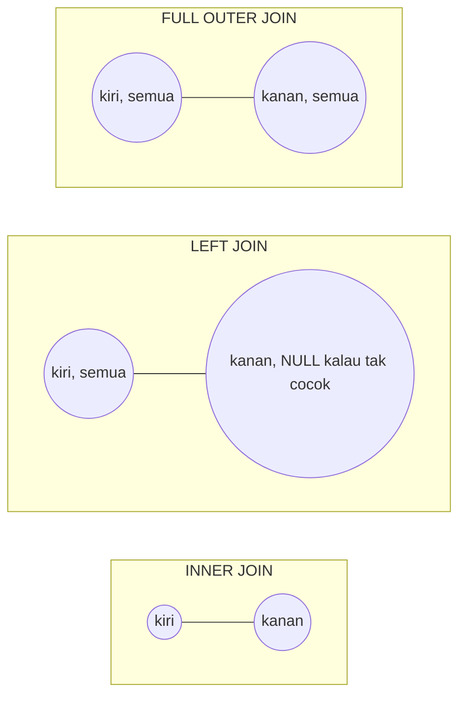

## TL;DR

`JOIN` menggabungkan baris dari dua tabel berdasarkan syarat kecocokan (`ON`). `INNER JOIN` hanya menyimpan baris yang cocok di **kedua** tabel. `LEFT JOIN` menyimpan **semua** baris tabel kiri, mengisi `NULL` untuk kolom kanan yang tidak punya pasangan. `RIGHT JOIN` adalah kebalikannya, dan jarang dipakai karena orang lebih suka menulis ulang sebagai `LEFT JOIN` dengan urutan tabel dibalik. `FULL OUTER JOIN` menyimpan semua baris dari kedua sisi, cocok atau tidak. Salah pilih jenis join adalah salah satu cara paling umum menghasilkan baris yang hilang secara diam-diam — tanpa error, hanya angka yang salah.

## The Problem

Sebuah endpoint laporan diminta menampilkan **semua instansi terdaftar**, beserta jumlah permohonan yang pernah mereka ajukan — termasuk instansi yang belum pernah mengajukan sama sekali (jumlahnya harus tampil sebagai 0, bukan hilang dari laporan). Query pertama yang ditulis:

```sql
SELECT i.nama, COUNT(p.id) AS jumlah_permohonan
FROM instansi i
INNER JOIN permohonan p ON p.instansi_id = i.id
GROUP BY i.nama;
```

Laporan ini tampak benar sampai seseorang membandingkan jumlah baris hasil dengan jumlah instansi terdaftar di sistem — jumlahnya lebih sedikit. Instansi yang belum pernah mengajukan permohonan sama sekali **hilang total** dari laporan, bukan tampil dengan angka 0. Ini bukan bug di `COUNT()` — `INNER JOIN` sudah membuang baris `instansi` yang tidak punya pasangan di `permohonan` **sebelum** `COUNT()` sempat menghitung apa pun untuknya. Menukar `INNER JOIN` menjadi `LEFT JOIN` memperbaikinya sepenuhnya, tapi tanpa mental model yang benar tentang apa yang sebenarnya dilakukan tiap jenis join, perbaikan ini terasa seperti coba-coba, bukan konsekuensi logis.

## Intuition

Bayangkan dua lingkaran Venn — tabel kiri dan tabel kanan. `INNER JOIN` adalah **irisan** kedua lingkaran: hanya area yang tumpang tindih. `LEFT JOIN` adalah **lingkaran kiri secara utuh**, dengan bagian yang tumpang tindih diisi data dari kanan, dan bagian yang tidak tumpang tindih diisi `NULL` untuk semua kolom kanan. `RIGHT JOIN` adalah cerminannya — lingkaran kanan secara utuh. `FULL OUTER JOIN` adalah **gabungan kedua lingkaran seutuhnya**.

Analogi Venn diagram ini bocor pada satu hal: diagram Venn menyiratkan "irisan" sebagai konsep himpunan yang statis, padahal `JOIN` sebenarnya adalah operasi yang **menghasilkan baris baru** — kalau satu baris di tabel kiri cocok dengan **tiga** baris di tabel kanan, hasilnya adalah **tiga baris**, bukan satu baris "beririsan". Diagram Venn tidak menunjukkan penggandaan baris ini sama sekali, dan penggandaan itu adalah sumber bug paling umum kedua setelah salah pilih jenis join — lihat [[Aggregation and GROUP BY Semantics]] untuk bagaimana ini merusak `COUNT()` dan `SUM()` kalau tidak disadari.

## How It Works



Diagram ini menunjukkan cakupan baris yang dipertahankan tiap jenis join; garis putus menandakan bagian yang diisi `NULL` kalau tidak ada pasangan.

Contoh konkret dengan dua tabel kecil:

`instansi`: `(1, 'Dinas A')`, `(2, 'Dinas B')`
`permohonan`: `(id=10, instansi_id=1)`, `(id=11, instansi_id=1)`

```sql
-- INNER JOIN: Dinas B hilang, karena tidak punya baris permohonan
SELECT i.nama, p.id FROM instansi i INNER JOIN permohonan p ON p.instansi_id = i.id;
-- Dinas A | 10
-- Dinas A | 11

-- LEFT JOIN: Dinas B tetap muncul, dengan p.id = NULL
SELECT i.nama, p.id FROM instansi i LEFT JOIN permohonan p ON p.instansi_id = i.id;
-- Dinas A | 10
-- Dinas A | 11
-- Dinas B | NULL
```

`RIGHT JOIN` secara logis identik dengan `LEFT JOIN` yang urutan tabelnya dibalik — `A RIGHT JOIN B` selalu bisa ditulis ulang sebagai `B LEFT JOIN A`. Karena itu, kebanyakan tim menstandarkan gaya penulisan hanya memakai `LEFT JOIN` demi konsistensi kognitif: pembaca query tidak perlu menahan dua arah baca sekaligus di kepala.

`FULL OUTER JOIN` menyimpan baris yang tidak cocok dari **kedua** sisi sekaligus — berguna untuk audit "cari data yang ada di satu sistem tapi tidak di sistem lain", tapi tidak semua database mendukungnya langsung (MySQL/MariaDB tidak punya `FULL OUTER JOIN` bawaan; harus disimulasikan dengan `UNION` dari `LEFT JOIN` dan `RIGHT JOIN` — lihat [[UNION vs UNION ALL]]).

## In Go

```go
package main

import (
	"context"
	"database/sql"
	"fmt"
)

type LaporanInstansi struct {
	Nama             string
	JumlahPermohonan int
}

// AmbilLaporanSemuaInstansi memakai LEFT JOIN secara sengaja, supaya
// instansi tanpa permohonan tetap muncul dengan jumlah 0, bukan hilang.
func AmbilLaporanSemuaInstansi(ctx context.Context, db *sql.DB) ([]LaporanInstansi, error) {
	rows, err := db.QueryContext(ctx, `
		SELECT i.nama, COUNT(p.id) AS jumlah_permohonan
		FROM instansi i
		LEFT JOIN permohonan p ON p.instansi_id = i.id
		GROUP BY i.nama
		ORDER BY i.nama
	`)
	if err != nil {
		return nil, fmt.Errorf("query laporan instansi: %w", err)
	}
	defer rows.Close()

	var hasil []LaporanInstansi
	for rows.Next() {
		var l LaporanInstansi
		if err := rows.Scan(&l.Nama, &l.JumlahPermohonan); err != nil {
			return nil, fmt.Errorf("scan baris laporan instansi: %w", err)
		}
		hasil = append(hasil, l)
	}
	if err := rows.Err(); err != nil {
		return nil, fmt.Errorf("iterasi baris laporan instansi: %w", err)
	}
	return hasil, nil
}
```

`COUNT(p.id)` — bukan `COUNT(*)` — dipakai secara sengaja di sini: `COUNT(*)` menghitung baris hasil join termasuk baris yang kolom `p`-nya seluruhnya `NULL` (instansi tanpa permohonan), sehingga instansi tanpa permohonan akan terhitung 1 alih-alih 0. `COUNT(kolom)` mengabaikan `NULL`, jadi baris "tanpa pasangan" dari `LEFT JOIN` benar-benar terhitung 0 — perilaku `COUNT()` terhadap `NULL` ini dibahas lebih dalam di [[NULL Semantics and Three-Valued Logic]].

## In His Stack

Yii2 `ActiveQuery::joinWith()` secara default memakai `LEFT JOIN` kalau relasinya `hasMany`/`hasOne` tanpa syarat tambahan — tapi begitu kamu menambahkan filter di relasi lewat `andWhere()` pada kondisi tabel kanan (bukan lewat `ON`), Yii2 diam-diam mengubah perilakunya jadi seperti `INNER JOIN`, karena baris `NULL` dari `LEFT JOIN` otomatis gagal lolos filter `WHERE kolom_kanan = ...` (baris `NULL` tidak pernah lolos perbandingan `WHERE`, lihat [[NULL Semantics and Three-Valued Logic]]). Ini jebakan klasik: developer mengira sudah memakai `LEFT JOIN` karena menulis `joinWith()`, padahal syarat `WHERE` yang ditambahkan diam-diam membatalkan efek "tetap tampilkan baris tanpa pasangan"-nya.

## Trade-offs and When Not To Use It

`INNER JOIN` lebih murah secara konseptual dan sering secara performa (planner punya lebih banyak kebebasan mengoptimalkan, dan hasilnya biasanya lebih kecil) — pakai `INNER JOIN` ketika baris tanpa pasangan memang **tidak relevan** untuk kebutuhan bisnisnya (misalnya laporan "permohonan yang sudah diverifikasi oleh petugas tertentu" — permohonan tanpa petugas memang seharusnya tidak muncul). `LEFT`/`RIGHT`/`FULL OUTER JOIN` menambah kompleksitas nyata: setiap kolom dari sisi "opsional" sekarang bisa `NULL`, dan kode yang membaca hasilnya (di Go maupun di lapisan SQL berikutnya) harus menangani itu secara eksplisit, atau risiko `nil pointer` / asumsi salah menjalar ke bug lain.

## Common Mistakes

> [!warning] Jebakan
> Memakai `INNER JOIN` ketika maksud sebenarnya adalah "tampilkan semua baris kiri, termasuk yang tidak punya pasangan" — hasilnya baris hilang secara diam-diam, tanpa error apa pun.

> [!warning] Jebakan
> Memakai `COUNT(*)` alih-alih `COUNT(kolom_kanan)` setelah `LEFT JOIN`, sehingga baris "tanpa pasangan" ikut terhitung sebagai 1 alih-alih 0.

> [!warning] Jebakan
> Menaruh syarat filter untuk tabel kanan di klausa `WHERE` alih-alih `ON` setelah `LEFT JOIN`. `WHERE` dievaluasi setelah join selesai (lihat [[The Logical Order of Query Execution]]), dan baris `NULL` hasil `LEFT JOIN` hampir selalu gagal lolos syarat `WHERE`, sehingga `LEFT JOIN` diam-diam berperilaku seperti `INNER JOIN`.

## Exercises

1. Tabel `pengguna` dan `sesi_login` — tulis query untuk menampilkan semua pengguna beserta waktu login terakhirnya, termasuk pengguna yang belum pernah login sama sekali.
2. Kenapa `RIGHT JOIN` jarang dipakai dalam gaya penulisan tim yang konsisten? Tulis ulang sebuah `A RIGHT JOIN B ON ...` menjadi bentuk `LEFT JOIN` yang setara.
3. Jelaskan kenapa menaruh `AND p.status = 'aktif'` di klausa `ON` menghasilkan hasil berbeda dibanding menaruhnya di klausa `WHERE`, setelah sebuah `LEFT JOIN`.
4. Desain terbuka: kamu diminta membuat query audit "temukan permohonan di database utama yang tidak punya catatan log pengiriman di sistem arsip, DAN catatan log arsip yang tidak punya permohonan aslinya di database utama (indikasi data yatim di kedua arah)." Rancang query-nya, termasuk jenis join yang dipakai dan alasannya, dengan mempertimbangkan bahwa MariaDB tidak mendukung `FULL OUTER JOIN` secara langsung.

> [!success]- Kunci jawaban
> **1.** `SELECT u.nama, MAX(s.waktu_login) AS login_terakhir FROM pengguna u LEFT JOIN sesi_login s ON s.pengguna_id = u.id GROUP BY u.nama` — `LEFT JOIN` memastikan pengguna tanpa sesi tetap muncul, dengan `login_terakhir` bernilai `NULL`.
> **2.** `A RIGHT JOIN B ON A.x = B.y` setara dengan `B LEFT JOIN A ON A.x = B.y` — semua baris `B` dipertahankan, `A` yang jadi sisi opsional.
> **4.** Karena MariaDB tidak punya `FULL OUTER JOIN`, simulasikan dengan `UNION` dua `LEFT JOIN` yang arahnya berlawanan: `(SELECT p.id AS permohonan_id, l.id AS log_id FROM permohonan p LEFT JOIN log_arsip l ON l.permohonan_id = p.id WHERE l.id IS NULL) UNION (SELECT p.id, l.id FROM log_arsip l LEFT JOIN permohonan p ON p.id = l.permohonan_id WHERE p.id IS NULL)`. Bagian pertama menemukan permohonan tanpa log arsip (yatim di satu arah), bagian kedua menemukan log arsip tanpa permohonan (yatim di arah lain); `UNION` (bukan `UNION ALL`) aman dipakai di sini karena kedua subquery pada dasarnya tidak akan pernah menghasilkan baris yang identik persis.

## Self-Check

- Apa perbedaan baris yang dipertahankan `INNER JOIN` vs `LEFT JOIN`?
- Kenapa `COUNT(*)` dan `COUNT(kolom)` bisa menghasilkan angka berbeda setelah `LEFT JOIN`?
- Kenapa menaruh syarat filter tabel kanan di `WHERE` bisa diam-diam mengubah `LEFT JOIN` berperilaku seperti `INNER JOIN`?
- Bagaimana mensimulasikan `FULL OUTER JOIN` di database yang tidak mendukungnya langsung?

## Connected Notes

- [[The Logical Order of Query Execution]] — `FROM`/`JOIN` adalah tahap paling awal; note ini menjelaskan kenapa syarat di `ON` vs `WHERE` berperilaku berbeda setelah `LEFT JOIN`.
- [[Aggregation and GROUP BY Semantics]] — join yang menggandakan baris (satu-ke-banyak) mengacaukan `SUM()`/`COUNT()` kalau tidak disadari sebelum agregasi.
- [[NULL Semantics and Three-Valued Logic]] — kolom dari sisi opsional `LEFT JOIN` selalu berpotensi `NULL`, dan `WHERE`/`ON` bernalar berbeda terhadap `NULL`.
- [[UNION vs UNION ALL]] — dipakai untuk mensimulasikan `FULL OUTER JOIN` di database yang tidak mendukungnya.
- [[Relational Modelling]] — jenis relasi (satu-ke-satu, satu-ke-banyak, banyak-ke-banyak) menentukan jenis join mana yang relevan untuk sebuah query.

## Further Reading

- Dokumentasi resmi PostgreSQL dan MySQL/MariaDB, bagian `JOIN` — keduanya punya penjelasan referensi lengkap tentang tiap varian.

## Catatan Saya

*Tulis di sini query di kerjaanmu yang pernah kehilangan baris karena salah pilih INNER vs LEFT JOIN, atau kasus lain yang relevan.*
