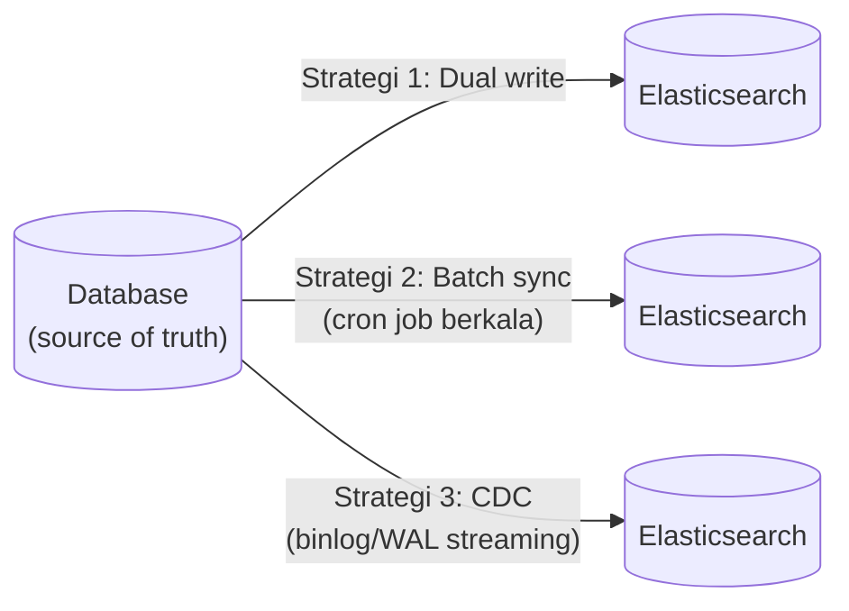

## TL;DR

Elasticsearch (atau sistem pencarian terpisah manapun) hampir tidak pernah menjadi sumber kebenaran (source of truth) data — database relasional tetap memegang peran itu, dan indeks pencarian adalah **salinan** yang dioptimalkan khusus untuk kebutuhan pencarian. Begitu ada dua salinan data yang harus tetap sinkron, muncul kelas masalah baru yang tidak ada saat data hanya hidup di satu tempat: **search index yang diam-diam melenceng dari database sumbernya** — dokumen yang sudah dihapus/diubah di database tapi masih muncul (atau muncul dengan data lama) di hasil pencarian, karena mekanisme sinkronisasinya gagal, tertunda, atau tidak pernah dibangun dengan benar sejak awal.

## The Problem

Sebuah petugas menghapus permohonan yang salah input, memverifikasi penghapusan itu berhasil di database (data benar-benar hilang saat di-query langsung), tapi permohonan itu **masih muncul** di hasil pencarian dashboard selama beberapa hari. Investigasi menemukan bahwa proses sinkronisasi ke Elasticsearch (job terjadwal yang berjalan setiap malam) gagal diam-diam beberapa malam berturut-turut karena perubahan skema kecil di database yang tidak diantisipasi kode sinkronisasi — tidak ada yang memantau kesehatan proses ini secara eksplisit, sehingga kegagalan itu berlangsung tanpa terdeteksi sampai pengguna melaporkannya sebagai bug "data hantu" yang membingungkan.

Masalah kedua yang lebih halus dan lebih sulit didiagnosis: sebuah dokumen yang statusnya baru saja diubah dari "menunggu" ke "disetujui" di database, masih muncul dengan status "menunggu" di hasil pencarian selama beberapa menit — bukan karena proses sinkronisasi gagal total, tapi karena ia berjalan dengan **jeda** (mirip replication lag yang dibahas di [[Read Replicas and Replication Lag]], tapi kali ini antara database dan search index, bukan antara primary dan replica database yang sama). Untuk kebanyakan kebutuhan pencarian, jeda beberapa menit ini bisa diterima — tapi kalau tidak dikomunikasikan atau dipahami sebagai trade-off yang disengaja, ia terasa seperti bug yang "kadang muncul, kadang tidak" tergantung seberapa cepat pengguna memeriksa ulang setelah mengubah data.

## Intuition

Bayangkan search index seperti **katalog perpustakaan yang harus diperbarui manual setiap kali ada buku baru masuk atau buku lama dikeluarkan dari rak**. Kalau petugas yang memperbarui katalog itu absen atau lalai satu hari, katalog itu **diam-diam** tidak lagi mencerminkan isi rak yang sebenarnya — buku yang sudah dikeluarkan masih tercantum di katalog, buku baru belum tercantum sama sekali. Masalahnya bukan katalog itu "rusak" secara mekanis — ia berfungsi normal, hanya berisi informasi yang sudah usang, dan tidak ada yang tahu sampai seseorang mencari buku yang menurut katalog "ada" tapi ternyata sudah tidak ada di rak.

Analogi ini bocor pada satu hal: petugas perpustakaan yang lalai biasanya terlihat jelas tidak bekerja (absen, meja kosong). Proses sinkronisasi search index yang gagal **tidak selalu terlihat jelas** — job yang gagal bisa saja tetap "berjalan" tanpa error yang eksplisit terlihat (misalnya berhasil terhubung ke Elasticsearch tapi gagal memproses sebagian dokumen karena format data yang berubah), membuat kegagalan sinkronisasi menjadi kelas bug yang secara khusus butuh observability eksplisit (lihat [[../70 Infrastructure and Delivery/The Three Pillars of Observability|The Three Pillars of Observability]]) untuk terdeteksi sebelum pengguna yang menemukannya lebih dulu.

## How It Works



Diagram ini menunjukkan tiga strategi umum menjaga sinkronisasi, masing-masing dengan trade-off berbeda:

- **Dual write** — aplikasi menulis ke database **dan** ke Elasticsearch dalam operasi yang sama (biasanya berurutan, bukan atomik). Paling sederhana diimplementasikan, tapi paling rapuh: kalau tulisan ke database berhasil tapi tulisan ke Elasticsearch gagal (jaringan terputus, Elasticsearch sedang down), kedua sistem melenceng seketika, dan tidak ada mekanisme bawaan untuk mendeteksi atau memperbaiki drift ini secara otomatis.
- **Batch sync** — job terjadwal (cron) yang secara berkala membaca perubahan dari database dan mendorongnya ke Elasticsearch. Lebih tahan terhadap kegagalan sesaat (percobaan berikutnya bisa memperbaiki apa yang terlewat), tapi memperkenalkan jeda yang jelas antara perubahan data dan perubahan hasil pencarian, sebesar interval job itu berjalan.
- **Change Data Capture (CDC)** — membaca perubahan langsung dari **binlog/WAL** database (dibahas lebih dalam di [[../60 Distributed Systems/Change Data Capture|Change Data Capture]], level senior) dan mengalirkannya ke Elasticsearch secara near-real-time. Paling andal dan minim jeda, tapi butuh infrastruktur tambahan (Debezium atau setara) dan kompleksitas operasional yang lebih tinggi dibanding dua pendekatan lainnya.

## Under The Hood

**Dual write** punya masalah struktural yang tidak bisa ditambal sepenuhnya tanpa mekanisme tambahan: tidak ada transaksi yang mencakup **dua sistem berbeda** (database relasional dan Elasticsearch) sekaligus — kalaupun aplikasi menunggu konfirmasi dari keduanya sebelum menganggap operasi "sukses", tetap ada jendela waktu di antara kedua tulisan itu di mana kegagalan pada satu sisi meninggalkan sistem dalam keadaan tidak konsisten. Pola **transactional outbox** (dibahas lebih dalam di domain APIs level intermediate) adalah salah satu cara memperbaiki ini — menulis "niat untuk sinkronisasi" sebagai bagian dari transaksi database yang sama, lalu proses terpisah yang membaca niat itu dan benar-benar mendorongnya ke Elasticsearch, dengan jaminan **at-least-once** (bisa dicoba ulang kalau gagal) alih-alih dual write yang bisa gagal diam-diam tanpa jejak.

**Full reindex** — proses membangun ulang seluruh index dari nol berdasarkan seluruh data di database — adalah jaring pengaman yang harus selalu tersedia terlepas dari strategi sinkronisasi harian yang dipakai, karena drift yang terakumulasi dari waktu ke waktu (bug kecil di CDC, kegagalan batch sync yang tidak terdeteksi lama) pada akhirnya butuh cara untuk "menyamakan ulang" kedua sistem dari awal. Full reindex pada dataset besar bisa memakan waktu signifikan dan membebani database sumber (harus membaca seluruh data) — perlu direncanakan sebagai operasi terjadwal dengan sengaja, bukan dijalankan reaktif secara panik saat drift sudah parah.

## In Go

```go
package outbox

import (
	"context"
	"database/sql"
	"encoding/json"
	"fmt"
)

// EntriOutbox dicatat dalam TRANSAKSI YANG SAMA dengan perubahan data
// utama — menjamin kalau perubahan data berhasil di-commit, niat untuk
// sinkronisasi ke Elasticsearch JUGA pasti tercatat, tidak pernah salah
// satu saja (berbeda dari dual write yang bisa gagal di salah satu sisi).
type EntriOutbox struct {
	ID        int64
	Entitas   string
	EntitasID int64
	Aksi      string // "index" atau "delete"
	Payload   []byte
}

func UbahStatusDenganOutbox(ctx context.Context, db *sql.DB, permohonanID int64, statusBaru string) error {
	tx, err := db.BeginTx(ctx, nil)
	if err != nil {
		return fmt.Errorf("mulai transaction: %w", err)
	}
	defer tx.Rollback()

	if _, err := tx.ExecContext(ctx, `UPDATE permohonan SET status = ? WHERE id = ?`, statusBaru, permohonanID); err != nil {
		return fmt.Errorf("update status permohonan: %w", err)
	}

	payload, err := json.Marshal(map[string]any{"id": permohonanID, "status": statusBaru})
	if err != nil {
		return fmt.Errorf("marshal payload outbox: %w", err)
	}

	// Dicatat dalam TRANSAKSI YANG SAMA — kalau UPDATE di atas berhasil
	// commit, baris outbox ini JUGA pasti ter-commit, tidak pernah hilang.
	_, err = tx.ExecContext(ctx, `
		INSERT INTO outbox (entitas, entitas_id, aksi, payload, diproses)
		VALUES ('permohonan', ?, 'index', ?, false)
	`, permohonanID, payload)
	if err != nil {
		return fmt.Errorf("catat entri outbox: %w", err)
	}

	return tx.Commit()
}

// ProsesOutboxKeElasticsearch dijalankan sebagai worker terpisah yang
// membaca entri outbox yang belum diproses, mendorongnya ke Elasticsearch,
// dan menandainya selesai — kalau gagal, entri tetap "belum diproses" dan
// akan dicoba ulang pada iterasi berikutnya (jaminan at-least-once).
func ProsesOutboxKeElasticsearch(ctx context.Context, db *sql.DB, kirimKeES func(ctx context.Context, payload []byte) error) error {
	rows, err := db.QueryContext(ctx, `
		SELECT id, payload FROM outbox WHERE diproses = false ORDER BY id ASC LIMIT 100
	`)
	if err != nil {
		return fmt.Errorf("ambil entri outbox belum diproses: %w", err)
	}
	defer rows.Close()

	var idSelesai []int64
	for rows.Next() {
		var id int64
		var payload []byte
		if err := rows.Scan(&id, &payload); err != nil {
			return fmt.Errorf("scan entri outbox: %w", err)
		}

		if err := kirimKeES(ctx, payload); err != nil {
			// Gagal kirim SATU entri tidak menghentikan proses entri
			// lain — dicoba lagi pada iterasi berikutnya.
			continue
		}
		idSelesai = append(idSelesai, id)
	}

	for _, id := range idSelesai {
		if _, err := db.ExecContext(ctx, `UPDATE outbox SET diproses = true WHERE id = ?`, id); err != nil {
			return fmt.Errorf("tandai outbox selesai id %d: %w", id, err)
		}
	}
	return nil
}
```

## In His Stack

Untuk sistem legal-services yang menggabungkan MariaDB dan Elasticsearch, "data hantu" di hasil pencarian (dokumen yang seharusnya sudah tidak ada tapi masih muncul) adalah kelas bug yang sangat mengganggu kepercayaan pengguna terhadap sistem, khususnya untuk data yang sensitif secara hukum — petugas yang mempercayai hasil pencarian sebagai representasi akurat dari database bisa membuat keputusan berdasarkan informasi usang. Menjadikan kesehatan proses sinkronisasi (lag antara database dan index, tingkat kegagalan job sinkronisasi) sebagai metrik yang eksplisit dipantau — bukan diasumsikan "pasti jalan karena sudah di-deploy" — adalah kebiasaan operasional yang sepadan dengan risiko yang ditanggung.

## Trade-offs and When Not To Use It

Membangun mekanisme sinkronisasi yang benar-benar andal (outbox pattern, CDC) menambah kompleksitas infrastruktur yang signifikan — untuk sistem pencarian yang kebutuhan kesegarannya longgar (misalnya pencarian arsip dokumen lama yang jarang berubah), batch sync sederhana yang berjalan tiap beberapa jam sudah lebih dari cukup, dan membangun CDC penuh untuk kasus ini adalah over-engineering. Sebaliknya, untuk sistem yang butuh hasil pencarian mencerminkan perubahan hampir seketika (misalnya pencarian status permohonan yang aktif diproses), batch sync sekali sehari jelas tidak memadai, dan investasi ke CDC atau setidaknya dual write dengan outbox pattern jadi sepadan. Keputusan strategi sinkronisasi harus mengikuti kebutuhan kesegaran data yang **sesungguhnya** dibutuhkan pengguna, bukan default ke solusi paling canggih atau paling sederhana tanpa mempertimbangkan kebutuhan nyata.

## Common Mistakes

> [!warning] Jebakan
> Memakai dual write murni (tulis ke database, lalu tulis ke Elasticsearch) tanpa mekanisme retry atau pendeteksian kegagalan — begitu salah satu tulisan gagal, kedua sistem melenceng tanpa jejak yang jelas, dan drift ini bisa terakumulasi diam-diam untuk waktu lama.

> [!warning] Jebakan
> Tidak memantau kesehatan proses sinkronisasi secara eksplisit (lag, tingkat kegagalan) — kegagalan sinkronisasi sering tidak menghasilkan error yang mencolok, dan baru terdeteksi setelah pengguna melaporkan data yang tidak sesuai.

> [!warning] Jebakan
> Tidak punya mekanisme full reindex yang siap dipakai sebagai jaring pengaman — begitu drift yang terakumulasi terlalu parah untuk diperbaiki inkremental, tim tidak punya cara cepat menyamakan ulang kedua sistem dari awal.

## Exercises

1. Jelaskan kenapa dual write murni (tanpa outbox pattern) rentan terhadap drift yang tidak terdeteksi antara database dan search index.
2. Apa perbedaan mendasar batch sync dan CDC dalam hal kesegaran data dan kompleksitas infrastruktur?
3. Kenapa full reindex tetap dibutuhkan sebagai jaring pengaman, terlepas dari strategi sinkronisasi harian yang dipakai?
4. Desain terbuka: sistem pencarianmu memakai batch sync setiap 30 menit, dan kamu baru menyadari proses ini sudah gagal diam-diam selama tiga hari terakhir tanpa terdeteksi (tidak ada alert yang terpasang). Rancang dua perbaikan: (a) bagaimana mendeteksi kegagalan semacam ini lebih cepat di masa depan, dan (b) bagaimana memperbaiki drift yang sudah terlanjur terjadi selama tiga hari itu, tanpa harus melakukan full reindex penuh yang memakan waktu lama kalau memang tidak perlu.

> [!success]- Kunci jawaban
> **1.** Dual write menulis ke dua sistem berbeda secara berurutan tanpa transaksi yang mencakup keduanya sekaligus — kalau tulisan pertama (database) berhasil tapi tulisan kedua (Elasticsearch) gagal karena alasan apa pun (jaringan, Elasticsearch down, timeout), tidak ada mekanisme otomatis yang mencatat bahwa sinkronisasi ini gagal dan perlu dicoba ulang. Aplikasi mungkin bahkan menganggap seluruh operasi "sukses" kalau error dari sisi Elasticsearch tidak ditangani dengan benar (misalnya di-log tapi tidak menggagalkan response ke pengguna) — drift terjadi tanpa jejak yang mudah ditemukan sampai seseorang secara spesifik membandingkan kedua sistem.
> **4.** (a) Tambahkan metrik eksplisit untuk proses batch sync: jumlah dokumen berhasil disinkronkan per run, waktu proses terakhir kali berhasil (`last_successful_sync`), dan alert otomatis kalau `last_successful_sync` lebih tua dari beberapa kali interval normal (misalnya lebih dari 2 jam untuk job yang seharusnya jalan tiap 30 menit) — mengubah kegagalan diam-diam menjadi sinyal yang eksplisit terlihat operator, bukan bergantung pada laporan pengguna. (b) Alih-alih full reindex penuh, jalankan sinkronisasi **bertarget** hanya untuk baris yang berubah dalam rentang waktu tiga hari terakhir (`WHERE updated_at >= now() - interval '3 days'`) — asumsikan tabel punya kolom timestamp perubahan yang bisa diandalkan; ini memperbaiki drift dari periode yang bermasalah tanpa perlu memproses ulang seluruh dataset yang tidak terpengaruh sama sekali, jauh lebih cepat dan lebih murah dibanding full reindex total.

## Self-Check

- Kenapa dual write murni rentan terhadap drift yang tidak terdeteksi?
- Apa perbedaan trade-off batch sync dan CDC?
- Kenapa full reindex tetap perlu ada sebagai jaring pengaman?
- Metrik apa yang perlu dipantau untuk mendeteksi kegagalan sinkronisasi lebih cepat?

## Connected Notes

- [[Relevance Scoring]] — hasil pencarian yang relevan tidak berguna kalau datanya sendiri sudah usang atau salah karena drift sinkronisasi, penutup alami dari rangkaian topik search di domain ini.
- [[Read Replicas and Replication Lag]] — lag antara database dan search index adalah masalah yang secara konseptual identik dengan replication lag, hanya antara dua sistem yang sepenuhnya berbeda alih-alih dua instance database yang sama.
- [[../60 Distributed Systems/Change Data Capture|Change Data Capture]] — strategi sinkronisasi paling andal yang dibahas mendalam di level senior, disinggung sebagai salah satu dari tiga strategi di note ini.
- [[../30 APIs and Web/_Overview|APIs and Web Overview]] — transactional outbox pattern yang dipakai untuk sinkronisasi andal di note ini dibahas lebih luas sebagai pola integrasi di domain APIs, level intermediate.
- [[../70 Infrastructure and Delivery/The Three Pillars of Observability|The Three Pillars of Observability]] — pemantauan kesehatan proses sinkronisasi (lag, tingkat kegagalan) adalah aplikasi langsung dari prinsip observability di domain itu.

## Further Reading

- Dokumentasi resmi Debezium (implementasi CDC open-source populer) sebagai referensi konkret arsitektur CDC untuk sinkronisasi database-ke-search-index.

## Catatan Saya

*Tulis di sini strategi sinkronisasi yang dipakai fitur pencarian di kerjaanmu saat ini (dual write, batch sync, atau CDC) — dan apakah pernah ada insiden "data hantu" seperti di note ini.*
