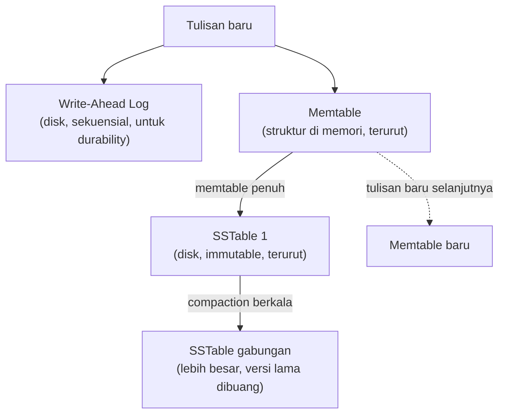

## TL;DR

[[B+Tree Structure]] menjelaskan struktur yang dipakai hampir semua database relasional untuk index. Struktur itu dioptimalkan untuk **baca** cepat, tapi setiap penulisan berarti mencari lokasi yang tepat di dalam pohon dan mengubahnya di tempat (*in-place update*) — sebuah pola akses disk yang acak. LSM-Tree (Log-Structured Merge-Tree) mengambil pendekatan yang secara filosofis terbalik: alih-alih mengubah data di tempat, setiap penulisan baru **selalu ditambahkan** secara berurutan (append-only) ke struktur di memori, yang secara berkala di-flush dan digabung (*merge*) ke disk dalam batch. Ini menukar kompleksitas tambahan saat membaca (data yang sama mungkin tersebar di beberapa lokasi, perlu digabung saat dicari) demi throughput tulis yang jauh lebih tinggi. Ini bukan struktur data yang "lebih baru dan lebih baik" dari B-Tree — ia mengoptimalkan trade-off baca/tulis ke arah yang berlawanan.

## The Problem

Sebuah sistem logging yang mencatat setiap aksi pengguna di 13 aplikasi menerima puluhan ribu penulisan per detik di jam sibuk — volume tulis yang jauh melebihi kebutuhan baca (log jarang dibaca ulang, kecuali untuk investigasi insiden yang jarang terjadi). Database berbasis B-Tree (MariaDB/InnoDB) yang dipakai untuk data transaksional lain mulai menunjukkan tekanan nyata saat menangani volume tulis logging ini. Setiap `INSERT` memaksa pencarian lokasi yang tepat di B+Tree index (termasuk kemungkinan node split, dibahas di [[B+Tree Structure]]), yang berarti operasi disk **acak** (random I/O) untuk setiap baris baru yang masuk, bukan operasi berurutan yang jauh lebih murah.

Pertanyaannya: kalau pola akses yang dominan adalah **tulis jauh lebih sering daripada baca**, dan sebagian besar data yang ditulis jarang sekali dibaca ulang secara individual, apakah ada struktur data yang dirancang khusus untuk pola ini? Struktur yang menerima tulisan secepat mungkin, bahkan kalau itu berarti pembacaan sesekali jadi sedikit lebih kompleks. Jawabannya adalah LSM-Tree, struktur yang mendasari banyak database yang secara eksplisit dioptimalkan untuk beban tulis tinggi (RocksDB, Cassandra, dan komponen storage di banyak sistem time-series/logging modern).

## Intuition

Bayangkan B-Tree seperti **arsiparis yang langsung menaruh setiap dokumen baru tepat di tempatnya yang benar di rak**, sesuai urutan alfabet atau kategori. Perlu waktu mencari slot yang tepat setiap kali (bahkan mungkin menggeser dokumen lain untuk membuat ruang, mirip node split), tapi begitu ditaruh, dokumen itu mudah ditemukan kapan pun karena rak selalu dalam keadaan terurut sempurna.

LSM-Tree seperti **arsiparis yang menaruh setiap dokumen baru di atas meja kerja (memori) tanpa menyusunnya dulu**, dan hanya sesekali (saat meja penuh) membawa seluruh tumpukan dokumen di meja itu ke gudang, menggabungkannya dengan tumpukan yang sudah ada di sana dalam satu proses rapi (*compaction*). Menaruh dokumen baru di meja jauh lebih cepat daripada mencari slot rak yang tepat setiap kali. Tapi mencari satu dokumen tertentu sekarang mungkin perlu memeriksa **meja kerja saat ini** dan **beberapa tumpukan gudang** dari waktu penggabungan yang berbeda-beda, karena dokumen yang sama (versi terbarunya) bisa saja masih ada di meja, belum sempat dipindah.

Analogi ini bocor pada satu hal: meja kerja fisik yang penuh dokumen tidak hilang isinya kalau listrik padam. Struktur di memori LSM-Tree (biasanya disebut *memtable*) **akan** hilang kalau proses database mati tiba-tiba sebelum sempat di-flush ke disk. Inilah kenapa LSM-Tree selalu dipasangkan dengan **write-ahead log** (WAL) terpisah yang mencatat setiap tulisan secara berurutan ke disk **sebelum** dianggap sukses, memberi jaminan durability yang sama seperti B-Tree meski strukturnya sangat berbeda.

## How It Works



Diagram ini menunjukkan siklus hidup data di LSM-Tree: tulisan masuk ke **memtable** (struktur di memori, biasanya pohon terurut seperti skip list atau red-black tree) sambil juga dicatat ke **WAL** di disk untuk durability. Begitu memtable mencapai ukuran tertentu, isinya di-flush jadi **SSTable** (Sorted String Table) — file di disk yang immutable (tidak pernah diubah setelah ditulis) dan terurut. Seiring waktu, banyak SSTable menumpuk, dan proses **compaction** berjalan di latar belakang menggabungkan beberapa SSTable jadi satu yang lebih besar, sekaligus membuang versi data yang sudah usang (misalnya baris yang sudah di-`UPDATE` atau di-`DELETE` setelahnya).

**Kenapa pembacaan lebih kompleks**: mencari satu key tertentu mungkin harus memeriksa memtable saat ini, **dan** beberapa SSTable dari berbagai waktu compaction yang berbeda (versi terbaru key itu bisa ada di salah satu dari semuanya) — di kasus terburuk, satu pembacaan menyentuh banyak lokasi terpisah. Optimasi seperti **bloom filter** (struktur probabilistik yang bisa menjawab cepat "key ini PASTI TIDAK ADA di SSTable ini" tanpa benar-benar membaca isinya) dipakai secara luas untuk mengurangi jumlah SSTable yang benar-benar perlu diperiksa untuk satu pencarian.

## Under The Hood

**Write amplification** (dibahas lebih dalam di [[Write Amplification and Compression]]) muncul secara berbeda di kedua struktur: B-Tree mengalami write amplification lewat node split (satu perubahan logis bisa memicu penulisan ulang beberapa halaman disk sekaligus); LSM-Tree mengalami write amplification lewat **compaction** (data yang sama ditulis ulang berkali-kali seiring SSTable digabung berulang dari kecil ke besar, meski secara logis hanya ditulis sekali oleh aplikasi). Kedua struktur membayar "pajak" tulis tambahan, hanya lewat mekanisme yang berbeda.

**Kenapa LSM-Tree unggul untuk tulis**: seluruh tulisan ke memtable dan WAL bersifat **sekuensial** (berurutan), baik di memori maupun saat flush ke disk. Tidak ada pencarian lokasi spesifik yang perlu dilakukan seperti B-Tree, yang harus menemukan node yang tepat di tengah struktur pohon yang sudah ada. Operasi disk sekuensial secara mendasar jauh lebih cepat dari operasi disk acak (random I/O), terutama untuk storage berbasis disk mekanis (HDD) di mana perbedaannya sangat drastis, dan tetap signifikan (meski lebih kecil) bahkan untuk SSD modern.

Trade-off ini kenapa banyak sistem embedded key-value store (RocksDB, LevelDB) dan database wide-column (Cassandra) memakai LSM-Tree sebagai storage engine intinya. Beban kerja mereka secara khas menulis jauh lebih sering daripada membaca ulang satu key spesifik, dan mereka bersedia membayar kompleksitas baca tambahan demi throughput tulis yang jauh lebih tinggi.

## In Go

```go
package logstore

import (
	"context"
	"fmt"
	"sync"
)

// MemtableSederhana mendemonstrasikan PRINSIP inti LSM-Tree, bukan
// implementasi produksi — struktur di memori yang menerima tulisan
// secepat mungkin (append), tanpa pencarian lokasi kompleks di setiap
// tulisan seperti yang dibutuhkan struktur B-Tree.
type MemtableSederhana struct {
	mu   sync.Mutex
	data map[string]string
	ukuranMaks int
}

func NewMemtableSederhana(ukuranMaks int) *MemtableSederhana {
	return &MemtableSederhana{data: make(map[string]string), ukuranMaks: ukuranMaks}
}

// Tulis menambahkan key-value ke memtable — operasi CEPAT karena hanya
// menulis ke struktur di memori, tanpa pencarian lokasi disk sama sekali.
// Dalam LSM-Tree sungguhan, ini juga dibarengi tulisan sinkron ke WAL
// untuk durability (diringkas di sini untuk fokus pada konsep memtable).
func (m *MemtableSederhana) Tulis(ctx context.Context, key, value string) (butuhFlush bool) {
	m.mu.Lock()
	defer m.mu.Unlock()

	m.data[key] = value
	return len(m.data) >= m.ukuranMaks
}

// Baca mencari key HANYA di memtable saat ini — implementasi sungguhan
// juga harus memeriksa SSTable di disk kalau key tidak ditemukan di sini,
// dari yang terbaru ke terlama, sampai ditemukan atau semua sudah diperiksa.
func (m *MemtableSederhana) Baca(ctx context.Context, key string) (string, bool) {
	m.mu.Lock()
	defer m.mu.Unlock()

	nilai, ada := m.data[key]
	return nilai, ada
}

// Flush "membekukan" memtable saat ini menjadi kandidat SSTable, dan
// mengosongkan memtable untuk menerima tulisan berikutnya. Implementasi
// sungguhan menulis data yang sudah terurut ke file immutable di disk
// pada titik ini.
func (m *MemtableSederhana) Flush() map[string]string {
	m.mu.Lock()
	defer m.mu.Unlock()

	dataLama := m.data
	m.data = make(map[string]string)
	fmt.Printf("flush %d entri ke SSTable baru\n", len(dataLama))
	return dataLama
}
```

## In His Stack

Kafka, meski bukan database dalam pengertian tradisional, memakai prinsip filosofis yang sangat mirip LSM-Tree di level penyimpanan log-nya. Setiap pesan ditambahkan secara sekuensial (append-only) ke segment log di disk, tidak pernah diubah di tempat, dan pembersihan data lama terjadi lewat mekanisme retensi/compaction terpisah, bukan penghapusan baris satu per satu. Memahami LSM-Tree membantu memahami kenapa Kafka bisa mencapai throughput tulis yang sangat tinggi — akar filosofisnya (append-only, sekuensial) sama dengan yang membuat LSM-Tree unggul untuk beban tulis berat. Elasticsearch juga memakai struktur penyimpanan berbasis segment yang immutable dengan proses merge berkala, prinsip yang lagi-lagi mengingatkan pada LSM-Tree meski detail implementasinya (Lucene segments) berbeda.

## Trade-offs and When Not To Use It

LSM-Tree adalah pilihan yang salah untuk beban kerja yang butuh **latensi baca konsisten dan rendah** untuk pencarian titik (point lookup) yang sangat sering — kompleksitas memeriksa beberapa SSTable (bahkan dengan bantuan bloom filter) tetap menambah overhead dibanding B-Tree yang selalu tahu persis satu jalur pencarian ke data yang dicari. LSM-Tree juga membutuhkan proses compaction yang berjalan terus-menerus di latar belakang. Kalau compaction tertinggal dari laju tulis yang masuk (write pressure lebih tinggi dari kapasitas compaction), jumlah SSTable yang harus diperiksa untuk setiap baca terus bertambah, memperlambat baca secara progresif sampai compaction bisa mengejar ketinggalan — sebuah mode kegagalan operasional yang tidak punya analog langsung di B-Tree. Untuk beban kerja OLTP khas (banyak pencarian titik campur dengan tulisan, kebutuhan latensi baca yang konsisten), B-Tree tetap pilihan yang lebih matang dan dapat diprediksi.

## Common Mistakes

> [!warning] Jebakan
> Memilih database berbasis LSM-Tree untuk beban kerja yang didominasi pencarian titik (point lookup) yang sangat sering dan butuh latensi rendah konsisten — kompleksitas memeriksa beberapa SSTable membuatnya kurang cocok dibanding B-Tree untuk pola akses ini.

> [!warning] Jebakan
> Mengabaikan pemantauan proses compaction pada database berbasis LSM-Tree — compaction yang tertinggal dari laju tulis menyebabkan penumpukan SSTable yang terus memperlambat pembacaan, sebuah degradasi bertahap yang mudah tidak disadari sampai sudah parah.

> [!warning] Jebakan
> Menyamakan "append-only" LSM-Tree dengan "tidak butuh durability tambahan" — memtable tetap hidup di memori dan bisa hilang kalau proses mati mendadak; write-ahead log tetap wajib ada sebagai jaminan durability yang setara dengan B-Tree.

## Exercises

1. Jelaskan kenapa LSM-Tree unggul untuk beban tulis tinggi, dan trade-off apa yang dibayar untuk keunggulan itu.
2. Apa peran write-ahead log dalam LSM-Tree, dan kenapa ia tetap dibutuhkan meski memtable-nya sendiri sudah menerima tulisan dengan cepat?
3. Kenapa compaction yang tertinggal dari laju tulis bisa memperlambat pembacaan secara progresif pada database berbasis LSM-Tree?
4. Desain terbuka: timmu mempertimbangkan dua opsi untuk sistem logging baru dengan volume tulis sangat tinggi (puluhan ribu entri per detik) tapi kebutuhan baca yang jarang dan tidak butuh latensi rendah (hanya untuk investigasi insiden sesekali): (a) MariaDB dengan InnoDB (B-Tree), (b) database berbasis LSM-Tree. Jelaskan alasan teknis kenapa opsi (b) lebih sesuai untuk kasus ini, dan sebutkan satu skenario yang akan membalik keputusan ini kembali ke opsi (a).

> [!success]- Kunci jawaban
> **1.** LSM-Tree unggul untuk tulis karena setiap tulisan hanya perlu ditambahkan secara sekuensial ke memtable (dan WAL) — operasi yang jauh lebih cepat dibanding B-Tree yang harus mencari lokasi tepat di dalam struktur pohon yang sudah ada (operasi disk acak, plus kemungkinan node split). Trade-off yang dibayar: pembacaan menjadi lebih kompleks karena data untuk satu key bisa tersebar di memtable dan beberapa SSTable dari waktu berbeda, butuh diperiksa berurutan (dibantu bloom filter) sampai ditemukan, alih-alih satu jalur pencarian langsung seperti di B-Tree.
> **4.** Opsi (b) lebih sesuai karena pola aksesnya (volume tulis sangat tinggi, baca jarang dan tidak sensitif latensi) persis profil yang dioptimalkan LSM-Tree: menukar kompleksitas baca (yang jarang terjadi dan boleh sedikit lebih lambat) demi throughput tulis maksimal (yang terjadi terus-menerus dan volumenya tinggi). Skenario yang akan membalik keputusan ke opsi (a): kalau kebutuhan bisnis berubah dan sistem logging ini tiba-tiba butuh mendukung pencarian real-time yang sering dan butuh latensi rendah konsisten (misalnya, dashboard monitoring yang terus-menerus query log terbaru per pengguna tertentu). Di titik itu, karakteristik baca yang berubah dari "jarang" jadi "sering dan butuh cepat" membuat trade-off LSM-Tree tidak lagi menguntungkan, dan B-Tree (atau pemisahan ke sistem terpisah yang dioptimalkan untuk pencarian, seperti Elasticsearch) menjadi pilihan yang lebih tepat.

## Self-Check

- Kenapa LSM-Tree menulis lebih cepat dibanding B-Tree, secara mekanis?
- Apa fungsi write-ahead log dalam LSM-Tree?
- Apa itu compaction, dan kenapa keterlambatannya berdampak pada kecepatan baca?
- Kapan LSM-Tree adalah pilihan yang salah dibanding B-Tree?

## Connected Notes

- [[B+Tree Structure]] — struktur data pembanding langsung; kedua note ini menjelaskan dua filosofi berlawanan dalam mendesain storage engine untuk trade-off baca vs tulis.
- [[Write Amplification and Compression]] — kelanjutan langsung: biaya tersembunyi compaction pada LSM-Tree, dibahas mendalam di note berikutnya.
- [[OLTP vs OLAP vs HTAP]] — pemilihan struktur storage (B-Tree vs LSM-Tree) adalah salah satu dimensi konkret dari keputusan OLTP vs OLAP yang lebih luas.
- [[../92 Tools/Kafka|Kafka]] — filosofi append-only sekuensial yang mendasari LSM-Tree juga menjadi dasar desain log storage Kafka, dibahas lebih operasional di tool note itu.
- [[../50 Concurrency and Performance/_Overview|Concurrency and Performance Overview]] — trade-off antara struktur data yang dioptimalkan untuk penulisan konkuren adalah tema yang berulang di domain itu, khususnya untuk struktur data in-memory.

## Further Reading

- Paper asli "The Log-Structured Merge-Tree (LSM-Tree)" oleh O'Neil dkk. — rujukan akademik pertama yang memformalkan struktur ini.
- Dokumentasi resmi RocksDB, bagian "Terminology" dan penjelasan memtable/SSTable/compaction.

## Catatan Saya

*Tulis di sini apakah ada sistem logging atau time-series di kerjaanmu yang saat ini disimpan di database berbasis B-Tree (MariaDB) — apakah LSM-Tree akan lebih cocok untuk pola akses datanya.*
