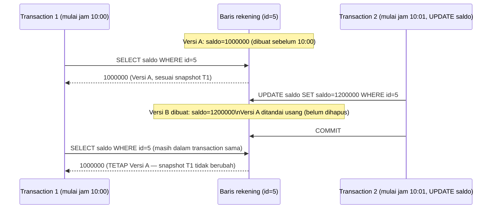

## TL;DR

MVCC (Multi-Version Concurrency Control) adalah jawaban mengapa database modern bisa memberi setiap transaction "tampilan" data yang konsisten tanpa memaksa pembaca menunggu penulis, atau penulis menunggu pembaca — sesuatu yang di [[Basic Isolation Levels]] disebut sebagai kemungkinan mekanis tanpa dijelaskan caranya. Alih-alih menimpa baris lama begitu di-`UPDATE`, database menyimpan **beberapa versi** baris yang sama sekaligus, masing-masing ditandai kapan versi itu dibuat dan (kalau sudah usang) kapan digantikan. Setiap transaction melihat versi yang konsisten dengan **snapshot** waktu mulainya sendiri, mengabaikan versi yang dibuat oleh transaction lain yang belum `commit` — tanpa perlu mengunci baris yang sedang dibaca sama sekali.

## The Problem

Sebuah laporan panjang menjumlahkan saldo seluruh rekening, butuh waktu beberapa detik untuk selesai karena memproses jutaan baris. Tanpa MVCC, cara paling naif menjaga konsistensi laporan ini adalah mengunci seluruh tabel `rekening` selama laporan berjalan — mencegah transaction lain membaca **atau** menulis baris apa pun di tabel itu sampai laporan selesai. Ini jelas tidak bisa diterima untuk sistem yang harus tetap melayani transaksi nasabah sepanjang hari; mengunci tabel selama beberapa detik di sistem dengan volume transaksi tinggi berarti mengantre ribuan operasi lain yang seharusnya independen dari laporan ini.

Pertanyaannya: bagaimana database bisa memberi laporan itu jaminan "lihat data seolah-olah waktu berhenti sejak laporan mulai berjalan", **sambil** tetap mengizinkan transaksi baru masuk dan mengubah data yang sama pada saat bersamaan? Jawabannya bukan mengunci semuanya — jawabannya adalah tidak pernah benar-benar "menimpa" data lama sampai dipastikan tidak ada transaction lain yang masih membutuhkannya, dan membiarkan setiap transaction memilih versi mana yang relevan untuknya sendiri.

## Intuition

Bayangkan MVCC seperti **sistem kontrol versi dokumen kolaboratif** (mirip Google Docs dengan riwayat versi, atau Git) — alih-alih semua orang mengedit satu salinan tunggal dokumen dan harus bergiliran mengunci dokumen itu seluruhnya, setiap orang yang membuka dokumen melihat **versi tertentu** sesuai kapan mereka membukanya, sementara orang lain terus menyimpan revisi baru di latar belakang. Kamu yang sudah membuka dokumen sejak pagi tidak tiba-tiba melihat kalimat berubah di tengah kamu membaca, meski rekan kerja terus menyimpan revisi baru — kamu tetap melihat versi yang konsisten dengan saat kamu membukanya, sampai kamu memilih membuka ulang (transaction baru) untuk melihat versi terbaru.

Analogi ini bocor pada satu hal: sistem kontrol versi dokumen biasanya menyimpan **seluruh riwayat** versi selamanya sebagai fitur yang diinginkan. Database dengan MVCC justru sebaliknya — versi lama yang **tidak lagi dibutuhkan** transaction manapun (disebut *dead tuple* di PostgreSQL) harus segera dibersihkan (lewat proses seperti *vacuum*), karena membiarkannya menumpuk memenuhi ruang disk dan memperlambat pencarian tanpa manfaat apa pun. MVCC bukan tentang menyimpan riwayat selamanya — ia tentang menyimpan **cukup banyak** versi untuk melayani transaction yang sedang aktif, lalu membersihkannya secepat mungkin begitu tidak dibutuhkan lagi.

## How It Works



Diagram ini menunjukkan inti MVCC: `Transaction 2` tidak pernah menimpa Versi A secara langsung — ia membuat Versi B **baru**, dan Versi A tetap ada (ditandai usang tapi belum dihapus) selama masih ada transaction aktif (seperti `Transaction 1`) yang snapshot-nya dimulai sebelum Versi B dibuat. `Transaction 1` terus melihat Versi A sepanjang hidupnya sendiri, memberi jaminan `REPEATABLE READ` **tanpa** pernah mengunci baris itu dari pembacaan atau penulisan pihak lain.

**Implementasi PostgreSQL** menyimpan setiap versi baris secara fisik sebagai baris terpisah di halaman tabel (heap), masing-masing dengan metadata `xmin` (ID transaction yang membuatnya) dan `xmax` (ID transaction yang menggantikannya, kalau ada) — sebuah transaction menentukan versi mana yang "terlihat" baginya dengan membandingkan `xmin`/`xmax` versi itu terhadap snapshot ID transaction-nya sendiri. Versi lama yang tidak lagi terlihat oleh transaction manapun menjadi *dead tuple*, dibersihkan oleh proses `VACUUM` (biasanya berjalan otomatis lewat *autovacuum*).

**Implementasi MySQL/InnoDB** berbeda secara mekanis: alih-alih menyimpan seluruh versi lama di tabel utama, InnoDB menyimpan **undo log** — catatan perubahan yang bisa dipakai merekonstruksi versi lama dari versi terbaru bila dibutuhkan transaction lain yang snapshot-nya lebih tua. Baris utama di tabel selalu berisi versi **terbaru**, dan transaction yang butuh versi lebih lama merekonstruksinya secara on-the-fly dari undo log — pendekatan yang lebih hemat ruang di tabel utama, tapi menambah biaya rekonstruksi untuk transaction dengan snapshot lama yang berjalan lama di tengah banyak perubahan.

## Under The Hood

Di PostgreSQL, snapshot diambil saat statement **pertama** dijalankan, bukan saat `BEGIN`. Membuka transaction lalu menunggu sebelum query pertama berarti snapshot-nya diambil di waktu yang lebih akhir dari yang mungkin kamu kira — hal yang perlu diperhatikan kalau titik waktu snapshot itu penting secara bisnis.

Konsekuensi paling praktis dari perbedaan implementasi ini: **transaction PostgreSQL yang berjalan lama** (long-running transaction) sambil banyak `UPDATE` terjadi di tabel yang sama menyebabkan banyak dead tuple menumpuk **karena** `VACUUM` tidak bisa membersihkan versi apa pun yang mungkin masih dibutuhkan transaction tua itu — dikenal sebagai masalah *table bloat*, di mana ukuran fisik tabel membengkak jauh melebihi data yang sebenarnya aktif. **Transaction InnoDB yang berjalan lama**, sebaliknya, menyebabkan undo log terus membengkak karena harus mempertahankan cukup banyak riwayat perubahan untuk merekonstruksi versi lama yang mungkin masih dibutuhkan — keduanya sama-sama bermasalah, hanya termanifestasi di tempat fisik yang berbeda (tabel utama vs undo log), dan keduanya adalah alasan konkret kenapa transaction yang dibiarkan terbuka lama (misalnya lupa `COMMIT`/`ROLLBACK`, atau menahan transaction untuk operasi yang tidak perlu) adalah masalah operasional nyata, bukan sekadar gaya penulisan kode yang kurang rapi.

Pemeriksaan write-write conflict (dua transaction sama-sama mencoba `UPDATE` baris yang sama) tetap butuh mekanisme lain di luar MVCC murni — MVCC menyelesaikan masalah **read** yang tidak memblokir **write** dan sebaliknya, tapi dua **write** terhadap baris yang sama tetap harus diselesaikan lewat locking (baris yang sedang di-`UPDATE` satu transaction akan memblokir `UPDATE` lain terhadap baris yang sama sampai transaction pertama selesai) — dibahas lebih dalam di [[Locking and Row Locks]].

## In Go

```go
package laporan

import (
	"context"
	"database/sql"
	"fmt"
)

// HitungTotalSaldoSnapshot memanfaatkan MVCC secara implisit: dengan
// membuka satu transaction REPEATABLE READ, seluruh SELECT di dalamnya
// melihat snapshot yang konsisten sejak query pertama di dalam transaction
// dijalankan — TANPA mengunci tabel rekening sama sekali, meski transaksi
// lain terus mengubah saldo di latar belakang selama laporan ini berjalan.
func HitungTotalSaldoSnapshot(ctx context.Context, db *sql.DB) (int64, error) {
	tx, err := db.BeginTx(ctx, &sql.TxOptions{
		Isolation: sql.LevelRepeatableRead,
		ReadOnly:  true, // menandai eksplisit bahwa transaction ini tidak menulis apa pun
	})
	if err != nil {
		return 0, fmt.Errorf("mulai transaction snapshot: %w", err)
	}
	defer tx.Rollback()

	var total int64
	if err := tx.QueryRowContext(ctx, `SELECT SUM(saldo) FROM rekening`).Scan(&total); err != nil {
		return 0, fmt.Errorf("hitung total saldo: %w", err)
	}

	// Baris kedua ini, meski dijalankan detik berikutnya, TETAP melihat
	// snapshot yang sama seperti query pertama, berkat MVCC + REPEATABLE READ —
	// tidak ada perubahan dari transaction lain yang terlihat di sini,
	// meski mereka sudah commit di antara kedua query ini.
	var jumlahRekeningAktif int
	if err := tx.QueryRowContext(ctx, `SELECT COUNT(*) FROM rekening WHERE status = 'aktif'`).Scan(&jumlahRekeningAktif); err != nil {
		return 0, fmt.Errorf("hitung rekening aktif: %w", err)
	}

	return total, tx.Commit()
}
```

Penting: `ReadOnly: true` di `sql.TxOptions` bukan sekadar dokumentasi niat — di beberapa database, menandai transaction sebagai read-only memberi optimizer informasi tambahan (transaction ini tidak akan pernah butuh menahan lock tulis) yang bisa dimanfaatkan untuk optimasi resource, dan juga membantu menjaga disiplin kode bahwa transaction ini memang murni untuk membaca snapshot konsisten, bukan tempat menulis yang lupa ditandai.

## In His Stack

MariaDB (InnoDB) dan PostgreSQL sama-sama memakai MVCC sebagai fondasi, tapi konsekuensi operasionalnya berbeda cukup jauh — inilah kenapa "transaction yang lupa di-`commit`/`rollback`" adalah kelas bug operasional yang perlu penanganan berbeda di kedua mesin: di PostgreSQL, ini terlihat sebagai `pg_stat_activity` yang menunjukkan transaction idle-in-transaction berumur panjang, dan tabel yang bloat karena `VACUUM` tertahan; di MariaDB/InnoDB, ini terlihat sebagai `information_schema.INNODB_TRX` yang menunjukkan transaction lama, dan ukuran undo log (`ibdata`/undo tablespace) yang membengkak. Memantau metrik ini secara eksplisit (bukan hanya memantau CPU/memori server) adalah kebiasaan operasional yang layak dibangun untuk sistem dengan volume transaksi tinggi.

## Trade-offs and When Not To Use It

MVCC bukan tanpa biaya — menyimpan banyak versi (PostgreSQL) atau undo log (InnoDB) berarti ruang disk dan pekerjaan pembersihan tambahan (`VACUUM`/purge thread) yang harus berjalan terus-menerus di latar belakang, dan kalau proses pembersihan ini tertinggal (misalnya karena transaction panjang yang menahan versi lama tetap dibutuhkan), sistem bisa mengalami degradasi performa yang tidak langsung terlihat sebagai "query lambat" tapi sebagai "database makin lama makin berat" secara keseluruhan. Ini bukan alasan untuk menghindari MVCC (alternatifnya — locking penuh untuk setiap baca — jauh lebih buruk untuk concurrency), tapi alasan untuk memahami bahwa MVCC memindahkan biaya dari "pembaca menunggu penulis" menjadi "pekerjaan pembersihan berkelanjutan di latar belakang", yang butuh dipantau dan dijaga tetap sehat, bukan diasumsikan berjalan sempurna tanpa perhatian.

## Common Mistakes

> [!warning] Jebakan
> Membiarkan transaction terbuka lama tanpa `COMMIT`/`ROLLBACK` (misalnya menahan koneksi untuk operasi lain yang tidak berhubungan) — mencegah proses pembersihan versi lama (`VACUUM` di PostgreSQL, purge undo log di InnoDB) berjalan efektif, menyebabkan table bloat atau undo log membengkak tanpa gejala performa yang langsung jelas.

> [!warning] Jebakan
> Mengira MVCC berarti write-write conflict juga otomatis terselesaikan tanpa locking — MVCC menyelesaikan konflik baca-tulis, tapi dua transaction yang sama-sama menulis baris yang sama tetap butuh mekanisme locking terpisah.

> [!warning] Jebakan
> Menyamakan mekanisme MVCC PostgreSQL (multiple versi fisik di tabel utama) dengan InnoDB (versi terbaru di tabel utama + undo log) sebagai "sama saja" — keduanya menghasilkan jaminan isolasi yang serupa, tapi karakteristik operasional dan sumber masalah performanya (table bloat vs undo log growth) berbeda.

## Exercises

1. Jelaskan kenapa MVCC memungkinkan pembaca tidak pernah memblokir penulis, dan penulis tidak pernah memblokir pembaca.
2. Apa perbedaan mendasar implementasi MVCC PostgreSQL (versi fisik di heap) dan InnoDB (undo log)?
3. Kenapa transaction yang dibiarkan terbuka lama menjadi masalah operasional nyata di sistem yang memakai MVCC?
4. Desain terbuka: tim operasionalmu melaporkan bahwa ukuran fisik tabel `transaksi_harian` di PostgreSQL terus membengkak jauh melebihi jumlah baris aktif yang sebenarnya, meski `DELETE` rutin dijalankan untuk membersihkan data lama. Rancang langkah investigasi untuk menemukan penyebabnya (dengan mempertimbangkan konsep MVCC dan `VACUUM` di note ini), dan sebutkan dua kemungkinan akar masalah yang paling umum.

> [!success]- Kunci jawaban
> **1.** MVCC memungkinkan ini karena `SELECT` tidak pernah perlu mengunci baris sama sekali — ia cukup membaca versi yang sesuai dengan snapshot transaction-nya sendiri (versi yang sudah `commit` sebelum snapshot itu dimulai), mengabaikan versi yang lebih baru yang mungkin sedang dibuat transaction lain. Karena pembaca tidak pernah menunggu penulis "selesai" (ia langsung memakai versi lama yang sudah pasti final), dan penulis tidak perlu menunggu pembaca "selesai membaca" (versi lama tetap ada, tidak ditimpa langsung), keduanya bisa berjalan bersamaan tanpa saling memblokir.
> **4.** Investigasi: (1) periksa `pg_stat_activity` untuk transaction yang berjalan lama atau berstatus idle-in-transaction — ini kandidat utama yang mencegah `VACUUM` membersihkan dead tuple karena versi lama masih "mungkin dibutuhkan" transaction tersebut; (2) periksa apakah `autovacuum` benar-benar berjalan dan menyelesaikan pekerjaannya untuk tabel ini (lewat `pg_stat_user_tables`, kolom `last_autovacuum` dan `n_dead_tup`) — autovacuum bisa tertinggal kalau parameter threshold-nya tidak sesuai dengan volume perubahan tabel yang sangat tinggi. Dua akar masalah paling umum: (a) ada koneksi atau proses yang membuka transaction lama tanpa pernah `commit`/`rollback` (bug aplikasi, atau connection pool yang salah konfigurasi menahan transaction), mencegah dead tuple lama dibersihkan; (b) `autovacuum` tidak cukup agresif untuk volume perubahan tabel ini (parameter default yang tidak disesuaikan untuk tabel dengan `DELETE`/`UPDATE` sangat sering), butuh tuning parameter autovacuum khusus untuk tabel ini, bukan mengandalkan setting default untuk seluruh database.

## Self-Check

- Kenapa MVCC memungkinkan pembaca dan penulis tidak saling memblokir?
- Apa perbedaan cara PostgreSQL dan InnoDB menyimpan versi lama sebuah baris?
- Apa itu dead tuple, dan kenapa ia perlu dibersihkan secara aktif?
- Kenapa transaction yang lupa di-`commit` adalah masalah nyata di database yang memakai MVCC?

## Connected Notes

- [[Isolation Levels and Their Anomalies]] — MVCC adalah mekanisme konkret yang membuat beberapa isolation level dan pencegahan anomalinya bisa berjalan tanpa locking berat.
- [[Basic Isolation Levels]] — pengantar isolation level yang menyinggung sekilas kemungkinan "snapshot konsisten tanpa membekukan semuanya", dijelaskan mekanismenya penuh di note ini.
- [[Locking and Row Locks]] — locking tetap dibutuhkan untuk write-write conflict, kasus yang tidak diselesaikan MVCC sendirian.
- [[Connection Pooling]] — transaction yang tertahan lama karena koneksi tidak dikembalikan ke pool berdampak langsung pada penumpukan dead tuple/undo log yang dibahas di note ini.
- [[../92 Tools/PostgreSQL - Features Worth Switching For|PostgreSQL - Features Worth Switching For]] — `VACUUM` dan mekanisme MVCC PostgreSQL adalah bagian dari karakteristik operasional yang dibahas lebih konkret di tool note itu.

## Further Reading

- Dokumentasi resmi PostgreSQL, bagian "Concurrency Control" dan "Routine Vacuuming".
- Dokumentasi resmi MySQL/InnoDB, bagian "Multi-Versioning" dan "Undo Logs".

## Catatan Saya

*Tulis di sini apakah kamu pernah menemukan tabel yang "bloat" atau lambat tanpa alasan jelas di kerjaanmu — dan setelah membaca note ini, kecurigaan apa yang muncul soal penyebabnya.*
