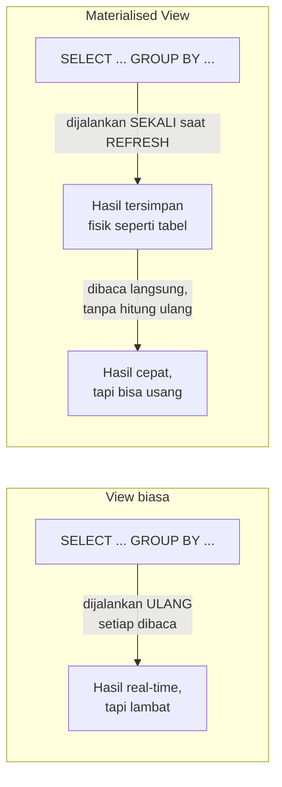

## TL;DR

Sebuah view SQL biasa hanyalah query yang disimpan dan diberi nama — setiap kali dibaca, database menjalankan ulang query aslinya dari awal, tidak menyimpan hasilnya. Materialised view berbeda secara fundamental: ia menyimpan **hasil** query itu secara fisik seperti tabel biasa, sehingga membacanya secepat membaca tabel, bukan menjalankan ulang query mahal setiap kali. Trade-off-nya eksplisit dan tidak bisa dihindari: hasil yang tersimpan itu **usang** sejak detik ia dibuat — ia hanya diperbarui saat proses refresh dijalankan, bukan otomatis mengikuti setiap perubahan data sumbernya seperti view biasa.

## The Problem

Sebuah dashboard menampilkan ringkasan "total permohonan per status, per provinsi, per bulan" — query agregasi yang menggabungkan jutaan baris dari tabel `permohonan` lewat `GROUP BY` bertingkat. Query ini butuh beberapa detik setiap kali dijalankan, dan dashboard yang sama diakses ratusan kali per hari oleh berbagai petugas di berbagai instansi — setiap akses menjalankan ulang agregasi mahal yang sama dari nol, membebani database dengan pekerjaan berulang untuk data yang sebenarnya baru berubah beberapa kali per hari (permohonan baru masuk terus, tapi tidak secepat dashboard ini diakses).

Membuat view SQL biasa untuk query ini tidak menyelesaikan masalah performa sama sekali — view hanyalah "query tersimpan", ia tetap menjalankan agregasi penuh setiap kali dibaca, sama persis seperti menjalankan query mentahnya langsung. Yang dibutuhkan bukan sekadar menyederhanakan penulisan query (yang diselesaikan view biasa), tapi menghindari **komputasi berulang** untuk hasil yang perubahannya jauh lebih jarang dari frekuensi pembacaannya.

## Intuition

Bayangkan materialised view seperti **laporan rekap bulanan yang dicetak sekali dan digandakan**, dibanding menghitung ulang rekap itu dari nol setiap kali seseorang memintanya. Kalau kamu butuh rekap "total penjualan per cabang bulan ini" dan diminta seratus orang berbeda sepanjang hari, jauh lebih efisien menghitungnya **sekali** di pagi hari lalu membagikan salinan cetakannya ke siapa pun yang bertanya, dibanding menghitung ulang dari seluruh nota transaksi setiap kali ada yang bertanya. Konsekuensinya jelas: rekap yang dibagikan siang hari tidak mencerminkan transaksi yang terjadi setelah rekap itu dicetak pagi tadi — ia akurat "per pagi ini", bukan real-time.

Analogi ini bocor pada satu hal: mencetak ulang rekap kertas jelas butuh usaha manual eksplisit setiap kali. Materialised view bisa di-refresh secara terjadwal otomatis (lewat cron job atau trigger database), tapi keputusan **seberapa sering** refresh itu berjalan tetap keputusan sadar yang harus disesuaikan dengan seberapa usang data boleh terlihat — bukan sesuatu yang "otomatis benar" hanya karena mekanismenya bisa dijadwalkan.

## How It Works



Diagram ini menunjukkan perbedaan inti: view biasa menukar kecepatan baca demi selalu akurat (setiap baca = komputasi penuh); materialised view menukar akurasi real-time demi kecepatan baca (baca secepat tabel biasa, tapi hasilnya seakurat refresh terakhir).

```sql
-- PostgreSQL
CREATE MATERIALIZED VIEW ringkasan_permohonan_bulanan AS
SELECT
    provinsi,
    status,
    DATE_TRUNC('month', tanggal_dibuat) AS bulan,
    COUNT(*) AS jumlah
FROM permohonan
GROUP BY provinsi, status, DATE_TRUNC('month', tanggal_dibuat);

-- Refresh eksplisit, dijalankan terjadwal (misalnya tiap jam)
REFRESH MATERIALIZED VIEW ringkasan_permohonan_bulanan;

-- REFRESH CONCURRENTLY memungkinkan view tetap bisa dibaca SELAMA refresh
-- berjalan (butuh unique index pada view), menghindari downtime baca yang
-- terjadi pada REFRESH biasa yang mengunci view selama proses berlangsung.
REFRESH MATERIALIZED VIEW CONCURRENTLY ringkasan_permohonan_bulanan;
```

MySQL/MariaDB tidak punya sintaks `MATERIALIZED VIEW` native — pola yang setara biasanya diimplementasikan manual lewat tabel biasa yang diisi ulang secara terjadwal (event scheduler atau cron job eksternal yang menjalankan `INSERT ... SELECT` atau `REPLACE INTO`), memberi hasil fungsional yang sama tapi tanpa dukungan sintaksis bawaan seperti `REFRESH CONCURRENTLY`.

## Under The Hood

`REFRESH MATERIALIZED VIEW` biasa di PostgreSQL mengunci view dari pembacaan **selama** proses refresh berlangsung — untuk view yang refresh-nya butuh waktu lama (agregasi berat terhadap tabel besar), ini berarti jendela waktu di mana dashboard yang bergantung padanya tidak bisa diakses sama sekali. `REFRESH MATERIALIZED VIEW CONCURRENTLY` menyelesaikan ini dengan membangun versi baru di latar belakang dan menukarnya secara atomik begitu selesai (mirip strategi blue-green di level yang jauh lebih kecil), tapi butuh **unique index** pada materialised view itu sendiri sebagai prasyarat teknis, dan secara mekanis lebih mahal (butuh menyimpan dua versi sesaat) dibanding refresh biasa.

Pilihan strategi refresh — **penuh** (menghitung ulang seluruh view dari nol setiap kali) vs **inkremental** (hanya memperbarui bagian yang datanya berubah sejak refresh terakhir) — adalah trade-off kompleksitas vs efisiensi: refresh penuh sederhana diimplementasikan tapi biayanya tetap sama besar berapa pun kecil perubahan datanya; refresh inkremental jauh lebih efisien untuk perubahan kecil tapi butuh mekanisme tambahan (seperti change data capture, disinggung di [[../60 Distributed Systems/Change Data Capture|Change Data Capture]] level senior) untuk melacak baris mana saja yang berubah sejak refresh terakhir — PostgreSQL native tidak mendukung refresh inkremental otomatis untuk materialised view standarnya, sehingga pola inkremental biasanya diimplementasikan manual atau lewat tooling tambahan.

## In Go

```go
package scheduler

import (
	"context"
	"database/sql"
	"fmt"
	"log/slog"
	"time"
)

// JadwalkanRefreshRingkasan menjalankan REFRESH MATERIALIZED VIEW secara
// berkala, terpisah dari alur request pengguna biasa — refresh TIDAK
// pernah dipicu oleh request dashboard itu sendiri, karena itu akan
// mengembalikan kita ke masalah awal (komputasi mahal di jalur baca).
func JadwalkanRefreshRingkasan(ctx context.Context, db *sql.DB, logger *slog.Logger, interval time.Duration) {
	ticker := time.NewTicker(interval)
	defer ticker.Stop()

	for {
		select {
		case <-ctx.Done():
			return
		case <-ticker.C:
			mulai := time.Now()
			_, err := db.ExecContext(ctx, `REFRESH MATERIALIZED VIEW CONCURRENTLY ringkasan_permohonan_bulanan`)
			durasi := time.Since(mulai)

			if err != nil {
				logger.Error("gagal refresh materialised view", "error", err, "durasi", durasi)
				continue
			}
			logger.Info("materialised view berhasil di-refresh", "durasi", durasi)
		}
	}
}

// AmbilRingkasanDashboard membaca dari materialised view — secepat
// membaca tabel biasa, TANPA menjalankan ulang agregasi mahal.
func AmbilRingkasanDashboard(ctx context.Context, db *sql.DB, provinsi string) (*sql.Rows, error) {
	rows, err := db.QueryContext(ctx, `
		SELECT status, bulan, jumlah
		FROM ringkasan_permohonan_bulanan
		WHERE provinsi = ?
		ORDER BY bulan DESC
	`, provinsi)
	if err != nil {
		return nil, fmt.Errorf("ambil ringkasan dashboard: %w", err)
	}
	return rows, nil
}
```

## In His Stack

Untuk sistem yang masih memakai MariaDB tanpa dukungan materialised view native, pola "tabel ringkasan yang diisi ulang cron job" adalah solusi yang sudah lama umum dipakai di ekosistem Yii2 — sebuah tabel biasa (`ringkasan_permohonan_bulanan`) yang datanya diisi lewat `INSERT ... SELECT ... GROUP BY` dijalankan sebagai cron job terjadwal, secara fungsional identik dengan materialised view PostgreSQL meski butuh mengelola siklus refresh-nya secara manual di kode aplikasi, bukan lewat sintaks database bawaan. Memahami konsep materialised view di PostgreSQL tetap berharga meski daily driver-nya MariaDB, karena mental model "hasil komputasi mahal yang disimpan dan di-refresh terjadwal" adalah pola yang sama, hanya beda cara implementasinya.

## Trade-offs and When Not To Use It

Materialised view tidak cocok untuk data yang butuh akurasi real-time ketat — kalau dashboard harus selalu mencerminkan perubahan detik-ke-detik (misalnya status permohonan individual yang sedang aktif diproses petugas), materialised view yang di-refresh tiap jam akan menampilkan data yang jelas usang dan menyesatkan. Materialised view paling bernilai justru untuk **agregasi** yang secara alami boleh sedikit tertinggal (laporan bulanan, dashboard ringkasan tren) di mana pengguna secara implisit memahami data itu adalah snapshot periode tertentu, bukan real-time. Biaya penyimpanan tambahan (data yang disimpan dua kali — sekali di tabel sumber, sekali di hasil agregasi) dan biaya refresh (yang tetap membebani database, hanya terjadwal alih-alih per-request) juga bukan gratis — untuk agregasi yang jarang diakses, biaya refresh terjadwal mungkin tidak sepadan dibanding sekadar menjalankan query biasa saat benar-benar dibutuhkan.

## Common Mistakes

> [!warning] Jebakan
> Mengira `CREATE VIEW` biasa (bukan `MATERIALIZED VIEW`) akan meningkatkan performa — view biasa hanyalah query tersimpan, dijalankan ulang penuh setiap kali dibaca, tidak menyimpan hasil apa pun.

> [!warning] Jebakan
> Menjalankan `REFRESH MATERIALIZED VIEW` biasa (bukan `CONCURRENTLY`) pada view yang sering diakses, tanpa menyadari ini mengunci view dari pembacaan selama proses refresh — menyebabkan dashboard tidak bisa diakses persis di jendela waktu refresh berjalan.

> [!warning] Jebakan
> Memakai materialised view untuk data yang butuh akurasi real-time, lalu bingung kenapa pengguna melaporkan "data yang salah" — data itu tidak salah, ia hanya seusang refresh terakhir, sebuah trade-off yang harus dikomunikasikan jelas ke pengguna (misalnya dengan menampilkan "data per pukul X").

## Exercises

1. Jelaskan perbedaan mendasar view biasa dan materialised view, dan kenapa hanya salah satunya yang menyelesaikan masalah performa agregasi berulang.
2. Kenapa `REFRESH MATERIALIZED VIEW CONCURRENTLY` butuh unique index, dan apa manfaatnya dibanding refresh biasa?
3. Kapan materialised view menjadi pilihan yang salah untuk sebuah kebutuhan data?
4. Desain terbuka: dashboard nasionalmu menampilkan ringkasan permohonan yang diakses ribuan kali per hari oleh petugas di seluruh Indonesia, dengan data sumber yang berubah terus-menerus sepanjang hari kerja. Rancang strategi refresh (frekuensi, penuh vs pertimbangan inkremental) untuk materialised view ini, dan jelaskan bagaimana kamu akan mengomunikasikan ke pengguna bahwa data yang mereka lihat adalah snapshot, bukan real-time.

> [!success]- Kunci jawaban
> **1.** View biasa adalah "query tersimpan" — nama untuk sebuah query, dijalankan ulang penuh dari sumber data setiap kali dibaca, sehingga waktu bacanya identik dengan menjalankan query mentahnya langsung. Materialised view menyimpan **hasil** query itu secara fisik seperti tabel — membaca materialised view berarti membaca data yang sudah dihitung sebelumnya, secepat membaca tabel biasa, tanpa menjalankan ulang agregasi apa pun. Hanya materialised view yang menyelesaikan masalah "komputasi mahal dijalankan berulang setiap dibaca", karena view biasa justru tetap menjalankan komputasi mahal itu setiap kali, hanya dengan sintaks yang lebih ringkas ditulis.
> **4.** Frekuensi refresh yang wajar: setiap 15-30 menit selama jam kerja (menyeimbangkan kesegaran data dengan beban refresh berulang), mungkin lebih jarang di luar jam kerja. Refresh penuh kemungkinan tetap cukup untuk kebanyakan kasus ukuran ini, kecuali volume data sudah sangat besar sehingga refresh penuh sendiri butuh waktu lama — di titik itu, mempertimbangkan pendekatan inkremental (butuh tooling tambahan di luar PostgreSQL native) baru sepadan. Selalu pakai `REFRESH CONCURRENTLY` supaya dashboard tetap bisa diakses selama proses refresh berjalan, bukan `REFRESH` biasa yang mengunci pembacaan. Untuk komunikasi ke pengguna: tampilkan eksplisit "Data per [waktu refresh terakhir]" di dashboard (bisa diambil dari kolom timestamp yang disimpan sebagai bagian dari hasil materialised view, atau dari metadata refresh terpisah) — ini mengubah ekspektasi pengguna dari "kenapa datanya salah" menjadi "oh, ini snapshot beberapa menit lalu", perbedaan yang sepenuhnya soal komunikasi, bukan soal teknis semata.

## Self-Check

- Apa perbedaan mendasar antara view biasa dan materialised view?
- Kenapa `REFRESH MATERIALIZED VIEW CONCURRENTLY` butuh unique index?
- Kapan materialised view adalah pilihan yang salah untuk kebutuhan data tertentu?
- Bagaimana MariaDB/MySQL yang tidak punya sintaks materialised view native biasanya mensimulasikan pola yang sama?

## Connected Notes

- [[Aggregation and GROUP BY Semantics]] — materialised view paling sering dipakai justru untuk menyimpan hasil agregasi mahal yang dijelaskan mekanismenya di note junior itu.
- [[Introduction to Sharding]] — materialised view adalah salah satu alternatif lebih murah untuk kebutuhan agregasi cepat, sebelum benar-benar mempertimbangkan sharding.
- [[Row-Oriented vs Columnar Storage]] — kebutuhan agregasi berat yang mendasari materialised view sering menjadi sinyal bahwa beban kerja analitik sudah pantas dipertimbangkan storage kolom, dibahas di note berikutnya.
- [[../60 Distributed Systems/Change Data Capture|Change Data Capture]] — mekanisme yang memungkinkan refresh inkremental (bukan penuh) untuk materialised view atau pola serupa, dibahas di level senior.
- [[../92 Tools/PostgreSQL - Features Worth Switching For|PostgreSQL - Features Worth Switching For]] — `REFRESH MATERIALIZED VIEW CONCURRENTLY` adalah salah satu fitur konkret yang dibahas lebih operasional di tool note itu.

## Further Reading

- Dokumentasi resmi PostgreSQL, bagian "Materialized Views" dan `REFRESH MATERIALIZED VIEW`.

## Catatan Saya

*Tulis di sini apakah ada dashboard di kerjaanmu yang menjalankan agregasi berat setiap request — apakah materialised view (atau tabel ringkasan manual di MariaDB) bisa menyelesaikannya.*
