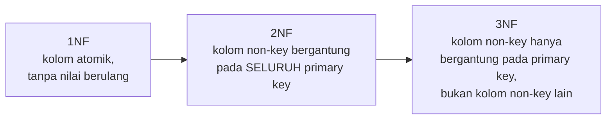

## TL;DR

Normalisasi adalah proses menyusun tabel supaya setiap fakta disimpan **hanya di satu tempat**. 1NF (First Normal Form) melarang kolom yang menyimpan banyak nilai sekaligus (seperti daftar dipisah koma dalam satu kolom). 2NF melarang kolom non-key yang hanya bergantung pada **sebagian** dari primary key komposit. 3NF melarang kolom non-key yang bergantung pada kolom non-key lain, bukan langsung pada primary key. Tujuannya bukan kepatuhan akademis — tujuannya menghindari **update anomaly**: situasi di mana mengubah satu fakta mengharuskan mengubah banyak baris sekaligus, dan lupa satu baris berarti data yang saling kontradiksi tanpa ada error yang memberi tahu.

## The Problem

Sebuah tabel `permohonan` awalnya dirancang menyertakan detail instansi langsung di setiap baris untuk "menghindari join":

| id | judul | instansi_nama | instansi_alamat |
|---|---|---|---|
| 1 | Permohonan A | Dinas Kependudukan | Jl. Merdeka 1 |
| 2 | Permohonan B | Dinas Kependudukan | Jl. Merdeka 1 |
| 3 | Permohonan C | Dinas Kependudukan | Jl. Merdeka 1 |

Ketika Dinas Kependudukan pindah alamat, seseorang menjalankan `UPDATE permohonan SET instansi_alamat = 'Jl. Sudirman 99' WHERE id = 1` — hanya mengubah **satu** baris, bukan ketiganya, karena tidak sadar (atau lupa) bahwa `instansi_alamat` berulang di setiap baris permohonan instansi yang sama. Hasilnya: database sekarang punya dua alamat berbeda untuk instansi yang sama, tergantung baris permohonan mana yang dibaca — tidak ada cara mengetahui mana yang benar tanpa menyelidiki riwayat perubahan. Ini **update anomaly**, konsekuensi langsung dari menyimpan fakta yang sama ("alamat Dinas Kependudukan") di banyak tempat. 3NF mencegah ini dengan aturan: `instansi_alamat` bergantung pada `instansi_nama` (atau `instansi_id`), bukan langsung pada primary key `permohonan.id` — jadi ia tidak boleh ada di tabel `permohonan` sama sekali, ia milik tabel `instansi`.

## Intuition

Bayangkan normalisasi seperti **aturan "satu fakta, satu rumah"** — kalau alamat kantor sebuah instansi dicatat di sepuluh dokumen berbeda, memperbarui alamat itu berarti mendatangi sepuluh dokumen satu per satu; lupa satu berarti sepuluh dokumen sekarang saling bertentangan. Normalisasi memberi alamat itu **satu rumah** (tabel `instansi`), dan setiap dokumen lain (`permohonan`) cukup menyimpan **alamat rumah itu** (foreign key `instansi_id`) alih-alih menyalin isinya.

Analogi ini bocor pada satu hal: "satu rumah, satu fakta" terdengar seperti prinsip yang selalu benar tanpa syarat, padahal normalisasi punya biaya nyata — setiap kali kamu butuh alamat instansi bersama data permohonan, kamu **wajib** melakukan `JOIN` untuk menyatukannya kembali. Untuk data yang dibaca jauh lebih sering daripada diubah, dan di mana sedikit "kontradiksi sementara" bisa diterima, menyalin sebagian fakta secara sengaja (denormalisasi) kadang justru pilihan yang lebih baik — lihat [[Deliberate Denormalisation]] untuk kapan itu masuk akal.

## How It Works

**1NF — nilai atomik.** Setiap kolom hanya menyimpan satu nilai, bukan daftar. Pelanggaran umum: kolom `tag` berisi `"urgent,legal,pending"` sebagai satu string.

```sql
-- Melanggar 1NF
CREATE TABLE permohonan (id INT, judul VARCHAR(255), tag VARCHAR(255)); -- tag = "urgent,legal,pending"

-- Mematuhi 1NF: tabel terpisah untuk relasi satu-ke-banyak
CREATE TABLE permohonan_tag (permohonan_id INT, tag VARCHAR(50));
```

**2NF — hanya relevan untuk primary key komposit.** Setiap kolom non-key harus bergantung pada **seluruh** primary key, bukan sebagian. Pelanggaran umum: tabel dengan primary key `(permohonan_id, petugas_id)`, tapi punya kolom `nama_petugas` yang sebenarnya hanya bergantung pada `petugas_id` saja, bukan kombinasi keduanya.

```sql
-- Melanggar 2NF: nama_petugas hanya bergantung pada petugas_id, bukan kombinasi (permohonan_id, petugas_id)
CREATE TABLE penanganan (permohonan_id INT, petugas_id INT, nama_petugas VARCHAR(255), PRIMARY KEY (permohonan_id, petugas_id));

-- Mematuhi 2NF: nama_petugas dipindah ke tabel pegawai, hanya bergantung pada petugas_id
CREATE TABLE penanganan (permohonan_id INT, petugas_id INT, PRIMARY KEY (permohonan_id, petugas_id));
CREATE TABLE pegawai (id INT PRIMARY KEY, nama VARCHAR(255));
```

**3NF — tidak ada dependency transitif.** Kolom non-key tidak boleh bergantung pada kolom non-key lain. Ini persis kasus `instansi_alamat` di "The Problem" — bergantung pada `instansi_nama`, bukan langsung pada `permohonan.id`.



Setiap tahap adalah syarat untuk tahap berikutnya — sebuah tabel tidak bisa disebut memenuhi 3NF kalau ia bahkan belum memenuhi 1NF.

## In Go

Normalisasi adalah keputusan desain skema, bukan sesuatu yang "ditulis" di kode Go — tapi bentuknya langsung memengaruhi bentuk struct dan query yang dibutuhkan:

```go
package main

import (
	"context"
	"database/sql"
	"fmt"
)

// PermohonanDenganInstansi menggabungkan data dari DUA tabel ternormalisasi
// (permohonan dan instansi) lewat JOIN — ini adalah biaya normalisasi yang
// harus dibayar setiap kali data gabungan dibutuhkan.
type PermohonanDenganInstansi struct {
	ID             int
	Judul          string
	InstansiNama   string
	InstansiAlamat string
}

func AmbilPermohonanDenganInstansi(ctx context.Context, db *sql.DB, id int) (*PermohonanDenganInstansi, error) {
	var p PermohonanDenganInstansi
	err := db.QueryRowContext(ctx, `
		SELECT p.id, p.judul, i.nama, i.alamat
		FROM permohonan p
		JOIN instansi i ON i.id = p.instansi_id
		WHERE p.id = ?
	`, id).Scan(&p.ID, &p.Judul, &p.InstansiNama, &p.InstansiAlamat)
	if err != nil {
		return nil, fmt.Errorf("ambil permohonan dengan instansi id %d: %w", id, err)
	}
	return &p, nil
}
```

## In His Stack

Sistem legacy Yii1 yang sudah berjalan bertahun-tahun sering punya tabel yang melanggar 3NF karena "dulu ditambahkan untuk mempercepat satu laporan tertentu" tanpa dikomentari sebagai keputusan sadar — kolom seperti `nama_instansi_snapshot` yang disalin ke `permohonan` untuk menghindari join, tapi tidak pernah diperbarui ulang saat instansi berganti nama. Sebelum menganggap kolom semacam ini sebagai "bug yang harus dinormalisasi ulang", penting menyelidiki dulu apakah itu memang denormalisasi sengaja (snapshot historis yang **seharusnya** tidak berubah — nama instansi *pada saat* permohonan diajukan, bukan nama instansi saat ini) atau memang update anomaly yang tidak disadari — dua hal ini terlihat identik di skema tapi butuh solusi yang sangat berbeda.

## Trade-offs and When Not To Use It

Normalisasi penuh (3NF dan seterusnya) meminimalkan update anomaly dan duplikasi, tapi memaksimalkan jumlah `JOIN` yang dibutuhkan untuk membaca data gabungan — pada beban baca yang sangat tinggi dengan data yang jarang berubah, biaya `JOIN` berulang-ulang bisa jadi lebih mahal daripada risiko update anomaly yang sudah dimitigasi lewat cara lain (misalnya proses sinkronisasi terjadwal). Normalisasi juga bukan tujuan akhir yang harus dikejar tanpa syarat — beberapa desain (data warehouse, tabel laporan) secara sengaja didenormalisasi dari awal karena pola baca yang dominan sudah diketahui sejak desain, bukan hasil kompromi belakangan.

## Common Mistakes

> [!warning] Jebakan
> Menyalin kolom dari tabel lain "untuk menghindari join" tanpa proses eksplisit untuk menjaga salinannya tetap sinkron — inilah yang melahirkan update anomaly seperti di "The Problem".

> [!warning] Jebakan
> Menerapkan normalisasi ke kolom yang sebenarnya berupa **snapshot historis yang sengaja tidak berubah** (misalnya nama instansi pada saat permohonan diajukan) — menganggapnya sebagai duplikasi yang harus dihapus, padahal justru itu maksud desainnya.

> [!warning] Jebakan
> Berhenti hanya di 1NF (kolom atomik) dan menganggap itu cukup, padahal update anomaly paling umum (seperti alamat instansi yang tersebar di banyak baris) justru pelanggaran 3NF, bukan 1NF.

## Exercises

1. Tabel `pesanan (id, produk, jumlah, harga_satuan_saat_ini)` — kalau `harga_satuan_saat_ini` selalu mengambil harga terbaru produk (bukan harga saat pesanan dibuat), pelanggaran normal form apa ini, dan bagaimana memperbaikinya?
2. Jelaskan kenapa 2NF hanya relevan untuk tabel dengan primary key komposit (lebih dari satu kolom).
3. Berikan satu contoh dari domain kerja pemerintahan (selain yang dibahas di note ini) tentang kolom yang melanggar 3NF, dan jelaskan update anomaly konkret yang bisa terjadi.
4. Desain terbuka: tabel `log_perubahan_status (permohonan_id, status_baru, waktu, nama_petugas, jabatan_petugas)` mencatat riwayat perubahan status permohonan. `nama_petugas` dan `jabatan_petugas` bergantung pada `petugas_id` (yang tidak ada langsung di tabel ini, hanya `nama_petugas` yang dicatat sebagai string bebas). Diskusikan apakah ini pelanggaran 3NF yang perlu diperbaiki, atau justru desain yang tepat untuk kasus log audit — pertimbangkan sifat data historis dan kebutuhan compliance.

> [!success]- Kunci jawaban
> **1.** Ini pelanggaran 3NF: `harga_satuan_saat_ini` bergantung pada `produk`, bukan langsung pada primary key `id` pesanan — kalau harga produk berubah, kolom ini akan (atau seharusnya) ikut berubah untuk pesanan lama, padahal pesanan lama seharusnya mencatat harga **pada saat pesanan dibuat**, bukan harga sekarang. Perbaikannya bergantung maksud sebenarnya: kalau memang harus mencatat harga saat itu (snapshot), namanya harus diubah jadi `harga_satuan_saat_pesanan` dan itu justru **benar** disimpan langsung di tabel `pesanan` (bukan pelanggaran, karena nilainya memang milik baris pesanan itu, bukan bergantung pada `produk` saat ini); kalau memang dimaksudkan selalu mengikuti harga terkini produk, kolom itu harus dihapus dan diganti `JOIN` ke tabel `produk`.
> **4.** Ini justru desain yang **tepat** untuk log audit, bukan pelanggaran 3NF yang perlu diperbaiki. `log_perubahan_status` mencatat fakta historis "pada waktu ini, petugas dengan nama dan jabatan ini yang melakukan perubahan" — nama dan jabatan petugas **pada saat kejadian** adalah bagian dari fakta historis itu sendiri, bukan referensi ke keadaan petugas saat ini. Kalau nama atau jabatan petugas menyimpan `petugas_id` lalu di-`JOIN` ke tabel `pegawai` untuk laporan, hasilnya akan menampilkan jabatan **saat ini**, bukan jabatan pada saat kejadian — merusak akurasi audit trail kalau petugas tersebut sejak itu naik jabatan atau pindah unit. Ini contoh langsung dari analogi "leak" di bagian Intuition: normalisasi ketat kadang justru salah untuk data yang secara sengaja berupa snapshot historis.

## Self-Check

- Apa syarat 1NF, dan apa contoh pelanggarannya yang paling umum?
- Kenapa 2NF hanya relevan untuk primary key komposit?
- Apa itu dependency transitif, dan kenapa itu yang dilarang 3NF?
- Kapan sebuah kolom yang "terlihat" melanggar normalisasi sebenarnya adalah desain yang benar?

## Connected Notes

- [[Relational Modelling]] — normalisasi adalah tahap lanjutan setelah kardinalitas relasi ditentukan; note itu prasyarat langsung untuk note ini.
- [[Deliberate Denormalisation]] — kontras yang wajib dibaca setelah ini: kapan menyimpangi 3NF secara sengaja justru keputusan yang tepat.
- [[Data Types and Constraints]] — foreign key dan constraint lain adalah alat teknis yang menegakkan struktur hasil normalisasi di level database.
- [[Join Types and Their Mental Models]] — biaya utama normalisasi adalah kebutuhan `JOIN` berulang untuk menyatukan kembali data yang dipisah.
- [[../90 Architecture and Design/_Overview|Architecture and Design Overview]] — keputusan normalisasi vs denormalisasi adalah salah satu bentuk trade-off arsitektural yang harus bisa dipertanggungjawabkan, bukan sekadar kebiasaan.

## Further Reading

- E.F. Codd, *"Further Normalization of the Data Base Relational Model"* (1971) — paper yang memperkenalkan 2NF dan 3NF secara formal.

## Catatan Saya

*Tulis di sini tabel di kerjaanmu yang menurutmu melanggar 3NF — dan setelah dipikir ulang, apakah itu bug atau justru desain snapshot yang sengaja.*
