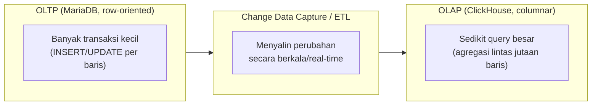

## TL;DR

OLTP (Online Transaction Processing) dan OLAP (Online Analytical Processing) adalah dua kategori beban kerja database dengan karakteristik yang nyaris berlawanan: OLTP adalah banyak transaksi kecil yang masing-masing menyentuh sedikit baris (satu petugas menyimpan satu perubahan status), OLAP adalah sedikit query besar yang masing-masing menyentuh banyak baris (satu laporan menjumlahkan jutaan baris). [[Row-Oriented vs Columnar Storage|Row vs columnar storage]] menjelaskan **kenapa** keduanya butuh struktur fisik penyimpanan yang berbeda. Note ini menegaskan konsekuensi arsitekturalnya: **menjalankan query analitik berat langsung di atas database transaksional yang sama adalah bau arsitektur** (architecture smell) — bukan kesalahan pemrograman, tapi tanda desain sistem yang mencampur dua kebutuhan yang seharusnya dipisah. HTAP (Hybrid Transactional/Analytical Processing) adalah kelas database yang berusaha menutup celah ini, dengan trade-off tersendiri.

## The Problem

Sebuah sistem legal-services memulai hidupnya sederhana: satu database MariaDB melayani semua kebutuhan — transaksi harian petugas **dan** laporan bulanan untuk kementerian. Di tahun pertama, ini bekerja baik-baik saja karena volume data masih kecil. Seiring waktu, laporan yang diminta makin kompleks (analisis tren tiga tahun, breakdown per provinsi per jenis layanan), dan volume transaksi harian juga tumbuh. Titik krisis muncul ketika laporan akhir bulan (yang butuh memindai jutaan baris) dijalankan di jam kerja, dan **seluruh aplikasi transaksional ikut melambat** selama laporan itu berjalan, karena keduanya berebut CPU, I/O, dan cache buffer pool yang sama di instance database yang sama.

Tim awalnya mengira ini murni masalah performa yang bisa ditambal: menambah index, menambah RAM, menjadwalkan laporan di malam hari. Tambalan ini bekerja untuk sementara, tapi masalah selalu kembali seiring data terus tumbuh, karena akar masalahnya bukan "kurang optimal", melainkan **dua beban kerja dengan kebutuhan struktural berlawanan dipaksa berbagi satu sumber daya yang sama**. Masalah ini tidak pernah benar-benar hilang sampai keduanya dipisahkan secara arsitektural, bukan ditambal lebih jauh.

## Intuition

Bayangkan OLTP seperti **loket pelayanan yang melayani banyak pelanggan satu per satu dengan cepat** — masing-masing transaksi singkat (ambil nomor antrean, verifikasi berkas, cap stempel), dan yang penting adalah **kecepatan per transaksi individual** serta kemampuan melayani banyak orang bersamaan tanpa saling menunggu lama. OLAP seperti **tim riset yang datang sesekali meminta akses ke seluruh arsip** untuk menyusun laporan tahunan. Mereka tidak butuh kecepatan per dokumen individual — mereka butuh **membaca dalam jumlah sangat besar sekaligus**, dan pekerjaan mereka bisa memakan waktu lama tanpa masalah selama tidak mengganggu loket yang sedang melayani pelanggan.

Kalau tim riset itu diizinkan menggeledah **rak arsip fisik yang sama** yang sedang dipakai loket untuk melayani pelanggan (mengambil map, menaruhnya di meja mereka berjam-jam untuk dianalisis), loket jadi tidak bisa melayani pelanggan yang kebetulan butuh map yang sama, dan bahkan pelanggan lain pun ikut terganggu karena antrean di depan rak arsip jadi macet. Solusi yang jelas: beri tim riset **salinan** arsip di ruangan terpisah, supaya mereka bisa bekerja sepuasnya tanpa pernah mengganggu loket sama sekali.

Analogi ini bocor pada satu hal: salinan arsip untuk tim riset di dunia nyata butuh biaya fotokopi yang jelas terlihat. Menyalin data OLTP ke sistem OLAP terpisah (biasanya lewat [[../60 Distributed Systems/Change Data Capture|Change Data Capture]] atau ETL batch) juga punya biaya, tapi lebih tersembunyi: **kesegaran data** (data OLAP selalu sedikit tertinggal dari OLTP) dan **kompleksitas operasional tambahan** (dua sistem untuk dikelola, dipantau, dan disinkronkan, bukan satu).

## How It Works



Diagram ini menunjukkan pemisahan standar: OLTP tetap menjadi satu-satunya sumber kebenaran (source of truth) untuk data transaksional, disalin lewat pipeline ke sistem OLAP terpisah yang dirancang khusus untuk analitik berat. Pemisahan ini menghilangkan kontensi sumber daya sepenuhnya, karena keduanya sekarang berjalan di instance (bahkan mungkin jenis database) yang berbeda.

**Karakteristik yang membedakan OLTP dan OLAP secara ringkas:**

| Aspek | OLTP | OLAP |
|---|---|---|
| Ukuran query | Kecil, menyentuh sedikit baris | Besar, menyentuh banyak baris |
| Frekuensi | Sangat sering (ribuan/detik) | Jarang (puluhan/jam atau hari) |
| Jenis operasi | `INSERT`/`UPDATE`/`SELECT` per baris | `SELECT` agregat (`GROUP BY`, `SUM`, `AVG`) |
| Storage yang cocok | Row-oriented | Columnar |
| Prioritas | Latensi rendah per transaksi | Throughput tinggi untuk scan besar |

## Under The Hood

**HTAP (Hybrid Transactional/Analytical Processing)** adalah kelas database yang mencoba menutup celah antara OLTP dan OLAP dalam satu sistem. Biasanya lewat mekanisme internal yang menyimpan data dalam **dua representasi sekaligus** (row-oriented untuk transaksi terbaru yang butuh akses cepat per baris, columnar untuk data yang sudah "matang" dan siap dianalisis), dengan lapisan tambahan yang secara transparan mengarahkan query ke representasi yang tepat. Ini menghilangkan kebutuhan pipeline ETL/CDC terpisah dan mengurangi lag antara data transaksional dan analitik. Tapi HTAP menambah kompleksitas internal database itu sendiri, dan biasanya butuh hardware/lisensi yang lebih mahal dibanding menjalankan OLTP dan OLAP terpisah dengan tool masing-masing yang sudah matang dan murah (MariaDB + ClickHouse, misalnya).

> [!question] Perlu diverifikasi
> Klaim umum bahwa HTAP "lebih mahal" dibanding OLTP+OLAP terpisah.
> Kenapa ragu: ini generalisasi kasar yang sangat bergantung pada vendor dan skala spesifik — beberapa solusi HTAP open-source mungkin punya profil biaya berbeda dari asumsi umum ini.
> Cara verifikasi: bandingkan langsung total cost of ownership solusi HTAP spesifik (nama vendor) terhadap kombinasi OLTP+OLAP terpisah untuk skala kebutuhan yang sama.

Keputusan antara "pisahkan OLTP dan OLAP dengan tool berbeda" vs "adopsi HTAP" pada dasarnya adalah keputusan trade-off yang sama seperti banyak keputusan arsitektur lain: kompleksitas operasional (dua sistem vs satu) ditukar dengan kesegaran data dan biaya lisensi/hardware.

## In Go

```go
package repository

import (
	"context"
	"database/sql"
	"fmt"
)

// LayananPermohonan secara eksplisit memisahkan koneksi OLTP dan OLAP di
// level kode — mencegah developer "asal query" ke database yang salah
// hanya karena kebetulan koneksinya tersedia di scope yang sama.
type LayananPermohonan struct {
	oltp *sql.DB // MariaDB — transaksi harian
	olap *sql.DB // ClickHouse — laporan analitik
}

func NewLayananPermohonan(oltp, olap *sql.DB) *LayananPermohonan {
	return &LayananPermohonan{oltp: oltp, olap: olap}
}

// SimpanPerubahanStatus SELALU ke OLTP — tidak ada jalan lain, ini
// operasi transaksional inti yang butuh konsistensi dan latensi rendah.
func (l *LayananPermohonan) SimpanPerubahanStatus(ctx context.Context, id int64, status string) error {
	_, err := l.oltp.ExecContext(ctx, `UPDATE permohonan SET status = ? WHERE id = ?`, status, id)
	if err != nil {
		return fmt.Errorf("simpan perubahan status: %w", err)
	}
	return nil
}

// LaporanTrenTigaTahun SELALU ke OLAP — laporan analitik berat tidak
// pernah diarahkan ke database OLTP, terlepas seberapa "sekali-sekali"
// laporan ini dijalankan.
func (l *LayananPermohonan) LaporanTrenTigaTahun(ctx context.Context) (*sql.Rows, error) {
	rows, err := l.olap.QueryContext(ctx, `
		SELECT toYear(tanggal_dibuat) AS tahun, jenis_layanan, count() AS jumlah
		FROM permohonan_analitik
		WHERE tanggal_dibuat >= now() - INTERVAL 3 YEAR
		GROUP BY tahun, jenis_layanan
	`)
	if err != nil {
		return nil, fmt.Errorf("query laporan tren tiga tahun: %w", err)
	}
	return rows, nil
}
```

## In His Stack

Gejala paling jelas bahwa sebuah aplikasi Yii2/MariaDB butuh pemisahan OLTP-OLAP muncul dalam beberapa bentuk: laporan yang "kadang bikin aplikasi lambat"; tim yang menjadwalkan laporan berat khusus di luar jam kerja sebagai solusi sementara (yang berhenti bekerja begitu kebutuhan laporan real-time atau near-real-time muncul); atau DBA yang mulai menyarankan "server terpisah untuk laporan" tanpa framework konseptual yang jelas soal kenapa. Mengenali OLTP vs OLAP sebagai kerangka berpikir eksplisit mengubah percakapan dari "server kita kurang kencang" menjadi "kita mencampur dua beban kerja yang seharusnya dipisah" — percakapan yang jauh lebih produktif untuk keputusan arsitektur jangka panjang.

## Trade-offs and When Not To Use It

Memisahkan OLTP dan OLAP menjadi dua sistem terpisah menambah kompleksitas operasional nyata: dua database untuk dipantau, di-backup, dan disinkronkan lewat pipeline yang juga bisa gagal dan butuh pemantauan sendiri. Untuk sistem kecil dengan volume data dan kompleksitas laporan yang masih rendah, satu database OLTP yang menangani sesekali laporan ringan **masih sepenuhnya wajar**. Pemisahan ini baru sepadan begitu laporan analitik benar-benar mulai mengganggu performa transaksional secara terukur (bukan sekadar "kelihatannya akan jadi masalah suatu saat"), mengikuti prinsip umum: jangan optimasi prematur untuk masalah yang belum benar-benar terjadi.

## Common Mistakes

> [!warning] Jebakan
> Terus menambal performa (index, RAM, tuning) untuk laporan analitik yang berjalan di atas database OLTP yang sama, tanpa menyadari akar masalahnya adalah dua beban kerja berlawanan yang dipaksa berbagi sumber daya. Tambalan akan terus dibutuhkan seiring data bertambah, karena masalah struktural tidak pernah benar-benar hilang.

> [!warning] Jebakan
> Menjadwalkan laporan berat "di luar jam kerja" sebagai solusi permanen — bekerja sementara, tapi berhenti berfungsi begitu kebutuhan bisnis berubah (laporan yang harus real-time, atau volume data yang membuat bahkan proses malam hari mengganggu proses lain).

> [!warning] Jebakan
> Mengadopsi HTAP atau memisahkan OLTP/OLAP untuk sistem yang sebenarnya belum butuh — menambah kompleksitas operasional signifikan untuk masalah performa yang belum benar-benar terjadi atau belum terukur sebagai masalah nyata.

## Exercises

1. Jelaskan kenapa "laporan bikin aplikasi lambat" adalah bau arsitektur, bukan sekadar masalah performa yang bisa ditambal index atau RAM.
2. Sebutkan tiga perbedaan karakteristik utama antara beban kerja OLTP dan OLAP.
3. Apa trade-off inti memilih HTAP dibanding memisahkan OLTP dan OLAP jadi dua sistem terpisah?
4. Desain terbuka: timmu baru menyadari laporan bulanan mulai memperlambat aplikasi transaksional, tapi anggaran dan kapasitas tim operasional terbatas — belum bisa langsung mengadopsi ClickHouse atau sistem OLAP terpisah penuh dalam waktu dekat. Rancang solusi sementara yang mengurangi dampak masalah ini tanpa investasi infrastruktur besar, dan jelaskan kenapa solusi ini tetap disebut "sementara" (bukan solusi permanen yang menghilangkan masalah struktural sepenuhnya).

> [!success]- Kunci jawaban
> **1.** Masalah performa biasa (query lambat karena kurang index, misalnya) punya solusi yang menghilangkan masalahnya secara permanen setelah diperbaiki sekali. "Laporan bikin aplikasi lambat" berakar dari dua beban kerja dengan kebutuhan struktural berlawanan (banyak transaksi kecil vs sedikit query besar) yang dipaksa berbagi sumber daya fisik yang sama (CPU, I/O, cache). Index atau RAM tambahan mungkin menunda gejalanya, tapi seiring data terus tumbuh, kontensi sumber daya yang sama akan kembali muncul, karena akar masalahnya (dua beban kerja berlawanan di satu tempat) tidak pernah benar-benar diperbaiki, hanya ditunda.
> **4.** Solusi sementara yang wajar: (1) pindahkan laporan berat ke **read replica** (lihat [[Read Replicas and Replication Lag]]) yang sudah ada atau murah disiapkan — replica menyerap beban baca berat tanpa mengganggu primary yang melayani transaksi tulis, meski masih row-oriented dan belum seoptimal columnar untuk analitik; (2) buat **materialised view** (atau tabel ringkasan manual di MariaDB, lihat [[Materialised Views]]) untuk laporan yang paling sering diminta, dihitung sekali secara terjadwal alih-alih dihitung ulang setiap diminta. Ini tetap disebut sementara karena kedua solusi ini masih menjalankan komputasi analitik di atas storage row-oriented yang secara struktural tidak ideal untuk itu (lihat [[Row-Oriented vs Columnar Storage]]). Begitu volume data atau kompleksitas laporan terus bertambah, batasan struktural itu akan kembali terasa, dan pemisahan OLAP sungguhan (columnar terpisah) tetap menjadi solusi jangka panjang yang dibutuhkan.

## Self-Check

- Kenapa mencampur OLTP dan OLAP dalam satu database dianggap bau arsitektur, bukan sekadar masalah performa biasa?
- Sebutkan tiga karakteristik yang membedakan OLTP dan OLAP.
- Apa yang coba diselesaikan HTAP, dan apa trade-off yang dibawanya?
- Kapan memisahkan OLTP dan OLAP menjadi dua sistem terpisah belum sepadan dilakukan?

## Connected Notes

- [[Row-Oriented vs Columnar Storage]] — perbedaan storage fisik yang menjadi alasan struktural kenapa OLTP dan OLAP butuh sistem yang berbeda.
- [[Materialised Views]] dan [[Read Replicas and Replication Lag]] — dua solusi sementara yang lebih murah sebelum benar-benar memisahkan OLTP dan OLAP jadi sistem berbeda.
- [[../60 Distributed Systems/Change Data Capture|Change Data Capture]] — mekanisme umum menyalin data dari OLTP ke OLAP secara near-real-time, dibahas lebih dalam di level senior.
- [[../90 Architecture and Design/Modular Monolith vs Microservices|Modular Monolith vs Microservices]] — pemisahan OLTP/OLAP adalah salah satu contoh konkret prinsip pemisahan tanggung jawab berdasarkan pola akses yang berbeda, tema yang relevan juga di keputusan modular monolith.
- [[../92 Tools/ClickHouse|ClickHouse]] — implementasi konkret sistem OLAP yang relevan di ekosistem kerja ini.

## Further Reading

- Martin Kleppmann, "Designing Data-Intensive Applications" — pembahasan mendalam OLTP vs OLAP dan evolusi menuju sistem data modern (rujukan konseptual umum, bukan kutipan halaman spesifik).

## Catatan Saya

*Tulis di sini apakah sistem kerjaanmu pernah mengalami "laporan bikin aplikasi lambat" — dan solusi apa (kalau ada) yang sudah dicoba sejauh ini.*
