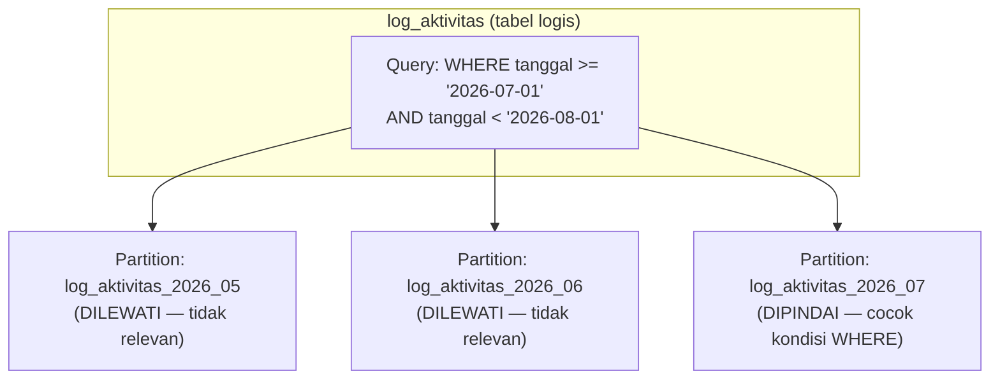

## TL;DR

Read replica (dibahas di note sebelumnya) membagi beban **baca** dengan menyalin seluruh data ke instance tambahan. Partitioning menyelesaikan masalah yang berbeda: tabel yang **terlalu besar** untuk dikelola efisien sebagai satu kesatuan, bahkan oleh satu instance database yang sama. Partitioning membelah satu tabel logis menjadi beberapa **partition** fisik — biasanya berdasarkan rentang tanggal atau nilai tertentu — yang tetap terlihat sebagai satu tabel dari sudut pandang aplikasi (query tetap `SELECT * FROM transaksi WHERE ...` seperti biasa), tapi database bisa memilih hanya memindai partition yang relevan (*partition pruning*), dan operasi pemeliharaan seperti menghapus data lama menjadi jauh lebih murah karena bisa dilakukan per partition, bukan `DELETE` baris satu per satu dari tabel raksasa.

## The Problem

Tabel `log_aktivitas` yang mencatat setiap aksi pengguna di 13 aplikasi pemerintah tumbuh jadi ratusan juta baris dalam setahun. Kebijakan retensi mengharuskan data lebih dari 90 hari dihapus, tapi menjalankan `DELETE FROM log_aktivitas WHERE tanggal < ?` terhadap tabel sebesar itu adalah operasi yang sangat mahal — ia harus memindai dan mengunci jutaan baris satu per satu (tergantung index yang tersedia), menghasilkan transaction log yang membengkak, replikasi yang tertunda (lihat [[Read Replicas and Replication Lag]]), dan dalam kasus tertentu bisa menahan lock cukup lama untuk mengganggu operasi tulis lain yang sedang berjalan terhadap tabel yang sama.

Masalah kedua: query dashboard yang hanya butuh log 7 hari terakhir tetap harus "melewati" seluruh struktur index tabel yang mencakup ratusan juta baris historis — meski index bekerja dengan baik ([[B+Tree Structure]] tetap logaritmik terhadap jumlah baris), tabel yang sangat besar membuat setiap operasi maintenance (rebuild index, backup, vacuum/analyze) menjadi jauh lebih lambat dan lebih berisiko dibanding kalau data yang benar-benar aktif terisolasi secara fisik dari data historis yang jarang disentuh.

## Intuition

Bayangkan partitioning seperti **mengorganisir gudang arsip berdasarkan tahun**, alih-alih menumpuk semua dokumen dari sepuluh tahun terakhir dalam satu ruangan besar tanpa pembagian. Kalau kamu butuh dokumen dari bulan ini, kamu langsung ke rak "2026" tanpa perlu menggeledah rak "2016" sampai "2025" sama sekali (*partition pruning*). Kalau kebijakan retensi mengharuskan dokumen lebih dari lima tahun dimusnahkan, kamu cukup membuang **seluruh rak** "2020" dalam sekali kerja, bukan mengeluarkan dokumen satu per satu dari tumpukan besar sambil memeriksa tanggalnya masing-masing.

Analogi ini bocor pada satu hal: rak arsip fisik yang berbeda benar-benar terpisah secara lokasi. Partition di database (setidaknya untuk *declarative partitioning* modern) tetap terlihat sebagai **satu tabel logis** dari sudut pandang query — aplikasi tidak perlu tahu partition mana yang menyimpan baris tertentu, ia cukup query tabel induk seperti biasa, dan database yang memutuskan di belakang layar partition fisik mana yang perlu diperiksa. Ilusi "satu tabel" ini yang membuat partitioning bisa diterapkan tanpa mengubah kode aplikasi sama sekali — kontras dengan sharding (dibahas di note berikutnya) yang justru **tidak** memberi ilusi ini.

## How It Works



Diagram ini menunjukkan **partition pruning**: optimizer database memeriksa kondisi `WHERE` terhadap rentang setiap partition, dan hanya memindai partition yang benar-benar mungkin mengandung baris relevan — partition lain dilewati sepenuhnya, tanpa perlu diperiksa satu per satu. Ini kenapa query yang memfilter berdasarkan kolom partition (biasanya tanggal) pada tabel yang di-partition dengan benar bisa jauh lebih cepat dibanding tabel tunggal raksasa yang sama, meski secara logis keduanya "tabel yang sama".

**Jenis partitioning yang umum:**

- **Range partitioning** — partition berdasarkan rentang nilai (paling umum: rentang tanggal), cocok untuk data time-series seperti log atau transaksi yang secara alami dikueri berdasarkan rentang waktu.
- **List partitioning** — partition berdasarkan daftar nilai diskrit tertentu (misalnya per wilayah/provinsi), cocok kalau query sering memfilter berdasarkan kategori itu.
- **Hash partitioning** — partition berdasarkan hash dari suatu kolom, dipakai ketika tidak ada pola rentang/kategori alami tapi tetap ingin menyebar data secara merata lintas partition untuk keperluan paralelisme.

## Under The Hood

**Menghapus data lama menjadi operasi metadata, bukan operasi data**: alih-alih `DELETE` jutaan baris satu per satu, kebijakan retensi 90 hari bisa diimplementasikan dengan **men-drop seluruh partition** yang mewakili data lebih tua dari 90 hari (`DROP TABLE log_aktivitas_2026_04` misalnya, atau perintah `DETACH PARTITION` di PostgreSQL) — operasi ini nyaris instan karena murni menghapus referensi ke partition di level katalog, tidak perlu memindai dan menghapus baris individual sama sekali. Ini perbedaan performa yang bisa dari berjam-jam (`DELETE` jutaan baris dengan lock yang ditahan lama) menjadi hitungan detik.

PostgreSQL native declarative partitioning (sejak versi yang mendukungnya penuh) memerlukan definisi eksplisit strategi partition (`PARTITION BY RANGE (tanggal)`) dan pembuatan partition individual sebagai tabel anak — tanpa automasi tambahan, partition baru untuk periode mendatang (misalnya bulan berikutnya) harus dibuat secara eksplisit sebelum data untuk periode itu bisa dimasukkan, sering diotomasi lewat job terjadwal yang membuat partition baru beberapa hari sebelum periode itu dimulai. MySQL/MariaDB mendukung partitioning bawaan dengan sintaks `PARTITION BY RANGE`/`LIST`/`HASH` yang serupa secara konsep, dengan detail operasional dan batasan yang berbeda dari PostgreSQL (misalnya batasan terkait foreign key dan unique constraint yang harus menyertakan kolom partition).

> [!question] Perlu diverifikasi
> Klaim: batasan spesifik MySQL/MariaDB soal foreign key dan unique constraint pada tabel yang di-partition.
> Kenapa ragu: batasan ini cukup teknis dan detail, serta bisa berubah antar versi — perlu diverifikasi terhadap versi MariaDB yang relevan sebelum dijadikan dasar keputusan desain.
> Cara verifikasi: dokumentasi resmi MySQL/MariaDB, bagian "Partitioning Limitations".

## In Go

```go
package migration

import (
	"context"
	"database/sql"
	"fmt"
	"time"
)

// BuatTabelPartisiTanggal mendefinisikan tabel induk PostgreSQL dengan
// declarative partitioning berdasarkan rentang tanggal — tabel induk ini
// TIDAK menyimpan data apa pun secara langsung, murni definisi strategi
// partitioning; data sesungguhnya tersimpan di tabel-tabel partition anak.
func BuatTabelPartisiTanggal(ctx context.Context, db *sql.DB) error {
	_, err := db.ExecContext(ctx, `
		CREATE TABLE log_aktivitas (
			id BIGSERIAL,
			user_id BIGINT NOT NULL,
			aksi VARCHAR(100) NOT NULL,
			tanggal TIMESTAMP NOT NULL,
			PRIMARY KEY (id, tanggal)
		) PARTITION BY RANGE (tanggal)
	`)
	if err != nil {
		return fmt.Errorf("buat tabel induk partisi: %w", err)
	}
	return nil
}

// BuatPartisiBulanan membuat SATU partition anak untuk bulan tertentu —
// dipanggil lewat job terjadwal yang berjalan beberapa hari sebelum bulan
// itu dimulai, memastikan partition sudah siap sebelum data pertama masuk.
func BuatPartisiBulanan(ctx context.Context, db *sql.DB, tahun int, bulan time.Month) error {
	awal := time.Date(tahun, bulan, 1, 0, 0, 0, 0, time.UTC)
	akhir := awal.AddDate(0, 1, 0)
	namaPartisi := fmt.Sprintf("log_aktivitas_%d_%02d", tahun, int(bulan))

	query := fmt.Sprintf(`
		CREATE TABLE %s PARTITION OF log_aktivitas
		FOR VALUES FROM ('%s') TO ('%s')
	`, namaPartisi, awal.Format("2006-01-02"), akhir.Format("2006-01-02"))

	if _, err := db.ExecContext(ctx, query); err != nil {
		return fmt.Errorf("buat partisi %s: %w", namaPartisi, err)
	}
	return nil
}

// HapusPartisiKedaluwarsa men-drop partition yang mewakili data di luar
// periode retensi — operasi metadata yang cepat, BUKAN DELETE baris satu
// per satu, dijalankan sebagai bagian dari kebijakan retensi terjadwal.
func HapusPartisiKedaluwarsa(ctx context.Context, db *sql.DB, tahun int, bulan time.Month) error {
	namaPartisi := fmt.Sprintf("log_aktivitas_%d_%02d", tahun, int(bulan))
	if _, err := db.ExecContext(ctx, fmt.Sprintf(`DROP TABLE IF EXISTS %s`, namaPartisi)); err != nil {
		return fmt.Errorf("hapus partisi kedaluwarsa %s: %w", namaPartisi, err)
	}
	return nil
}
```

## In His Stack

Log aktivitas dan tabel audit trail di sistem pemerintah adalah kandidat paling jelas untuk partitioning — volumenya besar, ditulis terus-menerus, jarang di-update, dan hampir selalu dikueri berdasarkan rentang waktu, persis pola akses yang paling diuntungkan partition pruning berbasis tanggal. Elasticsearch (bagian dari ekosistem kerja) menerapkan filosofi yang serupa lewat *index per time period* (misalnya satu index per hari/bulan untuk log) — konsep yang secara mengejutkan mirip dengan partitioning relasional meski implementasinya sama sekali berbeda, dan pengetahuan tentang salah satunya mempercepat pemahaman yang lain.

## Trade-offs and When Not To Use It

Partitioning menambah kompleksitas operasional nyata — partition baru harus dibuat secara proaktif sebelum dibutuhkan (kalau tidak, insert untuk periode yang belum punya partition akan gagal), dan query yang **tidak** memfilter berdasarkan kolom partition kehilangan manfaat pruning sepenuhnya, bisa jadi harus memindai seluruh partition satu per satu (dalam kasus terburuk, sedikit lebih lambat dibanding tabel tunggal karena overhead tambahan memutuskan partition mana yang relevan). Partitioning juga bukan solusi untuk tabel yang **tidak** punya kolom natural untuk dipartisi dengan pola akses yang jelas (kebanyakan query tidak memfilter berdasarkan kolom itu) — memaksa partitioning pada tabel semacam itu menambah kompleksitas tanpa manfaat pruning yang nyata. Penting dibedakan dari sharding: partitioning tetap berjalan dalam **satu instance database**, menyelesaikan masalah ukuran dan maintenance tabel, bukan masalah kapasitas keseluruhan satu mesin database — untuk itu, sharding (note berikutnya) adalah langkah yang berbeda.

## Common Mistakes

> [!warning] Jebakan
> Lupa membuat partition baru untuk periode mendatang sebelum data pertama untuk periode itu masuk — menyebabkan insert gagal atau (tergantung konfigurasi) data salah masuk ke partition default/lain yang tidak seharusnya.

> [!warning] Jebakan
> Menulis query yang tidak memfilter berdasarkan kolom partition (misalnya mencari berdasarkan `user_id` saja tanpa rentang tanggal pada tabel yang di-partition berdasarkan tanggal) — kehilangan manfaat partition pruning sepenuhnya, database harus memeriksa semua partition.

> [!warning] Jebakan
> Menerapkan partitioning pada tabel yang tidak punya pola akses jelas berdasarkan kolom partition manapun — menambah kompleksitas operasional (pembuatan partition proaktif, migrasi skema yang lebih rumit) tanpa manfaat pruning yang nyata.

## Exercises

1. Jelaskan kenapa menghapus data lewat `DROP PARTITION` jauh lebih murah dibanding `DELETE` baris satu per satu untuk volume data yang sama.
2. Apa itu partition pruning, dan kenapa ia hanya bekerja efektif kalau query memfilter berdasarkan kolom partition?
3. Kenapa partitioning berbeda dari sharding, meski keduanya "membelah" data?
4. Desain terbuka: tabel `notifikasi` di sistemmu menyimpan riwayat notifikasi yang dikirim ke pengguna, dengan kebijakan bisnis "notifikasi yang sudah dibaca dan lebih tua dari 30 hari boleh dihapus, tapi yang belum dibaca harus tetap disimpan berapa pun umurnya". Rancang strategi partitioning yang sesuai untuk kasus ini, dan jelaskan kenapa kasus ini sedikit lebih rumit dari sekadar partitioning berbasis tanggal murni seperti pada log aktivitas.

> [!success]- Kunci jawaban
> **1.** `DELETE` baris satu per satu harus memindai (atau memakai index untuk menemukan) setiap baris yang cocok kondisi, mengunci masing-masing baris selama transaksi berlangsung, dan mencatat setiap penghapusan itu ke transaction log — untuk jutaan baris, ini pekerjaan yang signifikan dan bisa menahan lock lama. `DROP PARTITION` (atau `DETACH PARTITION` diikuti `DROP TABLE`) murni operasi metadata di level katalog database — memutus referensi tabel anak dari tabel induk dan menghapus filenya, tanpa perlu memeriksa atau mengunci baris individual sama sekali, sehingga waktunya nyaris konstan tidak peduli berapa juta baris yang ada di partition itu.
> **4.** Kasus ini lebih rumit karena kriteria penghapusan bukan murni "tanggal lebih tua dari X" — ia juga bergantung pada status `dibaca`/`belum dibaca`, sebuah kondisi yang bisa berbeda-beda **dalam** satu rentang tanggal yang sama. Partitioning murni berdasarkan tanggal tidak bisa langsung menjawab "hapus partition ini" karena partition yang sama mungkin masih mengandung notifikasi belum dibaca yang harus dipertahankan. Pendekatan yang lebih tepat: tetap partition berdasarkan tanggal untuk manfaat pruning pada query (yang mayoritas tetap memfilter berdasarkan rentang waktu), tapi kebijakan retensi tidak bisa murni `DROP PARTITION` — perlu proses terjadwal terpisah yang menjalankan `DELETE` (bukan drop partition) khusus untuk baris dengan `dibaca = true AND tanggal < now() - interval '30 days'` dalam partition yang sudah "cukup tua" (misalnya partition berumur lebih dari 30 hari), sementara partition itu sendiri baru benar-benar di-drop setelah **seluruh** barisnya (baik yang dibaca maupun belum) sudah tidak ada lagi — kombinasi partitioning untuk manfaat pruning query, dan `DELETE` bertarget untuk kebijakan retensi yang punya syarat lebih dari sekadar umur data.

## Self-Check

- Kenapa `DROP PARTITION` jauh lebih murah dibanding `DELETE` untuk volume data besar?
- Apa itu partition pruning, dan syarat apa yang membuatnya efektif?
- Apa perbedaan mendasar partitioning dan sharding?
- Kenapa lupa membuat partition baru untuk periode mendatang bisa menyebabkan masalah?

## Connected Notes

- [[B+Tree Structure]] — partitioning membuat setiap index per partition lebih kecil, mempercepat operasi yang sudah memanfaatkan struktur B+Tree yang dijelaskan di note itu.
- [[Read Replicas and Replication Lag]] — partitioning dan replikasi adalah dua strategi berbeda untuk skala yang sering dikombinasikan: partition untuk ukuran tabel, replica untuk kapasitas baca.
- [[Introduction to Sharding]] — kelanjutan langsung: memecah data lintas **instance** database, bukan hanya lintas partition dalam satu instance yang sama.
- [[Database Migrations]] — pembuatan partition baru secara terjadwal adalah bentuk migrasi skema yang berjalan rutin, bukan sekali saat deployment.
- [[../60 Distributed Systems/Sharding Strategies and Hot Partitions|Sharding Strategies and Hot Partitions]] — pembahasan lanjutan di level senior tentang strategi memilih kunci partisi/shard yang menghindari beban tidak merata.

## Further Reading

- Dokumentasi resmi PostgreSQL, bagian "Table Partitioning".
- Dokumentasi resmi MySQL/MariaDB, bagian "Partitioning".

## Catatan Saya

*Tulis di sini tabel di kerjaanmu yang paling besar dan paling jarang dihapus datanya secara efisien — apakah partitioning berdasarkan tanggal masuk akal untuk tabel itu?*
