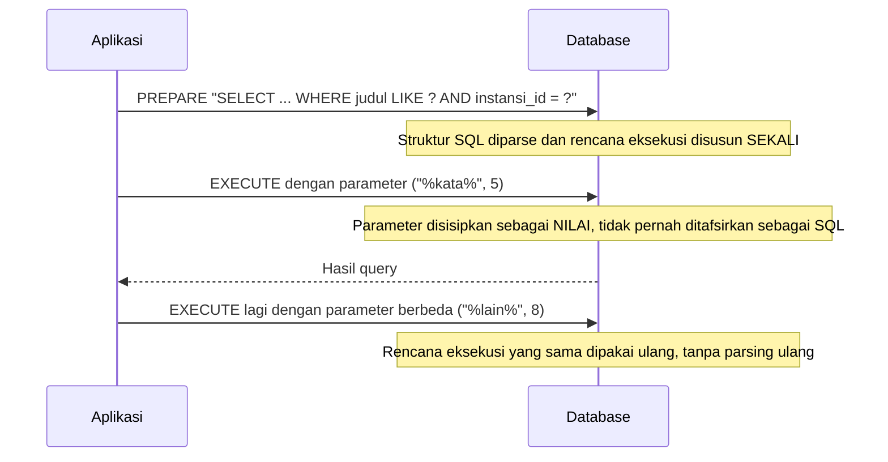

## TL;DR

Prepared statement memisahkan **struktur query** (SQL dengan placeholder seperti `?` atau `$1`) dari **nilai parameter** (data yang disisipkan ke placeholder itu), dikirim ke database sebagai dua langkah terpisah alih-alih satu string SQL utuh. Ini menyelesaikan dua masalah sekaligus: **keamanan** (nilai parameter tidak pernah ditafsirkan sebagai bagian dari struktur SQL, menutup jalur SQL injection secara struktural) dan **performa** (database bisa menyusun rencana eksekusi sekali, lalu memakainya ulang untuk eksekusi berikutnya dengan parameter berbeda, tanpa parsing dan planning ulang dari nol). `database/sql` Go memakai prepared statement secara otomatis di balik layar setiap kali kamu memakai placeholder — kamu mendapat manfaat keamanannya bahkan tanpa memanggil `Prepare()` secara eksplisit.

## The Problem

Sebuah endpoint pencarian dibangun dengan menyisipkan input pengguna langsung ke string SQL:

```go
query := fmt.Sprintf("SELECT * FROM permohonan WHERE judul LIKE '%%%s%%'", katakunci)
rows, err := db.QueryContext(ctx, query)
```

Kalau `katakunci` berasal dari input pengguna tanpa disaring, seorang penyerang bisa mengirim `katakunci` berisi `' OR '1'='1` — mengubah query menjadi `WHERE judul LIKE '%' OR '1'='1%'`, yang secara efektif mengembalikan **seluruh** baris tabel, bukan hanya yang cocok kata kunci. Skenario yang lebih berbahaya: input yang dirancang untuk menyisipkan statement SQL tambahan sepenuhnya (`'; DROP TABLE permohonan; --`), berpotensi merusak atau membocorkan data jauh di luar cakupan yang dimaksud endpoint itu. Ini adalah SQL injection — salah satu kerentanan tertua dan paling merusak di OWASP Top 10, dan penyebabnya selalu sama: **mencampur data dengan kode** dengan menyisipkan string secara langsung ke SQL. Prepared statement menutup celah ini secara struktural: `katakunci` dikirim sebagai **nilai parameter terpisah**, tidak pernah ditafsirkan database sebagai bagian dari sintaks SQL, apa pun isinya.

## Intuition

Bayangkan mengirim query tanpa prepared statement seperti **menulis surat perintah dengan mencampur instruksi dan nama orang dalam satu kalimat bebas** — "Berikan akses ke [nama yang ditulis bebas]" — kalau nama itu ternyata berisi kata-kata yang kebetulan terlihat seperti instruksi tambahan ("... dan berikan akses admin juga"), pembaca surat (database) bisa saja menafsirkannya sebagai instruksi sungguhan, bukan sekadar nama. Prepared statement seperti **formulir dengan kotak nama yang secara fisik terpisah dari instruksi** — apa pun yang ditulis di kotak nama, ia **selalu** diperlakukan sebagai isian nama, tidak peduli kata-kata apa yang ditulis di dalamnya, karena struktur formulirnya sendiri (instruksi) sudah ditetapkan lebih dulu, sebelum isi kotak nama dibaca sama sekali.

Analogi ini bocor pada satu hal teknis: pemisahan "struktur vs data" ini **hanya efektif kalau benar-benar dilakukan lewat mekanisme placeholder database** (`?`, `$1`, dsb.) — menyusun string SQL sendiri lalu "membersihkan" input secara manual (escaping manual, blacklist karakter berbahaya) mencoba meniru efek yang sama tapi jauh lebih rapuh, karena daftar karakter/pola berbahaya yang harus diantisipasi nyaris tidak pernah benar-benar lengkap. Prepared statement bukan "pembersihan input yang lebih baik" — ia menghilangkan seluruh kategori masalah dengan tidak pernah mencampur data ke dalam struktur SQL sama sekali.

## How It Works

```go
// Placeholder ? (MySQL/MariaDB) atau $1, $2 (PostgreSQL) — database/sql
// Go secara otomatis mengirim ini sebagai prepared statement di balik layar.
rows, err := db.QueryContext(ctx,
    "SELECT id, judul FROM permohonan WHERE judul LIKE ? AND instansi_id = ?",
    "%"+katakunci+"%", instansiID)
```



Diagram ini menunjukkan dua manfaat sekaligus: keamanan (parameter tidak pernah masuk ke tahap `PREPARE`, hanya ke tahap `EXECUTE`) dan performa (tahap `PREPARE` yang mahal — parsing, validasi, penyusunan rencana eksekusi — hanya terjadi sekali untuk struktur query yang sama, dipakai ulang untuk `EXECUTE` berikutnya).

Untuk query yang benar-benar dieksekusi berkali-kali dengan struktur identik (misalnya dalam loop), menyiapkan `*sql.Stmt` secara eksplisit menghindari overhead "prepare ulang" implisit yang mungkin terjadi tergantung driver:

```go
stmt, err := db.PrepareContext(ctx, "INSERT INTO log_akses (permohonan_id, waktu) VALUES (?, NOW())")
if err != nil {
    return fmt.Errorf("prepare statement log akses: %w", err)
}
defer stmt.Close()

for _, id := range permohonanIDs {
    if _, err := stmt.ExecContext(ctx, id); err != nil {
        return fmt.Errorf("exec log akses permohonan %d: %w", id, err)
    }
}
```

## In Go

```go
package main

import (
	"context"
	"database/sql"
	"fmt"
)

// CariPermohonan aman dari SQL injection karena katakunci dan instansiID
// dikirim sebagai parameter terpisah lewat placeholder ?, bukan disisipkan
// langsung ke string SQL lewat fmt.Sprintf.
func CariPermohonan(ctx context.Context, db *sql.DB, katakunci string, instansiID int) ([]string, error) {
	rows, err := db.QueryContext(ctx, `
		SELECT judul FROM permohonan
		WHERE judul LIKE ? AND instansi_id = ?
	`, "%"+katakunci+"%", instansiID)
	if err != nil {
		return nil, fmt.Errorf("cari permohonan dengan kata kunci %q: %w", katakunci, err)
	}
	defer rows.Close()

	var judulList []string
	for rows.Next() {
		var judul string
		if err := rows.Scan(&judul); err != nil {
			return nil, fmt.Errorf("scan judul permohonan: %w", err)
		}
		judulList = append(judulList, judul)
	}
	if err := rows.Err(); err != nil {
		return nil, fmt.Errorf("iterasi hasil pencarian permohonan: %w", err)
	}
	return judulList, nil
}
```

Perhatikan `"%"+katakunci+"%"` — penggabungan string ini **aman** karena hasilnya tetap dikirim sebagai **satu nilai parameter utuh** ke placeholder `?`, bukan disisipkan ke struktur SQL itu sendiri. Yang berbahaya bukan penggabungan string secara umum — yang berbahaya adalah menggabungkan input pengguna **ke dalam teks query SQL itu sendiri** (seperti `fmt.Sprintf` di "The Problem").

## In His Stack

Yii2 `ActiveRecord` dan query builder (`->where(['judul' => $input])`) secara otomatis memakai prepared statement/parameter binding di balik layar — ini salah satu alasan utama proteksi SQL injection "gratis" selama developer memakai jalur `ActiveRecord`/`QueryBuilder` yang idiomatic. Risiko muncul justru saat kode "keluar jalur" lewat `Yii::$app->db->createCommand($sqlMentahDenganInterpolasi)` — pola yang cukup umum muncul di kode legacy untuk query kompleks yang dirasa sulit diekspresikan lewat query builder, dan di situlah proteksi otomatis itu hilang kalau developer tidak secara sadar kembali memakai parameter binding (`createCommand($sql, [':param' => $nilai])`).

## Trade-offs and When Not To Use It

Prepared statement nyaris tidak punya downside untuk query dengan struktur tetap dan nilai yang bervariasi — ini seharusnya jadi default, bukan pengecualian. Kasus di mana prepared statement **tidak bisa** dipakai secara langsung: bagian query yang berupa **identifier** (nama tabel, nama kolom, arah `ORDER BY ASC`/`DESC`) — placeholder hanya berfungsi untuk **nilai**, bukan untuk struktur SQL itu sendiri. Kalau nama tabel atau kolom perlu dinamis (misalnya endpoint generik yang menerima nama kolom untuk `ORDER BY` dari query parameter), itu harus divalidasi lewat **whitelist eksplisit** (daftar nama kolom yang diizinkan, dicocokkan sebelum disisipkan ke SQL), bukan lewat placeholder yang memang tidak dirancang untuk kasus ini.

## Common Mistakes

> [!warning] Jebakan
> Menyisipkan input pengguna langsung ke string SQL lewat `fmt.Sprintf` atau penggabungan string, alih-alih memakai placeholder — membuka celah SQL injection, terlepas seberapa "tidak berbahaya" input itu terlihat.

> [!warning] Jebakan
> Mencoba memakai placeholder untuk nama tabel/kolom yang dinamis — placeholder hanya berfungsi untuk nilai, bukan struktur SQL; kebutuhan ini harus diselesaikan lewat whitelist eksplisit di kode aplikasi.

> [!warning] Jebakan
> Berasumsi memakai ORM/query builder otomatis berarti selalu aman dari SQL injection, padahal jalur "raw SQL" yang disediakan hampir semua ORM (termasuk Yii2) tetap rentan kalau input pengguna disisipkan langsung tanpa parameter binding.

## Exercises

1. Jelaskan kenapa `fmt.Sprintf("... WHERE id = %d", id)` untuk `id` bertipe `int` relatif lebih aman dibanding kasus `string`, tapi tetap bukan praktik yang direkomendasikan.
2. Kenapa prepared statement tidak bisa dipakai untuk membuat nama kolom `ORDER BY` menjadi dinamis? Bagaimana kebutuhan ini seharusnya diselesaikan dengan aman?
3. Jelaskan dua manfaat berbeda dari prepared statement — satu soal keamanan, satu soal performa — dan kenapa keduanya berasal dari mekanisme yang sama.
4. Desain terbuka: sebuah endpoint laporan menerima parameter `sortBy` dan `sortOrder` dari query string (`?sortBy=tanggal&sortOrder=desc`) untuk mengurutkan hasil secara dinamis. Rancang implementasi yang aman dari SQL injection untuk endpoint ini, dengan mempertimbangkan bahwa `sortBy` dan `sortOrder` adalah bagian struktur SQL (`ORDER BY <kolom> <arah>`), bukan nilai yang bisa memakai placeholder biasa.

> [!success]- Kunci jawaban
> **1.** `%d` di `fmt.Sprintf` memaksa Go memformat nilai sebagai representasi desimal dari tipe `int` — kalau `id` benar-benar bertipe `int` di Go (bukan `string` yang diterima langsung dari input pengguna lalu di-parse), tidak ada string sembarang yang bisa "lolos" masuk ke posisi itu, karena tipe Go sendiri sudah membatasi nilainya menjadi angka. Tapi ini tetap bukan praktik yang direkomendasikan: ia bergantung pada disiplin bahwa `id` **selalu** sudah divalidasi sebagai `int` sebelum sampai ke titik ini, dan sangat mudah lupa/salah kalau kode berkembang — placeholder tetap lebih aman karena tidak bergantung pada asumsi seperti ini sama sekali.
> **4.** Baik `sortBy` maupun `sortOrder` harus divalidasi lewat **whitelist eksplisit**, bukan disisipkan langsung: `allowedSortColumns := map[string]bool{"tanggal": true, "judul": true, "status": true}` — kalau `sortBy` yang diterima tidak ada di whitelist ini, tolak request atau pakai default aman. `sortOrder` divalidasi serupa, hanya menerima `"asc"` atau `"desc"` secara eksak (case-insensitive kalau perlu, tapi tetap dicocokkan ke daftar tetap, bukan diterima bebas). Setelah lolos whitelist, nilai yang sudah divalidasi itu baru aman disisipkan langsung ke struktur SQL (`fmt.Sprintf("... ORDER BY %s %s", sortBy, sortOrder)`) — aman bukan karena `Sprintf`-nya berubah jadi aman, tapi karena nilai yang masuk sudah dijamin hanya salah satu dari sedikit kemungkinan yang eksplisit diizinkan, bukan string bebas dari pengguna.

## Self-Check

- Apa dua langkah terpisah yang dilakukan prepared statement, dan kenapa pemisahan itu penting?
- Kenapa `database/sql` Go memberi proteksi SQL injection meski kamu tidak pernah memanggil `Prepare()` secara eksplisit?
- Kenapa placeholder tidak bisa dipakai untuk nama tabel atau kolom yang dinamis?
- Bagaimana kebutuhan nama kolom dinamis (misalnya untuk `ORDER BY`) seharusnya diamankan?

## Connected Notes

- [[database-sql and sqlx]] — prepared statement adalah mekanisme di balik layar setiap kali `Query`/`Exec`/`QueryRow` dipakai dengan placeholder di package ini.
- [[Connection Pooling]] — statement yang di-prepare terikat pada koneksi tertentu di beberapa driver; ini berinteraksi dengan bagaimana connection pool mengelola koneksi, dibahas di note berikutnya.
- [[../80 Security/SQL Injection|SQL Injection]] — pembahasan lebih luas tentang kerentanan ini sebagai bagian dari OWASP Top 10, dengan prepared statement sebagai pertahanan utamanya.
- [[../80 Security/The OWASP Top 10|The OWASP Top 10]] — SQL injection adalah salah satu kerentanan klasik dalam daftar ini; note ini menjelaskan pertahanan konkretnya dari sisi database.
- [[Upserts]] — sama-sama operasi tulis yang idealnya selalu memakai parameter binding, bukan penggabungan string manual.

## Further Reading

- OWASP, halaman "SQL Injection Prevention Cheat Sheet" — referensi praktik terbaik yang lebih luas dari sekadar prepared statement.
- Dokumentasi resmi `database/sql` Go, bagian `DB.Prepare` dan `DB.PrepareContext`.

## Catatan Saya

*Tulis di sini query di kerjaanmu yang masih memakai penggabungan string langsung untuk menyisipkan input — audit apakah ada risiko SQL injection di sana.*
