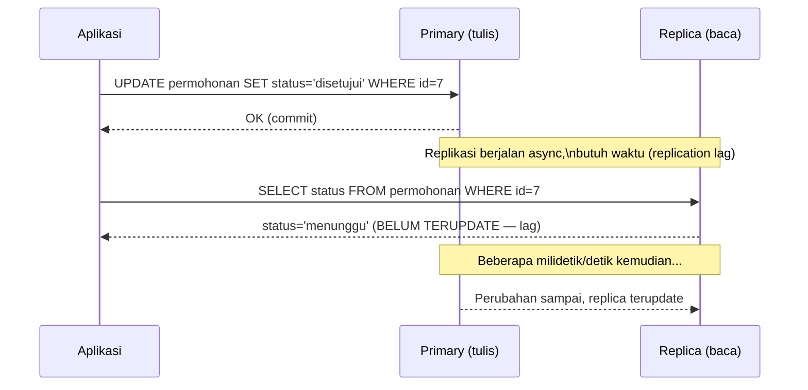

## TL;DR

Ketika satu instance database tidak lagi cukup menangani volume baca (query `SELECT` jauh lebih banyak dari `INSERT`/`UPDATE`/`DELETE` di kebanyakan aplikasi), read replica menyalin data dari database utama (primary/master) ke satu atau lebih instance tambahan yang **hanya melayani baca**, membagi beban tanpa mengorbankan konsistensi tulis di primary. Konsekuensinya tidak gratis: penyalinan data dari primary ke replica butuh waktu — biasanya milidetik, kadang detik dalam kondisi beban tinggi — sebuah jeda yang disebut **replication lag**. Ini mengubah jaminan konsistensi aplikasi secara fundamental: kode yang menulis lalu langsung membaca dari replica bisa membaca data **sebelum** tulisannya sendiri, sebuah kelas bug yang tidak pernah muncul selama aplikasi hanya bicara dengan satu database.

## The Problem

Seorang petugas mengirim formulir untuk memperbarui status permohonan, sistem menyimpannya ke database primary, lalu langsung me-redirect ke halaman detail permohonan yang query-nya diarahkan ke read replica (untuk mengurangi beban primary, sesuai desain yang disengaja). Halaman detail itu menampilkan status **lama** — bukan bug logika aplikasi, bukan bug penyimpanan, murni karena replication lag: perubahan yang baru saja di-commit ke primary belum sempat disalin ke replica saat halaman detail dibaca sepersekian detik kemudian. Petugas itu bingung, mengira perubahannya gagal tersimpan, dan mencoba menyimpan ulang — berpotensi menciptakan duplikasi entri riwayat perubahan status kalau sistem tidak menangani submit ganda dengan baik.

Masalah kedua yang lebih berbahaya: sebuah proses batch menghitung agregat laporan dengan membaca dari beberapa replica berbeda secara bergantian (load balancer memilih replica secara round-robin) tanpa menyadari bahwa **replica yang berbeda punya lag yang berbeda pula** — replica A mungkin tertinggal 50ms, replica B tertinggal 2 detik karena beban replikasinya sedang tinggi. Laporan yang membaca sebagian data dari replica A dan sebagian dari replica B dalam satu proses yang sama bisa menghasilkan angka yang secara logis tidak konsisten, seolah-olah membaca dua "titik waktu" berbeda dalam satu laporan tunggal — masalah yang sama sekali berbeda dari sekadar "data agak usang", tapi "data dari waktu yang berbeda-beda dicampur jadi satu".

## Intuition

Bayangkan read replica seperti **cabang perpustakaan yang menerima salinan buku baru dari perpustakaan pusat lewat kurir**, bukan tersambung langsung ke rak yang sama. Perpustakaan pusat (primary) menerima buku baru (data yang ditulis) dan segera mengirim salinannya ke cabang-cabang (replica) lewat kurir — tapi kurir butuh waktu untuk sampai. Kalau kamu baru saja menyerahkan buku ke perpustakaan pusat, lalu langsung bertanya ke cabang terdekat "apakah buku ini sudah ada?", jawabannya mungkin "belum", bukan karena buku itu hilang, tapi karena kurir belum sampai. Jeda pengiriman kurir inilah replication lag.

Analogi ini bocor pada satu hal: kurir perpustakaan biasanya berjalan dengan kecepatan yang relatif konsisten dan bisa diprediksi. Replication lag database **sangat bervariasi** tergantung beban tulis primary saat itu, jarak jaringan (replica di region berbeda punya lag lebih tinggi secara struktural), dan beban replica itu sendiri dalam memproses perubahan yang diterima — lag yang biasanya di bawah 100ms bisa melonjak ke beberapa detik atau lebih saat primary menerima lonjakan tulis besar (misalnya proses batch import), tanpa peringatan sebelumnya kalau tidak dipantau secara eksplisit.

## How It Works



Diagram ini menunjukkan momen kritis: request baca yang datang **tepat setelah** tulisan ke primary bisa mendarat di replica sebelum replikasi selesai, membaca data yang sudah usang — ini bukan kegagalan sistem, ini adalah konsekuensi yang melekat pada replikasi asinkron (*asynchronous replication*), model yang paling umum dipakai karena replikasi sinkron (menunggu semua replica konfirmasi sebelum primary menganggap tulisan selesai) akan membuat setiap tulisan jauh lebih lambat, terikat pada replica paling lambat.

**Strategi menangani replication lag** yang umum dipakai:

- **Read-your-writes consistency** — memaksa pembacaan tertentu (biasanya segera setelah tulisan oleh pengguna yang sama) untuk diarahkan ke primary, bukan replica, memastikan pengguna selalu melihat perubahannya sendiri segera.
- **Session pinning** — dalam satu sesi pengguna, semua baca diarahkan ke replica yang sama (bukan berpindah-pindah round-robin), menghindari masalah "membaca dari titik waktu berbeda-beda" seperti di skenario proses batch.
- **Memantau lag secara eksplisit** dan mengeluarkan replica dari pool baca kalau lag-nya melebihi ambang batas yang bisa diterima, alih-alih membiarkan aplikasi membaca data yang sangat usang tanpa sepengetahuan siapa pun.

## Under The Hood

Replikasi MySQL/MariaDB secara tradisional berbasis **binlog** (binary log) — primary mencatat setiap perubahan dalam format terstruktur, replica membaca log ini dan menerapkan ulang perubahannya secara berurutan. Replikasi bisa berbasis *statement* (mereplikasi perintah SQL itu sendiri) atau *row-based* (mereplikasi hasil perubahan baris secara langsung) — row-based lebih umum dipakai default modern karena lebih dapat diandalkan untuk perintah yang hasilnya bergantung konteks (seperti `NOW()` atau `RAND()`) yang bisa menghasilkan hasil berbeda kalau dieksekusi ulang di replica pada waktu yang berbeda.

PostgreSQL memakai **WAL (write-ahead log) shipping** sebagai basis replikasinya — mekanisme yang sama yang juga dipakai untuk crash recovery (menuliskan setiap perubahan ke log sebelum diterapkan ke data sesungguhnya) diperluas untuk mengirim log itu ke replica, yang menerapkan ulang perubahan yang sama secara berurutan. Baik binlog maupun WAL shipping sama-sama bersifat berurutan (sequential) — replica tidak bisa "melompat" menerapkan perubahan lebih awal dari yang seharusnya, sehingga lag yang terjadi selalu berarti replica **tertinggal**, tidak pernah "salah urutan".

Mengukur lag secara konkret: MySQL menyediakan `SHOW REPLICA STATUS` (sebelumnya `SHOW SLAVE STATUS`) dengan kolom `Seconds_Behind_Source` (sebelumnya `Seconds_Behind_Master`); PostgreSQL menyediakan fungsi seperti `pg_last_wal_receive_lsn()` dibandingkan dengan posisi WAL primary untuk menghitung selisihnya.

> [!question] Perlu diverifikasi
> Klaim: penamaan kolom `Seconds_Behind_Source`/`Seconds_Behind_Master` di MySQL.
> Kenapa ragu: MySQL memperbarui terminologi replikasinya (dari "master/slave" ke "source/replica") di rilis yang relatif baru, dan nama kolom persis yang berlaku bisa berbeda tergantung versi yang dipakai.
> Cara verifikasi: dokumentasi resmi MySQL versi yang relevan, bagian "Checking Replication Status".

## In Go

```go
package repository

import (
	"context"
	"database/sql"
	"fmt"
)

// RouterBacaTulis memisahkan koneksi primary (untuk tulis DAN baca yang
// butuh data terbaru) dari koneksi replica (untuk baca yang toleran
// terhadap data sedikit usang) — pemisahan eksplisit di level kode,
// bukan mengandalkan load balancer transparan yang tidak dipahami aplikasi.
type RouterBacaTulis struct {
	primary  *sql.DB
	replica  *sql.DB
}

func NewRouterBacaTulis(primary, replica *sql.DB) *RouterBacaTulis {
	return &RouterBacaTulis{primary: primary, replica: replica}
}

// SimpanStatusPermohonan SELALU lewat primary — operasi tulis tidak pernah
// diarahkan ke replica (replica bersifat read-only).
func (r *RouterBacaTulis) SimpanStatusPermohonan(ctx context.Context, id int64, status string) error {
	_, err := r.primary.ExecContext(ctx, `UPDATE permohonan SET status = ? WHERE id = ?`, status, id)
	if err != nil {
		return fmt.Errorf("simpan status permohonan: %w", err)
	}
	return nil
}

// AmbilStatusSetelahMenyimpan SENGAJA membaca dari PRIMARY, bukan replica —
// menerapkan pola "read-your-writes": pengguna yang baru saja menyimpan
// perubahan harus segera melihat perubahannya sendiri, tidak boleh terkena
// replication lag.
func (r *RouterBacaTulis) AmbilStatusSetelahMenyimpan(ctx context.Context, id int64) (string, error) {
	var status string
	err := r.primary.QueryRowContext(ctx, `SELECT status FROM permohonan WHERE id = ?`, id).Scan(&status)
	if err != nil {
		return "", fmt.Errorf("ambil status dari primary: %w", err)
	}
	return status, nil
}

// AmbilDaftarPermohonanUntukDashboard membaca dari REPLICA — dashboard
// yang menampilkan daftar umum bisa mentolerir data yang tertinggal
// beberapa ratus milidetik, dan mengarahkannya ke replica mengurangi
// beban baca yang signifikan dari primary.
func (r *RouterBacaTulis) AmbilDaftarPermohonanUntukDashboard(ctx context.Context) (*sql.Rows, error) {
	rows, err := r.replica.QueryContext(ctx, `SELECT id, nomor_permohonan, status FROM permohonan ORDER BY tanggal_dibuat DESC LIMIT 50`)
	if err != nil {
		return nil, fmt.Errorf("ambil daftar permohonan dari replica: %w", err)
	}
	return rows, nil
}
```

## In His Stack

Yii2 mendukung konfigurasi multiple `db` component atau pemakaian `masters`/`slaves` di konfigurasi koneksi database bawaannya untuk memisahkan koneksi baca dan tulis — secara konsep identik dengan pola `RouterBacaTulis` di atas, hanya beda cara konfigurasinya. Kubernetes tidak menyelesaikan masalah replication lag secara otomatis hanya karena beberapa replica dijalankan sebagai pod terpisah — memilih replica mana yang menerima traffic baca (lewat Service terpisah untuk primary dan replica, atau operator database khusus seperti yang disediakan beberapa vendor managed database) tetap keputusan arsitektur eksplisit yang harus dirancang di level aplikasi atau infrastruktur, bukan sesuatu yang "otomatis benar" hanya karena berjalan di Kubernetes.

## Trade-offs and When Not To Use It

Read replica menyelesaikan masalah **kapasitas baca**, bukan masalah **kapasitas tulis** — semua tulisan tetap harus melalui satu primary (atau, dalam arsitektur yang lebih kompleks, sekelompok primary yang saling koordinasi, di luar cakupan intermediate ini), sehingga replica tidak membantu sama sekali kalau bottleneck sesungguhnya ada di volume tulis, bukan baca. Menambah lebih banyak replica juga bukan solusi gratis — setiap replica tambahan menambah beban jaringan dan I/O di primary untuk mengirim log replikasi ke lebih banyak tujuan, dan replica yang terlalu banyak dengan hardware terbatas di primary bisa **memperlambat** primary itu sendiri alih-alih membantunya. Untuk aplikasi yang mayoritas operasinya butuh data real-time yang ketat (misalnya sistem yang memverifikasi identitas dan tidak boleh sedikit pun membaca data usang), read replica untuk jalur kritis itu mungkin bukan pilihan yang tepat — read-your-writes consistency yang ketat untuk semua baca berarti kehilangan sebagian besar manfaat pemisahan beban yang menjadi alasan awal memakai replica.

## Common Mistakes

> [!warning] Jebakan
> Mengarahkan pembacaan segera setelah penulisan (misalnya redirect setelah submit form) ke replica tanpa mempertimbangkan replication lag — pengguna melihat data lama dan mengira perubahannya gagal tersimpan, berpotensi memicu submit ganda.

> [!warning] Jebakan
> Membiarkan load balancer memilih replica secara round-robin untuk satu proses/laporan yang butuh konsistensi baca sepanjang eksekusinya — bisa mencampur data dari replica dengan lag berbeda-beda, menghasilkan angka yang secara logis tidak konsisten meski masing-masing baca "valid" untuk replica-nya sendiri.

> [!warning] Jebakan
> Menambah replica tanpa batas sebagai solusi universal untuk semua masalah performa, tanpa menyadari bottleneck sesungguhnya mungkin ada di kapasitas tulis primary, yang tidak diselesaikan oleh replica sama sekali.

## Exercises

1. Jelaskan kenapa replication lag adalah konsekuensi yang melekat pada replikasi asinkron, bukan bug atau kegagalan sistem.
2. Apa yang dimaksud "read-your-writes consistency", dan kenapa itu penting khususnya segera setelah pengguna melakukan perubahan?
3. Kenapa membaca dari replica yang berbeda-beda dalam satu proses laporan bisa menghasilkan angka yang secara logis tidak konsisten?
4. Desain terbuka: sistem antreanmu punya endpoint "cek nomor antrean saya saat ini" yang dipanggil berulang kali (polling) oleh aplikasi mobile setiap beberapa detik, dan endpoint "submit dokumen baru" yang menciptakan nomor antrean baru. Rancang strategi routing baca-tulis (primary vs replica) untuk kedua endpoint ini, dengan mempertimbangkan bahwa "cek nomor antrean" dipanggil jauh lebih sering daripada "submit dokumen", tapi pengguna yang baru saja submit perlu segera melihat nomor antreannya sendiri muncul dengan benar.

> [!success]- Kunci jawaban
> **4.** Endpoint "submit dokumen baru" selalu ke primary (tulisan tidak bisa lewat replica). Untuk "cek nomor antrean saya", strategi yang tepat: segera **setelah** submit berhasil (respons pertama yang menampilkan nomor antrean baru), baca itu diarahkan ke primary untuk memastikan read-your-writes consistency — pengguna harus langsung melihat nomor antreannya sendiri dengan benar tanpa terkena lag. Untuk polling **berikutnya** (mengecek status antrean yang sudah ada, dipanggil berulang setiap beberapa detik), pembacaan bisa diarahkan ke replica — toleransi terhadap data yang tertinggal beberapa ratus milidetik pada polling rutin ini wajar dan tidak mengganggu pengalaman pengguna, sementara volumenya yang tinggi (dipanggil berulang oleh banyak pengguna) adalah beban baca yang tepat dipindahkan dari primary. Pendekatan praktis: tandai response submit dengan flag/timestamp yang membuat client tahu untuk memakai endpoint "baca dari primary" pada permintaan pertama setelah submit, lalu beralih ke endpoint polling biasa (replica) untuk permintaan selanjutnya.

## Self-Check

- Kenapa replication lag adalah konsekuensi struktural dari replikasi asinkron, bukan bug?
- Apa itu read-your-writes consistency, dan kapan itu dibutuhkan?
- Kenapa session pinning membantu mencegah masalah konsistensi saat membaca dari beberapa replica?
- Apa yang tidak diselesaikan read replica, meski menyelesaikan masalah kapasitas baca?

## Connected Notes

- [[Tuning the Connection Pool]] — read replica adalah salah satu cara mengurangi tekanan pada pool koneksi primary, melengkapi tuning ukuran pool itu sendiri.
- [[MVCC]] — snapshot konsisten yang diberikan MVCC berlaku dalam satu instance database; replication lag adalah masalah konsistensi yang berbeda, muncul justru karena ada lebih dari satu instance.
- [[Partitioning]] — strategi lain membagi beban database, kali ini dengan memecah data (bukan menyalinnya), dibahas di note berikutnya.
- [[../60 Distributed Systems/Consistency Models|Consistency Models]] — read-your-writes consistency adalah salah satu model konsistensi konkret yang dibahas lebih formal dan luas di domain distributed systems senior.
- [[../92 Tools/MySQL and MariaDB - Dialect and Behaviour|MySQL and MariaDB - Dialect and Behaviour]] — detail konfigurasi replikasi binlog spesifik MariaDB dibahas lebih operasional di tool note itu.

## Further Reading

- Dokumentasi resmi MySQL, bagian "Replication" dan "Checking Replication Status".
- Dokumentasi resmi PostgreSQL, bagian "Log-Shipping Standby Servers" dan "Streaming Replication".

## Catatan Saya

*Tulis di sini apakah sistem kerjaanmu sudah memakai read replica — dan kalau ya, apakah pernah ada bug "data hilang sesaat" yang ternyata disebabkan replication lag.*
