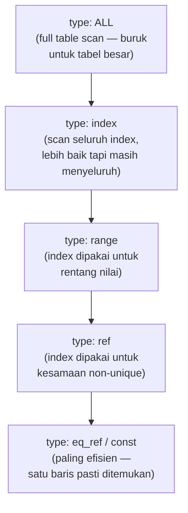

## TL;DR

`EXPLAIN` meminta database menunjukkan **rencana eksekusi** (execution plan) yang akan dipakai untuk menjalankan sebuah query — index mana yang dipilih, urutan tabel mana yang dipindai lebih dulu pada `JOIN`, berapa perkiraan baris yang diperiksa — tanpa benar-benar menjalankan query itu. Ini adalah satu-satunya cara mengetahui **kenapa** sebuah query lambat, alih-alih menebak-nebak lewat trial and error (menambah index lalu berharap, tanpa pernah memverifikasi index itu benar-benar dipakai). Engineer yang bisa menulis query yang bekerja tapi tidak bisa membaca `EXPLAIN` akan terus menambal gejala tanpa pernah tahu akar masalahnya — persis kegelisahan yang dibuka di [[../40 Databases/_Overview|Databases Overview]].

## The Problem

Sebuah query laporan bulanan tiba-tiba melambat drastis dari beberapa ratus milidetik jadi lebih dari sepuluh detik, tanpa ada perubahan kode apa pun. Tim langsung menebak "mungkin butuh index baru" dan menambahkan index pada beberapa kolom yang terlihat relevan — tapi performa tidak membaik sama sekali, karena tebakan itu salah: index yang sudah ada sebenarnya masih dipakai dengan benar, tapi optimizer memilih rencana yang berbeda karena distribusi data berubah signifikan (jumlah baris bertambah tajam, membuat statistik lama yang dipakai optimizer untuk mengestimasi biaya jadi usang). Tanpa membaca `EXPLAIN`, tim menghabiskan berhari-hari menambah dan menghapus index secara coba-coba, sementara jawaban sesungguhnya (`ANALYZE TABLE` untuk memperbarui statistik) ada satu perintah jauh, bisa langsung terlihat dari rencana eksekusi yang ditunjukkan `EXPLAIN`.

Masalah kedua yang lebih halus: sebuah query `JOIN` antara tabel `permohonan` dan `dokumen_pendukung` terlihat memakai index pada kedua tabel (`EXPLAIN` menunjukkan `type: ref` untuk keduanya, indikasi umum "menggunakan index"), tapi tetap lambat karena optimizer memilih tabel yang **salah** sebagai tabel pertama di urutan `JOIN` — memindai tabel `permohonan` yang jauh lebih besar terlebih dulu, alih-alih memulai dari `dokumen_pendukung` yang jauh lebih kecil dan sangat selektif untuk kondisi `WHERE` yang ada. "Index dipakai" tidak selalu berarti "dipakai secara optimal" — memahami detail lebih dalam dari output `EXPLAIN` (bukan sekadar melihat kolom `type`) yang membedakan keduanya.

## Intuition

`EXPLAIN` seperti **meminta pemandu wisata menjelaskan rute perjalanan sebelum benar-benar berangkat**, bukan langsung jalan dan berharap sampai secepat mungkin. Pemandu itu menjelaskan: "kita akan mulai dari titik A karena paling sedikit orang yang berkumpul di sana, lalu ke titik B lewat jalan pintas ini karena sudah ada penunjuk arah yang jelas (index)" — kamu bisa menilai sebelumnya apakah rute itu masuk akal, atau menyadari pemandu memilih rute memutar yang tidak perlu (full table scan padahal ada index yang lebih baik), sebelum benar-benar menghabiskan waktu menempuhnya.

Analogi ini bocor pada satu hal: pemandu wisata biasanya menjelaskan rute dengan pasti karena sudah pernah melewatinya. Optimizer database **menebak** rencana terbaik berdasarkan statistik distribusi data yang disimpannya (jumlah baris, distribusi nilai per kolom) — tebakan ini bisa salah kalau statistik itu usang atau kalau query-nya kompleks dengan banyak kemungkinan rencana eksekusi, dan `EXPLAIN` menunjukkan rencana yang **akan** dipilih berdasarkan tebakan itu, bukan jaminan bahwa tebakan itu selalu optimal.

## How It Works

```sql
EXPLAIN SELECT p.id, p.nomor_permohonan, d.nama_file
FROM permohonan p
JOIN dokumen_pendukung d ON d.permohonan_id = p.id
WHERE p.status = 'menunggu';
```

Output `EXPLAIN` MySQL/MariaDB (disederhanakan) menampilkan kolom-kolom kunci yang harus dibaca berurutan, bukan sekadar dilihat sepintas:

| id | table | type | possible_keys | key | rows | Extra |
|---|---|---|---|---|---|---|
| 1 | p | ref | idx_status | idx_status | 500 | Using where |
| 1 | d | ref | idx_permohonan_id | idx_permohonan_id | 3 | — |



Diagram ini menunjukkan spektrum nilai kolom `type` dari yang paling mahal (`ALL`, full table scan) ke paling murah (`const`/`eq_ref`) — ini bukan daftar lengkap semua nilai yang mungkin, tapi urutan relatif yang cukup untuk menilai cepat apakah sebuah query "sehat" atau butuh perhatian.

**Kolom yang paling sering diabaikan padahal krusial:**

- **`rows`** — estimasi jumlah baris yang harus diperiksa optimizer untuk tabel itu. Angka yang jauh lebih besar dari yang diharapkan (misalnya `rows: 500000` padahal kondisi `WHERE` seharusnya sangat selektif) adalah sinyal kuat ada yang salah — index yang tidak dipakai, statistik usang, atau kondisi yang tidak seselektif yang dikira.
- **`Extra`** — informasi tambahan yang sering jadi kunci: `Using filesort` berarti database harus mengurutkan hasil secara terpisah (tidak memanfaatkan keterurutan index, lihat [[Composite Indexes and the Leftmost-Prefix Rule]]); `Using temporary` berarti database membuat tabel sementara (biasanya untuk `GROUP BY`/`ORDER BY` kompleks), operasi yang jauh lebih mahal dari yang terlihat; `Using index` (tanpa "condition") berarti index-only scan seperti dibahas di [[Covering Indexes]].
- **Urutan `JOIN`** — baris dengan `id` yang sama tapi tabel berbeda menunjukkan urutan tabel yang dipindai; tabel pertama idealnya adalah tabel yang paling sedikit barisnya **setelah** filter diterapkan, karena tabel berikutnya di-join per baris hasil tabel sebelumnya.

## Under The Hood

`EXPLAIN` menunjukkan rencana yang **akan** dipakai berdasarkan estimasi optimizer, bukan angka aktual dari eksekusi sungguhan — untuk melihat perbedaan antara estimasi dan kenyataan (yang sering mengungkap masalah statistik usang), `EXPLAIN ANALYZE` (didukung PostgreSQL secara native, dan MySQL sejak versi yang cukup baru) benar-benar **menjalankan** query dan melaporkan waktu eksekusi aktual di setiap langkah, dibandingkan dengan estimasi. Selisih besar antara `rows` yang diestimasi dan baris aktual yang diproses adalah sinyal paling jelas bahwa statistik tabel (dipelihara lewat `ANALYZE TABLE` di MySQL, atau `ANALYZE` di PostgreSQL, biasanya juga berjalan otomatis lewat *autovacuum*) sudah usang dan perlu diperbarui.

> [!question] Perlu diverifikasi
> Klaim: sejak versi berapa MySQL mendukung `EXPLAIN ANALYZE`.
> Kenapa ragu: dukungan fitur ini ditambahkan di rilis MySQL yang relatif baru, dan detail versi minimum persisnya sebaiknya dicek langsung agar tidak keliru menyebut versi yang belum mendukungnya.
> Cara verifikasi: cek changelog resmi MySQL untuk fitur `EXPLAIN ANALYZE`.

PostgreSQL menyediakan format output yang sedikit berbeda (`Seq Scan`, `Index Scan`, `Bitmap Heap Scan`, `Nested Loop`, `Hash Join`, `Merge Join`) tapi filosofi membacanya identik: cari operasi yang memindai banyak baris tanpa perlu (`Seq Scan` pada tabel besar dengan kondisi selektif), cari langkah dengan selisih besar antara `estimated rows` dan `actual rows`, dan perhatikan strategi join yang dipilih — `Nested Loop` cocok untuk hasil kecil di satu sisi join, tapi bisa sangat mahal kalau kedua sisi besar, di mana `Hash Join` biasanya lebih efisien.

## In Go

```go
package diagnostic

import (
	"context"
	"database/sql"
	"fmt"
)

// JalankanExplain menjalankan EXPLAIN terhadap query yang sama persis
// dengan yang dipakai aplikasi — penting menjalankan EXPLAIN pada query
// SESUNGGUHNYA (termasuk parameter yang representatif), karena rencana
// eksekusi bisa berbeda tergantung nilai parameter untuk beberapa jenis query.
func JalankanExplain(ctx context.Context, db *sql.DB, status string) ([]map[string]any, error) {
	rows, err := db.QueryContext(ctx, `
		EXPLAIN SELECT p.id, p.nomor_permohonan, d.nama_file
		FROM permohonan p
		JOIN dokumen_pendukung d ON d.permohonan_id = p.id
		WHERE p.status = ?
	`, status)
	if err != nil {
		return nil, fmt.Errorf("jalankan EXPLAIN: %w", err)
	}
	defer rows.Close()

	kolom, err := rows.Columns()
	if err != nil {
		return nil, fmt.Errorf("ambil nama kolom hasil EXPLAIN: %w", err)
	}

	var hasil []map[string]any
	for rows.Next() {
		nilai := make([]any, len(kolom))
		pointer := make([]any, len(kolom))
		for i := range nilai {
			pointer[i] = &nilai[i]
		}
		if err := rows.Scan(pointer...); err != nil {
			return nil, fmt.Errorf("scan baris EXPLAIN: %w", err)
		}

		baris := make(map[string]any, len(kolom))
		for i, nama := range kolom {
			baris[nama] = nilai[i]
		}
		hasil = append(hasil, baris)
	}
	return hasil, nil
}
```

Kode ini sengaja tidak mem-parsing `EXPLAIN` secara mendalam di aplikasi produksi — tujuannya biasanya diagnosis manual saat investigasi performa, bukan logika bisnis yang bergantung padanya. Pola ini lebih sering dipakai lewat tool CLI langsung ke database (`mysql -e "EXPLAIN ..."` atau klien SQL) daripada dari kode aplikasi, tapi memiliki cara memanggilnya secara terprogram berguna untuk membangun tooling internal (misalnya dashboard yang menampilkan rencana eksekusi query lambat yang tertangkap slow query log).

## In His Stack

MariaDB dan PostgreSQL punya format output `EXPLAIN` yang berbeda secara sintaksis (kolom `type`/`Extra` di MySQL vs `Seq Scan`/`Index Scan` di PostgreSQL) tapi tujuan membacanya sama persis — perbedaan format ini salah satu alasan kenapa memahami filosofi di baliknya (bukan menghafal satu format tertentu) lebih penting daripada menghafal nilai kolom spesifik satu dialek. Untuk aplikasi Yii2 yang memakai Active Record, query yang dihasilkan ORM kadang cukup kompleks (banyak `JOIN` implisit dari relasi eager loading) sehingga membiasakan menjalankan `EXPLAIN` terhadap SQL mentah yang benar-benar dikirim ORM ke database (bisa dilihat lewat query log Yii2) — bukan berasumsi dari kode Active Record saja — adalah kebiasaan yang sama pentingnya di kedua sisi stack, PHP maupun Go.

## Trade-offs and When Not To Use It

`EXPLAIN` sendiri (tanpa `ANALYZE`) nyaris tidak punya biaya — ia hanya meminta optimizer menunjukkan rencananya tanpa benar-benar menjalankan query, aman dipakai kapan pun termasuk terhadap query yang mengubah data (meski untuk `INSERT`/`UPDATE`/`DELETE`, sebagian database perlu penanganan berbeda untuk melihat rencananya tanpa efek samping). `EXPLAIN ANALYZE`, sebaliknya, **benar-benar menjalankan** query — untuk query yang mengubah data atau query `SELECT` yang sangat berat, ini berarti biaya eksekusi sungguhan ditanggung, dan untuk `UPDATE`/`DELETE` bisa berarti perubahan data sungguhan terjadi (tergantung dialek dan cara pemakaiannya) — `EXPLAIN ANALYZE` pada query yang mengubah data di database production butuh kehati-hatian ekstra, idealnya diuji dulu di replica atau lingkungan staging dengan data representatif.

## Common Mistakes

> [!warning] Jebakan
> Menambah index secara coba-coba tanpa pernah menjalankan `EXPLAIN` untuk memverifikasi apakah index itu benar-benar dipakai — bisa menghabiskan waktu berhari-hari menambal gejala tanpa pernah menemukan akar masalah sesungguhnya.

> [!warning] Jebakan
> Hanya melihat kolom `type` (atau setara di PostgreSQL) dan berhenti di situ, mengabaikan `rows` dan `Extra` — "index dipakai" tidak sama dengan "dipakai secara optimal"; `Using filesort` atau `Using temporary` di kolom `Extra` bisa menandakan biaya tersembunyi meski index sudah dipakai.

> [!warning] Jebakan
> Menjalankan `EXPLAIN ANALYZE` pada query `UPDATE`/`DELETE` di database production tanpa menyadari ini benar-benar mengeksekusi query itu, bukan sekadar mensimulasikan — berisiko mengubah data sungguhan di tengah investigasi performa yang seharusnya bersifat non-invasif.

## Exercises

1. Jelaskan perbedaan `EXPLAIN` biasa dan `EXPLAIN ANALYZE`, dan kapan masing-masing lebih tepat dipakai.
2. Kenapa "index dipakai" (terlihat dari kolom `key` atau `type`) belum tentu berarti query itu sudah optimal?
3. Apa yang ditandakan `Using filesort` di kolom `Extra`, dan kenapa ini sinyal yang perlu diperhatikan?
4. Desain terbuka: sebuah query `JOIN` tiga tabel (`permohonan`, `dokumen_pendukung`, `riwayat_status`) tiba-tiba melambat drastis setelah tabel `riwayat_status` bertambah dari seratus ribu jadi lima juta baris dalam beberapa bulan terakhir, tanpa perubahan kode apa pun. Rancang urutan langkah investigasi memakai `EXPLAIN`/`EXPLAIN ANALYZE` untuk menemukan akar masalahnya, dan sebutkan dua kemungkinan penyebab paling umum yang perlu diperiksa lebih dulu.

> [!success]- Kunci jawaban
> **1.** `EXPLAIN` menunjukkan rencana eksekusi berdasarkan estimasi optimizer **tanpa** benar-benar menjalankan query — aman dan cepat, cocok untuk pengecekan rutin atau query yang berat/mengubah data. `EXPLAIN ANALYZE` benar-benar mengeksekusi query dan melaporkan waktu aktual di setiap langkah dibanding estimasi — dibutuhkan justru saat estimasi optimizer dicurigai keliru (selisih `rows` estimasi vs aktual besar), tapi harus dipakai hati-hati untuk query yang mahal atau mengubah data di production.
> **4.** Urutan investigasi: (1) jalankan `EXPLAIN` terhadap query yang sama persis seperti yang dijalankan aplikasi, bandingkan urutan `JOIN` dan index yang dipakai dengan kondisi sebelum tabel `riwayat_status` membesar (kalau ada baseline/dokumentasi lama); (2) perhatikan kolom `rows` untuk tabel `riwayat_status` — kalau angkanya jauh lebih besar dari yang seharusnya (kondisi `WHERE` seharusnya selektif tapi `rows` menunjukkan jutaan), curigai statistik usang; (3) jalankan `ANALYZE TABLE riwayat_status` (MySQL) atau `ANALYZE riwayat_status` (PostgreSQL) untuk memperbarui statistik, lalu ulangi `EXPLAIN` untuk melihat apakah rencana berubah. Dua penyebab paling umum untuk diperiksa lebih dulu: (a) statistik tabel usang setelah pertumbuhan data drastis, membuat optimizer salah mengestimasi biaya dan memilih urutan `JOIN` yang buruk; (b) index pada `riwayat_status` yang tadinya cukup untuk seratus ribu baris (misalnya index non-composite atau kardinalitas rendah) sekarang tidak lagi efisien untuk lima juta baris, butuh index composite baru yang mengikuti pola query sesungguhnya.

## Self-Check

- Apa yang ditunjukkan `EXPLAIN`, dan kenapa ia tidak menjalankan query sesungguhnya?
- Kenapa kolom `rows` dan `Extra` sering lebih informatif daripada sekadar kolom `type`/`key`?
- Kapan `EXPLAIN ANALYZE` dibutuhkan, dan risiko apa yang harus diwaspadai saat memakainya?
- Apa hubungan antara statistik tabel yang usang dan rencana eksekusi yang buruk?

## Connected Notes

- [[Covering Indexes]] — nilai `Using index` di kolom `Extra` adalah cara memverifikasi index-only scan yang dibahas di note itu benar-benar terjadi.
- [[Composite Indexes and the Leftmost-Prefix Rule]] — `EXPLAIN` adalah alat verifikasi utama untuk memastikan composite index benar-benar dipakai sesuai leftmost-prefix rule.
- [[The N+1 Query Problem]] — `EXPLAIN` terhadap query individual dalam pola N+1 sering menunjukkan setiap query kecil itu sendiri sudah efisien, menyembunyikan bahwa masalah sesungguhnya ada di jumlah query, bukan rencana eksekusi satu query.
- [[../70 Infrastructure and Delivery/The Three Pillars of Observability|The Three Pillars of Observability]] — slow query log yang menangkap query lambat adalah titik masuk paling umum untuk tahu query mana yang perlu dianalisis lewat EXPLAIN.
- [[Isolation Levels and Their Anomalies]] — rencana eksekusi yang ditunjukkan EXPLAIN bisa berbeda tergantung isolation level yang aktif, terutama untuk query yang membaca data yang sedang diubah transaksi lain.

## Further Reading

- Dokumentasi resmi MySQL mengenai "EXPLAIN Output Format" dan "EXPLAIN ANALYZE Statement".
- Dokumentasi resmi PostgreSQL mengenai "Using EXPLAIN".

## Catatan Saya

*Tulis di sini hasil EXPLAIN dari satu query lambat di kerjaanmu, dan apa yang kamu temukan sebagai penyebabnya.*
